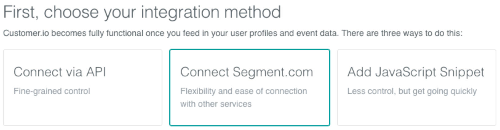
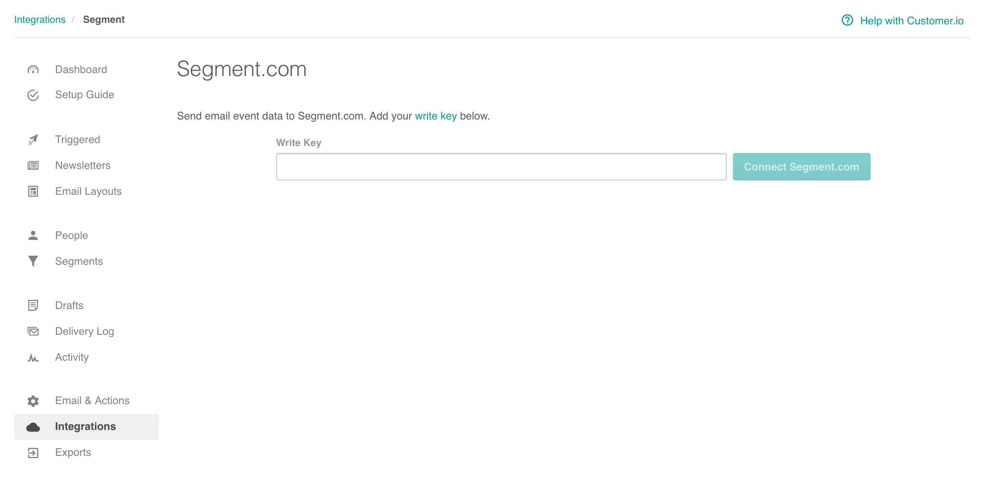

[Customer.io](https://customer.io/) lets you send automated email, push, SMS, letters, and webhooks based on your customer's activities in your app or product. It makes conversion tracking, optimization and remarketing easier than ever. The `analytics.js` {{integration.name}} Destination is open-source. You can browse the code [on GitHub](https://github.com/segment-integrations/analytics.js-integration-customerio).

This document was last updated on January 26, 2018. If you notice any gaps, out-dated information or simply want to leave some feedback to help us improve our documentation, please [let us know](https://segment.com/help/contact)!

**Use Cases**

* [Send emails to users based on topics of interest with Customer.io](https://segment.com/recipes/emails-topic-interest-customerio/)
* [Send users an email that summarizes recent product usage with Customer.io](https://segment.com/recipes/product-summary-email-customerio/)
* [Automatically send an autoresponder email when your initial email goes unopened with Customer.io](https://segment.com/recipes/autoresponder-email-customerio/)
* [Use email to move users through your onboarding funnel with Customer.io](https://segment.com/recipes/onboarding-email-customerio/)
* [Ask engaged users to take an NPS survey with Customer.io](Ask engaged users to take an NPS survey with Customer.io)
* [Get users to your Aha moment faster with email via Customer.io](https://segment.com/recipes/aha-activation-customerio/)
* [Ask your best customers to leave a review at just the right moment with Customer.io](https://segment.com/recipes/automate-customer-reviews-customerio/)
* 


## Getting Started

<!-- {{>connection-modes}} -->

1. From your Segment UI's Destinations page click on "Add Destination".
2. Search for "Customer.io" within the Destinations Catalog and confirm the Source you'd like to connect to.
3. Drop in your Customer.io `API Key` and `Site ID`, which you can retrieve from Settings > [API Credentials](https://fly.customer.io/account/api_credentials) in Customer.io, into the Segment UI Settings.
4. Alternatively, you can automatically sync your Customer.io connection settings to your desired Segment source by following the flow within the Customer.io Setup Guide.




## Page

If you haven't had a chance to review our spec, please take a look to understand what the [Page method](https://segment.com/docs/spec/page/) does. An example call would look like:

```javascript
analytics.page();
```

Page events will be sent to Customer.io as a `Page View` event where name and properties are optional. In the Customer.io "Activity View", the event will have "Activity Type" set to "Page View" and "Activity Name" set to the page name. If no page name has been specified, "Activity Name" will default to the page URL.

## Screen

If you haven't had a chance to review our spec, please take a look to understand what the [Screen method](https://segment.com/docs/spec/screen/) does. An example call would look like:

```objective-c
[[SEGAnalytics sharedAnalytics] screen:@"Home"];
```

Screen events will be sent to Customer.io as a custom event. In the Customer.io "Activity View", "Activity Type" will be `event` and "Activity Value" will be set to `Viewed {screen name} Screen`. For the earlier example the "Activity Value" will be `Viewed Home Screen`. If no screen name has been specifed then "Activity Value" will be `Viewed Undefined Screen`.


## Identify

If you haven't had a chance to review our spec, please take a look to understand what the [Identify method](https://segment.com/docs/spec/identify/) does. An example call would look like:

```javascript
analytics.identify('userId123', {
  email: 'john.doe@segment.com'
});
```

An email address is not required by Customer.io. It is only needed for people you intend to send email messages to (as opposed to SMS or push notifications). If you want an email to appear in the Customer.io "People View", you must provide an email as a trait labeled `email`. Customer.io accepts up to 30 unique traits per identify event. If you exceed this limit, not all of the traits will be passed to Customer.io.

When you identify a new user, the user will be subscribed to Customer.io. If the user is already subscribed, the user attributes will be updated according to the traits provided.

To unsubscribe a user, simply pass in `user_id` and `unsubscribed` (with a value of true) in an `identify` call. Be sure the `user_id` and `email` match the values in Customer.io, which you can find in the "Overview" section under the "Attributes" column within an individual user's view in the Customer.io UI. Here is an example of how to unsubscribe a user:

```javascript
analytics.identify('userId123', {
    email: 'john.doe@segment.com',
    unsubscribed: true
  }
)
```
## Track

If you haven't had a chance to review our spec, please take a look to understand what the [Track method](https://segment.com/docs/spec/track/) does. An example call would look like:

```javascript
analytics.track('Clicked Button');
```

Track events will be sent to Customer.io as `custom events`. In the Customer.io "Activity View", "Activity Type" will be set to `event` and "Activity Name" will be set to the event name.

### Sending Data from Customer.io

Customer.io supports sending [email events](/docs/spec/email/) to other tools on the Segment platform. These events will be sent as `track` calls to the other destinations you've turned on.

To enable this feature, go to the Account Settings in Customer.io and add your Segment write key:




## Best Practices

### Rate Limits
Customer.io has limits on the data collected by their API. To ensure your events arrive in Customer.io, please ensure that you are respecting the limits placed on the [Customer.io API](https://learn.customer.io/api/#api-documentationlimits). If you are using our [HTTP API](/docs/sources/server/http/) to send a batch of events to Customer.io at once, make sure you throttle the `import` to 100-200 requests per second.

## Troubleshooting

### No Events in Customer.io from the Browser
Remember that before we can send events to Customer.io from client-side Javascript the current user must be identified with their `userId`. The user's email address can only be used to identify them if that is the id on record for them in Customer.io.

### Page events not being associated with user
Page events will only be associated to a user if the user has been previously identified in Customer.io. If you identify a user after making Page calls, the previous page events will not be associated to the user in Customer.io.
