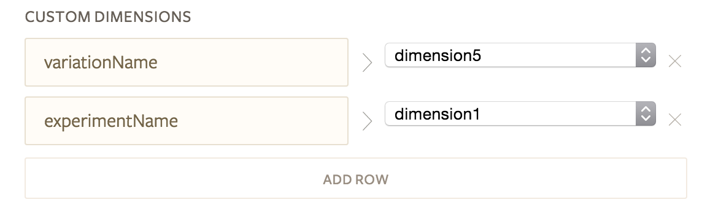

## Getting Started

Segment’s **Optimizely Web (previously Optimizely)** destination supports the following Optimizely products:

* [Optimizely Classic](#optimizely-classic-web)
* [Optimizely Classic Android 1.x](#optimizely-classic-android) (NOTE: This has been deprecated by Optimizely as of September 30, 2018.)
* [Optimizely Classic iOS 1.x](#optimizely-classic-ios) (NOTE: This has been deprecated by Optimizely as of September 30, 2018.)
* [Optimizely X Web](#optimizely-x-web)
* [Optimizely Full Stack (JavaScript)](#optimizely-full-stack-javascript)

If you’re interested in implementing Optimizely Full Stack server-side or on mobile, please see Segment’s [**Optimizely Full Stack** destination](https://segment.com/docs/destinations/optimizelyx/), which supports:

* [Optimizely Full Stack (server)](https://segment.com/docs/destinations/optimizelyx/#server-side)
* [Optimizely Full Stack Android (cloud mode)](https://segment.com/docs/destinations/optimizelyx/#android-cloud-mode-implementation)
* [Optimizely Full Stack iOS (cloud mode)](https://segment.com/docs/destinations/optimizelyx/#ios-cloud-mode-implementation)

**Use Cases**

* [Personalize Web Content with Optimizely and ClearBrain](https://segment.com/recipes/personalize-web-pages-optimizely-clearbrain/)
* [Use Optimizely to A/B test which CTAs lead to more signups](https://segment.com/recipes/ab-test-cta-signups-optimizely/)
* [Test which call to action (CTA) results in more shopping cart conversions with Optimizely](https://segment.com/recipes/ab-test-cta-conversions-optimizely/)

## Implementation Prerequisite

Optimizely works differently than other Segment destinations: It requires that customers implement at least some Optimizely functionalities natively.

Although Segment maps `track`, and in some cases `page`, events to Optimizely’s `track` method, customers must implement all Optimizely decision-based methods, such as `activate`, `isFeatureEnabled`, etc., natively. Segment’s API does not include methods that correspond to decision-based methods.

This limitation requires that customers include a native Optimizely snippet or implementation before their Segment snippet or implementation on pages or in mobile apps where Optimizely experiments run.

Segment provides specific implementation details for each Optimizely product in the sections below, in addition to details of the out-of-the-box mappings Segment's Optimizely component handles for Optimizely users.

## Optimizely Classic Web

### Getting Started

1. In your Segment source dashboard, enable the "Optimizely Web" destination (*not the "Optimizely Full Stack" destination*).
2. Go to your project’s home page in your Optimizely dashboard, then navigate to Settings -> Implementation and select the snippet version you’d like to include on your Web page.
3. In your Optimizely dashboard, select "Use Both Optimizely X and Optimizely Classic" under "Snippet Configuration."
4. In your Optimizely dashboard, copy the snippet provided at the bottom of the page. The snippet looks something like this:

  ```javascript
  <script src="//cdn.optimizely.com/js/#########.js"></script>
  ```

5. Include the snippet immediately after the opening `<head>` tag on every page where you’d like to include Optimizely’s JavaScript.
6. Now, paste your Segment snippet below the Optimizely snippet on every page where you’d like to include Segment’s JavaScript.
7. Finally, remember to define any `metrics` in your Optimizely dashboard, and to associate `metrics` with the appropriate Optimizely Experiments. Segment maps `track` event names to Optimizely `eventName` - the `eventName` corresponds to an experiment `metric`.

### Track

Behind the scenes, Segment’s Optimizely Web destination creates a global Optimizely queue on the page. Upon invocation of a Segment `track` event, Segment pushes the `track` event to the global queue.

Segment forwards the event to Optimizely:
* If the Segment event name matches exactly the name of an active experiment `metric` set up in the Optimizely dashboard;
* If the experiment `metric` is associated with a running experiment;
* If the current user has been assigned a `userId` via Segment's `identify` method (e.g. `analytics.identify('123')`);
* If the current user has been activated in a running experiment with the associated `metric`.

Segment also handles the following mapping:
* Segment `track` event name to `eventName`;
* Segment `track` event `properties` to Optimizely `eventTags`.

Also, `revenue` values should be passed as a `track` event `property`. The value should be an integer and represent the value in cents, so, for example, $1 should be represented by `100`.

### Page

Segment maps `page` calls to its own `track` events, i.e. invoking `analytics.page('Page Viewed')` using Segment’s API maps the call to `analytics.track('Page Viewed')`. Segment sends this `track` event downstream to other destinations just like a regular Segment `track` event.

### Experiment Listeners

Segment implements listeners for Optimizely Classic Web standard/redirect and multivariate experiments.

#### Standard or Redirect Experiments

**Properties sent via `track` calls:**

* experimentId
* experimentName
* variationId
* variationName
* referrer (only set if the effective referrer is different than `document.referrer`)
* nonInteraction (based on your advanced settings inside Segment)

**Example call automatically invoked upon page load:**

```javascript
analytics.track('Experiment Viewed', {
  experimentId: '7561662364',
  experimentName: 'Home Page CTA Button',
  variationId: '7549901603',
  variationName: 'Variation Blue Background',
  nonInteraction: 1
});
```

The `nonInteraction` property is set if you have enabled "Send Experiment Viewed as a non-interaction event" setting.

**Traits sent via `identify` calls:**

* experimentName
* variationName

**Example call automatically invoked upon page load:**

```javascript
analytics.identify({
  'Experiment: Home Page CTA Button': 'Variation Blue Background'
});
```

If you run multiple experiments during a user session, since `traits` are cached, subsequent experiments would fire `identify` calls that contain previous experiment data.

#### Multivariate Experiments

**Properties sent via `track` calls:**

* experimentId
* experimentName
* variationId
* variationName
* sectionName
* sectionId
* nonInteraction (based on your advanced settings inside Segment)

Segment concatenates all the `variationIds`, `variationNames`, `sectionNames`, and `sectionIds` where necessary.

**Example call automatically invoked upon page load:**

```javascript
analytics.track('Experiment Viewed', {
  experimentId: '7571581357',
  experimentName: 'Most Popular LoL Champion',
  variationId: '756194997,7563911532'
  variationName: 'Variation Teemo, Variation Corki',
  sectionName: 'Section Top, Section ADC',
  sectionId: '752911997,226194955'
  nonInteraction: 1
});
```

The `nonInteraction` property is set if you have enabled "Send Experiment Viewed as a non-interaction event" setting.

**Trait sent via `identify` calls:**

* experimentName
* variationName

**Example call automatically invoked upon page load:**

```
analytics.identify({
  'Experiment: Most Popular LoL Champion': 'Variation Teemo, Variation Corki'
});
```

If you run multiple experiments during a user session, since `traits` are cached, subsequent experiments would fire `identify` calls that contain previous experiment data.

## Optimizely Classic Android

**NOTE: Optimizely Mobile Classic has been officially deprecated as of September 30, 2018. You won't be able to start new experiments in Classic.**

For Segment’s Optimizely Full Stack Android destination, see Segment's [Optimizely Full Stack](./../optimizely-full-stack/index.md) documentation.

### Getting Started
1. In your Segment source dashboard, enable the "Optimizely Web" destination (*not the "Optimizely Full Stack" destination*).
2. Go to your project’s home page in your Optimizely dashboard and retrieve your `projectId` - you’ll need this to instantiate Optimizely.
3. Include the desired version of the Optimizely Classic Android SDK as a dependency in your Android app.
4. Instantiate Optimizely - you’ll use this instance to invoke methods from Optimizely’s decision API such as `activate` and `isFeatureEnabled`.
5. Instantiate Segment’s global Analytics object with an Optimizely factory registered:

  ```java
  analytics.use(OptimizelyIntegration.createFactory(context, /* your Optimizely projectId */));
  ```

  Since Optimizely needs to be initialized as early as possible, you need to supply your Optimizely `projectId` when you initialize the factory registered with the analytics client. Once registered, Segment maps `track` and `identify` events to Optimizely methods.

7. Finally, remember to define any `metrics` in your Optimizely dashboard, and to associate `metrics` with the appropriate Optimizely Experiments. Segment maps `track` event names to Optimizely `eventName` - the `eventName` corresponds to an experiment `metric`.

### Track

Segment maps only the `track` event name, and, if applicable, `revenue` downstream to Optimizely. `revenue` should be passed as a Segment property. The value should be an integer and represent the value in cents, so, for example, $1 would be `100`.

Segment sends the `track` event downstream to Optimizely:
* If the Segment event name matches exactly the name of an active experiment `metric` set up in the Optimizely dashboard;
* If the experiment `metric` is associated with a running experiment;
* If the current user has been assigned a `userId` via Segment's `identify` method (e.g. `analytics.identify('123')`);
* If the current user activated in a running experiment with the associated `metric`.

### Identify

If `identify` is invoked with a `userId`, under the hood, Segment invokes `Optimizely.setUserId()` with the `userId` provided.

### Experiment Listeners

Upon an Optimizely experiment activation, Segment’s Optimizely Classic<>Android SDK triggers a `track` event, which Segment forwards to all enabled downstream destinations:

```java
    analytics.track("Experiment Viewed", new Properties() //
            .putValue("experimentId", optimizelyExperimentData.experimentId)
            .putValue("experimentName", optimizelyExperimentData.experimentName)
            .putValue("variationId", optimizelyExperimentData.variationId)
            .putValue("variationName", optimizelyExperimentData.variationName));
```

## Optimizely Classic iOS

**NOTE: Optimizely Mobile Classic has been officially deprecated as of September 30, 2018. You won't be able to start new experiments in Classic.**

For Segment’s Optimizely Full Stack iOS destination, see Segment's [Optimizely Full Stack documentation](./../optimizelyx/index.md).

### Getting Started
1. In your Segment source dashboard, enable the "Optimizely Web" destination (*not the "Optimizely Full Stack" destination*).
2. Go to your project’s home page in your Optimizely dashboard and retrieve your `projectId` - you’ll need this to instantiate Optimizely.
3. Include the desired version of the Optimizely 1.x iOS SDK as a dependency in your iOS app.
4. Instantiate Optimizely - you’ll use this instance to invoke methods from Optimizely’s decision API such as `activate` and `isFeatureEnabled`.
5. Instantiate Segment’s global Analytics object with an Optimizely factory registered:

  ```objective-c
  [config use:[SEGOptimizelyIntegrationFactory instanceWithToken: /* your Optimizely project id /* launchOptions:launchOptions]];
  ```

Since Optimizely needs to be initialized as early as possible, you need to supply the Optimizely `projectId` when you initialize the factory registered with the analytics client. Once registered, Segment maps `track` and `identify` to Optimizely.

6. Finally, remember to define any `metrics` in your Optimizely dashboard, and to associate `metrics` with the appropriate Optimizely Experiments. Segment maps `track` event names to Optimizely `eventName` - the `eventName` corresponds to an experiment `metric`.

### Track

Segment maps only the `track` event name, and, if applicable, `revenue`, downstream to Optimizely. `revenue` should be passed as a Segment property. The value should be an integer and represent the value in cents, so, for example, $1 would be `100`.

Segment sends the `track` event downstream to Optimizely:
* If the Segment event name matches exactly the name of an active experiment `metric` set up in the Optimizely dashboard;
* If the experiment `metric` is associated with a running experiment;
* If the current user has been assigned a `userId` via Segment's `identify` method (e.g. `analytics.identify('123')`);
* If the current user activated in a running experiment with the associated `metric`.

### Identify

If `identify` is invoked with a `userId`, under the hood, Segment sets `[Optimizely sharedInstance].universalUserId` to the `userId` value provided.

### Experiment Listeners

Upon an Optimizely experiment activation, Segment’s Optimizely Classic<>iOS SDK triggers a `track` event, which Segment then forwards to all enabled downstream destinations:

```objective-c
[[SEGAnalytics sharedAnalytics] track:@"Experiment Viewed"
                                       properties:@{
                                                    @"experimentId" : data.experimentId,
                                                    @"experimentName" : data.experimentName,
                                                    @"variationId" : data.variationId,
                                                    @"variationName" : data.variationName
                                                    }];
```

## Optimizely X Web

### Getting Started

1. In your Segment source dashboard, enable the "Optimizely Web" destination (*not the "Optimizely Full Stack" destination*).
2. Go to your project’s home page in your Optimizely dashboard, then navigate to Settings -> Implementation and select the snippet version you’d like to include on your Web page.
3. In your Optimizely dashboard, select "Use only Optimizely X" under "Snippet Configuration."
4. In your Optimizely dashboard, copy the snippet provided at the bottom of the page.
5. Include the snippet immediately after the opening `<head>` tag on every page where you’d like to include Optimizely’s JavaScript.
6. Now, paste your Segment snippet below the Optimizely snippet on every page where you’d like to include Segment’s JavaScript.
7. Finally, remember to define any `metrics` in your Optimizely dashboard, and to associate `metrics` with the appropriate Optimizely Experiments. Segment maps `track` event names to Optimizely `eventName` - the `eventName` corresponds to an experiment `metric`.

### Track

Behind the scenes, Segment’s Optimizely Web destination creates a global Optimizely queue on the page. Upon invocation of a Segment `track` event, Segment pushes the `track` event to the global queue.

Segment forwards the event to Optimizely:
* If the Segment event name matches exactly the name of an active experiment `metric` set up in the Optimizely dashboard;
* If the experiment `metric` is associated with a running experiment;
* If the current user has been assigned a `userId` via Segment's `identify` method (e.g. `analytics.identify('123')`);
* If the current user is activated in a running experiment with the associated `metric`.

Segment also handles the following mapping:
* Segment `track` event name to Optimizely `eventName`.
* Segment `track` event `properties` to Optimizely `eventTags`.

`revenue` values should be passed as a Segment `property`. The value should be an integer and represent the value in cents, so, for example, $1 should be represented by `100`.

### Page

Segment maps `page` calls to its own `track` events, i.e. invoking `analytics.page('Page Viewed')` using Segment’s API maps the event to a `analytics.track('Page Viewed')` event. Segment maps the `track` event to other downstream destinations like a regular Segment `track` event.

### Experiment Listeners

Upon activation of an Optimizely experiment, an "Experiment Viewed" `track` event is sent to Segment. The event includes Optimizely experiment metadata. Optimizely X Web no longer supports multivariate experiments.

#### Standard or Redirect Experiments

**Properties sent via `track` calls:**

* campaignName
* campaignId
* experimentId
* experimentName
* referrer (only set if the effective referrer is different than `document.referrer`)
* variationName
* variationId
* audienceId
* audienceName
* nonInteraction (based on your advanced settings inside Segment)

`campaignName` and `experimentName` are the same if you create an experiment directly rather than creating an "experience" inside a personalized campaign. However, `campaignId` is still be auto generated by Optimizely’s API, thus it is different than the `experimentId`.

  

**Example call automatically invoked upon page load:**

```javascript
analytics.track('Experiment Viewed', {
  campaignName: 'Countdown to Stranger Things 2',
  campaignId: '7554165405',
  experimentId: '7556781578',
  experimentName: 'What about Barbs?',
  variationId: '7578240035',
  variationName: 'Variation Barbs',
  audienceId: '7527565438',
  audienceName: 'Netflix Bingers',
  nonInteraction: 1
});
```

**Trait sent via `identify` calls:**

* experimentName
* variationName

**Example call automatically invoked upon page load:**

```javascript
analytics.identify({
  'Experiment: What about Barbs?': 'Variation Barbs'
});
```

If you run multiple experiments during a user session, since `traits` are cached, subsequent experiments would fire `identify` calls that still contain previous experiment data.

#### Sending Experiment Viewed events as Non-Interaction for Google Analytics

If you’re using Google Analytics, you’ll likely want to check this setting in the Segment UI for the Optimizely Web destination:

  

This appends an additional property in your "Experiment Viewed" events called `nonInteraction` and set it to 1. This is to prevent the "Experiment Viewed" event from affecting your bounce rate.

#### Sending Experiment Viewed event properties as Google Analytics Custom Dimensions

If you’re sending your experiments to Google Analytics in the form of `track` calls, Segment recommends creating hit-scoped custom dimensions in Google Analytics with titles like "Experiment Name" and "Variation Name," and then mapping the properties to those Custom Dimensions accordingly. For example, if you set Custom Dimension 5 to "Experiment Name" and Custom Dimension 1 to "Variation Name," here’s how you’d configure the mappings in your Segment<>GA settings:

  

## Optimizely Full Stack (JavaScript)

### Getting Started

1. In your Segment source dashboard, enable the "Optimizely Web" destination (*not the "Optimizely Full Stack" destination*).
2. Require Optimizely’s `@optimizely/optimizely-sdk` on your site and create an `optimizelyClientInstance`.
3. The instance must be named `optmizelyClientInstance`.
4. Attach the `optimizelyClientInstance` to the `window` so Segment recognizes it.
5. Now, paste your Segment snippet below the Optimizely implementation on every page where you’d like to include Segment’s JavaScript. Or, if you’ve implemented Optimizely in a separate file, ensure Segment loads only after Optimizely has been initialized.
6. Finally, remember to define any `metrics` and `attributes` in your Optimizely dashboard, and to associate `metrics` with the appropriate Optimizely Experiments. Segment maps `track` event names to Optimizely `eventName` - the `eventName` corresponds to an experiment `metric`.

### Track

Upon invocation of a Segment `track` event, Segment maps the event to an Optimizely `track` event:
* If the Segment event name matches exactly the name of an active experiment `metric` set up in the Optimizely dashboard;
* If the experiment `metric` is associated with a running experiment;
* If the current user has been assigned a `userId` via Segment's `identify` method (e.g. `analytics.identify('123')`);
* If the current user is activated in a running experiment with the associated `metric`.

Segment also handles the following mapping:
* Segment `track` event name to Optimizely `eventName`.
* Segment `track` event `properties` to Optimizely `eventTags`.
* Segment `track` event `traits`, falling back to cached user `traits`, to Optimizely `attributes`.

`revenue` values should be passed as a Segment `property`. The value should be an integer and represent the value in cents, so, for example, $1 should be represented by `100`.

### Page

Segment maps `page` calls to its own `track` events, i.e. invoking `analytics.page("Page Viewed")` using Segment’s API maps the event to `analytics.track("Page Viewed")`. Segment maps the `track` event downstream to other destinations like a regular Segment `track` event.

### Experiment Listeners

Segment does not implement experiment listeners for Optimizely X Full Stack.

### Tracking Anonymous Data with Optimizely X Full Stack

If you are sending anonymous data to Optimizely X Full Stack via their server-side SDK elsewhere and would like to send anonymous data for the same user via this Segment client-side component, you can pass in an Optimizely-specific `userId`:

  ```javascript
  analytics.track('Some event', { /* properties */ }, {
    Optimizely: { userId: 'some anonymousId' }
  });
  ```

## Troubleshooting

### No Data for Anonymous Users

Segment does not map any data to Optimizely from the Segment<>Optimizely Web destination for anonymous users - in other words, to map `track` and `page` data, a user must be `identified` with a `userId`.

### Lower Experiment Viewed counts inside Segment and other tools vs. Optimizely unique visitors

The count of "Experiment Viewed" events may be slightly lower compared to the number of unique visitors seen in Optimizely because Optimizely loads synchronously and Segment loads asynchronously. This means that if the user quickly closes or redirects from a page, sometimes Segment does not have enough time to scrape the experiment data from the global Optimizely object and make its API calls back to Segment and to your other enabled tools.

### Sending effective referrer in your automatic page calls

If you are running redirect experiments, you might run into a case where the effective referrer is different than the referrer that is captured by `page` calls, such as the default page call in our Segment snippet.

For example, let’s say you run a redirect experiment on page `http://home.com` that redirects you to `http://home-offers.com`. Now, if a customer visits your page via a Google ad, you want to make sure that the `page` call fired on `http://home-offers.com` knows that the true referrer was Google and NOT `http://home.com`.

Our Optimizely Web destination detects this and send the effective referrer value as a property of the subsequent Experiment Viewed. Segment also overrides the `context.page.referrer` with the effective referrer.

More importantly, to send the true referrer value with the initial `page` call inside the Segment snippet, you can look up `window.optimizelyEffectiveReferrer`, and if it exists, you can pass that into your `page` call. This is how you might modify your Segment snippet:

```javascript
<script type="text/javascript">
  !function(){var analytics=window.analytics=window.analytics||[];if(!analytics.initialize)if(analytics.invoked)window.console&&console.error&&console.error("Segment snippet included twice.");else{analytics.invoked=!0;analytics.methods=["trackSubmit","trackClick","trackLink","trackForm","pageview","identify","reset","group","track","ready","alias","page","once","off","on"];analytics.factory=function(t){return function(){var e=Array.prototype.slice.call(arguments);e.unshift(t);analytics.push(e);return analytics}};for(var t=0;t<analytics.methods.length;t++){var e=analytics.methods[t];analytics[e]=analytics.factory(e)}analytics.load=function(t){var e=document.createElement("script");e.type="text/javascript";e.async=!0;e.src=("https:"===document.location.protocol?"https://":"http://")+"cdn.segment.com/analytics.js/v1/"+t+"/analytics.min.js";var n=document.getElementsByTagName("script")[0];n.parentNode.insertBefore(e,n)};analytics.SNIPPET_VERSION="3.1.0";
  analytics.load("YOUR_WRITE_KEY");

  /* MODIFIED SECTION */
  // Hey did Optimizely set an effective referrer?
  if (window.optimizelyEffectiveReferrer) var referrer = window.optimizelyEffectiveReferrer;

  // If they did, override the document.referrer
  referrer ? analytics.page({ referrer: referrer }); : analytics.page();
  /* MODIFIED SECTION */

  }}();
</script>
```
