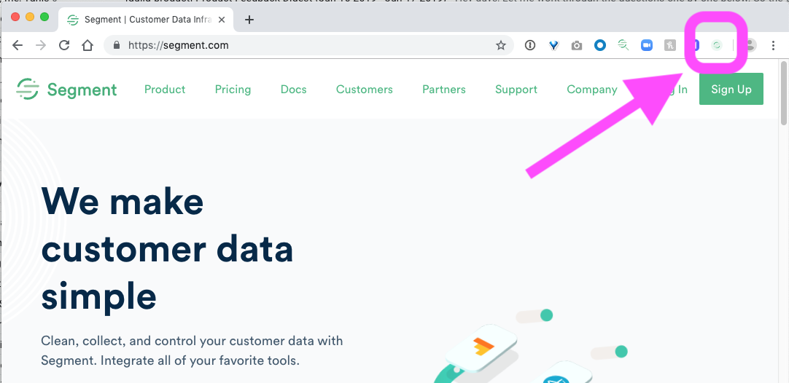
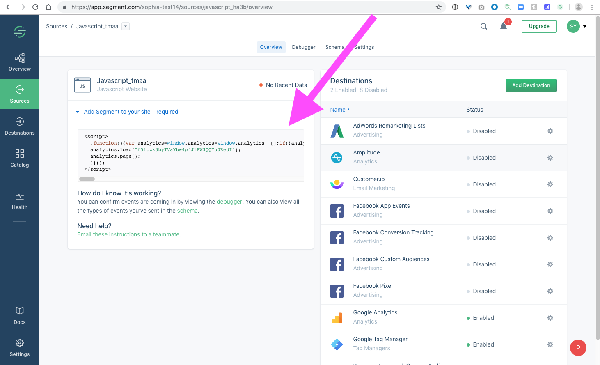
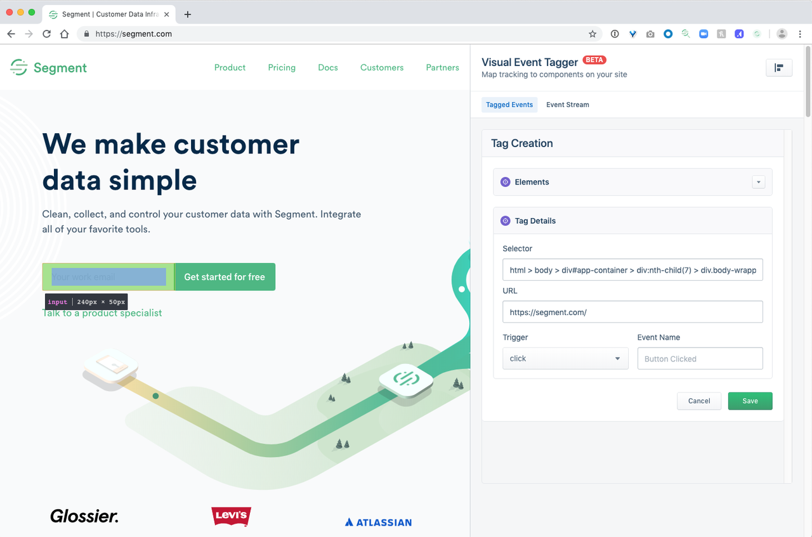

**Note**: Downloading the Visual Tagger Chrome Extension constitutes acknowledgment of the [Visual Tagger Beta Product Terms and Conditions](#Beta-Product-Terms-Conditions), and acceptance of the [Segment Beta Terms and Conditions](/docs/legal/first-access-beta-preview/).

## Overview

Segment offers tons of functionality with downstream integrations once you’ve started sending data into Segment, but the first step of setting up event tracking on your website or web app can be a challenge! Segment’s Visual Tagger shortens the process of implementing event tracking on your site by letting you add events without writing any code.

The Visual Tagger is a Chrome Extension created by Segment that allows you to create Segment track events on a website or web app by pointing and clicking on parts of the site’s UI. When you create events in the Visual Tagger, it sends real track events into Segment.

## Supported Features:

- `track` events
- `identify` calls
- Ability to send form field values as properties on a `Form Submitted` track event

## Beta Requirements and Limitations

### Requirements:

- The Visual Tagger is only available for websites or web apps. There is no support for mobile apps at this time.
- You must have a Segment Workspace and a Javascript Source set up to receive data from the website before using the Visual Tagger.
- You must have the Segment snippet for Analytics.js already installed on the website you want to use Visual Tagger for.
- You must use the Google Chrome browser. The Visual Tagger is currently only available as a Chrome Extension.

### Current Limitations (see Roadmap below for planned improvements)

- **Support is currently limited for adding properties to `track` calls**. Creating a `track` event based on `form` element and `submit` handler will add the form fields as properties to the `track` event.
- **Only `track` and `identify` calls are supported**. Other methods are not yet available in Visual Tagger.
- **We are currently unable to notify you if tracking breaks** due to changes in the website UI.

## Visual Tagger Set up

### Install the Chrome Extension

1. Download and install the [Visual Tagger Chrome extension](https://chrome.google.com/webstore/detail/segment-visual-tagger/ahofbpemlckjfmcebnanjmkhpcmnbjia).
   The extension is private while the Visual Tagger is in beta. Once you install the extension, it appears in the browser in the extensions area.
   

### Install the Segment snippet on your site

Before you start: Make sure you have Workspace Owner or Source Admin privileges, so you can create a new Source.

1. Log in to your Segment Workspace and create a Javascript Source.
2. Copy the Analytics.js script tag which appears.
3. Paste this tag into your website’s code within the `<head>` tag.
   If you’re having trouble with this step, follow the [Analytics.js Quickstart Guide](/docs/sources/website/analytics.js).
   

### Enable the Visual Tagger integration

Enable the Visual Tagger integration for the source you created above.

1. Navigate to your source settings and click on the Analytics.js tab.
2. Accept the beta terms and toggle to enable/disable the integration.
   

### Tag Events Using Visual Tagger

#### Go to your site in your browser window.

1. Click Segment Logo in the Chrome toolbar, and log in to your Segment account.
2. Click **Enable Tagger**.
3. In the white bar that appears at the bottom of the screen, click **Event Tagger**.
   

4. Click **Tag an Event** and mouse over parts of the site. The mouse highlights components that you can add an event tag to.
5. Click a component to open the **Tag Creation** panel, where you can adjust the event tag's configuration.
   For each event, there are the following configuration options:
   - _Selector_: The CSS selector that the event will be added to. If you are unsure whether or not the right selector has been chosen (or you need to go up a level in the elements tree to a parent element), click on the “Elements” dropdown where you can explore the tree.
   - _URL_: The page that the event should be fired from
   - _Trigger_: What user action should trigger the event. Currently, we support:
     - `click` - when a user clicks on an element -
     - `focus` - when a user’s mouse enters a form field -
     - `blur` - when a user exists a form field that was focused on
     - `submit` - when a user submits a form
   - _Event Name_ What the event should be named. We recommend that you follow the Segment Spec for standard naming conventions.
     
     
6. When you're satisfied with the event details, click **Save** to create the event.
   User interactions with your site start sending events into Segment as soon as you save the event. To test that events are working, refresh the page.
7. Verify that events are appearing as expected by interacting with the element you tagged, and checking the Debugger in your Segment Workspace for the expected event call.
   Events added to your site using the Visual Tagger have a `context` property in the event payload that says `"visual_tagger" : true`. You can use this in the Keywords field to filter the Debugger contents to only show Visual Tagger events.

All events that you create in Visual Tagger appear in the **Tagged Events** panel. Mouse over any existing events to highlight the element that the tag is associated with.
  
  

## Tagging Tips

- You can edit and delete tags as needed by clicking the (…) link at the end of each event row.
- If the tagging panel covers an element that you want to tag, click the button in the upper right to move the panel to the other side.
- You can deactivate the Visual Tagger extension or log out by clicking the gear icon in the lower right corner.

## FAQs

### Does the Visual Tagger impact my site or app's performance?

The Visual Tagger integration has very minimal negative impact to your site’s performance, because it installs a single event handler that makes an asynchronous call to Segment when a tag’s event is invoked. The integration makes an initial request that takes the same amount of time required to load Analytics.js, and it is cached for subsequent requests.

However, adding a large number of tags to your site could potentially impact your site’s performance. To guard against this we limit the number of tags you can add using Visual Tagger to 99 while the Visual Tagger is in beta.

### How many events can I create with Visual Tagger?

Currently, you can create up to 99 events with the Visual Tagger.

### Are events applicable to specific URLs? Or are we able to match on URL patterns?

Currently, Visual Tagger only supports direct string matching on URLs. More flexibility, including matching on URL patterns, is on our roadmap.

### Does the Chrome extension work with dynamically generated elements or Single Page Applications?

Yes. The Chrome DOM is queried on runtime, so you can track dynamically generated elements like modals (for example) using the Visual Tagger.

### Once the Visual Tagger supports properties, can I grab info from the data layer that’s not visually on the page?

In the short term, only information that is visually present on the page will be available for use in the Visual Tagger. We're considering implementing a data layer as part of our roadmap.

### How can I tell which events were created using the Visual Tagger, versus those which were implemented using code?

Events that were added using the Visual Tagger (as opposed to in code) have a `context` property in the event payload that says `"visual_tagger": true`.
Events _not_ implemented using the Visual Tagger do not have this property.

### When will the Visual Tagger be Generally Availabile, have standard support and fully stable releases?

General Availability launch is planned for Fall of 2019.

## Beta Product Terms & Conditions

Segment cannot make commitments around warranties, support, service levels, etc. and will not be liable for any loss of use, lost or inaccurate data or failure of security mechanisms in connection with your use of this or other beta products, until we release the feature to general availability.

In particular, this means that events instrumented via Visual Tagger may be less reliable and prone to breakage than standard Segment track events instrumented via code.
