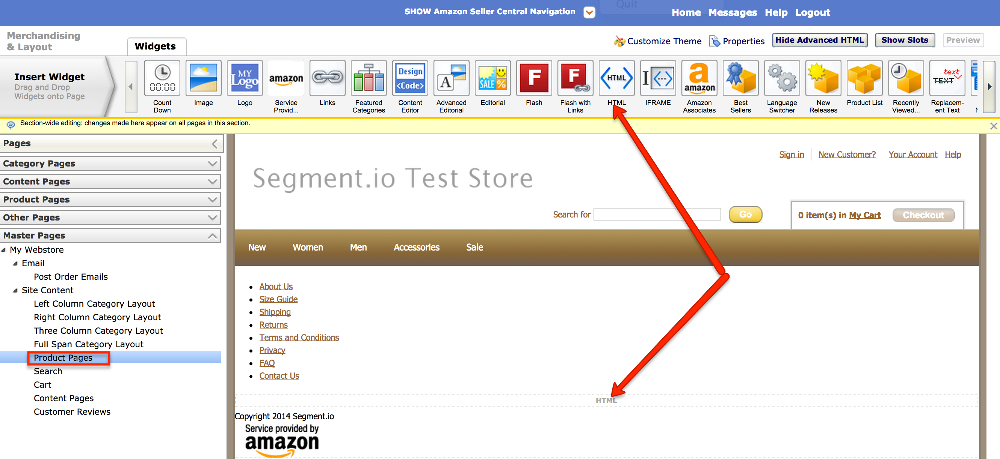
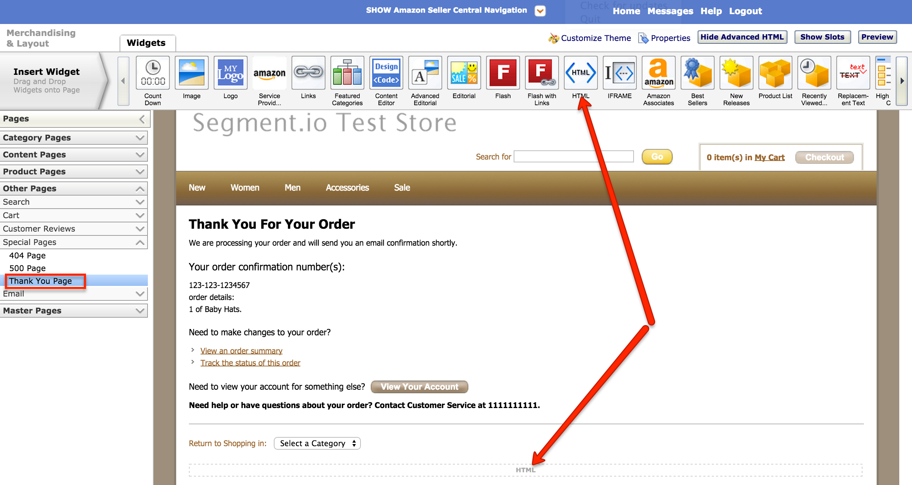

As an Amazon Webstore solution provider, we make it simple for Amazon merchants to integrate analytics, email marketing, advertising and optimization tools. Instead of installing each tool individually, you just install Segment once. We collect your data, translate it, and route it to any tool you want to use with the flick of a switch. Using Segment as the single platform to manage and install your third-party services will save you time and money.


The guide below explains how to install Segment in your Amazon Webstore. All you need to get up and running is copy and paste a few snippets of code. (You don't have to edit the code or be versed in JavaScript.) The following guide will show you how, step by step.

- - -

{{>deprecated}}


## Step 1: Segment Account

Start by creating a Segment account. We recommend creating an organization so you can invite teammates to your account in the future.

Once your account is created, add a new source.


## Step 2: Install Segment Code

Once your Segment account is ready to go you'll need to install a few lines of javascript into your Amazon Webstore template.


## 2A: Tracking Snippet

The first thing to add is your basic Segment snippet. Your snippet needs to load on every page, so you should add it to your File Library as a javascript file in your theme JS folder.

You can find this in Seller Central under **Store Design > File Library**, then **Theme Files > [Your Active Theme]  > JS**.

1. Add a new file by clicking the [New File] button.
2. Paste your Segment snippet into the empty file.
3. Click [Save As] and choose a file name (we used SegmentAnalytics.js).

Here's the snippet you'll need to paste into the file:

```js
  !function(){var analytics=window.analytics=window.analytics||[];if(!analytics.initialize)if(analytics.invoked)window.console&&console.error&&console.error("Segment snippet included twice.");else{analytics.invoked=!0;analytics.methods=["trackSubmit","trackClick","trackLink","trackForm","pageview","identify","reset","group","track","ready","alias","page","once","off","on"];analytics.factory=function(t){return function(){var e=Array.prototype.slice.call(arguments);e.unshift(t);analytics.push(e);return analytics}};for(var t=0;t<analytics.methods.length;t++){var e=analytics.methods[t];analytics[e]=analytics.factory(e)}analytics.load=function(t){var e=document.createElement("script");e.type="text/javascript";e.async=!0;e.src=("https:"===document.location.protocol?"https://":"http://")+"cdn.segment.com/analytics.js/v1/"+t+"/analytics.min.js";var n=document.getElementsByTagName("script")[0];n.parentNode.insertBefore(e,n)};analytics.SNIPPET_VERSION="3.1.0";

  window.analytics.load("YOUR_WRITE_KEY");
  window.analytics.page();
  }}();
</script>

```

Make sure to replace `YOUR_WRITE_KEY` with the write key from your source settings page.

For this script to load on all pages you'll need to head over to **Store Design > Merchandising & Layout** then the **Master Pages > Site Content** folder.

Click on **Properties** in the upper-right corner:


Then click **CSS and Scrip Links** and [Add] in the Link JS files section.


Select the `SegmentAnalytics.js` file from **Theme Files > [Your Active Theme]  > JS**. Push [OK] and the Segment snippet will now load on all your pages.


## 2B: Category/Search Pages

Category pages are a staple of Ecommerce. They let the user browse all of the products in a specific category. You'll want to track all of your product category pages so you can quickly see which categories are most popular.

In the case of Amazon Webstore Search pages are presented on the same template as categories. For that reason a single script (below) can be used to track all those templates.

Here's the script you'll use to track category pages:

```js
<script type="text/javascript">
if(amznAnalytics.flatValues.searchTerms) {
  analytics.track('Searched Products', {
    terms: amznAnalytics.flatValues.searchTerms,
    results: amznAnalytics.flatValues.searchResults,
    pageNumber: amznAnalytics.flatValues.pageNumber,
    pageType: amznAnalytics.flatValues.pageType,
    findingMethod: amznAnalytics.flatValues.productFindingMethod,
    deviceType: amznAnalytics.flatValues.deviceType,
    language: amznAnalytics.flatValues.language,
    loggedIn: amznAnalytics.flatValues.loggedIn,
    visitorStatus: amznAnalytics.flatValues.visitorStatus
  });
} else {
  analytics.track('Viewed Product Category', {
    category: amznAnalytics.flatValues.channel,
    pageType: amznAnalytics.flatValues.pageType,
    findingMethod: amznAnalytics.flatValues.productFindingMethod,
    deviceType: amznAnalytics.flatValues.deviceType,
    language: amznAnalytics.flatValues.language,
    loggedIn: amznAnalytics.flatValues.loggedIn,
    visitorStatus: amznAnalytics.flatValues.visitorStatus
  });
}
</script>
```

Paste the complete code snippet from above into all Category Page Templates as a new HTML Widget. The category page templates can be found under **Store Design > Merchandising & Layout** then the **Master Pages > Site Content** folder.

Add a new HTML Widget to the footer with the script above to each of these pages:

- Left Column Category Layout
- Right Column Category Layout
- Three Column Category Layout
- Full Span Category Layout


Once the template is saved you'll see an event like this in your Segment Debugger when people view product categories on your store:

```js
analytics.track('Product List Viewed', {
  category: 'Shirts',
  pageType: 'List',
  findingMethod: 'Browse',
  deviceType: 'DESKTOP',
  language: 'en_US',
  loggedIn: true,
  visitorStatus: 'Registered'
});
```

And one like this whenever visitors search for products:

```javascript
analytics.track('Product Searched', {
  terms: 'Pants',
  results: '4',
  pageNumber: 1,
  pageType: 'Search Results',
  deviceType: 'DESKTOP',
  language: 'en_US',
  loggedIn: true,
  visitorStatus: 'Registered'
});
```

## 2C: Viewed & Added Products

The next special events to record happen when a visitor is checking out one of your products. That starts with a **Viewed Product** event and if they like it, an **Added Product** event means they added it to their cart.

To track product pages you'll use this script:

```js
<script type="text/javascript">
analytics.track('Product Viewed', {
  sku: amznAnalytics.flatValues.productView.SKU,
  name: amznAnalytics.flatValues.productTitle,
  price: amznAnalytics.flatValues.itemPrice,
  rating: amznAnalytics.flatValues.productView.rating,
  addToCartButton: amznAnalytics.flatValues.addToCartButtonDisplayed,
  deviceType: amznAnalytics.flatValues.deviceType,
  imageDisplayed: amznAnalytics.flatValues.itemImageDisplayed,
  language: amznAnalytics.flatValues.language,
  loggedIn: amznAnalytics.flatValues.loggedIn,
  visitorStatus: amznAnalytics.flatValues.visitorStatus
});

var link = document.getElementById('addToCart');

analytics.trackLink(link, 'Product Added', {
  sku: amznAnalytics.flatValues.productView.SKU,
  name: amznAnalytics.flatValues.productTitle,
  price: amznAnalytics.flatValues.itemPrice,
  rating: amznAnalytics.flatValues.productView.rating,
  addToCartButton: amznAnalytics.flatValues.addToCartButtonDisplayed,
  deviceType: amznAnalytics.flatValues.deviceType,
  imageDisplayed: amznAnalytics.flatValues.itemImageDisplayed,
  language: amznAnalytics.flatValues.language,
  loggedIn: amznAnalytics.flatValues.loggedIn,
  visitorStatus: amznAnalytics.flatValues.visitorStatus

});
</script>
```

The code above needs to be pasted into your **Product Pages** template under **Store Design > Merchandising & Layout** then the **Master Pages > Site Content** folder. Add a new HTML Widget to the footer with the script above.



Once the template is saved you'll see an event like this in your Segment Debugger when people view products on your store:

```javascript
analytics.track('Product Viewed', {
  sku: 'SIO-12345',
  name: 'Fluffy Bunny',
  price: 6.99,
  rating: 4.5,
  addToCartButton: true,
  deviceType: 'DESKTOP',
  imageDisplayed: true,
  language: 'en-US',
  loggedIn: true,
  visitorStatus: 'Registered'
});
```

And when someone adds a product to their cart you'll see this in your Segment debugger:

```javascript
analytics.track('Product Added', {
  sku: 'SIO-12345',
  name: 'Fluffy Bunny',
  price: 6.99,
  rating: 4.5,
  addToCartButton: true,
  deviceType: 'DESKTOP',
  imageDisplayed: true,
  language: 'en-US',
  loggedIn: true,
  visitorStatus: 'Registered'
});
```


## 2D: Completed Order

The final step is to record a **Completed Order** event when people complete your checkout process.

This final code snippet is a bit longer since it submits a list of all items purchased to Segment and all your enabled destinations that support e-commerce tracking:

```js
<script type="text/javascript">
var prods = [];
var numProds = Object.keys(amznAnalytics.listVars.multiOrderPurchase[0].itemList).length;

for (var i = 0; i < numProds; i++) {
  var product = {}
  product.sku = amznAnalytics.listVars.multiOrderPurchase[0].itemList[i].SKU;
  product.name = amznAnalytics.listVars.multiOrderPurchase[0].itemList[i].title;
  product.price = amznAnalytics.listVars.multiOrderPurchase[0].itemList[i].unitPrice;
  product.quantity = amznAnalytics.listVars.multiOrderPurchase[0].itemList[i].quantity;
  prods.push(product);
}

analytics.track('Order Completed', {
  orderId: amznAnalytics.listVars.multiOrderPurchase[0].orderId,
  total: amznAnalytics.listVars.multiOrderPurchase[0].orderPrice,
  shipping: amznAnalytics.flatValues.shippingRevenue,
  tax: amznAnalytics.flatValues.taxRevenue,
  products: prods
});
</script>
```

Paste the complete code snippet from above onto your **Thank You Page** Template in a new HTML Widget. The **Thank You Page** Template can be found under **Store Design > Merchandising & Layout** then the **Other Pages > Special Pages** folder. Add a new HTML Widget to the footer with the script above.



Once someone makes a purchase on your store you'll see  something like this in your Segment debugger:

```javascript
analytics.track('Order Completed', {
  orderId: 'ed3ac8d2-98c9-4d8a-9aec-7ef828bbcd84',
  total: 31.99,
  shipping: 4.49,
  tax: 2.50,
  products: [{
    sku: '45790-32',
    name: 'Monopoly: 3rd Edition',
    price: 19.00,
    quantity: 1
  }, {
    sku: '46493-32',
    name: "Uno Card Game",
    price: 3.00,
    quantity: 2
  }]
});
```


## Step 3: Try Out Tools

The last step is to have some fun. Explore the Segment destinations page to find interesting new tools and sign up for a few free trials to see what works for your business.
