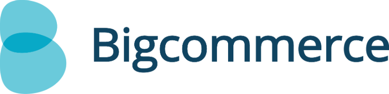

Segment makes it simple for Bigcommerce merchants to integrate analytics, email marketing, advertising and optimization tools. Rather than installing all your tools individually, you just install Segment once. We collect your data, translate it, and route it to any tool you want to use. Using Segment as the single platform to manage and install your third-party services will save you time and money.



The guide below explains how to install Segment in your Bigcommerce store. All you need to get up and running is copy and paste a few snippets of code into your theme editor. (You don't have to edit the code or be versed in JavaScript.) The following guide will show you how, step by step.

- - -

{{>deprecated}}

## Step 1: Segment Account

Start by creating a Segment account. We recommend creating an organization so you can invite teammates to your account in the future.

Once your account is created, add a new source for your store.


## Step 2: Install Segment Code

Once your Segment account is ready to go you'll need to install a few lines of javascript into your Bigcommerce theme templates.

Everything you need can be found in your Bigcommerce Admin under **Design > Edit HTML/CSS**. Except the [Completed Order](#) event, which is tracked separately.

**Remember:** You're editing your theme, so if you switch themes you'll need to go through this process again.

Each section below includes a reference to one of the folders and page templates that can be found on the left side of thed Edit HTML/CSS page.


## 2a: Load, Identify, & Page

**File:** Panels > `HTMLHead.html`

Paste the following snippet right above the `</head>` tag (at the bottom of the file):

```js
<script type="text/javascript">
  !function(){var analytics=window.analytics=window.analytics||[];if(!analytics.initialize)if(analytics.invoked)window.console&&console.error&&console.error("Segment snippet included twice.");else{analytics.invoked=!0;analytics.methods=["trackSubmit","trackClick","trackLink","trackForm","pageview","identify","reset","group","track","ready","alias","page","once","off","on"];analytics.factory=function(t){return function(){var e=Array.prototype.slice.call(arguments);e.unshift(t);analytics.push(e);return analytics}};for(var t=0;t<analytics.methods.length;t++){var e=analytics.methods[t];analytics[e]=analytics.factory(e)}analytics.load=function(t){var e=document.createElement("script");e.type="text/javascript";e.async=!0;e.src=("https:"===document.location.protocol?"https://":"http://")+"cdn.segment.com/analytics.js/v1/"+t+"/analytics.min.js";var n=document.getElementsByTagName("script")[0];n.parentNode.insertBefore(e,n)};analytics.SNIPPET_VERSION="3.1.0";

  // load Analytics.js
  window.analytics.load("YOUR_WRITE_KEY");

  // identify the customer if they have an account
  var customer = {};
      customer.id = '%%GLOBAL_CustomerId%%';
      customer.email = '%%GLOBAL_CustomerEmailAddress%%';
      customer.name = '%%GLOBAL_CustomerName%%';
      customer.phone = '%%GLOBAL_CustomerPhone%%';

  if(customer.id) {
    window.analytics.identify(customer.id, {
      name: customer.name,
      email: customer.email,
      phone: customer.phone
    });
  }

  // record a pageview
  window.analytics.page();
</script>
```

Make sure to replace `YOUR_WRITE_KEY` with the write key from your source settings or setup page in Segment. This snippet will load [the Segment javascript library](/docs/sources/website/analytics.js), [`identify`](/docs/spec/identify) customers if they are logged in to your store, and record a [pageview](/docs/spec/page).


## 2b: Viewed Product Category

Category pages are a staple of Ecommerce. They let the user browse all of the products in a specific category. You'll want to track all of your product category pages so you can quickly see which categories are most popular.

**File:** Layouts > `category.html`

This script tracks your product category pages. Paste it right above the closing `</body>` tag in your category template file:

```js
<script type="text/javascript">
    analytics.track('Viewed Product Category', {
      category: '%%GLOBAL_CategoryName%%',
      breadcrumb: '%%Panel.CategoryBreadcrumb%%',
      heading: '%%Panel.CategoryHeading%%',
      link: '%%GLOBAL_CategoryLink%%',
      subCategories: '%%GLOBAL_SubCategoryList%%',
      referrerUrl: document.referrer,
      referrerPath: new URL(document.referrer).pathname,
      urlHref: window.location.href,
      urlPath: window.location.pathname
    });
</script>
```

Paste this code above the `</body>` tag in your `category.html` file.


## 2c: Viewed/Added Product

The next special events to record happen when a visitor is checking out one of your products. That starts with a **Viewed Product** event and if they like it, an **Added Product** event means they added it to their cart.


### Full Product Page

**File:** Layouts > `product.html`

This script tracks a **Viewed Product** event when visitors view a product page and an **Added Product** event when they add products to their cart.

```js
<script type="text/javascript">
  analytics.track('Viewed Product', {
    quickview: false,
    id: '%%GLOBAL_ProductId%%',
    name: '%%GLOBAL_ProductName%%',
    price: '%%GLOBAL_ProductPrice%%',
    sku: '%%GLOBAL_ProductSku%%',
    url: '%%GLOBAL_ProductURL%%',
    rating: '%%GLOBAL_ProductRating%%',
    reviews: '%%GLOBAL_ProductNumReviews%%',
    availability: '%%GLOBAL_ProductAvailability%%',
    brand: '%%GLOBAL_ProductBrand%%',
    condition: '%%GLOBAL_ProductCondition%%',
    weight: '%%GLOBAL_ProductWeight%%',
    referrerUrl: document.referrer,
    referrerPath: new URL(document.referrer).pathname,
    urlHref: window.location.href,
    urlPath: window.location.pathname
  });

  // bind to add to cart button
  var form = document.getElementById('productDetailsAddToCartForm');

  analytics.trackForm(form, 'Added Product', {
    quickview: false,
    id: '%%GLOBAL_ProductId%%',
    name: '%%GLOBAL_ProductName%%',
    price: '%%GLOBAL_ProductPrice%%',
    sku: '%%GLOBAL_ProductSku%%',
    url: '%%GLOBAL_ProductURL%%',
    rating: '%%GLOBAL_ProductRating%%',
    reviews: '%%GLOBAL_ProductNumReviews%%',
    availability: '%%GLOBAL_ProductAvailability%%',
    brand: '%%GLOBAL_ProductBrand%%',
    condition: '%%GLOBAL_ProductCondition%%',
    weight: '%%GLOBAL_ProductWeight%%',
    referrerUrl: document.referrer,
    referrerPath: new URL(document.referrer).pathname,
    urlHref: window.location.href,
    urlPath: window.location.pathname
  });
</script>
```

Paste this code above the `</body>` tag in your `product.html` file.


### Product Quickview Modal

**File:** Pannels > `QuickViewContent.html`

This script tracks a **Viewed Product** event when visitors opens a quickview for a product and an **Added Product** event when they add products to their cart from the quickview.

```js
<script type="text/javascript">
  analytics.track('Viewed Product', {
    quickview: true,
    id: '%%GLOBAL_ProductId%%',
    name: '%%GLOBAL_ProductName%%',
    price: '%%GLOBAL_ProductPrice%%',
    sku: '%%GLOBAL_ProductSku%%',
    url: '%%GLOBAL_ProductURL%%',
    rating: '%%GLOBAL_ProductRating%%',
    reviews: '%%GLOBAL_ProductNumReviews%%',
    availability: '%%GLOBAL_ProductAvailability%%',
    brand: '%%GLOBAL_ProductBrand%%',
    condition: '%%GLOBAL_ProductCondition%%',
    weight: '%%GLOBAL_ProductWeight%%'
  });

  // bind to add to cart button
  var form = document.getElementById('productDetailsAddToCartForm');

  analytics.trackForm(form, 'Added Product', {
    quickview: true,
    id: '%%GLOBAL_ProductId%%',
    name: '%%GLOBAL_ProductName%%',
    price: '%%GLOBAL_ProductPrice%%',
    sku: '%%GLOBAL_ProductSku%%',
    url: '%%GLOBAL_ProductURL%%',
    rating: '%%GLOBAL_ProductRating%%',
    reviews: '%%GLOBAL_ProductNumReviews%%',
    availability: '%%GLOBAL_ProductAvailability%%',
    brand: '%%GLOBAL_ProductBrand%%',
    condition: '%%GLOBAL_ProductCondition%%',
    weight: '%%GLOBAL_ProductWeight%%'
  });
</script>
```

Paste this code above the `</body>` tag in your `QuickViewContent.html` file.


## 2d: Viewed Cart

The last event to track before a visitor completes their purchase is viewing the cart page. This code tracks a **Viewed Cart** event along with some details about the items currently in their cart.

**File:** Pannels > `cart.html`

```js
<script type="text/javascript">
  analytics.track('Viewed Cart', {
    itemTotal: '%%GLOBAL_CartItemTotal%%',
    total: '%%GLOBAL_CartTotal%%',
    items: '%%GLOBAL_CartItems%%',
    itemId: '%%GLOBAL_CartItemId%%',
    itemQty: '%%GLOBAL_CartItemQty%%'
  });
</script>
```

Paste this code above the `</body>` tag in your `cart.html` file.


## 2e: Completed Order

The final step in the purchase funnel is to record a **Completed Order** event when people complete your checkout process.

This final code snippet is a bit longer since it submits a list of all items purchased to Segment and all your enabled destinations that support e-commerce tracking. It also needs to be pasted into a separate section in your store admin.

1. From your Bigcommerce store admin click on **Setup & Tools** in the upper-right.
2. Then click: **Set up your store > Web analytics**.
3. Make sure Google Analytics is clicked.
4. Go to the **Google Analytics** tab.
5. Past the following code into the box:

```js
<script type="text/javascript">

function trackEcommerce() {
this._addTrans = addTrans;
this._addItem = addItems;
this._trackTrans = trackTrans;
}

var transactionInfo = {};
var productInfo = [];

function extend (object) {
    var args = Array.prototype.slice.call(arguments, 1);
    for (var i = 0, source; source = args[i]; i++) {
        if (!source) continue;
        for (var property in source) {
            object[property] = source[property];
        }
    }
    return object;
}

function addTrans(orderID,store,total,tax,shipping,city,state,country) {
extend(transactionInfo, {
    'id': orderID,
    'affiliation': store,
    'total': total,
    'tax': tax,
    'shipping': shipping,
    'city': city,
    'state': state,
    'country': country
});
}

function addItems(orderID,sku,product,variation,price,qty) {
productInfo.push({
    'id': orderID,
    'sku': sku,
    'name': product,
    'category': variation,
    'price': price,
    'quantity': qty
});
}

function trackTrans() {
    extend(transactionInfo, {products: productInfo});
    analytics.track('Completed Order', transactionInfo);
}

var pageTracker = new trackEcommerce();

</script>
```

This script will generate a **Completed Order** event with all products purchased as part of the event.


## Step 3: Try Out Tools

The last step is to have some fun. Explore the Segment destinations page to find interesting new tools and sign up for a few free trials to see what works for your business.

- - -


## Blog Pages
### Blog Front Page

**File:** Layouts > `blog.html`

This script will track a **Viewed Blog** event for the front page of the Blog:

```js
<script type="text/javascript">
  analytics.track('Viewed Blog', {
    pageType: 'Front Page',
    title: '%%GLOBAL_BlogPageTitle%%',
    referrerUrl: document.referrer,
    referrerPath: new URL(document.referrer).pathname,
    urlHref: window.location.href,
    urlPath: window.location.pathname
  });
</script>
```

Paste this code above the `</body>` tag in your `blog.html` file.


### Blog Post Pages

**File:** Layouts > `blog_post.html`

This script will track a **Viewed Blog** event for blog posts:

```js
<script type="text/javascript">
  analytics.track('Viewed Blog', {
    pageType: 'Post',
    title: '%%GLOBAL_PostTitle%%',
    author: '%%GLOBAL_PostAuthor%%',
    published: '%%GLOBAL_PostISO8601DatePublished%%',
    publishedBy: '%%LNG_PublishedBy%%',
    tags: '%%SNIPPET_PostTags%%',
    referrerUrl: document.referrer,
    referrerPath: new URL(document.referrer).pathname,
    urlHref: window.location.href,
    urlPath: window.location.pathname
  });
</script>
```

Paste this code above the `</body>` tag in your `blog_post.html` file.


## Search Page

**File:** Layouts > `search.html`

This script tracks your search page:

```js
<script type="text/javascript">
  analytics.track('Searched Products', {
    title: '%%GLOBAL_SearchTitle%%',
    originalQuery: '%%GLOBAL_OriginalSearchQuery%%',
    priceFrom: '%%GLOBAL_PriceFrom%%',
    priceTo: '%%GLOBAL_PriceTo%%',
    referrerUrl: document.referrer,
    referrerPath: new URL(document.referrer).pathname,
    urlHref: window.location.href,
    urlPath: window.location.pathname
  });
</script>
```

Paste this code above the `</body>` tag in your `search.html` file.


## 404 Page

**File:** Layouts > `search.html`

This tracks your search page:

```js
<script type="text/javascript">
  analytics.track('Hit 404',{
    href: document.location.href,
    pathname: document.location.pathname
    });
</script>
```
