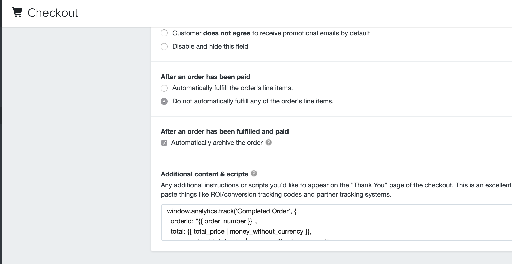

Segment makes it simple for Shopify merchants to integrate analytics, email marketing, advertising and optimization tools.
Segment helps collect, translate, and route your data to your integrated end-tools in the format they understand.

The guide below provides a basic "how to" for implementing Segment in your Shopify store.
All you need to get up and running is to copy and paste a few snippets of code into your theme editor.

**Note:** Because themes may alter the functionality of your site, some developer work could be required to fully implement the desired tracking. Providing an out-of-the-box solution for all event tracking is not the intention of this guide.

- - -




## Step 1: Segment Account

Start by creating a Segment account and workspace. You'll be able to invite teammates to this workspace in the future.

Once your account is created, add a new source for your store.


## Step 2: Install Segment Code

Once your Segment account is ready to go you'll need to copy/ paste a few lines of javascript into your Shopify theme templates.

Everything you need can be found in your Shopify Admin under Themes > Customize Theme > Edit HTML/CSS. Each section below includes a reference to one of the folders and liquid templates that can be found on the left side of this page.

If you want to track all events as [non-interaction to Google Analytics](/docs/integrations/google-analytics/#non-interaction-events), make sure to add an event property to specify this.


### 2a: Add Your Snippet to All Pages

- Folder: `Layouts`
- File: `theme.liquid`

Add the following snippet to the line above the `</head>` tag on your main `theme.liquid` template file. This loads "analytics.js", [Segment's javascript library](/docs/sources/website/analytics.js/), on every page of your Shopify store.

Make sure you replace `YOUR_WRITE_KEY` with the write key found at Dashboard > Sources > Settings > Keys > Write Key

```html
<script type="text/javascript">
!function(){var analytics=window.analytics=window.analytics||[];if(!analytics.initialize)if(analytics.invoked)window.console&&console.error&&console.error("Segment snippet included twice.");else{analytics.invoked=!0;analytics.methods=["trackSubmit","trackClick","trackLink","trackForm","pageview","identify","group","track","ready","alias","page","once","off","on"];analytics.factory=function(t){return function(){var e=Array.prototype.slice.call(arguments);e.unshift(t);analytics.push(e);return analytics}};for(var t=0;t<analytics.methods.length;t++){var e=analytics.methods[t];analytics[e]=analytics.factory(e)}analytics.load=function(t){var e=document.createElement("script");e.type="text/javascript";e.async=!0;e.src=("https:"===document.location.protocol?"https://":"http://")+"cdn.segment.com/analytics.js/v1/"+t+"/analytics.min.js";var n=document.getElementsByTagName("script")[0];n.parentNode.insertBefore(e,n)};analytics.SNIPPET_VERSION="3.0.1";


  window.analytics.load("YOUR_WRITE_KEY");

  // identify the customer if they have an account
  
  window.analytics.identify("\{{customer.id}}", {
    name: "\{{ customer.name }}",
    firstName: "\{{ customer.first_name }}",
    lastName: "\{{ customer.last_name }}",
    email: "\{{ customer.email }}",
    phone: "\{{ customer.default_address.phone }}",
    address: {  // uses the default address
      street: "\{{ customer.default_address.street }}",
      city: "\{{ customer.default_address.city }}",
      state: "\{{ customer.default_address.province }}",
      stateCode: "\{{ billing_address.province_code }}",
      postalCode: "\{{ customer.default_address.zip }}",
      country: "\{{ customer.default_address.country }}",
      countryCode: "\{{ customer.default_address.country_code }}"
    },
    totalSpent: "\{{ customer.total_spent }}",
    allOrdersCount: "\{{ customer.orders_count }}",
    allOrderIds: ["\{{ order.id }}",],
    tags: [ "\{{ tag }}", ]
  });
  
  window.analytics.page();
  }}();
</script>
```

### 2b: Category (Collection) Pages

- Folder: `Templates`
- File: `collection.liquid`

This creates a **Viewed Product Category** event that tracks your product category pages (referred to as Collections in Shopify).
Include the script as the last item in this file.

```html
<script type="text/javascript">
  analytics.track('Viewed Product Category', {
    category: "\{{ collection.title }}",
    categoryUrl: "\{{ collection.url }}",
    categoryProductCount: "\{{ collection.all_products_count }}",
     filteredType: "\{{ collection.current_type }}", 
     filteredVendor: "\{{ collection.current_vendor }}", 
    defaultSortBy: "\{{ collection.default_sort_by }}",
    referrerUrl: document.referrer,
    referrerPath: new URL(document.referrer).pathname,
    urlHref: window.location.href,
    urlPath: window.location.pathname,
    urlHash: window.location.hash
  });
</script>
```


### 2c: Product Pages

- Folder: `Templates`
- File: `product.liquid`

This creates **Viewed Product** and **Added Product**\* events.

> Note, the Added Product event script is designed to work with Shopify standard themes.
> If a theme leverages the Shopify AJAX cart (a good clue is that an overlay pops out where users update the cart rather than a page redirect), a custom solution will be required as each of these implementations will be different.

Include the script as the last item in this file.

```html
<script type="text/javascript">
  analytics.track('Viewed Product', {
    id: "\{{ product.id }}",
    name: "\{{ product.title }}",
    type: "\{{ product.type }}",
    url: "\{{ product.url }}",
    price: "\{{ product.price | money_without_currency }}",
    priceMin: "\{{ product.price_min | money_without_currency }}",
    priceMax: "\{{ product.price_max | money_without_currency }}",
    priceVaries: "\{{ product.price_varies | money_without_currency }}",
    variantsCount: "\{{ product.variants.size }}",
    firstAvailVariant: "\{{ product.first_available_variant.title }}",
    variantId: "\{{ product.selected_variant.id }}",
    variantAvailable: "\{{ variant.available }}",
    variantCompareAtPrice: "\{{ variant.compare_at_price | money_without_currency }}",
    variantQuantity: "\{{ variant.inventory_quantity }}",
    variantPrice: "\{{ variant.price | money_without_currency }}",
    variantSelected: "\{{ variant.selected }}",
    sku: "\{{ variant.sku }}",
    variantTitle: "\{{ variant.title }}",
    variantUrl: "\{{ variant.url }}",
    variantWeight: "\{{ variant.weight }}",
    vendor: "\{{ product.vendor }}",
    collections: ["\{{ collection.title }}",],
    available: "\{{ product.available }}",
    options: ["\{{ product.options | join: '", "' }}"],
    optionsCount: "\{{ product.options.size }}",
    tag: ["\{{ product.tags | join: '", "' }}"]
  });

  // track Product Added event

  var form = document.getElementById('AddToCartForm');
  // or your form's ID

  analytics.trackForm(form, 'Added Product', {
    id: "\{{ product.id }}",
    name: "\{{ product.title }}",
    price: "\{{ product.price | money_without_currency }}",
    quantity: "\{{ product.quantity }}",
    value: "\{{ product.quantity }}*\{{ product.price | money_without_currency }}"
  });
</script>
```


### 2d: Cart Page

- Folder: `Templates`
- File: `cart.liquid`

This script tracks a **Viewed Cart** event.
Include the script as the last item in this file.

```html
<script type="text/javascript">

// Viewed Cart Event

  analytics.track('Viewed Cart', {
    itemCount: "\{{ cart.item_count }}",
    totalPrice: "\{{ cart.total_price | money_without_currency }}",
    totalWeight: "\{{ cart.total_weight }}"
  });

</script>
```

### 2f: Thank You Page

The **Completed Order** event that records all your transaction data to Segment is added to the Thank You page.
> see Appendix A at the bottom of this guide for more details around expected behavior

To add a Thank You page script, you'll need to leave the Theme editor and head to your Settings > Checkout page: http://myshopify.com/admin/settings/checkout



Scroll down to the "Additional content scripts" field, shown above.

#### Important note:
**You'll need to include your Segment snippet from step 2a**.
*Make sure to add the WRITE KEY again*

Then add the Completed Order event code:

```html
<script type="text/javascript">

// calculate totalDiscount for Completed Order Event
var discounts = "\{{ order.discounts | json }}"
var totalDiscount = 0;

for (var i = 0; i< discounts.length; i++ ) {
totalDiscount += discounts[i].savings;
}

window.analytics.track('Completed Order', {
orderId: "\{{ order_number }}",
total: "\{{ total_price | money_without_currency }}",
revenue: "\{{subtotal_price | money_without_currency }}",
shipping: "\{{shipping_price | money_without_currency }}",
tax: "\{{tax_price | money_without_currency }}",
discount: totalDiscount,
products: [

{
  id: "\{{ line_item.product_id }}",
  sku: "\{{ line_item.sku }}",
  name: "\{{ line_item.title }}",
  price: "\{{ line_item.price }}",
  quantity: "\{{ line_item.quantity }}"
},
 ]
});

</script>
```


### 2x: Track the Index (Home / Main) Page

- Folder: `Templates`
- File: `index.liquid`

```html
<script type="text/javascript">
  analytics.track('Viewed Index');
</script>
```


### 2x: Track Other Pages

- Folder: `Templates`
- File: `page.liquid`

This will also track the contact page automatically (`page.contact.liquid`).

```html
<script type="text/javascript">
  analytics.track('Viewed Page', {
    title: "\{{ page.title }}",
    url: "\{{ page.url }}",
    author: "\{{ page.author }}",
    handle: "\{{ page.handle }}",
    id: "\{{ page.id }}"
  });
</script>
```

### 2x: Track Blog Pages

- Folder: `Templates`
- File: `blog.liquid`

This script tracks your blog home page.

```html
  <script type="text/javascript">
  window.analytics.track('Viewed Blog', {
    pageType: 'Front Page',
    pageTitle: document.title,
    blogArticleCount: "\{{ blog.articles_count }}",
    blogTitle: "\{{ blog.title }}",
    blogUrl: "\{{ blog.url }}",
    referrerUrl: document.referrer,
    referrerPath: new URL(document.referrer).pathname,
    urlHref: window.location.href,
    urlPath: window.location.pathname,
    urlHash: window.location.hash
    });
  </script>
```

- Folder: `Templates`
- File: `article.liquid`

This script tracks all your blog articles.

```html
<script type="text/javascript">

window.analytics.track('Viewed Blog', {
    pageType: 'Article',
    pageTitle: document.title,
    articleTitle: "\{{ article.title }}",
    articleAuthor: "\{{ article.author }}",
    articleCreatedAt: "\{{ article.created_at | date: "%F" }}",
    articlePublishedAt: "\{{ article.published_at | date: "%F" }}",
    articleCommentCount: "\{{article.comments_count }}",
    articleTags: ["\{{ article.tags | join: '", "'}}"],
    articleUrl: "\{{ article.url }}",
    referrerUrl: document.referrer,
    referrerPath: new URL(document.referrer).pathname,
    urlHref: window.location.href,
    urlPath: window.location.pathname,
    urlHash: window.location.hash
});

</script>
```


### 2e: Search Page

- Folder: `Templates`
- File: `search.liquid`

This tracks your search page.

```html


<script type="text/javascript">
  analytics.track('Searched Products', {
    resultsCount: "\{{ search.results_count }}",
    terms: "\{{ search.terms }}"
  });
</script>

```

## Registration

- Folder: `Templates`
- File: `customers/register.liquid`

```html
<script type="text/javascript">

// Viewed Registration Event

  analytics.track('Viewed Registration');

// Creates a "Signed Up" event on registration

  var form = document.querySelector('form[id="create_customer"]');

  analytics.trackForm(form, "Signed Up", function(form){
      var firstName = document.querySelector('input[name="customer[first_name]"]').value;
      var lastName = document.querySelector('input[name="customer[last_name]"]').value;
      var email = document.querySelector('input[name="customer[email]"]').value;

      return {
        firstName: firstName,
        lastName: lastName,
        email: email
      }
   });
</script>
```

## 404 Page (`404.liquid`)

```html
<script type="text/javascript">
  analytics.track('Viewed 404 Page');
</script>
```
___________
## Appendix A
### Expected behavior during checkout steps

From Admin > Settings > Checkout page: `https://<YOUR STORE>.myshopify.com/admin/settings/checkout`

Following step 2f, I added my snippet (write key removed for the example) and the Completed Order code:
[follow this link to see my code](https://gist.github.com/WesleyDRobinson/2b3812e735671383c6e23c446ce8ea0a#file-shopify-checkout-script-L5)

_________

For this example, I added a little check:


_________

Analytics calls as expected on page leading to Checkout:


_________

No Segment activity on the actual Checkout pages:
 

_________

On the final Thank You/ Order Status page, Segment is collecting data again and the little check event "Checkout - Additional contents and scripts" is fired:


_________
