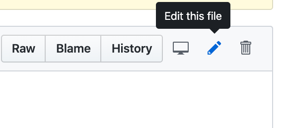
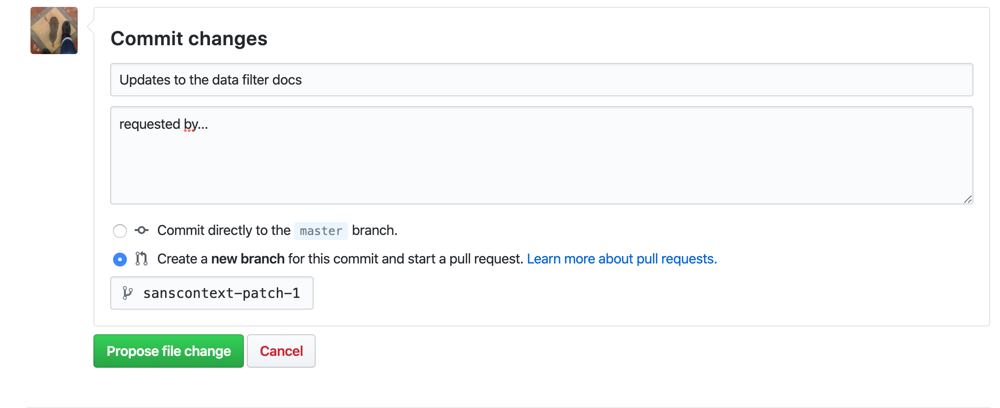
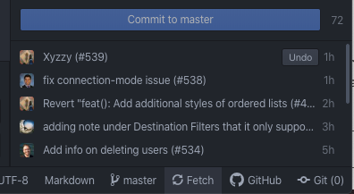
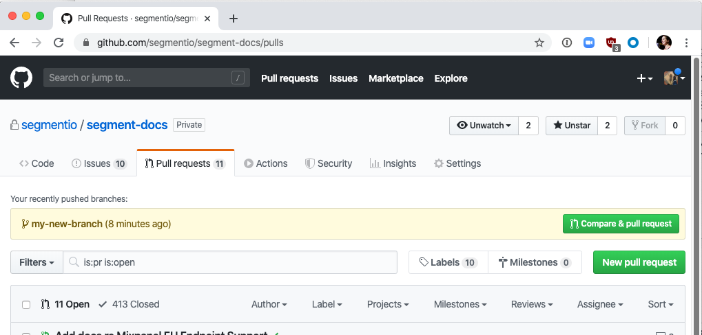
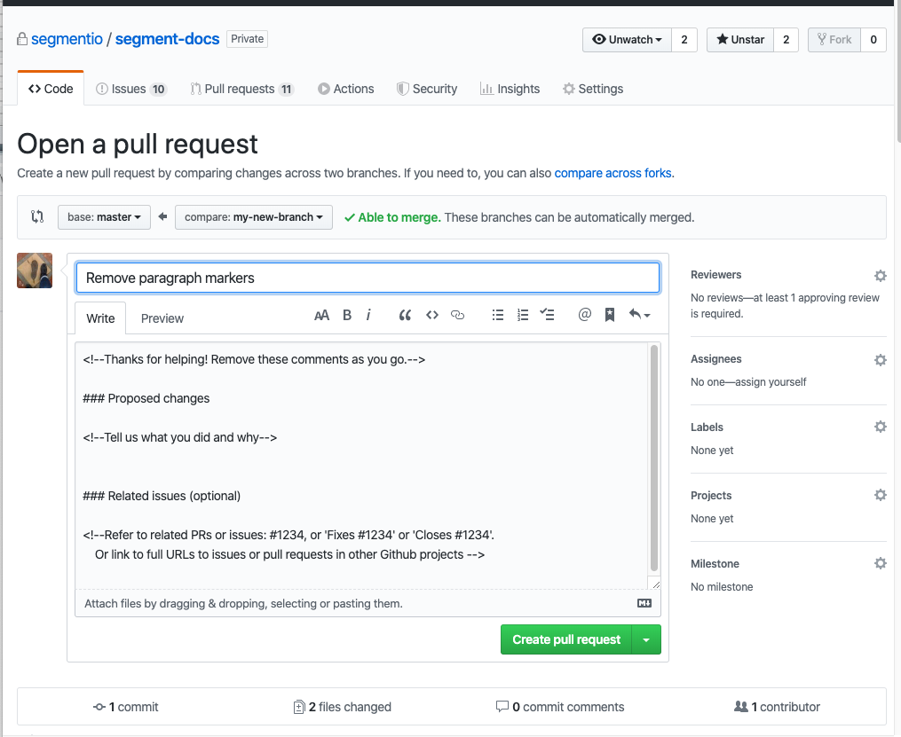
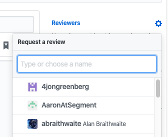

# Segment Docs Contributors Guide

Thanks for helpin' out! We really appreciate it.


Here's what's here:
<!-- TOC depthFrom:2 depthTo:6 withLinks:1 updateOnSave:1 orderedList:0 -->

- [Contribute from the Github web UI](#contribute-from-the-github-web-ui)
- [Contribute using Git and Atom](#contribute-using-git-and-atom)
	- [Making review edits in a PR](#making-review-edits-in-a-pr)
- [Contribute using git native commands](#contribute-using-git-native-commands)
- [Tips and tricks](#tips-and-tricks)
	- [Adding links that open in a new window](#adding-links-that-open-in-a-new-window)
	- [Escaping code snippets](#escaping-code-snippets)
	- [Syntax highlighting](#syntax-highlighting)
	- [Note Blocks](#note-blocks)
	- [Redirect to a workspace](#redirect-to-a-workspace)
- [Set up on Mac using the Env script](#set-up-on-mac-using-the-env-script)
- [Refresh the Segment catalog](#refresh-the-segment-catalog)
	- [Set up to refresh the Segment catalog](#set-up-to-refresh-the-segment-catalog)

<!-- /TOC -->


There are three ways to contribute.
- EASY: [Contribute from the Github web UI](#contribute-from-the-github-web-ui) - only use this when making small edits to existing text files
- INTERMEDIATE: [Contribute using Git and Atom](#contribute-using-git-and-atom) - use this for everything else
- ADVANCED: [Contribute using Git](#contribute-using-git-native-commands) - if you're a git nerd, you can use this method

If you're changing how the docs render, adding files or changing images, you should use the intermediate or advanced options.

This guide also contains a bunch of [useful formatting tips and tricks](#tips-and-tricks), plus instructions on how to [set up to run the docs locally](#set-up-on-mac-using-the-env-script), and how to [refresh the docs-catalog files](#refresh-the-segment-catalog).


## Contribute from the Github web UI

> **Use this method when making small edits to an existing file only.**
> Don’t use this when:
> - Editing more than one file at a time,
> - Adding or removing image files
> - Making  edits that change how the docs or docs navigation works.
>
> In those cases, set up to [contribute using Atom], and run the docs locally to confirm that your changes work and render as expected.

1. Go to https://github.com/segmentio/segment-docs/tree/master/src, find the file you want to edit, and click the Pencil icon - “Edit this file”
   
2. Make your changes.
3. Scroll all the way to the bottom and make a note about your change.
   
4. Click **Propose file change**.
5. On the next screen, add a reviewer or two.
   These should be folks who know enough about the content change to give it a thumbs up. If you don't know who that is, you can also tag @sanscontext for a docs-team review.
6. Once someone has reviewed and approved the change,  merge the change.
7. Delete the branch once the change has been merged!

**If changes are needed on your Github PR**: You (or they) can add Github "suggestions", which you can merge into your PR either in a batch, or one by one. If there are many updates, you might need to check out your branch using the Atom and Git process below to make the changes in a single commit.

## Contribute using Git and Atom

If you are adding files, changing images, making large or long-running changes to some docs, or changing how the docs are ordered or rendered, you should use Git. If you're not a git-native, your best bet is to use Atom, the Github-created open-source editor. This requires a bit of setup the first time, but we'll put that in a separate section!

> ℹ️ **Before you begin**: Make sure you've installed Atom. You can either install as part of running the `make env` command [described below](), or by > following the [Atom installation instructions](https://flight-manual.atom.io/getting-started/sections/installing-atom/).

1.  Open Atom, and make sure the Git tool panel is open.
    (Press `Ctrl + Shift + 9` to open or close it, or find it in the **Packages** menu in Atom.)
2.  Switch to the `master` branch, and update/fetch master from within Atom, using the 🔄 Fetch button
    
3.  Create a new branch from `master`. This is where you’ll commit your changes.
    
4.  Make your changes, and save the files you’ve changed.
5.  Stage changes. This means you mark them as specific files that you want to save and check in.
6.  Add a short commit message, and click **Commit to (branchname)**. This adds a save point to your branch.
    

7.  Click **Publish** (or **Push**).

8.  Go to the [Segment-docs repo in Github](https://github.com/segmentio/segment-docs), and create new Pull Request (PR).
    A pull request is how you ask to add your changes to the public version of the documentation.
    If you recently pushed a new branch, Github will prompt you to open a PR by clicking the Compare & pull request button.
    
    (If you don’t see this, you can go to **Pull requests** tab, and click **New pull request**, then in the second drop down, find your branch name.)
9.  Open your Pull request.
    1. Add a good title that explains what your change does.
    2. Fill out the template sections. At minimum you should explain what this change does, but you can also link to Github issues or Jiras, or other conversations about the issue you’re fixing.
    
10. Next, request a review or two. One person should be able to check for typos, the other for technical inaccuracies.

    If you’re making a large change, you should include someone from the Engineering or Product teams.
    Github will suggest the last few people who edited that file. That’s often a good way to go! If not, you can requesting a review from sanscontext.
   


### Making review edits in a PR

Your reviewers might ask you to make changes to your PR before merging it. You can do this easily in Atom: Just follow steps 4-7 above as needed. (Make the change(s), save the file(s), stage them, write a commit message, and push.) They’ll get added to the changes already in the branch in your Pull Request!

Once your PR has been reviewed, approved, and all the automated tests completed, click **Squash and Merge**, and then **Delete branch** to clean up after yourself!

Back in Atom, you can do a bit of pre-work by selecting the `master` branch and clicking and **Pull**. Now you're ready for the next edits!


## Contribute using git native commands

This section is a very sparse outline of a git flow for git-experts and other folks with strong opinions about Atom. ;)  It assumes that you have a favorite text editor, git installed, and that you've already set done a `git clone` to create the local segment-docs repo.

1. Change to and update master (`git checkout master && git pull`)
2. Create a new branch from master (`git checkout -b my_new_branch`)
3. Make changes, save them.
4. Stage your changes (`git status` and `git add` the appropriate files)
5. Commit staged changes to your branch (`git commit`)
6. Push your branch and changes to the `segment-docs` repo (`git push`, `git push --set-upstream origin`)
7. Repeat steps 3-6 as needed.
8. Open a PR by [going to the PRs page](https://github.com/segmentio/segment-docs/pulls), if not prompted, create new by selecting `master` as base, `(your branch name)` as other.
9. Request a review. The Codeowners should populate this, and if not you can tag someone on the docs team.
10. If changes are requested, repeat steps 3-6 as needed.
11. Once approved, merge and delete branch, delete branch locally.


## Tips and tricks


### Adding links that open in a new window

Use the standard markdown format for links (ex: `[text](https://example.com)`).
To make a link open in a new tab append `[text](https://example.com){:target="_blank"}` to the end.

### Escaping code snippets

Certain code syntax is interpreted by Jekyll/Liquid as site code. If you're having trouble showing code snippets in the docs, you can wrap the snippet in a `` tag. In the example below, the curly brackets would not render in the docs. The raw tags ensure the code renders properly.

```

To pass source name in the slack message, format it like so: `{{properties.sourceName}}`

```


### Syntax highlighting

We're using Rouge, set in the `_config.yml`. It's now default for Jekyll 3 and later, so 🎉.
A list of the cues Rouge accepts can be found [here](https://github.com/rouge-ruby/rouge/wiki/list-of-supported-languages-and-lexers).

### Note Blocks
We're using [Premonition](https://github.com/lazee/premonition) for our Note blocks. This is stock right now, with four styles: `note`, `info`, `success`, `warning`, and `error`.

You'd write a block like this:
```md
> warning "I am a warning"
> The body of the warning goes here. Premonition allows you to write any `Markdown` inside the block.
```

Notes *must* include a `[]` in the heading/title, even if it's empty.
You can see how to write them in the `formatguide.md`, and see how they render at [https://segment.com/docs/utils/formatguide/#alerts](https://segment.com/docs/utils/formatguide/#alerts). This section also includes instructions on when to use each one.

### Redirect to a workspace
Occasionally, you'll want to deep-link into the Segment app to link a reader to a specific page or screen. Previously we'd throw them an URL and say "replace {MY SLUG} with your actual workspace slug", but now you can use the slug of `goto-my-workspace` and the Segment app will redirect them to the first workspace they have access to. (This does mean that it can go a bit wrong for users with access to multiple workspaces, however that's a small proportion of our users at this time.)

https://app.segment.com/goto-my-workspace/destinations/catalog


## Set up on Mac using the Env script

Laura wrote a bash script to set up the environment for you on a Mac computer. If you're on another platform, please [email us](mailto:docs-feedback@segment.com) or [file a Github Issue](https://github.com/segmentio/segment-docs/issues/new) to request other instructions, and we'll see what we can do.

> info ""
> You only need to run `make env` once!

1. Set up your Github config so you have an SSH key on your laptop.
2. Clone this repo locally.
3. Open your Terminal app and navigate to where you cloned the docs repo.
4. Start by checking what directory you’re in, to make sure you’re in the `segment-docs` repo.
   Type `pwd` (which means “print working directory”) to check. You should see something like `~/repos/segment-docs`.
5. Type `make env`.
   The script first checks to see if you have [Brew](https://brew.sh) installed, and if you don’t, it installs it. It then runs more brew commands to download and install the software you need, including a bunch of really useful Atom packages.

   > **Heads up**! You’re going to need to enter your laptop password as part of this installation, but only once!

   Once the installer completes, you still need to do a few small configuration tasks.

6.  Open the Atom app, then click the **Atom** menu in the top left, and click **Install Shell Commands**.
7.  Next, make sure you’re showing invisible characters. These are important for seeing weird formatting in the docs, and for troubleshooting markdown.
    Go to **Preferences > Editor**, and scroll down to **Show Invisibles**. Make sure that’s checked!
    


<!-- LR: This stopped working when Apple switched to Zshell by default, and I haven't been able to get it working since.
8.  Finally, configure bash completion by adding tab-completion to your `.bash` profile:

    1. Open Terminal and type `atom ~/.bash_profile` to open the file in Atom.
    2. Paste the following anywhere in the file:
    `[[ -r "/usr/local/etc/profile.d/bash_completion.sh" ]] && . "/usr/local/etc/profile.d/bash_completion.sh"`
    3. Save and close the file in Atom.
    4. Quit and relaunch both Terminal and Atom.-->

## Refresh the Segment catalog

The Segment Docs pull a list of sources and destinations from the public ConfigAPI's Catalog API endpoint. We save these files locally (in YML files in `src/_data/catalog/`) so that you can run the docs locally without needing to touch the ConfigAPI, but these files can fall out of date.

To update the files, you run `make catalog` from your Terminal.  Before you can do that, follow the instructions below:

### Set up to refresh the Segment catalog

To use the `make catalog` command to update the list of sources and destinations that Segment supports, you'll need [a basic token for the Segment ConfigAPI](https://segment.com/docs/config-api/authentication/). You'll save this in a `.env` file on your computer, which allows the script to talk to the Segment APIs.

1. If you don't already have one, sign up for a free Segment workspace.
2. Copy the `.env.example` file at the root of this directory, and rename it to remove the word "example". It should *just* be called `.env` when you're done. **Do NOT check in your .env file.**
2. Go to the workspace's **Settings > Access Management > Tokens** tab (or click [here](https://app.segment.com/goto-my-workspace/settings/access-management)).
3. Click **Create Token**.
4. Add a description (and specify that you're using it for docs purposes, so nobody revokes it accidentally).
5. Select **Workspace Member**, check **Source Admin**, and select one or all sources. You _can_ grant this token more privileges, but that's unnecessary.
5. Click **Create**.
6. Copy the token, and paste it after the equals sign (`=`) after "PLATFORM_API_TOKEN".
7. Save and close the file.
   Before you run the make command you might need to type `env` and enter into Terminal, or otherwise restart your Terminal session.
