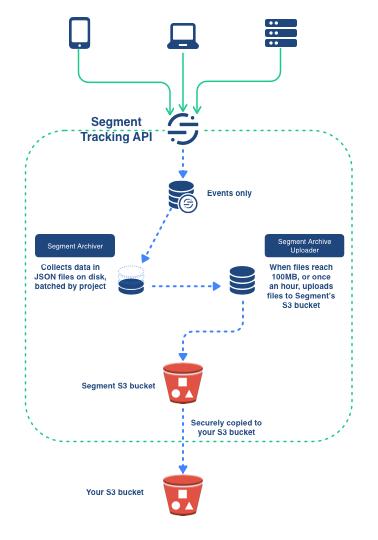

# The Segment Diagram Library

The library file was built by Tonik, and is in Sketch. You'll need a Sketch license to edit the file.

You can also export the file, or diagrams you make with it, to `.svg` format for storage.

## Using the Library

1. To create a new diagram, open the library file in Sketch and **make a copy**.
2. Rename the copy so it's specific to the project you're working on.
   *Don't* use the base library file itself for this.
3. Optionally, save the Sketch file to the `images` directory for the file you'll be putting this diagram in, so it's easier to find later.
    Jekyll _should_ exclude Sketch files from the build. You can also name the file with an underscore as the first character to exclude it from the build. If you have more than 3 sketch files for a specific doc, you can create a folder called `_src` in the `images` directory.
4. In Sketch, create a new Artboard. (Press A and drag a box on the screen.)
   This is the canvas where you'll put items from the library, and represents an area that you can export as an image.
5. Make your diagram! Don't forget to save frequently.
6. When you're ready to export, select the artboard by clicking it in the left layers navigation, and find the **Export** panel at the end of the right tool pane.
7. Select **1x** (Apple Retina screens support 2x but it's not necessary) and `.png` format.
8. At the VERY end of the panel, find the **Export Selected** button, and click it.
9. If needed, move the resulting `.png` file to the correct `images` directory.
10. Add the new diagram in the markdown file, and run a test build to make sure your diagram is legible on the page!
(Don't forget to add the file in git!)

That's it!

When you need to update the images, you can reopen the Sketch file, make your changes, and re-export.

## Adding new items to the Library

Contact @sanscontext for instructions. :)

## More reading on diagrams and diagram best practices

https://blog.ilograph.com/posts/diagram-mistakes/
