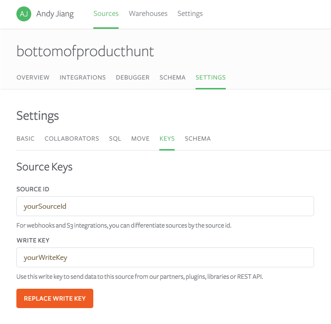

The write key is a unique identifier for your Source. It lets Segment know which Source is sending the data and therefore which destinations should receive the data.

To find your write key, you first need to create a Source that is not a “Cloud Source” (e.g. website, server). Then, in your Source, go to “Settings”, and then go to “Keys”:

Now you can place your write key in your app and begin sending us data.
