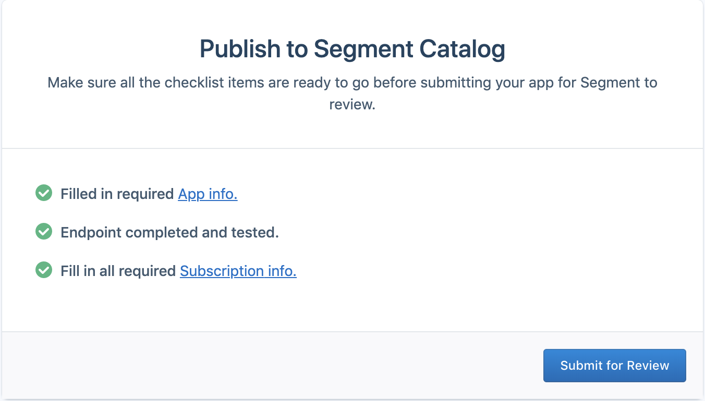

Subscriptions enable you to receive incoming data for our mutual customers to your service's HTTPS endpoint in realtime.

A Subscription gives you complete control over how you want to store, transform and process the data. It means that our mutual customers can immediately start sending you data from any one of Segment's [sources](/docs/sources), including a web browser, mobile apps, or from our mutual customer's servers — with no added work. Segment Business Tier customers can also replay historical data, which means you can demonstrate the value of your tool rapidly.

## Get Access to the Developer Center

[Request access](https://segment.com/partners/integration/) so we know you're interested in building an SDK Plugin. 

We'll grant you access to our Developer Center and agree on a launch date so that we can provide a focused window of deep guidance and support.

By starting or continuing this process, you agree to the [Segment Platform Partners Agreement](https://segment.com/docs/legal/partnersagreement/).

## Create your App

Now you can create your App. Your App will ultimately represent you in the Segment Catalog, so you should name it after your company.

## Build your Subscription

You can subscribe to customer data in two ways:

1. **[Webhook](/docs/partners/build-webhook)**: Build a new HTTP service that receives Webhook POSTs from Segment.
2. **[Functions](/docs/partners/build-functions)**: Write JavaScript functions that run on Segment to translate and send data to your existing API. [Get started...](/docs/partners/build-functions)

See the [Webhook](/docs/partners/build-webhook) and [Functions](/docs/partners/build-webhook) docs in-depth technical details about building.

## Test your Subscription

The ultimate goal is for Partners like yourself to create and publish high quality Destinations in [the Segment Catalog](https://segment.com/catalog/). Your Segment account doubles as a sandbox account to test your destination while you are still in a private "building" state.

To test your Destination in the Catalog, click the "Test" tab in the Developer Center Component builder. In the "Test in your workspace" section, select your personal workspace and click "view". This redirects to you a URL like https://app.segment.com/WORKSPACE-SLUG/destinations/catalog/APP-SLUG, which is your catalog entry.

From here, click "Configure App", select a Source, and click "Confirm Source". You can now configure your destination by setting the "API Key", then clicking the toggle to enable the destination.

Next you can click the "Event Tester" tab to send data to your destination. Here you can see what requests Segment sends to your destination and introspect the response you are returning. Learn more about the event tester [here](https://segment.com/docs/guides/best-practices/how-do-I-test-my-connections/).

Now you can use the JavaScript SDK in a browser to generate real analytics events.

Finally you should verify the data in your service.

## Document your Subscription

To provide a great experience for users, and to help us test your integration, you need to document your integration. Segment expects docs both on your site about Segment, and on Segment’s site about your integration. We provide templates for our docs to help you get started:

- For https://segment.com/docs/ about your integration ([HackMD template](https://hackmd.io/t7amLXluS7-39rg7ARZgSA))
- For https://segment.com/catalog/ about your integration ([Google Docs template](https://docs.google.com/document/d/1kvAvAHLyM3pOq-lBcZJhP_X_KivHlk1eiFy-5ERWDXc/edit))

## Submit your App for Review

After successfully testing your Component, make sure you've completed all [launch requirements](/docs/partners/#launch-requirements) and then it’s time to submit it for approval.

Please remember, you will not be able to edit your App information once you submit for approval, so please review all the details before hitting the “Submit for Review” button in Subscription "Publish" window.

Once you have submitted your Subscription for review, Segment will review it and get back to you within 2 business days.

## FAQ

### How do customers collect data?

A mutual customer will use `analytics.js` (our client-side javascript library), a server-side library, or one of our mobile SDK’s to implement our [api methods](https://segment.com/docs/spec/). For more information on Segment libraries, you can refer to our [source documentation](https://segment.com/docs/sources/#website).

### Does Segment automatically collect any data?

Only our `analytics.js` and mobile SDK’s collect contextual information from the device. Our server-side libraries do not collect contextual information, and a user is responsible for sending additional context themselves.

For more info on our automatically collected fields, please refer to [this document](https://segment.com/docs/spec/common/).

### How does Segment handle unique users?

For known users, a Segment customer will implement an `identify` method to collect info on the user. This can be  a moment in the user flow where a user logs in, registers, updates their info, or provides any type of identifiable information. A known user will have a `userId`, which is up to the customer to create and send.

For unknown users, Segment will handle generating a unique `anonymousId` via our client-side libraries: analytics.js, analytics-android and analytics-ios, and pass this in through all of Segment's api calls. This value is determined by the client cookie on our analytics.js library, and via the deviceId in our mobile SDKs.

Segment handles cacheing these values on our mobile SDKs and client-side analytics.js library and sending the values on subsequent calls. Our server-side libraries rely on the customer creating either the `anonymousId` or `userId` and passing this in on each call.

Read more about our unique Id’s [here](https://segment.com/blog/a-brief-history-of-the-uuid/).

### Do you have semantic events?

Yes!

To start, a Segment customer will track their user actions using our `track` method. Segment has [industry specs](https://segment.com/docs/spec/semantic/) to define semantic naming to follow, so when sending events in for a particular event flow, such as Ecommerce, Live Chat, Video and Email events, Segment can translate these semantic event names into other downstream tools.

It is essential that the destination follows the relevant industry specs when translating a Segment event into how the destination tool understands the event. That way, customers can enable any new integration and specced events, such as “Order Completed”, and it will automatically work with the new downstream destination.

### Are the events guaranteed to send in order?

No. Since Segment queues events, Segment cannot guarantee the order in which the event is delivered to your endpoint.

### Does Segment de-dupe messages?

Yes! Segment de-dupes messages by `messageId`.

Segment maintains a sliding window of all `messageId`s received for each source, only allowing `messageId`s through that do not already appear within the window.

Segment guarantees this window to be at least 24 hours of messages (meaning any message sent twice within 24 hours will be de-duped), but in practice, this window is significantly larger(currently sitting at around 170 days).

You can read more [here](https://segment.com/blog/exactly-once-delivery/).

### What is a replay?

Segment supports replaying historical data to new tools for Business Tier customers. This can greatly increase your activation and lower time to our customers getting value out of your tool.

Generally, the conditions required to replay data are:

1. The partner API respects the `timestamp` field for event time ordering.
2. Order of events does not matter.
3. The API has reasonably high rate-limit events.

Be sure to let us know if you are able to accept replays and what your rate limits look like.

### What are Segment's delivery guarantees?

Segment provides excellent data deliverability by employing API layer scalability and durability, data backup and replay, partner API monitoring, and library and integration cloud retries. Segment's API processes 170B+ billion calls per month across over a billion of monthly tracked users, is rate performant (avg. load 100,000 msg/sec), fully automated and scalable, can tolerate massive data spikes.

Segment monitors hundreds of partner APIs for 500s, success rate, and end-to-end latency to help our customers proactively achieve the best data deliverability possible.

You can subscribe to updates [here](https://status.segment.com/).

### Does Segment retry data?

Segment retries nine times over the course of four hours. This will increase the number of attempts for messages, so we’ll try and re-deliver them another 4 times after some backoff.

We don’t retry anywhere which is the sign of an expired API key or failed payment. However, if we push bad code that results in a malformed payload and a 400 or 422 response from an endpoint, we also won’t retry given that the call would not ever succeed.
