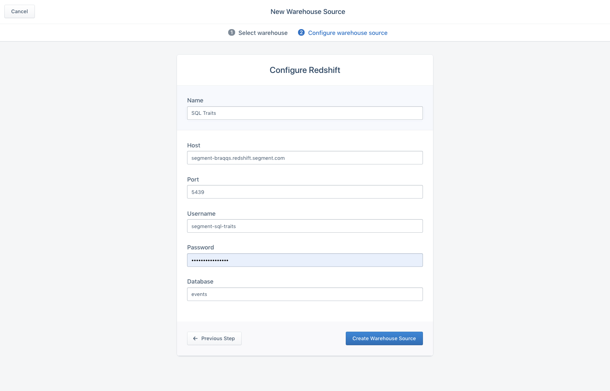
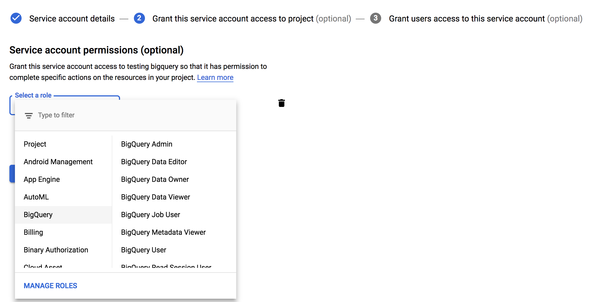
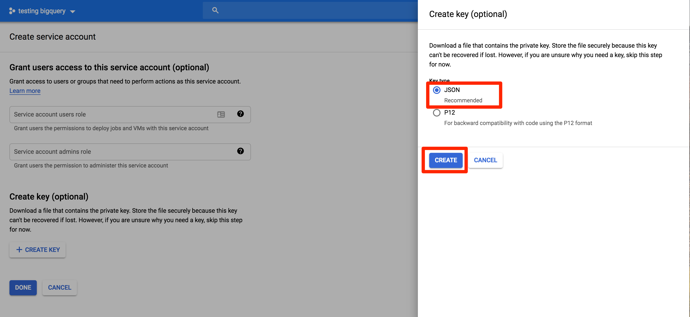
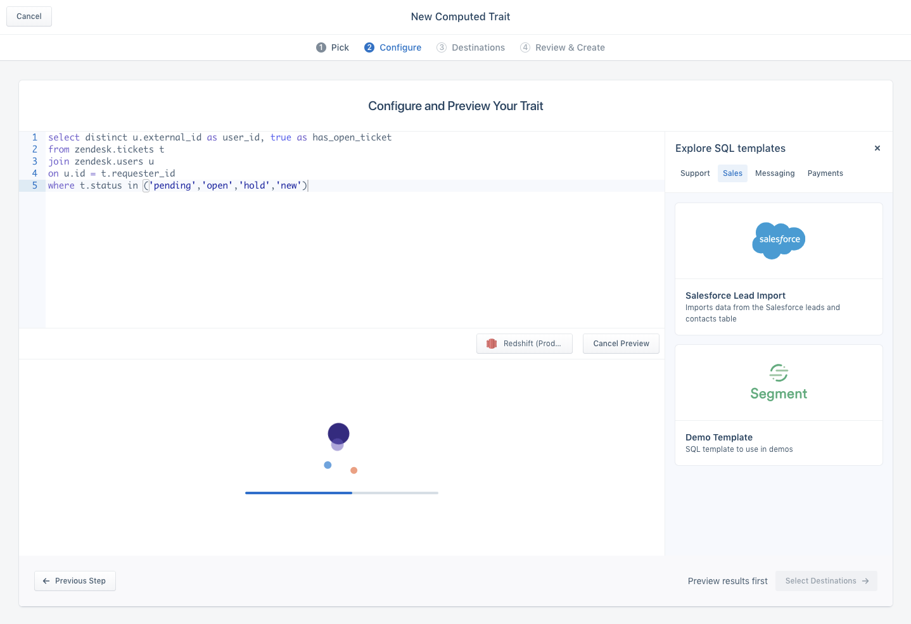
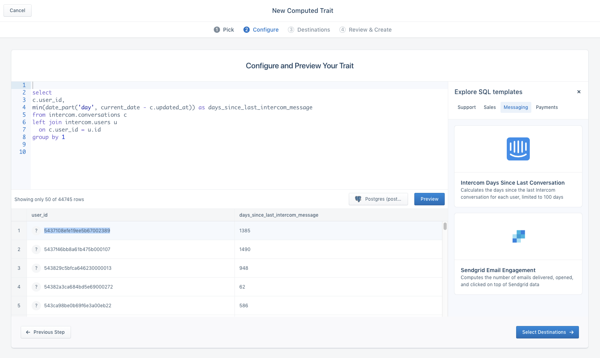

SQL Traits give you the flexibility of querying your data warehouse and importing the resulting user or account traits into Personas. This is useful for several use cases including:

- Creating audiences on cloud source data like Zendesk or Salesforce
- Importing historical traits
- Calculating advanced traits

## Quickstart

### Step 1. Set up a warehouse source

We currently support Redshift, Postgres, BigQuery, and Snowflake as data warehouse sources for SQL traits.

#### Redshift, Postgres, Snowflake Setup

If you don't already have a data warehouse already, please follow the steps here first:
- [Redshift Getting Started](/docs/destinations/redshift/#getting-started)
- [Postgres Getting Started](/docs/destinations/redshift/#getting-started)
- [Snowflake Getting Started](/docs/destinations/redshift/#getting-started)

Once your warehouse is up and running, add a new warehouse source from the Personas settings. For Redshift this might look like this:


Then provide your connection credentials, and then save. We recommend you create a separate read-only user for SQL traits.



#### BigQuery Setup

To connect BigQuery to Segment SQL Traits, you will need to create a service account for Segment to use.

1. Navigate to the Google Developers Console. Before proceeding, click on the drop down to the left of the search bar and select the project to which you want to connect.


> NOTE: If you do not see the project you would like to connect to listed in the drop down, click on the account switcher in the upper right corner of the window and ensure you are logged in to a Google account that is a member of the project.

2. Click on the hamburger menu in the upper left and select IAM & Admin and then Service accounts. Click the Create service account button.


3. Give your new service account a name. Under Project Role, add only the BigQuery Data Viewer and BigQuery Job User roles.



> IMPORTANT: We suggest adding only the BigQuery Data Viewer and BigQuery Job User roles to your service account. Adding other roles to your service account may prevent Segment from being able to connect.

4. Click "Create Key"


5. Click "Create" with "JSON" format selected


6. Create new BigQuery Warehouse Source in Personas

Now you can create a new BigQuery warehouse source, upload the JSON key you just downloaded, and complete the BigQuery setup


### Step 2. Preview a SQL trait

Now that you've setup your data warehouse, create a new SQL trait from the computed traits tab, and select the data warehouse you just configured. Note that there are a couple requirements for the data your query returns:

1. Must return a column with a user_id (or group_id for account traits, if you have Personas for B2B enabled).
2. Return at least one additional trait to import aside from user_id/group_id, and no more than 25 total columns
3. Ensure you have no null user_id’s or duplicate user_id’s
4. Query must return no more than 10 million rows

If you are sending [object cloud sources](https://segment.com/docs/sources/#cloud-apps) to your warehouse, you can also leverage some of the pre-made templates.



A successful preview will return a sample of users and their traits. Note that if we have seen this user before in Personas, you will see a green checkmark, and click on that user to view their user profile.


### Step 3. Connect to a destination

Once you’re ready to import these traits, select your destinations that you want to send this data to. You can also choose to skip, and in the ‘Review & Create’ final step, elect to just send this data to Personas by choosing "Compute without enabled destinations". You might want to do this if you want to build audiences from this data. Give your SQL trait a name. If you’re importing multiple traits, give it a name like "Zendesk traits". Note that the name here is for descriptive purposes, the trait names you will actually use in audience-building or in your downstream tools will correspond to the column names you've given in your query.


Once you’ve created a SQL trait, we will:

- Execute the query against your data warehouse twice a day by default (we are working on a customizable scheduling feature, please reach out if you'd like to use this)
- For each row (user or account) of your query result Personas sends an identify or group call with all the columns returned as traits. For e.g, if you write a query that returns `user_id,has_open_ticket, num_tickets_90_days, avg_zendesk_rating_90days` we will send an identify call with the following payload:

```
    {
      type: 'identify',
      userId: 'u123',
      traits: {
        has_open_ticket: true,
        num_tickets_90_days: 3,
        avg_zendesk_rating_90_days: 8
      }
    }
```

Happy Querying!

## Use Cases

SQL traits is a very flexible feature, but to get started we've seen three main categories of use cases:

### 1. Cloud Sources Sync

This means that you can now import data from our object cloud sources like Salesforce, Stripe, Zendesk, Hubspot, Marketo, Intercom etc. Check out our full list [here](/docs/sources/#object-cloud-sources)

Common use cases here include syncing Salesforce Leads or Accounts, syncing Zendesk ticket behavior, Stripe LTV calculations etc. Here are a couple example queries:

**Name:** Salesforce lead import

**Category:** Sales

**Source Required:** Salesforce

**Description:** Imports data from the Salesforce leads and contacts table

```
    select external_id_c as user_id,
    lead_score_c,
    lead_age_c,
    lead_status
    -- …more properties
    from salesforce.leads
```

**Name:** Has Open Ticket

**Category:** Support

**Source Required:** Zendesk

**Description:** Computes whether a user has an open ticket

```
    select distinct u.external_id as user_id, true as has_open_ticket
    from zendesk.tickets t
    join zendesk.users u
    on u.id = t.requester_id
    where t.status in ('pending','open','hold','new')
```

### 2. Historical / Non-Segment Data Import

Oftentimes there is data that predates your implementation of Segment, or exists in your data warehouse and isn’t implemented through our tracking APIs. You might want to send a historical LTV calculation for your customers, or sync user profile preferences, or usage data.

### 3. Custom SQL traits

We also have seen customers that have complex SQL trait calculations that are too complex to express in a UI builder. This can be tricky ARR calculations, days until or since a key milestone, complex user or account statuses etc. Please check out our [blog post](https://segment.com/blog/sql-traits) for more customer case studies.

## FAQs

### Is there a limit to the result set that can be queried and imported?

The result set is capped at 10M rows.

### How often are you querying the customer’s data warehouse?

We will query the data warehouse every 12 hours by default. It can go up to hourly. Please reach out if you have a need for more customizable schedules.

### Is querying a list of anonymous_id supported?

Currently anonymous users are not supported. We hope to release this in the near future. Please reach out to us to discuss your use case.

### Is Personas sending identify/group calls every run?

No, Personas will maintain only send an identify/group call if the values in a row have changed from previous runs.

### Can I return a query with just emails?

At this time, a user_id is required.

### Can you use SQL traits to create users in Segment? Or, will it only append traits to existing users?

Yes, it will send an `identify` call, so this use case will work. (Example use case: importing a list of customers that hasn't been active since you implemented Segment)

### I have a large (1M+) query of users to import, should I be worried?

If you are importing a large list of users and traits, the biggest consideration you have to take into account is the API call usage and volume amongst the partners you are sending the data to. These vary depending on our partners, so please reach out if you are concerned about this.


## Troubleshooting

### I am getting a permissions error.

You might encounter a similar permissions error:


This is usually because you are querying a schema and table for which the current user does not have access to. To check the table privileges for a specific grantee (user), go to your warehouse source credentials in Personas (for e.g. `https://app.segment.com/your_workspace_slug/personas/settings/warehouse-sources/`) to retrieve the user name. Typically to grant access to a table, an admin needs to grant access to both a schema and table through the following similar commands:

```
    GRANT USAGE ON SCHEMA ecommerce TO segment_user;
    GRANT SELECT ON TABLE ecommerce.users TO segment_user;
```

Learn more about granting permissions:
- https://www.postgresql.org/docs/9.0/sql-grant.html
- https://stackoverflow.com/questions/17338621/what-grant-usage-on-schema-exactly-do

### I am seeing a maximum columns error.


We currently support returning only 25 columns, please reach out to alex@segment.com if you need to access more with a description of your use case.

### I am seeing a duplicate user_id error.


We require that each row of your query corresponds to a unique user. We will throw this error if we see multiple rows with the same user_id. Please use a `distinct` or `group by` statement to ensure that each row has a unique user_id.

### I am seeing some users/accounts in my preview with questions marks. What does that mean?



This could mean one of two things:

#### 1. We haven’t seen this user_id/group_id before in Personas

This means for the sources connected to Personas (you can check these at https://app.segment.com/your_workspace_id/personas/settings/sources), we have not received any event (identify, track, page etc) with this user_id. This could a legitimate user_id for a number of reasons, but before syncing, make sure to rule out option 2, as this could corrupt your identity graph if you send a different type of identifier as the user_id.

#### 2. You have the wrong user_id column

It’s possible that you are returning a value for user_id which is inconsistent with how you are tracking user_id elsewhere. We’ve seen cases where some customers want to return email as the user_id, or a partner’s tool id as the user_id. These are against our best practices and will corrupt the identity graph if you are then tracking user_id differently elsewhere in your apps. If you see only question marks in the preview, and have already tracked data historically with Segment, then it’s likely you have the wrong column. If you cloud source doesn’t have the database user_id, we recommend joining with an internal users table first before sending the results back to Segment.
