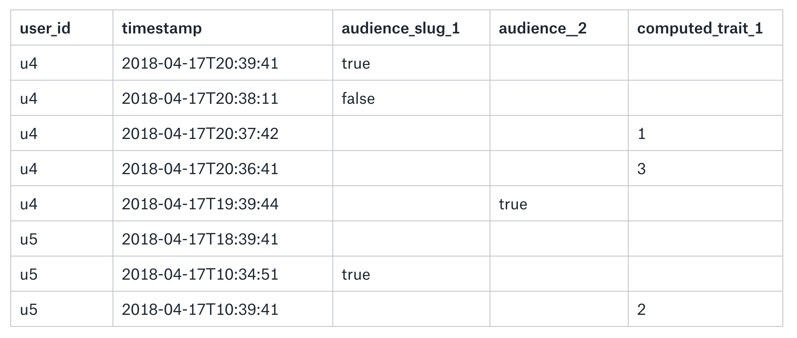

## How does Personas sync to my data warehouse?
Personas provides a complete, up-to-date view of your users customer journey as it unfolds. We know that one of the best ways to understand this journey is through SQL in a Data Warehouses. With Personas, we automatically load the synthesized Computed Traits and Audiences into your warehouse, so you can include this data in your reporting and analysis.

Segment makes it easy to load your customer profile data into a clean schema so your analysts can help answer some of your toughest business questions.

### Schema
Personas will create a new schema in your data warehouse, called `personas_default`. This schema contains clean tables with the synthesized traits and audiences generated within Personas.

#### personas_default.users

The most important table in this schema is the `users` table, which looks like this…

Each column in the users table will be a new computed trait or audience created within Personas. As you create more audiences and computed traits, Segment will dynamically add columns to this table without any additional configuration required.

For an **audience**, a user can be in three states:
* `true`: the user is in the audience
* `false`: the user was previously in the audience, but has exited the audience
* null: the user is not currently in the audience, nor were they ever in the audience

For a **computed trait**, the user can have:
* a value: the current value of the trait
* null: the user did not take any actions that would lead to computation of a trait (e.g. count of order completed where revenue >$100, user did not make any purchases >$100)

#### personas_default.identifies

The `identifies` table provides the log of users entering and exiting audiences, and updates to computed traits.

Using this table, you can reconstruct the historical state of a user or an audience, at any point in history.

## Common Questions

### Can I disable a table, computed trait, or audience from syncing from my warehouse?

Yes! You can use [Warehouses Selective Sync](https://segment.com/docs/guides/warehouses/can-i-control-what-data-is-sent-to-my-warehouse/) to manage which traits, audiences, and tables get synced from Personas.

### How frequently will my traits/audiences update in my warehouse?

Personas computed traits and audiences are updated based on your billing plan, up to every hour. You can see the sync history for any particular trait in the Computed Trait and Audience Overview page.

Warehouses also sync based on your billing plan and scheduled warehouse frequency, up to every hour. You can see the freshness of the `personas_default` schema in your Warehouse Overview page.

### Can I sync the identities table to my warehouse?

Not yet. We’re working on this feature, and if you’re interested please let your CSM know or get in touch with us [here](https://segment.com/help/contact/).
