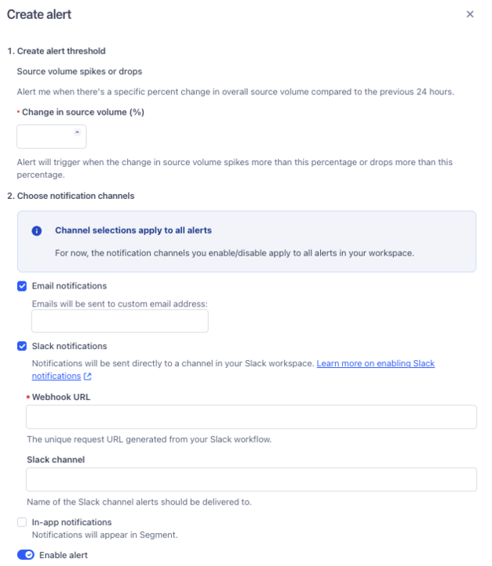

Connections Alerting allows Segment users to receive in-app, email, and Slack notifications related to the performance and throughput of an event-streaming connection. 

To access Connections Alerting, select an event-streaming connection (like a web library source or cloud mode destination) and click the **Alerts** tab. 

On the Alerts tab, you can create alerts and view all active alerts for this connection. You can only edit or delete the alerts that you create.

## Source volume alerts

You can create an alert that notifies you when the volume of events received by your source in the last 24 hours changes beyond a percentage you set. For example, if you set a change percentage of 4% and your source received 100 events over the first 24 hours, Segment would notify you the following day if your source ingested fewer than 96 or more than 104 events.

To receive a source volume alert in a Slack channel, you must first create a Slack webhook. For more information about Slack webhooks, see the [Sending messages using incoming webhooks](https://api.slack.com/messaging/webhooks){:target="_blank”} documentation.

To create a source volume alert: 
1. In your workspace, navigate to Connections, select Sources, and select the Event streams tab. 
2. Select the [event streams source](/docs/connections/sources/#event-streams-sources) you'd like to configure alerts for. 
2. Select the Alerts tab and click **Create alert**. 
3. On the Create alert sidesheet, enter a percentage of source volume change that you'd like to be notified for. 
4. Select one or more of the following alert channels:
  - **Email**: Select this to receive notifications at the provided email address. 
  - **Slack**: Select this to send alerts to one or more channels in your workspace. You can post messages to your channel with either a [webhook](https://api.slack.com/messaging/webhooks){:target="_blank”} or a [workflow](https://slack.com/help/articles/360041352714-Build-a-workflow--Create-a-workflow-that-starts-outside-of-Slack){:target="_blank”}. 
  - **In-app**: Select this to receive notifications in the Segment app. To view your notifications, select the bell next to your user icon in the Segment app. 
5. Click **Save**.

To make changes to a source volume alert, select the icon in the Actions column for the alert and click **Edit**. 

To delete a source volume alert, select the icon in the Actions column for the alert and click **Delete**.

> info "Deleting alerts created by other users requires Workspace Owner permissions"
> All users can delete source volume alerts that they created, but only those with Workspace Owner permissions can delete alerts created by other users. 

## Successful delivery rate alerts

You can create an alert that notifies you when the volume of events successfully received by your destination in the last 24 hours falls below a percentage you set. For example, if you set a percentage of 99%, Segment notifies you if your destination had a successful delivery rate of 98% or below. 

To receive a successful delivery rate alert in a Slack channel, you must first create a Slack webhook. For more information about Slack webhooks, see the [Sending messages using incoming webhooks](https://api.slack.com/messaging/webhooks){:target="_blank”} documentation.

To create a successful delivery rate alert: 
1. Navigate to the [cloud-mode destinations](/docs/connections/destinations/#:~:text=Cloud%2Dmode%3A%20The%20sources%20send%20data%20directly%20to%20the%20Segment%20servers%2C%20which%20then%20translate%20it%20for%20each%20connected%20downstream%20destination%2C%20and%20send%20it%20on.) you'd like to configure alerts for. 
2. Select the Alerts tab and click **Create alert**. 
3. On the Create alert sidesheet, enter a percentage. You will receive events if your successful delivery rate falls below this percentage. 
4. Select one of the following alert channels:
  - **Email**: Select this to receive notifications at either the email address associated with your account or another email address that you enter into this field. 
  - **Slack**: Select this to send alerts to one or more channels in your workspace. You can post messages to your channel with either a [webhook](https://api.slack.com/messaging/webhooks){:target="_blank”} or a [workflow](https://slack.com/help/articles/360041352714-Build-a-workflow--Create-a-workflow-that-starts-outside-of-Slack){:target="_blank”}.
  - **In-app**: Select this to receive notifications in the Segment app. To view your notifications, select the bell next to your user icon in the Segment app. 
5. Click **Save**.

To make changes to a successful delivery rate alert, select the icon in the Actions column for the alert and click **Edit**. 

To delete a successful delivery rate alert, select the icon in the Actions column for the alert and click **Delete**. 

> info "Deleting alerts created by other users requires Workspace Owner permissions"
> All users can delete successful delivery alerts that they created, but only those with Workspace Owner permissions can delete alerts created by other users.
Segment generates delivery alerts for failed deliveries and successful deliveries, which are the last two stages of the delivery pipeline. As a result, alerts are based on Segment's attempts to send qualified events to your destination, excluding those filtered out by business rules (like protocols, destination filters, or mappings).