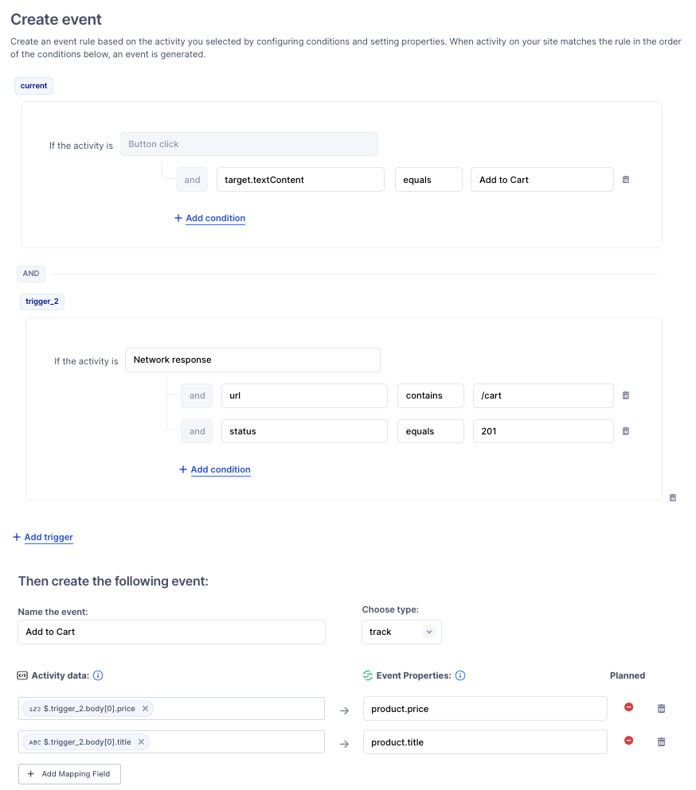

This guide details how to use signals and their associated data, generated in one of the Signals SDKs with the Auto-Instrumentation dashboard in your Segment workspace. On this page, find details on:

- Creating custom rules to capture and translate signals into actionable analytics events.
- Example rules that you can use as a basis for further customization.

This guide assumes that you've already added the Signals SDK to your application. If you haven't yet, see the [Auto-Instrumentation Setup](/docs/connections/auto-instrumentation/) guide for initial setup.

> info "Auto-Instrumentation in public beta"
> Auto-Instrumentation is in public beta, and Segment is actively working on this feature. Some functionality may change before it becomes generally available.                  

> info "Regional availability"
> Auto-Instrumentation isn't supported in EU workspaces.

## Converting signals to events

After you set up the Signals SDK to capture the signals you want to target, you can create rules in your Segment workspace to translate the captured signals into traditional Segment analytics events. These rules are deployed in your application the next time a user launches your app.

The process works like this:

1. The SDK sends raw signals from your app or website to Segment.
2. You build event rules in your workspace that define how those signals should become analytics events.
3. You publish the event rules.

After publishing, Segment analyzes user interactions in your app or website against these rules and automatically generates analytics events when matching interactions occur.

### Getting started with rule creation

1. Ensure you have the `Workspace Owner` or `Source Admin` role in Segment. If your source is connected to a tracking plan, you will also need, at a minimum, the `Tracking Plan Read-only` role. To view the content in the Event Builder tab, you will need, at a minimum, the `Source Read-only` role.
2. In your Segment workspace, go to **Sources** and select a source.
3. Open the **Event Builder**, then click **Create Rules**.

> info "Where's the Event Builder tab?"
> The Event Builder tab only appears after you've enabled Auto Instrumentation under the Analytics.js tab in the source's settings. If you don’t see the tab, reach out to your Segment CSM.

### Using the Rules Editor

The Rules Editor is where you define rules that transform raw signal data into analytics events. Using the dropdown-based editor, you can:

- Combine multiple signals into a single event (for example, a click followed by a navigation).
- Set conditions to control when events should be triggered.
- Assign custom event names.

#### Tracking plan integration

If your source is connected to a tracking plan, you can quickly confirm that a rule’s event and properties are planned. When creating or editing a rule, choose an event by typing its name or selecting from the tracking plan’s events in a dropdown. Similarly, add properties by typing their names or selecting from the event’s properties in a dropdown. The Planned column, shown next to each property mapping and in the Event Rules table, indicates whether the property or event is planned.

#### Adding event properties

You can enrich your events by adding properties based on signal metadata. For example:

- Capture `product.price` in your **Add to Cart** event.
- Add a boolean field like `couponApplied` to your **Order Completed** event.

These properties are sent alongside your event, giving your team deeper insights without requiring any manual instrumentation.

<!-- PW, 6 August 2025: Commenting this section out for now
#### Preview your event rule

To verify that a rule is working as expected, you don't need to enter a cycle of creating and updating the rule, generating signals, then checking the source debugger for the generated event. As you create, edit, or view a rule, you can preview it in real time against the current signal buffer to see which signals match and what the resulting event will look like. Event properties are mapped to the values found in the matched signals, and complete matches are grouped by anonymous ID.

The Rules Editor also lets you test your rules with recent signals to verify that they produce the data you need before you deploy. 

The following example tracks all Screen events:

```javascript
function screenCall(currentSignal) {
  if (currentSignal.type == SignalType.Navigation && currentSignal.data.action == NavigationAction.Entering) {
    analytics.screen(currentSignal.data.screen, null, null)
  }
}

function processSignal(signal) {
	screenCall(signal)
}
```

-->

<!-- PW, 6 August 2025: Also commenting the Signal definitions page out on PM request
## Signal definitions

Signals come in various types, each associated with specific data that you can use to create analytics events. This section contains code samples that detail each signal type. Because Segment has standardized these definitions across both the Signals-Swift and Signals-Kotlin libraries, they're useful when you create rules in your Segment workspace.

### Base signal

The Base Signal serves as the foundation for all other signal types. It's defined by the `RawSignal<T>` interface, where `T` represents the data type associated with the signal.

This interface ensures that every signal inherits essential properties:

```java
interface RawSignal<T> {
    var anonymousId: String    // 
    var type: SignalType       // Specifies the signal category.
    var timestamp: String      // The exact time when the signal was generated.
    var index: Int             // An integer representing the signal's position.
    var data: T                // The specific data of type `T` associated with the signal.
}
```

### Signal Types

The Signal Type `enum` defines the different types of signals the SDK can collect:

```java
enum SignalType {
    Interaction,      // User interactions like clicks or touches.
    Navigation,       // Navigation events.
    Network,          // Network requests and responses.
    LocalData,        // Data loaded from local or other external sources.
    Instrumentation,  // Events generated from Segment Track/Screen/... events.
    UserDefined       // Custom events defined by the user.
}
```

### Interaction signals

The SDK collects Interaction signals when you enable one of the `UIAutoSignal` options, like `useSwiftUIAutoSignal: true`. These signals primarily track user interactions with UI components:

```java
class InteractionData {
    var component: String // The type of UI component interacted with, like "Button" or "Image".
    var title: String?    // Optional title of the component, if applicable.
    var data: Object?     // Additional data related to the interaction, if any.
}

class InteractionSignal extends RawSignal<InteractionData> {
    type = SignalType.UIInteraction // Sets the signal type to UI Interaction.
}
```

### Navigation signals

The SDK collects Navigation signals when you enable one of the `UIAutoSignal` options, like `useSwiftUIAutoSignal: true`. These signals are generated when a user interacts with navigation components in your application's UI, giving you insight into how users move through and interact with your application:

```java
enum NavigationAction {
    Forward,    // Navigation to the next item or page
    Backward,   // Navigation to the previous item or page
    Modal,      // Opening a modal window
    Entering,   // Entering a new screen 
    Leaving,    // Leaving a screen 
    Page,       // Navigation involving a full page
    Popup       // Interaction with a popup
}

class NavigationData {
    var action: NavigationAction // The type of navigation action performed.
    var screen: String           // The screen or component name involved in the navigation.
}

class NavigationSignal extends RawSignal<NavigationData> {
    type = SignalType.Navigation // Sets the signal type to Navigation.
}
```

### Network signals

The SDK collects Network signals when you enable the `useNetworkAutoSignal` option in your Signals Configuration, like `useNetworkAutoSignal: true`. These signals are generated when your application makes network requests:

```java
enum NetworkAction {
    Request,  // A network request is made.
    Response  // A response is received.
}

class NetworkData {
    var action: NetworkAction // The type of network action, either Request or Response.
    var url: String           // The URL involved in the network action.
    var statusCode: Int?      // The HTTP status code of the response, if applicable.
    var data: Object?         // Additional data associated with the network action.
}

class NetworkSignal extends RawSignal<NetworkData> {
    type = SignalType.Network // Sets the signal type to Network.
}
```

### Local Data signals

The SDK collects Local Data Signals when data gets loaded from local soures, like SQLite databases or local caches. These signals help track how your application manages local data:

```java
enum LocalDataAction {
    Loaded,    // Data was loaded from a local source.
    Updated,   // Existing data was updated.
    Saved,     // New data was saved locally.
    Deleted,   // Data was deleted from a local source.
    Undefined  // Any other unspecified local data action.
}

class LocalData {
    var action: LocalDataAction // The type of action performed on the local data.
    var identifier: String      // A unique identifier for the data, like "Loaded User Info".
    var data: Object?           // Additional details or data associated with the action.
}

class LocalDataSignal extends RawSignal<LocalData> {
    type = SignalType.LocalData // Sets the signal type to LocalData.
}
```

### Instrumentation signals

The SDK collects Instrumentation Signals when [traditional Segment analytics events](/docs/connections/spec/) are invoked:

```java
enum EventType {
    Track,    // 
    Screen,   // 
    Identify, // 
    Group,    // 
    Alias,    // 
    Unknown   // Any other unspecified event type.
}

class InstrumentationData {
    type: EventType      // The type of Segment event.
    rawEvent: Object?    // Additional details of the event.
}

class InstrumentationSignal extends RawSignal<InstrumentationData> {
    type = SignalType.Instrumentation // Sets the signal type to Instrumentation.
}
```

### User-defined signals

You can also define your own signals. Use the following example as an implementation guideline:

```java
interface MyCustomData {
    var event: String  // A custom event description or identifier.
}

class MyCustomSignal extends RawSignal<MyCustomData> {
    type = SignalType.UserDefined // Sets the signal type to User Defined.
}
```


-->
## Example rule implementations

You can use Signals to create tracking rules using the event builder. 

### Example: Identify users

The following screenshot shows an Identify event rule that combines a button click with a successful network response to extract user data and trigger an identify call.


<!-- PW: more commenting out>

Building off of the screen tracking example, you could create a rule that identifies users:

```javascript
function detectIdentify(currentSignal) {
    var loginType;
    
    // Check if the signal is related to network activity on a login URL
    if (currentSignal.type == SignalType.Network && currentSignal.data.url.includes("login")) {
        loginType = "login";
    }
    
    // If a login type was detected, identify the user
    if (loginType) {
        var traits = new Object();
        traits.loggedIn = true; // Set user status to logged in
        let loginData = currentSignal.data.data.content; // Extract login data from the signal
        traits.userName = loginData.userName; // Capture the user's name

        if (loginType === "login") {
            var userId = loginData.userId; // Get userID from login data
            analytics.identify(userId, traits); // Identify the user with the Identify call
        } 
    }
}

//...other functions

function processSignal(signal) {
	//...other functions
	detectIdentify(signal); // Process the Identify call based on incoming signals
}
```
-->

### Example: Track `Add to Cart` events

This rule implements a core ordering event from [the e-commerce Spec](/docs/connections/spec/ecommerce/v2/#core-ordering-overview). It shows a Track event triggered by a button click and a network response, with product details from the response mapped to event properties.



<!-- PW: even more commenting out

```javascript
function trackAddToCart(currentSignal) {
    // Check if the signal is an interaction with the "Add To Cart" button
    if (currentSignal.type == SignalType.Interaction && currentSignal.data.title == "Add To Cart") {
        var properties = new Object(); // Initialize an object to store event properties
        
        // Find the network response signal for additional data
        let network = signals.find(currentSignal, SignalType.Network, (signal) => {
            return signal.data.action === NetworkAction.Response;
        });

        if (network) {
            // Extract and assign product details from the network response
            properties.price = network.data.data.content.price; // Product price
            properties.currency = network.data.data.content.currency ?? "USD"; // Currency, defaulting to USD if undefined
            properties.productId = network.data.data.content.id; // Product ID
            properties.productName = network.data.data.content.title; // Product name
        }
        
        // Track the "Add To Cart" event with the defined properties
        analytics.track(currentSignal.data.title, properties);
    }
}

//...other functions

function ProcessSignals(signal) {
    //...other functions
    trackAddToCart(signal); // Process the "Add To Cart" tracking based on incoming signals
}
```
-->
