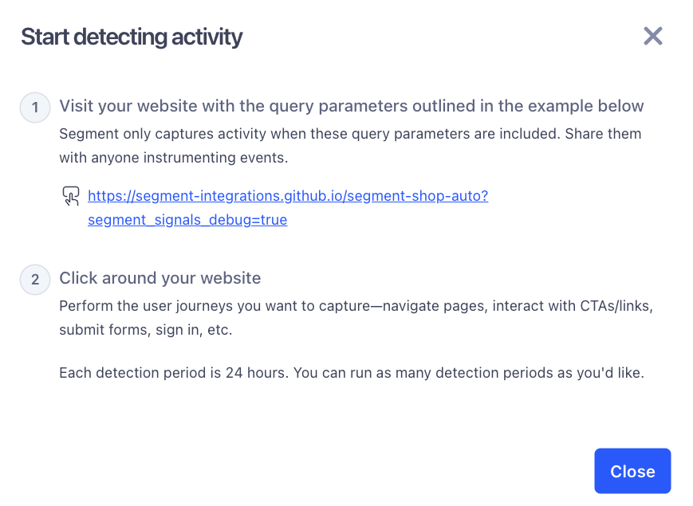

The Event Builder provides a no-code way to define analytics events based on signals collected by Auto-Instrumentation. 

You can use it to create Track, Identify, Page, and other event types directly from your Segment workspace.

> info "Auto-Instrumentation Private Beta"
> Auto-Instrumentation is currently in Private Beta and is governed by Segment's [First Access and Beta Preview Terms](https://www.twilio.com/en-us/legal/tos){:target="_blank"}. Segment is actively iterating on and improving the Auto-Instrumentation user experience.

## Access the Event Builder

The Event Builder appears as a tab within each source, next to the Debugger. If you don't see the Event Builder tab, first confirm that you've installed the required Auto-Instrumentation SDK. If you've installed the SDK but still don't see the Event Builder tab, reach out to your Segment account manager to verify your workspace is included in the Auto-Instrumentation Private Beta.

> info "Event Builder during Private Beta"
> During Private Beta beta, both the Event Builder and the legacy Auto-Instrumentation tab appear in the navigation. Segment will remove the legacy tab once all customers have migrated to the Event Builder experience.

## Generate activity

To populate the Event Builder with signals, you first need to visit your site or app using a special debug link that Segment provides.

1. In the Event Builder, copy the URL labeled **Start detecting activity**. It includes a required query parameter (for example, `?segment_signals_debug=true`).
2. Open your site or app in a browser or device using that exact link.
3. Interact with your app as a user would: click buttons, navigate between pages or screens, submit forms, and so on.

> info "Use the exact link shown"
> Segment can only detect activity if you use the debug link show in the Event Builder. Without it, no signals will show up.

Segment collects and displays activity as signals. These signals are grouped into types, like:

- Interaction: clicks, taps, and UI interactions.
- Navigation: screen changes and page transitions
- Network: requests and responses
- `LocalData`, Instrumentation, and `UserDefined`: additional signal types from the SDK.

### How signals relate to events

Segment separates signal collection from event creation. Signals represent raw user interactions, like a button click or screen view. Events, on the other hand, are analytics calls you define based on those signals. This two-step process lets you observe user behavior first, and then decide how and when to turn that behavior into structured analytics events, without needing to modify your code.

Signal detection is active for 24 hours after you generate activity. Detected signals are available in the Event Builder for 72 hours.

## Create an event

You can create events by selecting individual signals or combining multiple signals in sequence.

Follow these steps to create an event:

1. Find the signal you want to use and click **Configure event**.
2. Add one or more conditions. The order matters; Segment evaluates them in the order you add them.
   - For example, to track a successful login, first select a **button click** signal, then the **network response** signal.
3. Select properties from the signal(s) to include in your event.
4. Map those properties to your targeted Segment event fields.
5. Name your event. This name will appear in the Debugger and downstream tools.
6. Click **Publish event rules** to activate the event in your workspace.
    - You must publish each rule before Segment starts collecting data for the event.

For example, suppose a user taps an "Add to Cart" button. You can define an `Add to Cart` event by combining the button click signal with a network response signal that includes product details. You can then map properties like product name, ID, and price directly from the network response to your event.

Once published, your event rules appear in the **Event Rules** tab of the Event Builder.  From this tab, you can view all of your published rules and delete rules you no longer need.

## Choose an event type

When you define an event in the Event Builder, you assign it a type that determines how Segment and your connected destinations process it. These event types (Track, Identify, Page, and Screen) follow the same structure and behavior defined in the [Segment Spec](/docs/connections/spec/).

| Event type | Description                                                                                                 |
| ---------- | ----------------------------------------------------------------------------------------------------------- |
| Track      | Custom event tracking. Use this for user actions like `Product Viewed`, `Add to Cart`, or `Signup Started`. |
| Identify   | User identification. Use this to associate traits (like `email`, `userId`, or `plan`) with a known user.    |
| Page       | Web page view tracking. Use this to record visits to pages on your website.                                 |
| Screen     | Mobile screen view tracking. Use this to record views of screens in your mobile app.                        |

For example, to track a login flow, you might define an Identify event that maps traits like `userId` and `email` from a network response signal. To track cart activity, you could define a Track event like `Checkout Started` with properties like cart value, item count, and currency.

Segment uses the event name and any mapped properties to format each event according to the Segment Spec. Events you create in the Event Builder behave the same way as events sent through Segment SDKs or APIs.

> info "Event type behavior in destinations"
> While Segment handles these event types consistently, downstream tools may treat them differently. For example, Identify events often update user profiles, while Page or Screen events may be handled as pageviews instead of custom events.