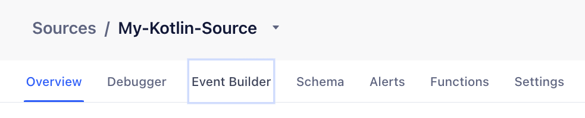

This guide outlines the steps required to set up the Signals SDK in your JavaScript website.

You'll learn how to add Auto-Instrumentation sources, integrate dependencies, and ensure that your setup captures and processes data as intended.

> info "Auto-Instrumentation Private Beta"
> Auto-Instrumentation is currently in Private Beta and is governed by Segment's [First Access and Beta Preview Terms](https://www.twilio.com/en-us/legal/tos){:target="_blank"}. Segment is actively iterating on and improving the Auto-Instrumentation user experience.

> success "Enable Auto-Instrumentation"
> To enable Auto-Instrumentation in your Segment workspace, reach out to your dedicated account manager.

## Step 1: Add a source and get its write key

You'll first need to add a source and copy its write key:

1. In your Segment workspace, navigate to **Connections > Auto-Instrumentation** and click **Add source**.
2. Select a source, give the source a name, and click **Save**.
3. Return to **Connections > Sources** to view your sources.
4. In the **My sources** table, find and click the new source you just set up.
5. In the **Initialize the Client** section, look for and copy the `writeKey` displayed in the code block.

## Step 2: Add dependencies and initialization code

Next, you'll need to add the Signals SDKs to your web environment.

Choose one of the following installation methods based on your setup:

### Option A: Snippet Users (HTML)

For websites using the Segment snippet, please REPLACE the regular Segment snippet with the following code, which includes the Signals SDK:

> warning ""
> If you are currently using Segment, replace the existing Segment snippet that loads analytics.js with the modified code below. You should not have two segment snippets that call analytics.load() in your html.

```html
<head>
  <title>My Website</title>
  <!-- Replace <YOUR_WRITE_KEY> in 'data-segment-write-key' -->
  <script data-segment-write-key="<YOUR_WRITE_KEY>">
  !(function () {
    var i = "analytics",
      analytics = (window[i] = window[i] || []);
    if (!analytics.initialize)
      if (analytics.invoked)
        window.console &&
          console.error &&
          console.error("Segment snippet included twice.");
      else {
        analytics.invoked = !0;
        analytics.methods = [
          "trackSubmit",
          "trackClick",
          "trackLink",
          "trackForm",
          "pageview",
          "identify",
          "reset",
          "group",
          "track",
          "ready",
          "alias",
          "debug",
          "page",
          "screen",
          "once",
          "off",
          "on",
          "addSourceMiddleware",
          "addIntegrationMiddleware",
          "setAnonymousId",
          "addDestinationMiddleware",
          "register",
        ];
        analytics.factory = function (e) {
          return function () {
            if (window[i].initialized)
              return window[i][e].apply(window[i], arguments);
            var n = Array.prototype.slice.call(arguments);
            if (
              [
                "track",
                "screen",
                "alias",
                "group",
                "page",
                "identify",
              ].indexOf(e) > -1
            ) {
              var c = document.querySelector("link[rel='canonical']");
              n.push({
                __t: "bpc",
                c: (c && c.getAttribute("href")) || void 0,
                p: location.pathname,
                u: location.href,
                s: location.search,
                t: document.title,
                r: document.referrer,
              });
            }
            n.unshift(e);
            analytics.push(n);
            return analytics;
          };
        };
        for (var n = 0; n < analytics.methods.length; n++) {
          var key = analytics.methods[n];
          analytics[key] = analytics.factory(key);
        }
        analytics.load = function (key, n) {
          var t = document.createElement("script");
          t.type = "text/javascript";
          t.async = !0;
          t.setAttribute("data-global-segment-analytics-key", i);
          t.src =
            "https://cdn.segment.com/analytics.js/v1/" +
            key +
            "/analytics.min.js";
          var r = document.getElementsByTagName("script")[0];
          r.parentNode.insertBefore(t, r);
          analytics._loadOptions = n;

          t.onload = function () {
            var s = document.createElement("script");
            s.type = "text/javascript";
            s.src =
              "https://cdn.jsdelivr.net/npm/@segment/analytics-signals@latest/dist/umd/analytics-signals.umd.js";
            s.async = !0;
            s.onload = function () {
              var signalsPlugin = new SignalsPlugin();
              analytics.register(signalsPlugin);
            };
            r.parentNode.insertBefore(s, r);
          };
        };
        analytics._writeKey = document.currentScript.getAttribute("data-segment-write-key");
        analytics.load(analytics._writeKey)
        analytics.page()
      }
  })();
  </script>
</head>
```

### Option B: NPM Users

1. Add the Signals SDK to your project:

```bash
# npm
npm install @segment/analytics-signals
# yarn
yarn add @segment/analytics-signals
# pnpm
pnpm install @segment/analytics-signals
```

2. Add the initialization code and configuration options:

> success ""
> see [configuration options](#configuration-options) for a complete list.

```ts
// analytics.js/ts
import { AnalyticsBrowser } from "@segment/analytics-next";
import { SignalsPlugin } from "@segment/analytics-signals";

export const analytics = new AnalyticsBrowser();

const signalsPlugin = new SignalsPlugin();

analytics.register(signalsPlugin);

analytics.load({
  writeKey: "<YOUR_WRITE_KEY>",
});
```

Verify that you replaced `<YOUR_WRITE_KEY>` with the actual write key you copied in Step 1.

3. Build and run your app.

## Step 3: Verify and deploy events

After integrating the SDK and running your app, verify that Segment is collecting signals:

1. In your Segment workspace, return to **Connections > Sources**, then select the source you created for Auto-Instrumentation.
2. In the source overview, look for the **Event Builder** tab. If the tab doesn’t appear:

- Make sure you've installed the SDK correctly.
- Reach out to your Segment CSM to confirm that your workspace has the necessary feature flags enabled.
  

3. Open the **Event Builder** and follow the on-screen instructions to start signal detection.

- To collect signals in the UI, visit your site in a browser using the query string:`?segment_signals_debug=true`

4. Interact with your app to trigger signals: click buttons, navigate pages, submit forms, and so on. Segment collects and displays these as signals in real time.
5. From the signals list, click **Configure event** to define a new event based on one or more signals. After configuring the event, click **Publish event rules**.

### Debugging

#### Enable debug mode

Values sent to the signals API are redacted by default.
This adds a local storage key. To disable redaction, add a magic query string:

```
https://my-website.com?segment_signals_debug=true
```

You can _turn off debugging_ by doing:

```
https://my-website.com?segment_signals_debug=false
```

### Advanced

#### Emitting custom signals

If you need to listen for data that is unavailable to the Signals plugin by default, you can create and emit a custom signal:

```ts
var signalsPlugin = new SignalsPlugin(); // or use the global variable if you registered it globally
signalsPlugin.addSignal({ someData: 'foo' })


// emits a signal with the following shape
{
  type: 'userDefined'
  data: { someData: 'foo', ...  }
}
```

#### Listening to signals

```ts
const signalsPlugin = new SignalsPlugin();
signalsPlugin.onSignal((signal) => console.log(signal));
```

#### Middleware / Plugins

You can drop or modify signals using middleware:

```ts
import { SignalsPlugin, SignalsMiddleware } from "@segment/analytics-signals";

class MyMiddleware implements SignalsMiddleware {
  process(signal: Signal) {
    // drop all instrumentation signals
    if (signal.type === "instrumentation") {
      return null;
    } else {
      return signal;
    }
  }
}

const signalsPlugin = new SignalsPlugin({
  middleware: [new MyMiddleware()],
});
analytics.register(signalsPlugin);
```

#### Sandbox Strategies

If getting CSP errors, you can use the experimental 'global' sandbox strategy:

```ts
new SignalsPlugin({ sandboxStrategy: "global" });
```

## Configuration Options

Using the Signals Configuration object, you can control the destination, frequency, and types of signals that Segment automatically tracks within your application. The following table details the configuration options for Signals Web.

| `Option`                 | Required | Value                | Description                                                                                                        |
| ------------------------ | -------- | -------------------- | ------------------------------------------------------------------------------------------------------------------ |
| `maxBufferSize`          | No       | number               | The number of signals to be kept for JavaScript inspection. This buffer is first-in, first-out. Default is `1000`. |
| `enableDebugLogging`     | No       | boolean              | Enable debug logs.                                                                                                 |
| `disableSignalRedaction` | No       | boolean              | Disable default Signal data redaction.                                                                             |
| `apiHost`                | No       | string               | Override the default signals API host. Default is `signals.segment.io/v1`.                                         |
| `functionHost`           | No       | string               | Override the default edge host. Default is `cdn.edgefn.segment.com`                                                |
| `flushAt`                | No       | number               | How many signals to flush at once when sending to the signals API. Default is `5` .                                |
| `flushInterval`          | No       | number               | How many ms to wait before flushing signals to the API. The default is `2000`.                                     |
| `middleware`             | No       | SignalsMiddleware[]  | Array of middleware to process signals before they are sent.                                                       |
| `sandboxStrategy`        | No       | 'global' \| 'iframe' | Sandbox strategy for signal collection. Use 'global' if getting CSP errors. Default is 'iframe'.                   |

## Core Signal Types

Auto-Instrumentation collects different types of signals automatically:

### `interaction`

Interaction signals emit in response to a user interaction (clicks, form submissions, etc.)

### `instrumentation`

Instrumentation signals emit whenever a Segment event is emitted.

### `navigation`

Navigation signals emit whenever the URL changes.

> Note: you can also rely on the initial analytics.page() call, which you can access as an Instrumentation signal.

### `network`

Network signals emit when an HTTP Request is made, or an HTTP Response is received. To emit a network signal, the network activity must have the following requirements:

- Initiated using the `fetch` API
- First party domain (e.g if on `foo.com`, then `foo.com/api/products`, but not `bar.com/api/products`)
- Contains the content-type: `application/json`

## Next steps

This guide walked you through initial Signals SDK/Auto-Instrumentation setup. Next, read the [Auto-Instrumentation Signals Implementation Guide](/docs/connections/auto-instrumentation/configuration/), which dives deeper into Signals and offers example rules.
