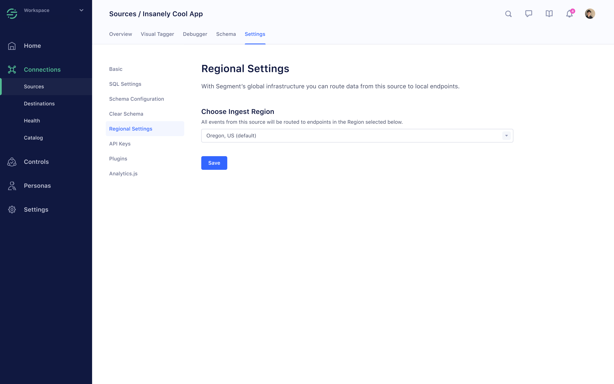

Segment offers customers the option to mitigate risk by providing regional infrastructure across Europe, Middle East, Africa and Asia Pacific. The default region for all customers is United States (Oregon). The regional infrastructure has the same [rate limits and SLA](/docs/connections/rate-limits/) as the default region.

If your workspace is enabled to support regional services, you can select on the region on a per-source basis in that Source's settings.

All Segment client-side libraries dynamically read your preferred region when the SDK is loaded when your app starts or restarts. Changing regions does not require changes to your code when you change regions.

For server-side routing, you can view endpoint details in the source's settings, and use the [`host`](https://github.com/segmentio/analytics-python/blob/c9f5ba6b58813eba1c3e5c778b0fc8d86f937f55/analytics/__init__.py#L9) configuration parameter to send data to the desired region.

Regional infrastructure can failover across locations within the region, but does not failover across regions.