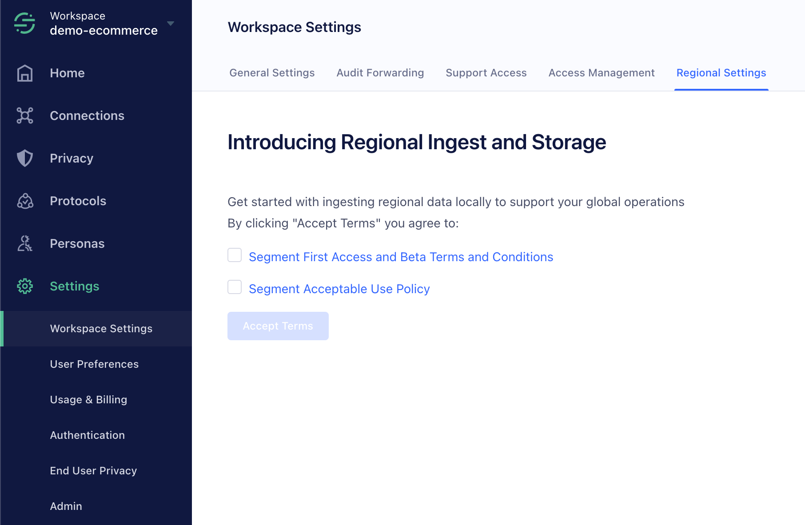
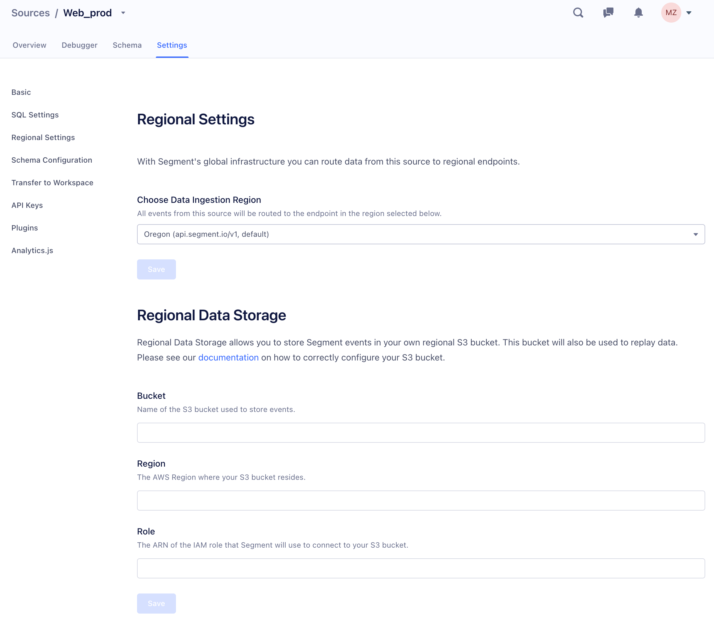
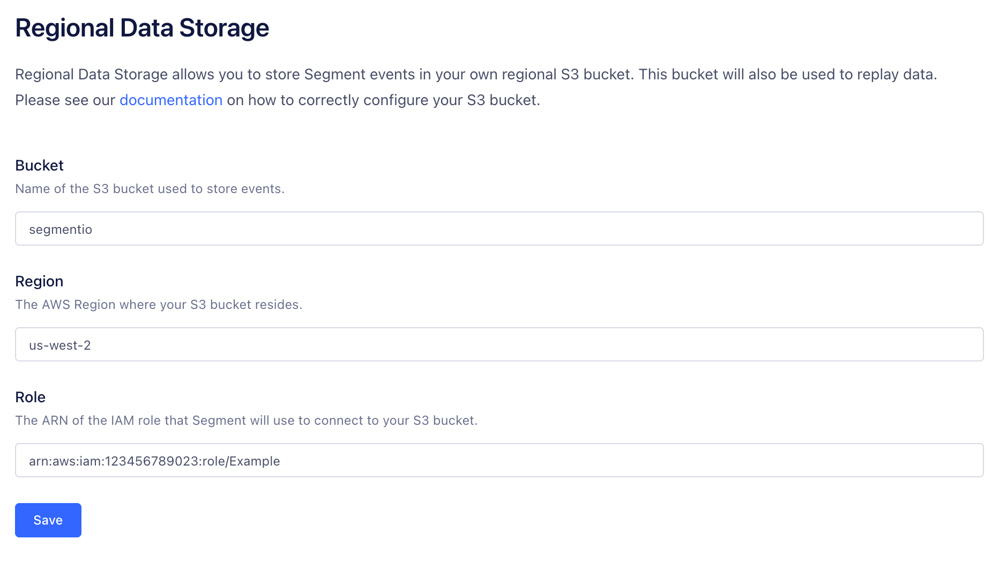

Segment offers customers the option to lead on data residency by providing regional infrastructure across Europe, Middle East, Africa and Asia Pacific. The default region for all customers is in Oregon, United States. The regional infrastructure has the same [rate limits and SLA](/docs/connections/rate-limits/) as the default region.

## Enable Regional Data Ingest and Storage

You can enable Regional Data Ingest and Storage from the Regional Settings tab within your Workspace settings. Enabling the feature here makes the feature available to both client-side and server-side sources.



> info ""
> **Note**: Regional Data Storage a Beta feature, and its use is governed by the [(1) Segment First Access and Beta Terms and Conditions](https://segment.com/legal/first-access-beta-preview/) and [(2) Segment Acceptable Use Policy](https://segment.com/legal/acceptable-use-policy/).

## Regional Data Ingest

Regional Data Ingest enables you to send data to Segment from both Client-side and Server-side sources through locally hosted API ingest points. The regional infrastructure can fail-over across locations within a region, but never across regions.

### Client-side sources

You can configure Segment's client-side SDKs for Javascript, iOS, Android, and React Native sources to send data to a regional host after you've updated the Ingest Region in that source's settings.



All regions are configured on a **per-source** basis. You'll need to configure the region for each source separately if you do not want to use the default region (Oregon). All Segment client-side SDKs read this setting and update themselves automatically to send data to new endpoints when the app is reloaded. You do not need to change code when you switch regions.

### Server-side and project sources

When you send data from a server-side or project source, you can use the `host` configuration parameter to send data to the desired region:

1. Oregon (Default) — `api.segment.io/v1`
2. Dublin — `in.eu2.segmentapis.com/v1`
3. Singapore — `in.ap1.segmentapis.com/v1`
4. Sydney — `in.au1.segmentapis.com/v1`

## Regional Data Storage

Regional Data Storage allows you to preserve your raw events in Amazon S3 buckets hosted regionally. These buckets are hosted by you, in your desired region.

> note ""
> Configure Regional Data Storage on new sources instead of enabling on an existing source to avoid deletion of historical data and a change in retention policy. Historical data that is expired due to a retention policy cannot be replayed at a time in the future. Historical data cannot be migrated from the US to your regional buckets.

### Pre-requisites

To begin with Regional Data Storage, complete the following steps in your AWS account:

1. Create an S3 bucket in your preferred region
2. Create a folder named `segment-logs` in the new bucket
3. Edit the bucket policy to allow Segment access to the S3 bucket
   ```json
    {
      "Version": "2008-10-17",
      "Id": "Policy1425281770533",
      "Statement": [
          {
            "Sid": "AllowSegmentUser",
            "Effect": "Allow",
            "Principal": {
                    "AWS": "arn:aws:iam::107630771604:user/s3-copy"
            },
            "Action": "s3:PutObject",
            "Resource": "arn:aws:s3:::YOUR_BUCKET_NAME/segment-logs/*"
          }
      ]
    }
   ```
  **Note**: `Resource` property string must end with `/*`.

    Segment requires this access to write raw data to your regionally hosted S3 bucket. Specifically, this allows Segment (as the Segment S3-copy user) to use `s3:PutObject`. To enable encryption at rest, use the default S3 mechanism. If you have server-side encryption enabled with AWS KMS managed keys, see the additional [required configuration step](/docs/connections/storage/catalog/amazon-s3/#encryption). To edit the bucket policy, right-click the bucket name in the AWS management console, and select **Edit policy**.

4. Create a new IAM role in your AWS account for Segment to assume. Attach the following trust relationship document to the role:
    ```json
    {
      "Version": "2012-10-17",
      "Statement": [
        {
          "Sid": "",
          "Effect": "Allow",
          "Principal": {
            "AWS": [
              "arn:aws:iam::595280932656:role/segment-regional-archives-production-access"
            ]
          },
          "Action": "sts:AssumeRole",
          "Condition": {
            "StringEquals": {
              "sts:ExternalId": [
                "WORKSPACE_ID"
              ]
            }
          }
        }
      ]
    }
    ```
  **Note**: This IAM role is used for replays only. The writes to the bucket are performed directly by the user added in step 3.

5. Attach this IAM policy to the role defined in Step 4.
  ```json
    {
      "Version": "2012-10-17",
      "Statement": [
        {
          "Sid": "ListObjectsInBucket",
          "Effect": "Allow",
          "Action": "s3:ListBucket",
          "Resource": [
            "arn:aws:s3:::YOUR_BUCKET_NAME"
          ]
        },
        {
          "Sid": "AllObjectActions",
          "Effect": "Allow",
          "Action": "s3:*Object*",
          "Resource": [
            "arn:aws:s3:::YOUR_BUCKET_NAME/*"
          ]
        }
      ]
    }
  ```
  This access allows Segment to run local deletions jobs from regionally hosted data for a given user ID.

6. If you are using KMS encryption on your S3 bucket, add the following policy to the IAM role:
  ```json
    {
      "Version": "2012-10-17",
      "Statement": [
        {
            "Sid": "AllowKMS",
            "Effect": "Allow",
            "Action": [
              "kms:GenerateDataKey",
              "kms:Decrypt"
            ],
            "Resource": "$YOUR_KEY_ARN"
        }
      ]
    }
  ```

### Regional Data Storage configuration

After you configure the policy and roles, as defined above, navigate to the Regional Settings tab of the Settings page of the  source for which you want to store data regionally, and find the Regional Data Storage section.



To complete the configuration of Regional Data Storage:

1. Enter the name of the S3 Bucket you created in the Pre-requisites section
2. Add a regional label to help locate the bucket from AWS at a later date. For example, `us-west2-294048959147` or `country-REGION-AWS_ACCOUNT`
3. Enter the ARN of the IAM role set up as a pre-requisite. For example, `arn:aws:iam::ACCOUNT_ID:role/ROLE_NAME`.
4. Click **Save**
5. Navigate to *Privacy > Settings > Data Retention*
6. Identify the Source in the source-level archive retention periods list
7. Set the Retention for this source to the suggested value of `7 days`* and click **Save**

The Regional Data Storage bucket will take roughly one hour to receive data.

* The data retention can be set to any value available in the portal. If you require less than 7 days of data stored in the Segment-owned Archives, please reach out to support.

### Deletion from Regional Data Storage

Regional Data Storage offers the same ability to delete end-user data when they revoke or alter their consent to have data collected, as long as they can be identified by a `userId`. For example, if an end-user invokes their Right to Object or Right to Erasure under the GDPR or CCPA, you can use these features to:
- block ongoing data collection for that user
- delete all historical data about them from Segment's systems, connected S3 buckets and warehouses, and supported downstream partners

Contact [Segment Support](https://segment.com/help/contact/) to initiate a deletion and provide a valid `userId` for each user to be deleted. Deletion requests are run within the region, and have a 30 day SLA, but requires that the raw data is accessible to Segment in an unaltered state. Deletion from Regional Data Storage is not available from the [Privacy Portal](/docs/privacy/user-deletion-and-suppression/#deletion-requests) or through the API.

> note "Business Plan Customers"
> If you use this feature to delete data, you cannot Replay the deleted data at the same time. For standard Replay requests, you must wait for any pending deletions to complete. You cannot submit new deletions requests for the period of time that Segment replays data for you.

### Replays from Regional Data Storage

Regional Data Storage supports [Replays](/docs/guides/what-is-replay/#replays-for-tooling-changes) to both existing and new tools. To request a Replay, [contact Segment](https://segment.com/help/contact/) with the following:
- Source ID
- Date Range
- Destination

Segment will initiate Replay jobs and update status as they progress.

### Debugging and support

The Segment Customer Success and Support Engineering teams do not have access to customer hosted regional buckets used for Regional Data Storage and cannot provide event level debug support.
