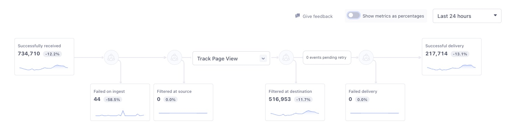
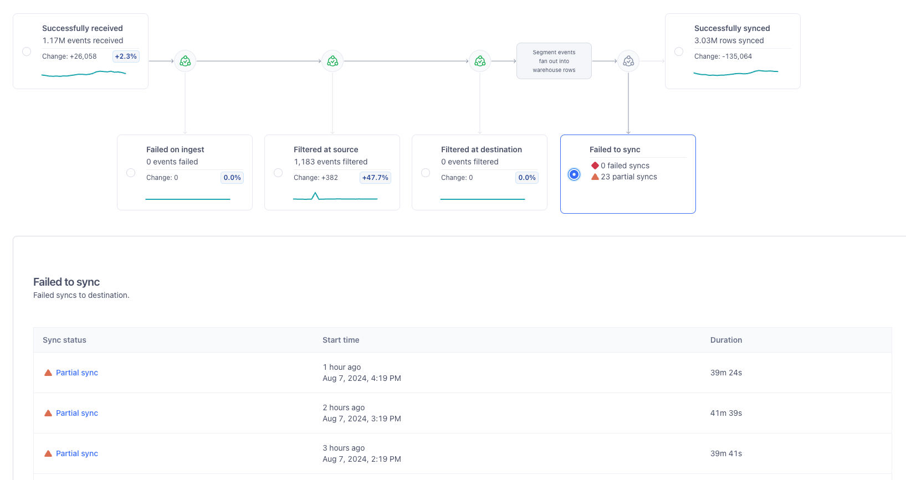

Delivery Overview is a visual observability tool designed to help Segment users diagnose event delivery issues for any cloud-streaming destination receiving events from cloud-streaming sources. 

> info "Delivery Overview for RETL destinations and Engage Audience Syncs currently in development"
> This means that Segment is actively developing Delivery Overview features for RETL destinations and Engage Audience syncs. Some functionality may change before Delivery Overview for these integrations becomes generally available. 
> 
> Delivery Overview is generally available for streaming connections (cloud-streaming sources and cloud-streaming destinations) and in public beta for storage destinations. Some metrics specific to storage destinations, like selective syncs, failed row counts, and total rows seen, are not yet available. 
> All users of Delivery Overview have access to the Event Delivery tab, and can configure delivery alerts for their destinations.

## Key features

Delivery Overview has three core features:
- [Pipeline view](#pipeline-view): a visual overview of each step your data takes during the delivery process
- [Breakdown table](#breakdown-table): contains more detail about the events that were processed at each pipeline step
- [Discard table](#discard-table): contains details about the events that failed or were filtered out of your process and allows you to inspect samples of them

You can refine these tables using the time picker and the metric toggle, located under the destination header. With the time picker, you can specify a time period (last 10 minutes, 1 hour, 24 hours, 7 days, 2 weeks, or a custom date range over the last two weeks) for which you'd like to see data. With the metric toggle, you can switch between seeing metrics represented as percentages (for example, *85% of events* or *a 133% increase in events*) or as counts (*13 events* or *an increase of 145 events*.) Delivery Overview shows percentages by default.

### Pipeline view

The pipeline view provides insights into each step your data is processed by enroute to the destination, with an emphasis on the steps where data can be discarded due to errors or your filter preferences. Each step provides details into counts, change rates, and event details (like the associated Event Type or Event Names), and the discard steps (Failed on ingest, Filtered at source, Filtered at destination, & Failed delivery) provide you with the reasons events were dropped before reaching the destination. Discard steps also include how to control or alter that outcome, when possible. The pipeline view also includes a label between the Filtered at destination and Failed delivery steps indicating how many events are currently pending retry. 

> info "Lookback window"
> Delivery Overview applies a 5-minute lookback period to provide stable, accurate metrics across all pipeline steps. This interval accounts for processing delays and ensures the data Segment displays reflects a reliable snapshot of recent events.

#### Classic destinations
The pipeline view for classic destinations includes the following steps:
- **Successfully received**: Events that Segment ingested from your source.
- **Failed on ingest**: Events that Segment received, but were dropped due to internal data validation rules.
- **Filtered at source**: Events that were discarded due to schema settings or [Protocols](/docs/protocols/) Tracking Plans.
- **Filtered at destination**: Events that were discarded due to [Destination Filters](/docs/guides/filtering-data/#destination-filters), [filtering in the Integrations object](/docs/guides/filtering-data/#filtering-with-the-integrations-object), [Destination Insert functions](/docs/connections/functions/insert-functions/), or [per source schema integration filters](/docs/guides/filtering-data/#per-source-schema-integrations-filters). [Actions destinations](/docs/connections/destinations/actions/) also have a filtering capability: for example, if your Action is set to only send Identify events, all other event types will be filtered out. Actions destinations with incomplete triggers or disabled mappings are filtered out at this step. [Consent Management](/docs/privacy/consent-management/) users also see events discarded due to consent preferences.
- **Failed delivery**: Events that have been discarded due to errors or unmet destination requirements.
- **Successful delivery**: Events that were successfully delivered to the destination.

#### Actions destinations
The pipeline view for Actions destination includes the following steps: 
- **Successfully received**: Events that Segment ingested from your source. You can filter these events by event type, event name, app version, and [enrichment status](/docs/unify/data-graph/linked-events/).
- **Failed on ingest**: Events that Segment received, but were dropped due to internal data validation rules.
- **Filtered at source**: Events that were discarded due to schema settings or [Protocols](/docs/protocols/) Tracking Plans.
- **Mapping dropdown**: Select a [mapping](/docs/connections/destinations/actions/#customize-mappings) to filter the events in the Filtered at destination, Failed delivery and Successful delivery pipeline steps. 
- **Filtered at destination**: Events that were discarded due to [Destination Filters](/docs/guides/filtering-data/#destination-filters), [filtering in the Integrations object](/docs/guides/filtering-data/#filtering-with-the-integrations-object), [Destination Insert functions](/docs/connections/functions/insert-functions/), or [per source schema integration filters](/docs/guides/filtering-data/#per-source-schema-integrations-filters). [Actions destinations](/docs/connections/destinations/actions/) also have a filtering capability: for example, if your Action is set to only send Identify events, all other event types will be filtered out. Actions destinations with incomplete triggers or disabled mappings are filtered out at this step. [Consent Management](/docs/privacy/consent-management/) users also see events discarded due to consent preferences.
- **Retry count**: The number of events currently pending retry. 
- **Failed delivery**: Events that have been discarded due to errors or unmet destination requirements.
- **Successful delivery**: Events that were successfully delivered to the destination.

#### Storage destinations
The pipeline view for storage destination includes the following steps: 
- **Successfully received**: Events that Segment ingested from your source.
- **Failed on ingest**: Events that Segment received, but were dropped due to internal data validation rules.
- **Filtered at source**: Events that were discarded due to schema settings or [Protocols](/docs/protocols/) Tracking Plans.
- **Filtered at destination**: Events that were discarded due to [Destination Filters](/docs/guides/filtering-data/#destination-filters), [filtering in the Integrations object](/docs/guides/filtering-data/#filtering-with-the-integrations-object), [Destination Insert functions](/docs/connections/functions/insert-functions/), or [per source schema integration filters](/docs/guides/filtering-data/#per-source-schema-integrations-filters). [Actions destinations](/docs/connections/destinations/actions/) also have a filtering capability: for example, if your Action is set to only send Identify events, all other event types will be filtered out. Actions destinations with incomplete triggers or disabled mappings are filtered out at this step. [Consent Management](/docs/privacy/consent-management/) users also see events discarded due to consent preferences.
- **Events to warehouse rows**: A read-only box that shows the point in the delivery process where Segment converts events into warehouse rows.
- **Failed to sync**: Syncs that either failed to sync or were partially successful. Selecting this step takes you to a table of all syncs with one or more failed collections. Select a sync from the table to view the discard reason, any collections that failed, the status, and the number of rows that synced for each collection. For information about common errors, see Ware
- **Successfully synced**: A record of all successful or partially successful syncs made with your destination. To view the reason a partially successfully sync was not fully successful, see the Failed to sync step. 

The following image shows a storage destination with 23 partially successful syncs: 

### Breakdown table
The breakdown table provides you with greater detail about the selected events.

To open the breakdown table, select either the first step in the pipeline view, the last step in the pipeline view, or select a discard step and then click on a discard reason. 

The breakdown table displays the following details:
- **Event type**: The Segment spec event type (Track call vs. Identify call, for example)
- **Event name**: The event name, provided by you or the source (*not available for inspection at all steps*)
- **App version**: The app/release version, provided by you or the source (*not available for inspection at all steps*)
- **Event count**: How many of each event either successfully made it through this pipeline step (in the case of the first or last steps in the pipeline view) or were filtered out (if you access it from a discard table)
- **% Change**: Insight into how the event counts differ from the last comparable time range as a percentage1

1: *Segment calculates the related change percentage by subtracting the percent of events impacted in the previous time period from the percent of impacted events in the current time period. For example, if last week 15% of your events were filtered at a source, but this week, 22% of your events were filtered at a source, you would have a related change percentage of 7%.*

### Discard table
The discard table provides you with greater detail about the events that failed to deliver or were filtered out of your sources and destinations. 

To open the discard table, click on one of the discard steps. If you click on a row in the discard table, you can see the breakdown table for the discarded events. 

The discard table displays the following details:

- **Discard reason**: Any relevant error code, message, or description associated with the event's failure. When possible, Delivery Overview links to any troubleshooting information you can use to get your events up and running again. Clicking on a discard reason brings you to the [breakdown table](#breakdown-table,) where you can see more detail about discarded events. For more context about discard reasons, see the [Troubleshooting](#troubleshooting) documentation.
- **Details & Samples**: View up to ten samples over the selected time range. Examine the error message and reason for the error or discard and inspect the payloads involved with the attempted transaction (*not available for inspection at all steps*)
- **Event count**: How many of each event were discarded in this pipeline step
- **% Change**: Insight into how the event counts differ from the last comparable time range as a percentage1

1: *Segment calculates the related change percentage by subtracting the percent of events impacted in the previous time period from the percent of impacted events in the current time period. For example, if last week 15% of your events were filtered at a source, but this week, 22% of your events were filtered at a source, you would have a related change percentage of 7%.*

## When should I use Delivery Overview?
Delivery Overview is useful to diagnose delivery errors in the following scenarios:
- **When setting up a destination, tracking plan, or filter for the first time**: With Delivery Overview, you can verify that the data you're sending to a new destination, a new tracking plan, or a new filter arrives in your destination as expected.
- **When data is missing from your destination**: The pipeline view can help you see where your data is getting "stuck" on the way to your destination, which can help you quickly diagnose and address problems in your data pipeline.
- **When emission or delivery volume fluctuates out of expected norms**: Delivery Overview will highlight where the largest rate change(s) occurred and what events were associated with the change.

> info "Delivery Overview in Engage Destinations"
> Because Engage uses sources for multiple purposes, you can expect to see `filtered at destination` events with the integrations object in destinations linked to Engage. Engage uses the integrations object to route events to destinations you've added to your audiences, traits, and journey steps. As a result, some events aren't meant to be delivered by the destination, so the integrations object filters them.

## Where do I find Delivery Overview?
To view the Delivery Overview page:
1. Sign into Segment.
2. From the homepage, navigate to **Connection** > **Destinations** and click on the destination you'd like to investigate.
3. Select the **Delivery Overview** tab from the destination header.

## How do I use Delivery Overview?
To use Delivery Overview: 

1. Navigate to the destination you'd like to review, and select **Delivery Overview** from the destination header.
2. On the **Delivery Overview** tab, select a time period from the time picker. The time picker reflects data in the user's local time.   ___Optional___: *Turn the metric toggle off if you'd like to see the quantity of events as counts instead of percentages. Delivery Overview shows percentages by default.*
3. Select a success or discard step to view additional context about the events that passed through that step.

## How does Delivery Overview differ from other Segment monitoring and observability tools?
With Source Debugger or Event Delivery, you can only verify that events are successfully making it from your source or to your destination. If events fail, you have to troubleshoot to see where in the pipeline your events are getting stuck. With Event Tester, you can verify that your event makes it from your source to your destination, but if the results aren't what you expected, you're stuck troubleshooting your source, filters, tracking plans, and destinations. 

With Delivery Overview, you can verify that your source receives your events, that any filters and tracking plans work as expected, and that events successfully make it to your destination. Any errors or unexpected behavior can be identified using the pipeline view, leading to quicker resolution. 

## How can I configure alerts?

You can use the Event Delivery alerting features (Delivery Alerts) by selecting the **Alerts** tab in the destination header. Once you enable alerts, if the successful delivery rate of all events is less than the threshold percentage in the last 24 hours, you'll be notified through in-app notification and/or workspace email. 

Note that this is dependent on your [notification settings](/docs/segment-app/#segment-settings). For example, if the threshold is set to 99%, then you'll be notified each time less than 100% of events fail. 

You can also use [Connections Alerting](/docs/connections/alerting), a feature that allows Segment users to receive in-app, email, and Slack notifications related to the performance and throughput of an event-streaming connection.

Connections Alerting allows you to create two different alerts:
- **Source volume alerts**: These alerts notify you if your source ingests an abnormally small or large amount of data. For example, if you set a change percentage of 4%, you would be notified when your source ingests less than 96% or more than 104% of the typical event volume.
- **Successful delivery rate alerts**: These alerts notify you if your destination's successful delivery rate falls outside of a percentage that you set. For example, if you set a percentage of 99%, you would be notified if you destination had a successful delivery rate of 98% or below.

## How "fresh" is the data in Delivery Overview?
The data in Delivery Overview has an expected latency of approximately 30 seconds after event ingestion, but this may vary, depending on the features you’ve enabled in your workspace and spikes in volume. Segment delays the data visible in the Delivery Overview UI by 5 minutes to allow for more precise metric correlation. Segment does not impose the 5 minute delay if you access data using the Public API.

## Why is the Delivery Overview page only available for cloud-mode destinations? 
Similar to Segment's [Event Delivery](/docs/connections/event-delivery/) feature, the Delivery Overview page is only available for server-side integrations (also known as cloud-mode destinations). You won't be able to use the Delivery Overview page for client side integrations (also known as device-mode destinations) because device-mode data is sent directly to the destination tool's API. In order to report on deliverability, data must be sent to destinations using a server-side connection. 

## Troubleshooting

The Delivery Overview pipeline steps Failed on Ingest, Filtered at Source, Filtered at Destination, and Failed Delivery display a [discard table](#discard-table) with information about why your events failed or were discarded.

This table provides a list of all possible discard reasons available at each pipeline step. 


<!--- not in the product yet--->
