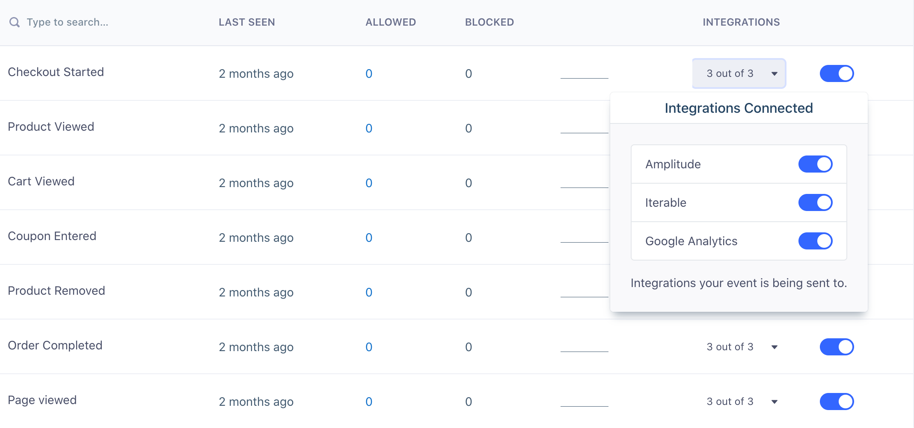
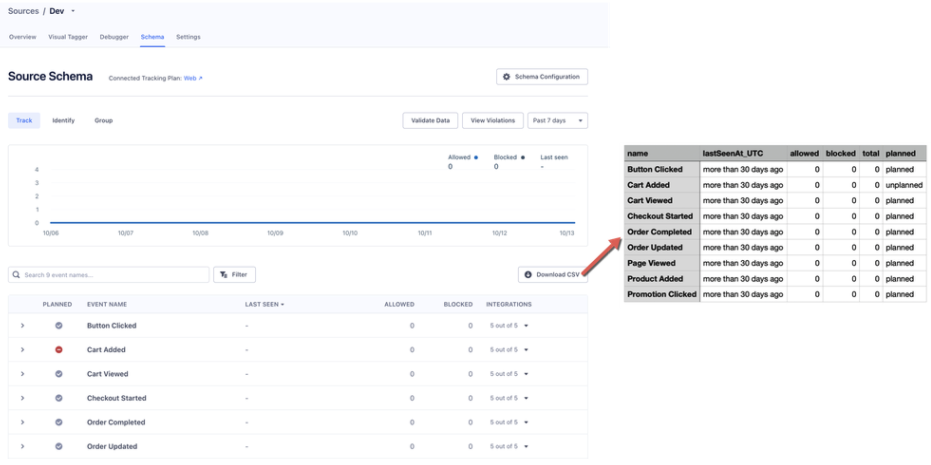

Once you have enabled Destinations for a given Source, all of the [data](/docs/connections/spec/) you track will be routed to your connected tools and warehouses. If you no longer wish to send all data to a particular Destination, you can disable the Destination from the Source overview page. 

But what happens when you want to send all of your data to a warehouse, and only two specific events to an analytics tool? And once you're satisfied with your spec, how do you make sure rogue events are blocked from all of your warehouses and end tools? Segment gives you the power to control exactly what data is allowed into your Destinations, so you can protect the integrity of your data, and the decisions you make with it.

## How do I filter specific events from being sent to specific Destinations?

An `integrations object` may be passed in the `options` of  `group`, `identify`, `page` and `track` methods, allowing selective Destination filtering. By default all Destinations are enabled.

All customers can filter specific events from being sent to specific Destinations (except for warehouses) by updating their tracking code. Here is an example showing how to send a single message only to Intercom and Google Analytics:

```js
analytics.identify('user_123', {
  email: 'jane.kim@example.com',
  name: 'Jane Kim'
}, {
  integrations: {
    'All': true,
    'Intercom': true,
    'Google Analytics': true,
    'Mixpanel': false
  }
});
```

Destination flags are **case sensitive** and match [the Destination's name in the docs](/docs/connections/destinations/catalog/) (for example, "AdLearn Open Platform", "awe.sm", "MailChimp", etc.).

If you're on Segment's Business plan, you can filter track calls right from the Segment UI on your Source Schema page by clicking on the field in the "Integrations" column and then adjusting the toggle for each tool. We recommend using the UI if possible since it's a much simpler way of managing your filters and can be updated with no code changes on your side.



## How do I block or disable specific events and properties from being sent to all Destinations?

If you no longer want to track an event, you can either remove it from your code or, if you're on the Business plan, you can block track calls right from the Segment UI on your Source Schema page by adjusting the toggle for each event.


Once you block an event in Segment, Segment stops forwarding it to all of your Destinations, including your warehouses. You can remove it from your code at your leisure. In addition to blocking track calls, Business plan customers can block all Page and Screen calls, as well as Identify traits and Group properties. 

## Export your Source Schema

Segment allows you to download your Source Schema as a CSV file, maximizing portability and access to event data. You can download a copy of your schema by visiting the Source Schema page.



CSV files generate based on the current view of your Source Schema. Any search parameters or filters you apply to the current Source Schema view also apply to the CSV.

You can download the following Track events:
- Event Name
- Last Seen (UTC)
  - If greater than 30 days, the value is "more than 30 days ago"
- Allowed Count
- Blocked Count
- Total Count
- Planned (available for Protocols customers with a connected Tracking Plan)
  - Values are "planned" or "unplanned"

Export Schema is not available for Identify or Group events.

> note ""
> Export Schema doesn't include any actual values (for example, personal data) for the events, properties, and traits you are tracking for a specific source. Properties aren't included in the CSV.
