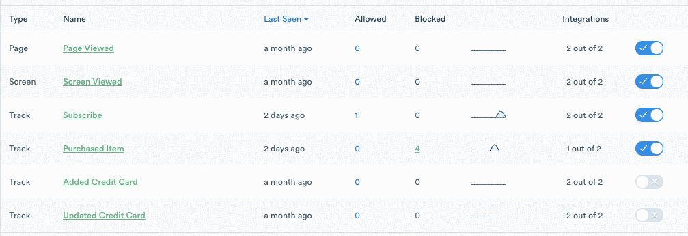
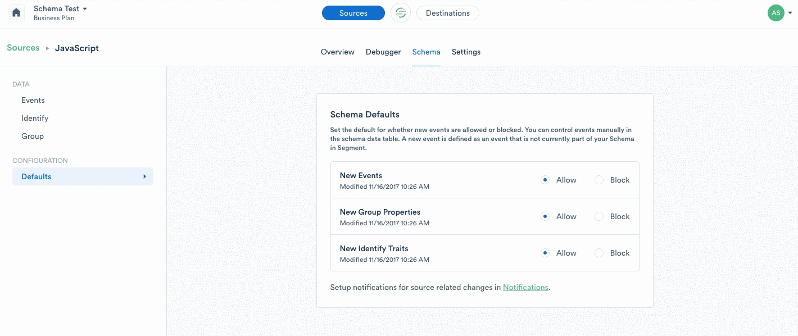

Once you have enabled Destinations for a given Source, all of the [data](/docs/connections/spec/) you track will be routed to your connected tools and warehouses. If you no longer wish to send all data to a particular Destination, you can disable the Destination from the Source overview page. 

But what happens when you want to send all of your data to a warehouse, and only two specific events to an analytics tool? And once you're satisfied with your spec, how do you make sure rogue events are blocked from all of your warehouses and end tools? Segment gives you the power to control exactly what data is allowed into your Destinations, so you can protect the integrity of your data, and the decisions you make with it.

## How do I filter specific events from being sent to specific Destinations?

An `integrations object` may be passed in the `options` of  `group`, `identify`, `page` and `track` methods, allowing selective Destination filtering. By default all Destinations are enabled.

All customers can filter specific events from being sent to specific Destinations (except for warehouses) by updating their tracking code. Here is an example showing how to send a single message only to Intercom and Google Analytics:

```js
analytics.identify('user_123', {
  email: 'jane.kim@example.com',
  name: 'Jane Kim'
}, {
  integrations: {
    'All': false,
    'Intercom': true,
    'Google Analytics': true
  }
});
```

Destination flags are **case sensitive** and match [the Destination's name in the docs](/docs/connections/destinations/catalog/) (i.e. "AdLearn Open Platform", "awe.sm", "MailChimp", etc.).

If you're on Segment's Business plan, you can filter track calls right from the Segment UI on your Source Schema page by clicking on the field in the "Integrations" column and then adjusting the toggle for each tool. We recommend using the UI if possible since it's a much simpler way of managing your filters and can be updated with no code changes on your side.



## How do I block or disable specific events and properties from being sent to all Destinations?

If you no longer want to track an event, you can either remove it from your code or, if you're on the Business plan, you can block track calls right from the Segment UI on your Source Schema page by adjusting the toggle for each event.


Once you block an event in Segment, we'll stop forwarding it to all of your Destinations, including your warehouses. You can remove it from your code at your leisure. In addition to blocking track calls, Business plan customers can block all Page and Screen calls, as well as Identify traits and Group properties. 

---

_Note: The following features are currently in beta._

## **How do I prevent new data from being allowed by default? **

If you've solidified your tracking plan and don't want any rogue events finding their way to your warehouses and end tools, we recommend activating our new feature, **Schema Defaults\***. When you lock your schema, or set your Schema Defaults to "Block," Segment will automatically prevent these calls from being sent downstream. You can activate this for new events—including `track`, `page`, and `screen` calls—or for new `identify` traits and `group` properties. 

Locking your schema only takes a few seconds and will protect your data from un-spec'd events or tracking errors. To configure your Schema Defaults, go to your Schema page, and then select "General" from the left-hand navigation.



\*_Note: Schema Defaults are currently in beta._

**Overview of Schema Default Settings**

**Default**

**Allow**

**Block**

**New Events**

All new events will be allowed in Segment and sent to all Destinations.

No new events will be allowed in Segment or sent to your Destinations. Any event that is already being tracked and part of your Schema will not be impacted.

**New Group Properties**

All new group properties will be allowed in Segment and sent to all Destinations.

No new group properties will be allowed in Segment or sent to your Destinations.

**New Identify Traits**

All new identify traits will be allowed in Segment and sent to all Destinations.

No new identify traits will be allowed in Segment or sent to your Destinations.

**Example: Order Completed**

For example, if you set your Schema Defaults for New Events to "Block," and a new event, `Order Completed`, is tracked, Segment will automatically block the event and it will not be sent to your warehouse or downstream tools. The event will continue to be blocked until you actively choose to allow it.

You will need to upgrade to the latest [iOS](/docs/connections/sources/catalog/libraries/mobile/ios/#install-the-sdk) and/or [Android](/docs/connections/sources/catalog/libraries/mobile/android/#step-1-install-the-library) SDKs for Schema Defaults to apply to events sent from mobile sources. 

## **What is considered a "new" event?**

New events refer to events that have not previously been sent to a given Source. Let's say you've only sent the following events from your Javascript source:

*   `Products Searched`

*   `Product List Viewed`

*   `Product List Filtered`


Your Schema Default setting will not have any impact on these three events because they are not considered new. You can manually block them, but your Schema Default setting will not change the status of these events. 

Here's what will happen the first time a new event, `Promotion Viewed`, is sent to this Source:

*   **Schema Default Set to Allow:** `Promotion Viewed` will be "allowed," which means the event will be sent to all enabled Destinations.

*   **Schema Default Set to Block:** `Promotion Viewed` will be "blocked," which means the event will not be sent to any Destinations.


## **What happens to blocked events and properties? **

When an event or property is blocked, the name of the event or property will be added to your Schema page, but no data will be tracked. By default, data from blocked events and properties is not recoverable. You can always re-enable the event or property if you want to begin tracking it going forward.

If you're concerned about permanently discarding data from blocked events, you can use advanced settings to forward these events to a designated Source. From there, you can send your data to a separate S3 bucket or warehouse for further analysis. That way if you decide you _do_ want the data in your downstream tools, you can ask Segment to Replay the data into your server-side Destinations. If you choose to route blocked events, this will contribute to your MTU count. 

**How do I forward blocked events?**

First, you will want to create a new Source to receive data from blocked Events and Traits. This Source should only be configured to received blocked data, so make sure it isn't receiving data from anywhere else. We recommend creating a new "Javascript" source and naming it "Blocked Data from \[Source Name\]." 

After you have created a new source, go to the Schema page for your primary Source and then select "General" from the left-hand navigation. Under "Advanced Settings," you will see two options:

*   Block and discard: select this option if you want to permanently discard data from blocked Events and Traits.

*   Forward: select this option if you would like to forward data from blocked Events and Traits to a separate source.


Select "Forward," and then select the new Source you created to receive blocked data. **As a reminder, if you choose to route blocked events, this will contribute to your MTU count. **

## **How am I charged for blocked events? **

Your bill is based on the number of Monthly Tracked Users (MTU). MTUs are the number of identified and anonymous users that you track with Segment. We only count users once per month, even if they perform multiple actions across your site or app. In most cases, blocked events will have no impact on your MTU count. If you choose to route blocked events, this will contribute to your MTU count. 

## **How do I configure notifications?**

While protecting the integrity of your data is helpful, we also want to flag any blocked events for you, so you can make any needed changes in your code or approve a new event. Source notifications will alert you when a new event is blocked due to your Schema Defaults. You can view these notifications in the Activity Feed in the app or subscribe to email notifications. 

You can view these notifications in the Activity Feed in the app or subscribe to email notifications. To subscribe to email notifications, go to your workspace settings, then click "Notification Settings," and subscribe to notifications for Sources by entering your email address and clicking "Save Changes." You can enter multiple email addresses separated by a comma.

## **When should I lock my schema? **

Whether you're just about to implement a new spec or you have been tracking the same events for years, Schema Defaults make it easy to protect your data and fix data quality issues.

Here are a few signs you may be ready to lock your schema:

*   You are concerned about developers implementing rogue events

*   You want to actively approve which events are tracked and routed to your downstream Destinations

*   You have created a tracking plan and want to use Segment to enforce it
