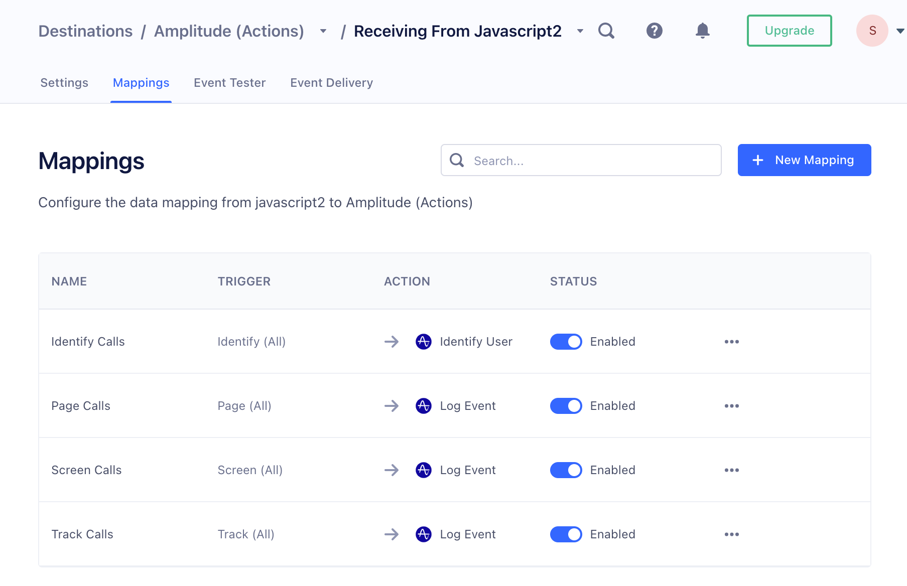
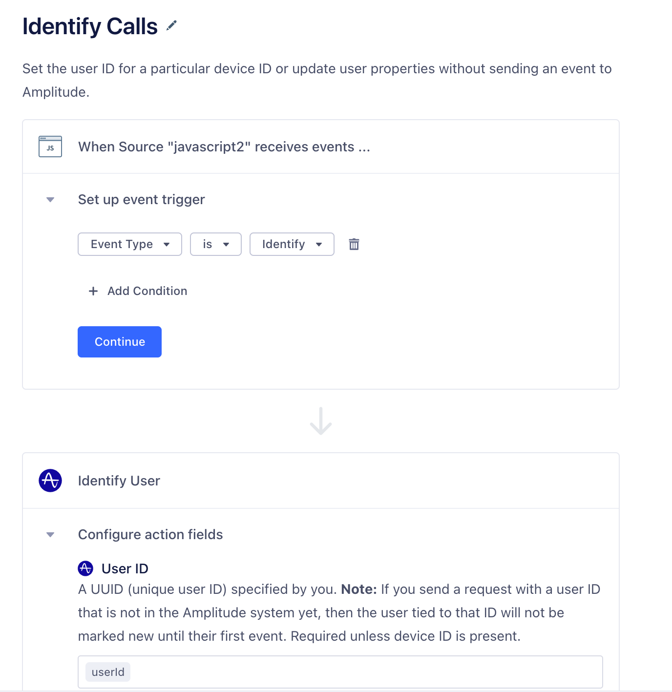



The Destination Actions framework improves on classic destinations by enabling you to see and control how Segment sends the event data it receives from your sources, to actions-based destinations. Each Action in a destination lists the event data it requires, and the event data that is optional.

You can also choose which event types, event names, or event property values trigger an Action. These Triggers and mappings make it possible to send different versions of the Action, depending on the context from which it is triggered.

Each Actions-framework Destination you see in the Segment catalog represents a feature or capability of the destination which can consume data from your Segment source. The Action clearly lists which data from the events it requires, and which data is optional. For example, Amplitude requires that you always send a  `LogEvent` , or Slack always requires a `PostMessage`.  Each Action also includes a default mapping which you can modify.



## Benefits of Destination Actions

- **Easier setup**: Users see fewer initial settings which can decrease the time spent configuring the destination.
- **Increased transparency**: Users can see the exact data that is sent to the destination, and when Segment sends it. For example, users can see exactly when Segment sends an IP address to FullStory or an AnonymousId to Amplitude.
- **Improved customization**: Users can determine how the events their sources trigger and map to actions supported by the destination. For example, define the exact events that are considered purchases by Braze.
- **Partner ownership**: Partners can own and contribute to any Actions-based destination that use cloud and device mode (web).

## Available Actions-based Destinations

The following Actions-based Destinations are available:



## Destination Actions compatibility

- Destination Actions are available to all customers on all Segment plans.
- Destination Actions do not require that you disable or change existing destinations. However, to prevent data duplication in the destination tool, you should make sure you aren't sending the data through both a standard destination and the Actions destination at the same time.
- You can still use the [Event Tester](/docs/connections/test-connections) with Destination Actions, and event delivery metrics are still collected and available in the destination information pages.
- If you are using Protocols, Destination Actions actions are applied *after* [schema filters](/docs/protocols/enforce/schema-configuration/) and [transformations](/docs/protocols/transform/). If you are using [destination filters](/docs/connections/destinations/destination-filters/), Actions are applied after the filters - meaning that they are not applied to data that is filtered out.
- Destination Actions can not yet be accessed or modified using the Segment APIs.

## Components of a Destination Action

A Destination Action contains a hierarchy of components, that work together to ensure the right data is sent to the destination. 

| Component       | Description                                                                                                                                                                                                                                                                                                                                                                                             |
| --------------- | ------------------------------------------------------------------------------------------------------------------------------------------------------------------------------------------------------------------------------------------------------------------------------------------------------------------------------------------------------------------------------------------------------- |
| Global Settings | Define authentication and connection-related information like API and Secret keys.                                                                                                                                                                                                                                                                                                                      |
| Mappings        | Handle the individual calls to the destination. In them, you define what type of call you want to make to the destination, and what Triggers that call. Individual Destination Actions may come enabled with some predefined mappings to handle common events like Screen calls, Identify calls, and Track calls. Mappings have two components that make this possible: **Triggers** and an **Action**. |
| Triggers        | Enable you to define *when* the corresponding Action fires. As part of a Trigger, you can use condition-based filters to narrow the scope of the Trigger.     Self-service users can add a maximum of two conditions per Trigger.                                                                                                                                                             |
| Actions         | Determine the information sent to the destination. In the Configure action section, you map the fields that come from your source, to fields that the destination expects to find. Fields on the destination side depend on the type of action selected.                                                                                                                                                |

For example, in the Amplitude (Actions) destination, you define your API and Secret keys in the destination's global settings. Then, the provided Page Calls mapping:

1. Triggers the action on all incoming Page events.
2. Runs the Log Event action, to map your incoming data to Amplitudes properties.

## Set up a destination action

To set up a new Actions-framework destination for the first time:

1. Log in to the Workspace where you want to add the new destination, go to the Catalog page, and click the Destinations tab. (You can also get to this screen by clicking **Add Destination**  either from an existing Source, or from your list of existing destinations.)
2. Click the **Destination Actions** category in the left navigation, then click the destination you want to add.
3. From the preview screen that appears, click **Configure**.
4. If prompted, select the source you want to connect to the new destination.
5. Enter your credentials. This could be an API Key and secret key, or similar information that allows the destination to connect to your account.
6. Next, choose how you want to set up the destination, and click **Configure Actions**.
    You can choose **Quick Setup** to use the default mappings, or choose **Customized Setup** (if available) to create new mappings and conditions from a blank state. You can always edit these mappings later.
7. Once you're satisfied with your mappings, click **Create Destination**.

## Migrate a classic destination to an actions-based destination



Moving from a classic destination to an actions-based destination is a manual process. Segment recommends that you follow the procedure below:

1. Create the actions-based destination with your development or test source.
2. Copy API keys, connection details, and other settings from the classic destination to the actions-based destination.
3. Refer to the actions-based destination's documentation for information about migrating specific settings.
4. Disable the classic version of the destination, and enable the actions-based version.
5. Verify that data is flowing from the development or test source to the partner tool.
6. Repeat the steps above with your production source.

## Edit a destination action
You can add or remove, disable and re-enable, and rename individual actions from the Actions tab on the destination's information page in the Segment app. Click an individual action to edit it.

From the edit screen you can change the action's name and mapping, and toggle it on or off. See [Customizing mappings](#customizing-mappings) for more information.

## Disable a destination action
If you find that you need to stop an action from running, but don't want to delete it completely, you can click the action to select it, then click the toggle next to the action's name to disable it. This takes effect within minutes, and disables the action until you reenable it.

## Delete a destination action
To delete a destination action: click the action to select it, and click **Delete** (the trash can icon).

This takes effect within minutes, and removes the action completely. Any data that would have gone to the destination is not delivered. Once deleted, the saved action cannot be restored.

## Customize mappings

If you use the default mappings for a destination action, you don't *need* to customize the mapping template for the action. You can edit the fields later if you find that the defaults no longer meet your needs.

> info ""
> Actions-based destinations have a limit of 50 individual mappings.

To create a custom destination action, start from the Actions tab.
If necessary, click **New Mapping** to create a new, blank action.

1. In the edit panel, define the [conditions](#conditions) under which the action should run.
2. Test those conditions to make sure that they correctly match an expected event.
    This step looks for events that match the criteria in the [debugger queue](/docs/connections/sources/debugger/), so you might need to Trigger some events with the expected criteria to test your conditions. You can skip the test step if needed, and re-try it at any time.
3. Next, set up the data mapping from the Segment format to the destination tool format.
4. Test the mapping with data from a sample event.
    The edit panel shows you the mapping output in the format for the destination tool. You can change your mapping as needed and re-test.
5. When you're satisfied with the mapping, click **Save**.

> info ""
> The required fields for a destination mapping appear automatically. Click the + sign to see optional fields.

### Conditions

> info ""
> Self-service users can add a maximum of two conditions per Trigger.

The following type filters and operators are available to help you build conditions:

- **Event type** (`is`/`is not`). This allows you to filter by the [event types in the Segment Spec](/docs/connections/spec).
- **Event name** (`is`, `is not`, `contains`, `does not contain`, `starts with`, `ends with`). Use these filters to find events that match a specific name, regardless of the event type.
- **Event property** (`is`, `is not`, `less than`, `less than or equal to`, `greater than`, `greater than or equal to`, `contains`,  `does not contain`, `starts with`, `ends with`, `exists`, `does not exist`).  Use these filters to trigger the action only when an event with a specific property occurs.  You can specify nested properties using dot notation, for example `context.app.name`. If the property might appear in more than one format or location, you can use an ANY statement and add conditions for each of those formats. For example, you might filter for both `context.device.type = ios`  as well as `context.os.name = "iPhone OS``"`
    The `does` `not exist` operator matches both a `null` value or a missing property.

You can combine criteria in a single group using **ALL** or **ANY**.  Use an ANY to “subscribe” to multiple conditions. Use ALL when you need to filter for very specific conditions. You can only create one group condition per destination action. You cannot created nested conditions.

> info "Destination Filters"
> Destination filters are compatible with Destination Actions. Consider a Destination Filter when:
> - You need to remove properties from the data sent to the destination
> - You need to filter data from multiple types of call (for example, Track, Page, and Identify calls)
> 
> If your use case does not match these criteria, you might benefit from using Mapping-level Triggers to match only certain events.
