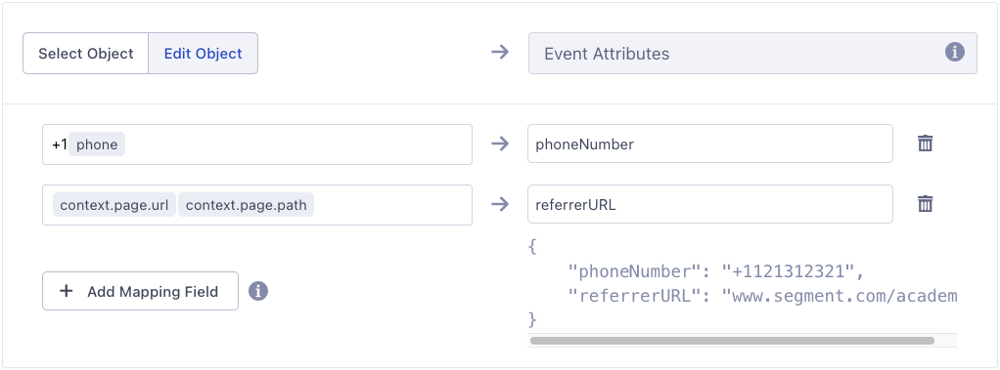

The Destination Actions framework improves on classic destinations by enabling you to see and control how Segment sends the event data it receives from your sources, to actions-based destinations. Each Action in a destination lists the event data it requires, and the event data that is optional.

You can also choose which event types, event names, or event property values trigger an Action. These Triggers and mappings make it possible to send different versions of the Action, depending on the context from which it is triggered.

Each Actions-framework Destination you see in the Segment catalog represents a feature or capability of the destination which can consume data from your Segment source. The Action clearly lists which data from the events it requires, and which data is optional. For example, Amplitude requires that you always send a  `LogEvent` , or Slack always requires a `PostMessage`.  Each Action also includes a default mapping which you can modify.

## Benefits of Destination Actions

- **Easier setup**: Users see fewer initial settings which can decrease the time spent configuring the destination.
- **Increased transparency**: Users can see the exact data that is sent to the destination, and when Segment sends it. For example, users can see exactly when Segment sends an IP address to FullStory or an AnonymousId to Amplitude.
- **Improved customization**: Users can determine how the events their sources trigger and map to actions supported by the destination. For example, define the exact events that are considered purchases by Braze.
- **Partner ownership**: Partners can own and contribute to any Actions-based destination that use cloud and device mode (web).

## Available Actions-based Destinations

The following Actions-based Destinations are available:



## Destination Actions compatibility

- Destination Actions are available to all customers on all Segment plans.
- Destination Actions do not require that you disable or change existing destinations. However, to prevent data duplication in the destination tool, you should make sure you aren't sending the data through both a standard destination and the Actions destination at the same time.
- You can still use the [Event Tester](/docs/connections/test-connections) with Destination Actions, and event delivery metrics are still collected and available in the destination information pages.
- If you are using Protocols, Destination Actions actions are applied *after* [schema filters](/docs/protocols/enforce/schema-configuration/) and [transformations](/docs/protocols/transform/). If you are using [destination filters](/docs/connections/destinations/destination-filters/), Actions are applied after the filters - meaning that they are not applied to data that is filtered out.
- Destination Actions can not yet be accessed or modified using the Segment APIs.

## Components of a Destination Action

A Destination Action contains a hierarchy of components, that work together to ensure the right data is sent to the destination.

| Component       | Description                                                                                                                                                                                                                                                                                                                                                                                             |
| --------------- | ------------------------------------------------------------------------------------------------------------------------------------------------------------------------------------------------------------------------------------------------------------------------------------------------------------------------------------------------------------------------------------------------------- |
| Global Settings | Define authentication and connection-related information like API and Secret keys.                                                                                                                                                                                                                                                                                                                      |
| Mappings        | Handle the individual calls to the destination. In them, you define what type of call you want to make to the destination, and what Triggers that call. Individual Destination Actions may come enabled with some predefined mappings to handle common events like Screen calls, Identify calls, and Track calls. Mappings have two components that make this possible: **Triggers** and an **Action**. |
| Triggers        | Enable you to define *when* the corresponding Action fires. As part of a Trigger, you can use condition-based filters to narrow the scope of the Trigger. Triggers don't support matching on event fields containing `.$` or `.$.`, which reference an array type. <br /> <br /> Self-service users can add a maximum of two conditions per Trigger. |
| Actions         | Determine the information sent to the destination. In the Configure action section, you map the fields that come from your source, to fields that the destination expects to find. Fields on the destination side depend on the type of action selected. |

For example, in the Amplitude (Actions) destination, you define your API and Secret keys in the destination's global settings. Then, the provided Page Calls mapping:

1. Triggers the action on all incoming Page events.
2. Runs the Log Event action, to map your incoming data to Amplitudes properties.


## Set up a destination action

To set up a new Actions-framework destination for the first time:

1. Log in to the Workspace where you want to add the new destination, go to the Catalog page, and click the Destinations tab. (You can also get to this screen by clicking **Add Destination**  either from an existing Source, or from your list of existing destinations.)
2. Click the **Destination Actions** category in the left navigation, then click the destination you want to add.
3. From the preview screen that appears, click **Configure**.
4. If prompted, select the source you want to connect to the new destination.
5. Enter your credentials. This could be an API Key and secret key, or similar information that allows the destination to connect to your account.
6. Next, choose how you want to set up the destination, and click **Configure Actions**.
   * You can choose **Quick Setup** to use the default mappings, or choose **Customized Setup** (if available) to create new mappings and conditions from a blank state. You can always edit these mappings later.
   * *(Optional)* Click **Suggest Mappings** to get suggested mappings. Learn more about [suggested mappings](#suggested-mappings).
7. Once you're satisfied with your mappings, click **Create Destination**.

> info ""
> You must configure and enable at least one mapping to handle a connected source's event(s) in an Actions-framework destination in order for data to send downstream. 
> Events send downstream in the order in which they appear in the mappings UI. There is no mechanism through which you can control the order of events that send to the downstream destinations outside of that. 

## Migrate a classic destination to an actions-based destination

Moving from a classic destination to an actions-based destination is a manual process. Segment recommends that you follow the procedure below:

1. Create the actions-based destination with your development or test source.
2. Copy API keys, connection details, and other settings from the classic destination to the actions-based destination.
3. Refer to the actions-based destination's documentation for information about migrating specific settings.
4. Disable the classic version of the destination, and enable the actions-based version.
5. Verify that data is flowing from the development or test source to the partner tool.
6. Repeat the steps above with your production source.

### Migrate your destination filters from the classic destination to the actions destination

> warning ""
> You can only migrate your destination filters using the Public API if you're on the business tier plan. This functionality isn't available in the Segment app. 

To migrate your destination filters to your actions destination from the classic destination: 
1. Send a request to the Public API endpoint. 
     - Use [List Filters from Destination](https://docs.segmentapis.com/tag/Destination-Filters#operation/listFiltersFromDestination){:target="_blank"} . The `destinationId` can be found in the URL while viewing the destination in your Segment workspace.
2. Grab the response and parse through the `data.filters` object. Each object returned inside the `data.filters` object is an individual filter associated with the specified destination.
4. Send individual `POST` requests to the Public API endpoint.
     - Use [Create Filter for Destination](https://docs.segmentapis.com/tag/Destination-Filters/#operation/createFilterForDestination){:target="_blank"} , for each of the filters from step 2. 
     - Specify the Actions `destinationId`, found in the URL when viewing that destination. The body of the request is the individual filters from step 2.
6. If the bodies of those requests don't already include the field `"enabled": true`, make sure to enable each of those filters after you create them.

### Migrate to an actions-based destination using Destination Filters
For a more comprehensive migration from a classic destination to an actions-based destination, follow the steps outlined below. This implementation strategy is only available for customers on a Segment Business Tier plan with access to [Destination Filters](/docs/connections/destinations/destination-filters/). By adding additional line of defense with Destination Filters, you remove the possibility of duplicate events or dropped events and ensure that events sent before/after a specified `received_at` timestamp are sent to each destination.

This migration strategy involves configuring a destination filter on both the Classic destination and the Actions destination. Configure the classic destination filter to block events by the `received_at` field with a certain value, and the Actions destination to drop events until the `received_at` timestamp field reaches that same value. Destination Filters within the UI have a limitation where they cannot access any top-level fields, but this is not a limitation for [Destination Filters](https://docs.segmentapis.com/tag/Destination-Filters/){:target="_blank”} created by the [Public API](https://segment.com/docs/api/public-api/){:target="_blank”} using [FQL](https://segment.com/docs/api/public-api/fql/){:target="_blank”}. Because the `received_at` is a top-level field in the payload, you'll need to create a destination filter with the Public API and submit the request with that FQL information described below.

By combining these Filters, Segment sends events through the Classic integration up until a specified time and then blocks events after that time. Then the Actions integration blocks events until that specified time, and only allows events beginning at that specified time.

The following code samples show you how you can create filters for your destinations using the [Create Filter for Destination](https://docs.segmentapis.com/tag/Destination-Filters#operation/createFilterForDestination){:target="_blank”} Public API operation.

#### Classic destination
_Endpoint_: `POST` `https://api.segmentapis.com/destination/classic_destination_id_from_url/filters`
``` 
// JSON BODY : 
{
  "sourceId": "add_source_id_here",
  "destinationId": "classic_destination_id_from_url",
  "title": "drop event after (timestamp) received_at > value April 4, 2023 19:55pm",
  "description": "drop event after (timestamp) received_at > value April 4, 2023 19:55pm",
  "if": "(received_at >= '2023-04-21T19:55:00.933Z')",
  "actions": [
    {
      "type":"DROP"
    }
  ],
  "enabled": true
}
```

#### Actions destination
_Endpoint_: `POST` `https://api.segmentapis.com/destination/actions_destination_id_from_url/filters`
```
// JSON BODY :
{
  "sourceId": "add_source_id_here",
  "destinationId": "actions_destination_id_from_url",
  "title": "drop event before (timestamp) received_at < value April 4, 2023 19:55pm",
  "description": "drop event before (timestamp) received_at < value April 4, 2023 19:55pm",
  "if": "(received_at < '2023-04-21T19:55:00.933Z')",
  "actions": [
    {
      "type":"DROP"
    }
  ],
  "enabled": true
}
```

After configuring the Destination Filter on both the Classic and Actions destination, see each destination's Filters tab and enable the filters. After completing the migration, you can disable the Classic destination on the Settings page, and remove each of the filters from both destinations.

## Edit a destination action
You can add or remove, disable and re-enable, and rename individual actions from the Actions tab on the destination's information page in the Segment app. Click an individual action to edit it.

From the edit screen you can change the action's name and mapping, and toggle it on or off. See [Customizing mappings](#customize-mappings) for more information.


When an Action is created, it's disabled by default, to ensure that it's only used after being fully configured. To begin sending data through an Action, enable it on the Actions page by selecting the toggle so that it appears blue.

## Disable a destination action
If you find that you need to stop an action from running, but don't want to delete it completely, you can click the action to select it, then click the toggle next to the action's name to disable it. This takes effect within minutes, and disables the action until you reenable it.

## Delete a destination action
To delete a destination action: click the action to select it, and click **Delete** (the trash can icon).

This takes effect within minutes, and removes the action completely. Any data that would have gone to the destination is not delivered. Once deleted, the saved action cannot be restored.

## Test a destination action
To test a destination action, follow the instructions in [Event Tester](/docs/connections/test-connections/). You must enable a mapping in order to test the destination. Otherwise, this error occurs: *You may not have any subscriptions that match this event.*

You can also test within the mapping itself. To test the mapping:
1. Navigate to the **Mappings** tab of your destination. 
2. Select a mapping and click the **...** and select **Edit Mapping**. 
3. In step 2 of the **Set up mappings** page, click **Load event from source** to add a test event from the source, select **Generate sample event** for Segment to generate a sample event for you, or enter your own event. 
4. Scroll to step 5 on the page and click **Send test event** to test the mapping and view the response from the destination.

> info "Test Mapping might not return the events you're looking for"
> Segment only surfaces a small subset of events for the Test Mapping feature and might not always return the event you're looking for. If you'd like to test with a specific event, copy a specific event from your [Source Debugger](/docs/connections/sources/debugger/) and paste it into the **Add test event** interface.

## Customize mappings

If you use the default mappings for a destination action, you don't *need* to customize the mapping template for the action. You can edit the fields later if you find that the defaults no longer meet your needs.

> info ""
> Actions-based destinations have a limit of 50 individual mappings.

To create a custom destination action, start from the Actions tab.
If necessary, click **New Mapping** to create a new, blank action.

1. In the edit panel, define the [conditions](#conditions) under which the action should run.
2. Test those conditions to make sure that they correctly match an expected event.
    This step looks for events that match the criteria in the [debugger queue](/docs/connections/sources/debugger/), so you might need to Trigger some events with the expected criteria to test your conditions. You can skip the test step if needed, and re-try it at any time.
3. Select data models to [enrich your events](/docs/unify/linked-profiles/linked-events/) with.
4. Set up the data mapping from the Segment format to the destination tool format.
- You can click the Source field, then select previously configured Enrichments from the Event Properties tab.
5. Test the mapping with data from a sample event.
    The edit panel shows you the mapping output in the format for the destination tool. The **Select Object** option sends the entire object from the event, while the **Edit Object** option lets you map each individual property. You can change your mapping as needed and re-test.
6. When you're satisfied with the mapping, click **Save**. Segment returns you to the Mappings table.
7. In the Mappings table **Status** column, verify that the **Enabled** toggle is on for the mapping you just customized.

> info ""
> The required fields for a destination mapping appear automatically. Click the + sign to see optional fields.

## Suggested mappings

> info ""
> Suggested mappings is fully available for RETL mappings, and is in public beta for event streams and connections. 

Segment offers suggested mappings that automatically propose relevant destination fields for both model columns and payload elements. For example, if your model includes a column or payload field named `transaction_amount`, the feature might suggest mapping it to a destination field like `Amount` or `TransactionValue`. This automation, powered by intelligent autocompletion, matches and identifies near-matching field names to streamline the setup. For more information, see [Segment's suggested mappings blogpost](https://segment.com/blog/ai-assisted-magical-mappings/){:target="_blank”} and the [Suggested Mappings Nutrition Label](/docs/connections/reverse-etl/suggested-mappings-nutrition-facts). 

To use Suggested mappings, a workspace owner must first accept the Customer AI Terms and Conditions.

> warning ""
> Review the suggested mappings for accuracy before finalizing them as the suggestions aren't guaranteed to be 100% accurate.

## Static values
Segment supports 4 static value types in Destination Actions mappings: string, boolean, number, and null. 
* To create a string static value, type the string directly into the input field. 
* To create boolean, number, and null values, use the **Static values** tab to create the appropriate static value based on its type.

## Functions
In Destination Actions mappings, functions transform event data before it sends to the destination. This enables custom data handling, such as selecting non-null values or formatting fields.

### Coalesce function

The coalesce function takes a primary value and uses it if it is available. If the value isn't available, the function uses the fallback value instead. 

### Case function

The case function allows you to change the casing of a given string value.

### JSON function

The JSON function allows you to convert an object or array to a JSON encoded string, or to convert from JSON to objects.

### Flatten function

The flatten function allows you to flatten a nested object to an object with a depth of 1. Keys are delimited by the configured separator. For example, an object like {a: { b: { c: 1 }, d: 2 } } will be converted to { 'a.b.c': 1, 'a.d': 2 }.

### Replace function

The replace function allows you to replace a string, integer, or boolean with a new value. You have the option to replace up to two values within a single field.

### Concatenate function

To combine 2 values in the event variable field, you can concatenate them using plain text and variables together. For example, to prepend the country code to a phone number, enter `+1{{Phone Number}}`. Segment evaluates this field as a string, so placing text next to a variable automatically concatenates them.

You can't concatenate event variables and plain text with static values and functions. Adding a static value or function into an input field replaces any previously added event variables and plain text.



## Conditions

> info ""
> Self-service users can add a maximum of two conditions per Trigger.

Mapping fields are case-sensitive. The following type filters and operators are available to help you build conditions:

- **Event type** (`is`/`is not`). This allows you to filter by the [event types in the Segment Spec](/docs/connections/spec).
- **Event name** (`is`, `is not`, `contains`, `does not contain`, `starts with`, `ends with`). Use these filters to find events that match a specific name, regardless of the event type.
- **Event property** (`is`, `is equals to`, `is not`, `is not equals to`, `less than`, `less than or equal to`, `greater than`, `greater than or equal to`, `contains`,  `does not contain`, `starts with`, `ends with`, `exists`, `does not exist`).  Use these filters to trigger the action only when an event with a specific property occurs. 

    You can specify nested properties using dot notation, for example `context.app.name`. If the property might appear in more than one format or location, you can use an ANY statement and add conditions for each of those formats. For example, you might filter for both `context.device.type = ios`  as well as `context.os.name = "iPhone OS``"`
    The `does` `not exist` operator matches both a `null` value or a missing property.


> info "Valid property and trait values"
> Property and trait names must begin with the characters: [a-z], [A-Z] or '_'. Property and trait names don't support special characters in the first character. If you save a property or trait with a special character in the first character, you'll get an Invalid Trigger error. 

> info "Event property operators and supported data types"
> Operators support matching on values with a **string** data type:
> - `is`, `is not`, `contains`,  `does not contain`, `starts with`, `ends with`
> 
> Operators that support matching on values with **numeric** data type:
> - `is equals to`, `is not equals to`, `is less than`, `is less than or equal to`, `is greater than`, `is greater than or equal to`
> 
> Operators that support matching on values with a **boolean** data type:
> - `is true`, `is false`


The available operators depend on the property's data type:

| Data Type         | Supported Operators                                                                          |
| ----------------- | -------------------------------------------------------------------------------------------- |
| string            | `is`, `is not`, `contains`,  `does not contain`, `starts with`, `ends with`                  |
| string or numeric | `is less than`, `is less than or equal to`, `is greater than`, `is greater than or equal to` |
| boolean           | `is true`, `is false`                                                                        |

You can combine criteria in a single group using **ALL** or **ANY**.  Use an ANY to “subscribe” to multiple conditions. Use ALL when you need to filter for very specific conditions. You can only create one group condition per destination action. You cannot created nested conditions.

> info "Unsupported special characters in trigger fields"
> Trigger fields don't support double quotes (`"`) or the tilde (`~`) character.

> info "Mapping field limitations"
> In **destination** fields, you can use dot notation to create nested objects and arrays (for example, `info.name` or `info[0].email`), unless the field is enclosed in double quotes (for example, `"user.email"` creates a literal key, not a nested structure). In **source**, dots are only supported for accessing object keys. Literal strings that include a dot (like `user.email`) aren't supported as property names.

> info "Destination Filters"
> Destination filters are compatible with Destination Actions. Consider a Destination Filter when:
> - You need to remove properties from the data sent to the destination
> - You need to filter data from multiple types of call (for example, Track, Page, and Identify calls)
>
> If your use case does not match these criteria, you might benefit from using Mapping-level Triggers to match only certain events.

## Duplicate Mappings

You can use the Duplicate Mappings feature to create an exact copy of a mapping. The duplicated mapping has the same configurations and enrichments as your original mapping. 

Duplicate Mappings supports [Actions destinations](#actions-destination), [Reverse ETL destinations](/docs/connections/reverse-etl/reverse-etl-catalog), and destinations connected to Engage [Audiences](/docs/engage/audiences) and [Journeys](/docs/engage/journeys).  

To duplicate your mappings: 

1. Navigate to **Connections > Destinations** and select the destination with the mappings you'd like to copy. 
2. On the destination's **Mappings** tab, select the menu button (**...**) and click **Duplicate Mapping**. 
3. Review the popup and click **Duplicate Mapping**.

Segment creates a disabled mapping with the name "Original Mapping Name (Copy)". You must enable the mapping for data to flow. 


## FAQ and troubleshooting

### Validation error when using the Event Tester

When you send an event with an actions destination Event Tester that doesn't match the trigger of any configured and enabled mappings, you'll see an error message that states, *You may not have any subscriptions that match this event.* To resolve the error, create a mapping with a trigger to handle the event being tested, or update the test event's payload to match the trigger of any existing mappings. 

### Data not sending downstream

If no mappings are enabled to trigger on an event that has been received from the connected source, the destination will not send any events. Ensure that at least one mapping has been configured and enabled in the destination mappings for an event that you would like to reach downstream. 

> info ""
> Events without mappings enabled to handle them display as being discarded due to "No matching mapping" in a destination's Delivery Overview.

### Multiple mappings triggered by the same event

When the same event triggers multiple mappings, a request will be generated for each mapping that's configured to trigger on an event. For example, for the *Subscription Updated* event, if two mappings are enabled and both have conditions defined to trigger on the *Subscription Updated* event, the two requests will be generated and sent to the destination for each *Subscription Updated* event. 

### Oauth "access token expired" message shown in Segment UI
Access Tokens that were generated from initial authorization, for example, when you connect a destination via Oauth, are always short-lived. Commonly, the token remains valid for 30 minutes to 1 hour. When Segment receives 401 error responses from the destination after a token has expired, it will automatically make another request to the destination for a new token and will then retry the event. Therefore, 401 responses are sometimes expected and do not indicate an event failure. There are three event flows when events are received and sent to a destination:

- through source 
- through event tester 
- through actions tester in mapping screen

The underlying systems for these flows have their own copy of the token, which can expire at different points in time.
Threfore, if you see a 401 error in a sample response, it is likely that you’ll also see another request was made after it, to ask the downstream destination for a new token. Then one more request was made to actually send the data in your payload to the downstream destination.

### Is it possible to map a field from one event to another?

Segment integrations process events through mappings individially. This means that no context is held that would allow you to map a value from one event to the field of a subsequent event. Each event itself must contain all of the data you'd like to send downstream in regards to it. For example, you cannot send `email` in on an Identify call and then access that same `email` field on a Track call that comes in later if that Track call doesn't also have `email` set on it. 

### I'm getting a 'Couldn't load page' error when viewing or editing a mapping

This issue can occur due to a browser cache conflict or if an event property name includes a `/`. To resolve it, try clearing your browser cache or accessing the mapping page in an incognito window. Additionally, check if the mapped property name contains a `/`. If it does, rename the property to remove the `/` and update the mapping.
