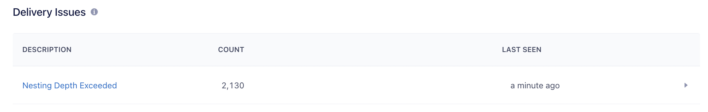



## Acoustic Connect

### Multichannel marketing without all the hassle

* Automate campaigns and messages across SMS, mobile push, group messaging, email, and social media based on real-time customer signals and intent across the customer journey.
* Trigger promotional and transactional messages based on customer preferences and behaviors to support onboarding, customer activation, cross-sell, and re-engagement strategies.
* Scale personalization and treat your customers as individuals with an automated view and understanding of the customer by pulling real-time behavior like intent so marketers do not have to manually segment users and audiences.

****Acoustic Website**** - [**www.acoustic.com**](http://www.acoustic.com/)

****Acoustic Documentation**** - [**www.goacoustic.com**](http://www.acoustic.com/)

### How Acoustic Connect Works

Acoustic Connect is a multichannel marketing tool for B2C consumer brands dedicated to engaging their audience. Developed to cater to the diverse needs of contemporary multichannel marketers, the platform leverages customer data, real-time behaviors and signals from the brand's owned channels, websites, and apps, and other data sources enabling marketers to personalize the journey based on each customer's preference and behavior. The integration with Twilio Segment allows marketers to quickly and easily gain access to all customer data so they can easily and quickly trigger messages, automate Connects, and build segments so each interaction is purposeful, every message is personal, and every journey leads to meaningful relationships.

Gain actionable insights across your Connects and journeys in a single view.

---

Build and automate journeys that can be triggered by real-time behaviors, events, and intent in a drag-and-drop interface.

---

Build dynamic, personalized messages and promotions with no coding required.

---

### Get more out of Acoustic Connect with Segment

When you use Acoustic Connect with Twilio Segment, you gain the ability to access real-time insights throughout the customer journey, empowering you with the timely information needed to deliver personalized digital experiences. All the data flowing through Twilio Segment will be shared automatically with Acoustic Connect so you can gain access to all the necessary customer data you need to quickly understand your customer and focus on optimizing and executing your strategies, instead of spending time trying to pull in all the data manually. The combined forces of Acoustic Connect and Twilio Segment help you unleash your creativity, hyper-personalize with more speed and ease, and streamline your MarTech stack without constantly relying on disparate solutions that leave gaps in your understanding and visibility of your customers. Additionally, capture the signals and behaviors after each campaign to supplement your view of the customer and optimize your next campaign and engagement efforts.

The destination is maintained by Acoustic. For any issues with the destination, please [contact the Acoustic Support team](mailto:support@goacoustic.com). Be sure to let them know you are working on the Acoustic Services Segment (Actions) Destination to have the request routed correctly and quickly.

## Getting started

1. From the Segment web app, click **Catalog**, then click **Destinations**.
2. Find the Destinations Actions item "Acoustic-Actions" in the left navigation, and click it.
3. Click **Configure <destination_name>**.
4. Select an existing Source to connect to <destination_name> (Actions).



### Edit Basic Settings

For some configuration options you will need information from your Connect Org. and others will need the help of your Customer Success and/or Services resources. If you do not recognize the options here or need help, reach out to your Acoustic Customer Success or Services resource for help.

Name  -	Enter a name to help you identify this destination definition in Segment.

Customer Prefix - *Important* - It's recommended that you use your Acoustic Connect Org name and a dataflow tag, as in eg., *CustomerAcme_Prod_* or *CustomerAcme_test1_* or *CustomerAcme_MktData3_*. Be sure to replace any spaces with an underscore and **be sure to end the string with an underscore '_'**.

> You will want to work with your Acoustic Customer Success or Services resource to align this string with the Acoustic definition that defines your unique table for this data set.

S3 Bucket Access Point Alias - The Alias of the Access Point created for your access to the S3 Bucket. Available from your Acoustic Customer Success or Services resource.

S3 Access Key  -  S3 Access Key for the S3 bucket. Available from your Acoustic Customer Success or Services resource.

S3 Secret -  S3 Secret credential for the S3 bucket. Available from your Acoustic Customer Success or Services resource.

S3 Region  - Should always be us-east-1 unless directed by Acoustic otherwise.

Version:	- No Need to Edit - Provides a metatag to confirm the version currently in effect.
Last-Modified: 02.01.2024 10.30.43
Version 1.7

When all config options are defined and confirmed, as well as all Filter and Mapping configurations completed (see below), be sure to "Enable" and "Save Changes" for the Destination.

When enabled, Segment will send data to Acoustic (Actions) based on configuration in the Mappings tab.

> Keep in mind, you can define multiple Destinations to send unique data to different Relational Tables, simply create the definition with unique names and Customer Prefixes to align the mapped data to the respective table.

### Defining Filters

The Destination dialog includes a Filter tab. If you have a significant volume of Events and data attributes from the Source you wish to use, a good first step would be to define Filter(s) to limit the data being sent to the Connection from the defined Source(s). Mapping is then used to define the specific set of attribute data and columns to be written to Acoustic.

For example, for a Connection definition of an Audience source, a Traits.email or similar attribute filter would be necessary to assure only "Identify" Events with a valid value in the traits section (to be mapped to UniqueRecipientId) will be sent to the Acoustic Destination.

Keep in mind that the Acoustic (Actions) Destination ignores any Events that do not contain a valid UniqueRecipientId attribute, therefore a common filter would be to avoid sending any Events to the Connection that do not have a valid attribute to be mapped to UniqueRecipientId. In many cases this will be a valid email address but other Unique Id attribute, such as CustID, can be used.

Click Next Step,

Enter a Name and Description for the Filter.

Click Enable and Save.

### Defining Mapping:

The Destination dialog also contains a Mapping tab. The Acoustic (Action) Destination currently supports Segment Track and Identity Events along with all attributes of those events. In the Mapping dialog initial Mapping templates are included as an aid. All of the provided mapping fields are optional but you will need to use at least one, in addition to the required attributes, to map the data you want to write to Acoustic Connect.

Keep in mind, Mapping provides the means to map Event data to Connect Columns in a Relational Table in Connect. The Value you map to a Key, is the Value of the Column with the same name as the Key in Connect. That is, if you map the Value of trait.firstName to the Key "firstname", the value mapped will show up in Connect in the column "firstname".

To that, you will want to work with the Acoustic Services team to define a Relational Table that will **have all of the Columns you intend to map**. The details of this Relational Table are also needed in the Destination's Settings dialog (see previous).

Here we can see the mapping for UniqueRecipientID. UniqueRecipientId is required. The Acoustic (Actions) Destination will not accept any event that does not contain a UniqueRecipientId attribute.

Also, do not edit 'type' or 'timestamp' mappings. These are required and are pre-mapped for you. As noted above, even these Values will show up in the respective Columns as the Key names, that is, there will be a column in your table in Connect of 'type' and 'timestamp', each will hold the respective mapped Values of the Event data.

Following the required attributes are a series of helpful predefined mapping structures. Each of these are optional but at least one must be used to provide data beyond the required attributes previously noted.

The first is a simple, straightforward Key and Value mapping dialog. You can use this dialog to map each attribute provided by the Track or Identify Event data one by one. That is, you can map traits.firstname to "firstname", then another Key/Value of traits.lastname to "lastname", and on and on until you have mapped all that you want to store in Connect.

The mapping sections that follow allow you to map whole sections or even the special use-case of an array of data that needs to be flattened in order to be useful, as in this example of flattening the properties.products array to individual attributes.

Lastly, if it makes sense to do so you can map whole sections, which will provide all of the attributes of the section mapped through to Connect.

With the Mapping completed, be sure to click "Save".

With all configuration completed you wil want to confirm data being written to the defined Relational Table in Connect.

### Delivery Report

Additionally, if you see `Nesting Depth Exceeded` in your Delivery report, this indicates that an array of data is being sent through that is too deep, that is, has too many levels and cannot be flattened. If this is the case you will need to revisit mapping that data to a flatter structure, that is, the attribute has a simple value versus the complex value structure that is coming through. Complex values, many layered values, are not useable and will not be accepted.

Tags: Email Marketing, Marketing Automation, SMS & Push Notifications

> Integrate Acoustic Connect with Segment
>
> Segment makes it easy to integrate with Acoustic Connect
