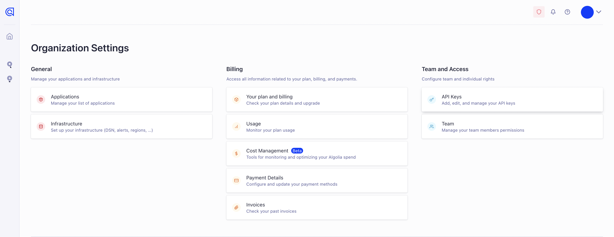
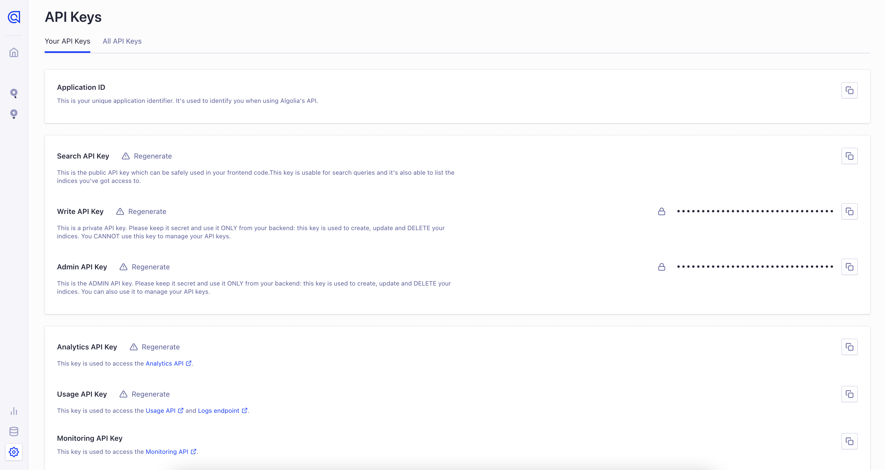
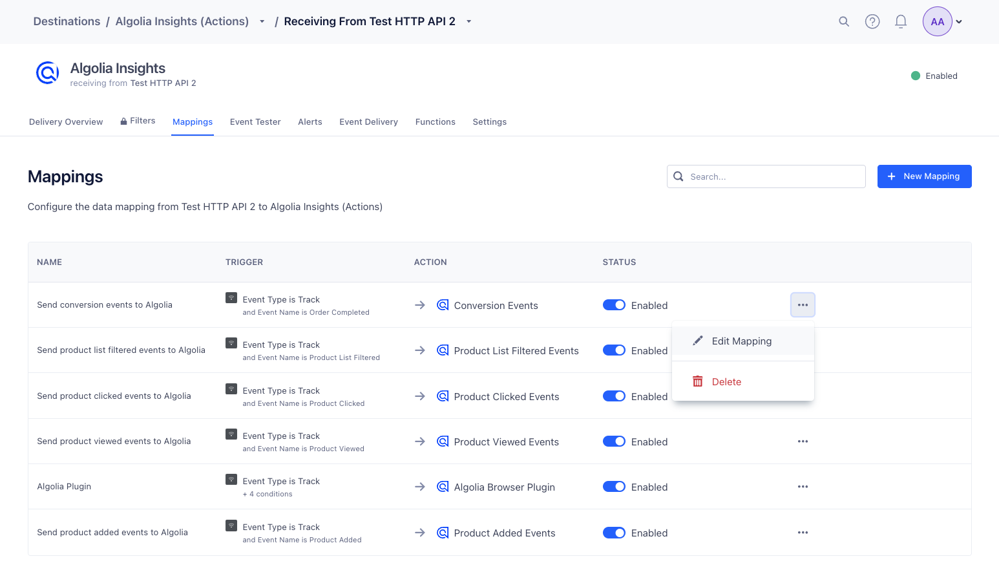

With the Algolia Insights (Actions) destination, you can send [Insights Events](https://www.algolia.com/doc/guides/sending-events/getting-started/){:target="_blank"}. Insight Events are required to use these Algolia features: 

- [Click and conversion analytics](https://www.algolia.com/doc/guides/search-analytics/overview/)
- [Algolia Recommend](https://www.algolia.com/doc/guides/algolia-recommend/overview/)
- [Personalization](https://www.algolia.com/doc/guides/personalization/classic-personalization/what-is-personalization/)
- [Dynamic Re-Ranking](https://www.algolia.com/doc/guides/algolia-ai/re-ranking/)
- [A/B Testing](https://www.algolia.com/doc/guides/ab-testing/what-is-ab-testing/)
- [Query Categorization](https://www.algolia.com/doc/guides/algolia-ai/query-categorization/)
- [NeuralSearch](https://www.algolia.com/doc/guides/getting-started/neuralsearch/)

This destination is maintained by [Algolia](https://www.algolia.com/){:target="_blank”}. For any issues with the destination, [contact the Algolia team](mailto:hey@algolia.com).

## Getting Started

1. From the Destinations catalog page in the Segment App, click **Add Destination**.
2. Search for **Algolia** in the Destinations Catalog and select the **Algolia Insights (Actions)** destination.
3. Choose which Source should send data to the Algolia destination.
4. Sign in to the [Algolia dashboard](https://dashboard.algolia.com/users/sign_in) and retrieve your **App ID** and **API Key** for the application you'd like to connect. See **[Getting your Algolia credentials](#getting-your-algolia-credentials)** below for details on where to get these values.
5. Enter the **App ID** and **API Key** in the Algolia destination settings in Segment.

### Getting your Algolia credentials

Your app ID and API key can be found in the **API Keys** section of your account settings in the Algolia dashboard. You need a **search** API key to set up the destination.






### Algolia-related data

The Algolia Insights Destination is not a plug-and-play integration. It requires you to modify your frontend code to add additional Algolia-related data like an index name and a query ID.

To access your query ID, make sure [`clickAnalytics`](https://www.algolia.com/doc/api-reference/api-parameters/clickAnalytics/) is enabled in your searches. If you're using our [JavaScript v5 search API client](https://www.algolia.com/doc/libraries/javascript/v5/methods/search/search-single-index/?client=javascript), this looks like:

```js
import { algoliasearch } from 'algoliasearch';

const client = algoliasearch('ALGOLIA_APPLICATION_ID', 'ALGOLIA_API_KEY');

const response = await client.searchSingleIndex({
  indexName: '<INDEX_NAME>',
  query: '<QUERY>',
  userToken: 'user-1',
  clickAnalytics: true
});
``` 

Once this is enabled, you will be able to access `queryID` in your search response, which you can then use in your Segment events.

You can read more about how to send Algolia-related data to Segment in the [Algolia documentation](https://www.algolia.com/doc/guides/sending-events/connectors/segment/#augment-your-segment-events-with-algolia-related-data){:target="_blank”}.

## Mapping Events

By default, Algolia has set up mappings for `Product List Filtered`, `Product List Viewed`, `Product Viewed`, `Product Clicked`, `Product Added` and `Order Completed` events. If your event structure doesn't match Segment's [Ecommerce Spec](/docs/connections/spec/ecommerce/v2/), you can update this in the destination mappings section of the Segment app.



## Track

If you're not familiar with the Segment spec, take a look to understand what the [Track](/docs/connections/spec/track/) method does.

Algolia supports the following Segment events out of the box:

<table>
  <tr>
    <td>Supported Events</td>
    <td>Description</td>
  </tr>
  <tr>
    <td><code>Product List Filtered</code></td>
    <td>Send this event when a visitor filters a product list or category.</td>
  </tr>
  <tr>
    <td><code>Product List Viewed</code></td>
    <td>Send this event when a visitor views a product list or category.</td>
  </tr>
  <tr>
    <td><code>Product Viewed</code></td>
    <td>Fire this event when a visitor views a product.</td>
  </tr>
  <tr>
    <td><code>Product Clicked</code></td>
    <td>Fire this event when a visitor clicks a product.</td>
  </tr>
  <tr>
    <td><code>Product Added</code></td>
    <td>Fire this event when a visitor adds a product to their shopping cart.</td>
  </tr>
  <tr>
    <td><code>Order Completed</code></td>
    <td>Fire this event whenever an order/transaction was successfully completed by the customer.</td>
  </tr>
</table>

For a full list of required properties for each event type, see [Spec: V2 Ecommerce Events](/docs/connections/spec/ecommerce/v2/)

```js
analytics.track('Product List Filtered', {
  search_index: "my-index-name",
  filters: [
    {
      attribute: "color",
      value: "yellow",
    }
  ],
  query_id: "Algolia queryID", // required only for Click Analytics,
  // ... other required properties from the spec
})

analytics.track('Product List Viewed', {
  search_index: "my-index-name",
  products: [
    {
      product_id: "hit objectID",
    },
    {
      product_id: "hit objectID 2",
    },
  ],
  query_id: "Algolia queryID", // required only for Click Analytics,
  // ... other required properties from the spec
})

analytics.track('Product Viewed', {
  search_index: "my-index-name",
  product_id: "hit objectID",
  query_id: "Algolia queryID", // required only for Click Analytics,
  // ... other required properties from the spec
})

analytics.track('Product Clicked', {
  search_index: "my-index-name",
  product_id: "hit objectID",
  position: hitPositionOnIndex, // number
  query_id: "Algolia queryID", // required only for Click Analytics,
  // ... other required properties from the spec
})

// This 
analytics.track('Product Added', {
  search_index: "my-index-name",
  product_id: "hit objectID",
  query_id: "Algolia queryID", // required only for Click Analytics,
  // ... other required properties from the spec
})

analytics.track('Order Completed', {
  search_index: "my-index-name",
  products: [
    {
      product_id: "hit objectID",
      queryID: "Algolia queryID",
        // ...
    },
    // ... other required properties from the spec
  ]
})
```

> info ""
> If you send anonymous activity to Algolia, Algolia does not connect it to activity attributed to that same user once they are identified.
