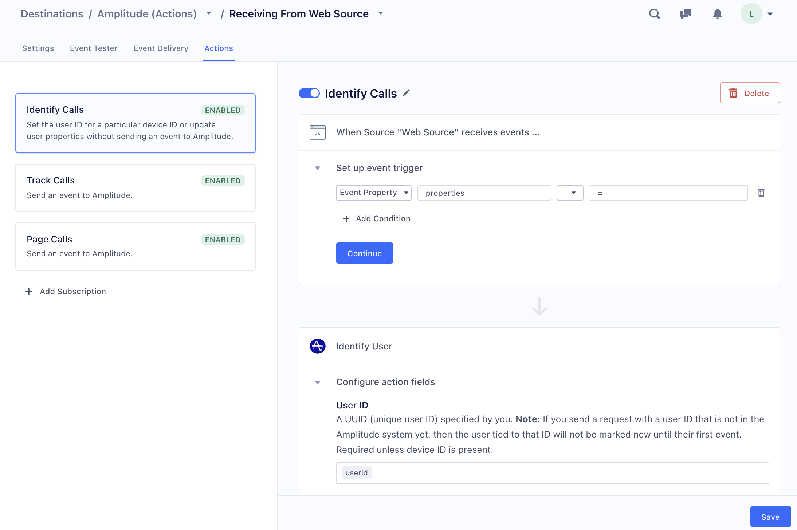




[Amplitude](https://amplitude.com/) is an event tracking and segmentation
platform for your web and mobile apps. By analyzing the actions your users
perform, you can gain a better understanding to drive retention, engagement,
and conversion.

> info ""
> This document is about a feature which is in beta. This means that the Destination Actions are in active development, and some functionality may change before it becomes generally available



> success ""
> **Good to know**: This page is about the [Actions-framework](/docs/connections/destinations/actions/) Amplitude Segment destination. There's also a page about the [non-Actions Amplitude destination](/docs/connections/destinations/catalog/amplitude/). Both of these destinations receives data _from_ Segment. There's also the [Amplitude Engage Segment source](/docs/connections/sources/catalog/cloud-apps/amplitude-cohorts/), which sends data _to_ Segment!


## Connection Modes for Amplitude (Actions) destination

The Amplitude (actions) destination does not offer a device-mode connection mode. However if you are using one of Segment's new libraries ([Analytics.js 2.0](https://segment.com/docs/connections/sources/catalog/libraries/website/javascript/), [Swift](https://github.com/segmentio/analytics-swift) or [Kotlin](https://github.com/segmentio/analytics-kotlin)) with the Actions-framework version of the destination, you do not need the device-mode connection.

Most previous deployments of the Amplitude Segment destination only used the device-mode connection to get use the `session_id` tracking feature. In the new Actions-framework Amplitude destination, session ID tracking is built in. This means you don’t need to bundle any software to run on the user’s device, or write any code. It also means that you can use more of the Segment platform features on data going to Amplitude, such as Protocols filtering and transformations, and Personas identity resolution.


Session tracking is only available when using Segment's new libraries: [Analytics.js 2.0](https://segment.com/docs/connections/sources/catalog/libraries/website/javascript/), [Swift](https://github.com/segmentio/analytics-swift) or [Kotlin](https://github.com/segmentio/analytics-kotlin)


## Getting Started

1. Before you start, go to your [Amplitude project settings](https://analytics.amplitude.com/settings/projects), and locate the project that you'll be sending Segment data to. Copy the Amplitude API Key and Secret key for the project.
1. From the Segment web app, click **Catalog**, then click **Destinations**.
2. Find the Destinations Actions item in the left navigation, and click it.
2. Click the "Amplitude" item to select it and click **Configure**.
3. Choose which of your sources to connect the destination to. (You can connect more sources to the destination later.)
3. On the next page enter your Amplitude API key and Secret key and click **Verify credentials**.
4. Next, choose how to create the mapping. You can click Quick Setup to use the defaults provided by Segment, or click Customized Setup to start from a blank mapping.

Once you have a mapping, you can follow the steps in the Destinations Actions documentation on [Customizing mappings](/docs/connections/destinations/actions/#customizing-mappings).


### Enable Amplitude session tracking for Analytics.js 2.0

The session tracking is automatically enabled on Javascript sources.


### Enable Amplitude session tracking for Swift

To enable session tracking in Amplitude when using the [Segment Swift library](https://github.com/segmentio/analytics-swift):
1. Enable `trackApplicationLifecycleEvents` in your configuration.
2. Add the [Amplitude Session plugin](https://github.com/segmentio/analytics-swift/blob/main/Examples/destination_plugins/AmplitudeSession.swift
) to your project.
3. Initialize the plugin ([example](https://github.com/segmentio/analytics-swift/blob/main/Examples/apps/DestinationsExample/DestinationsExample/AppDelegate.swift))
   ```swift
   analytics?.add(plugin: AmplitudeSession(name: "Amplitude"))
   ```

### Enable Amplitude session tracking for Kotlin

To enable session tracking in Amplitude when using the [Segment Kotlin library](https://github.com/segmentio/analytics-kotlin):
1. Enable `trackApplicationLifecycleEvents` in your configuration.
2. Add the [Amplitude Session plugin](https://github.com/segmentio/analytics-kotlin/blob/main/samples/kotlin-android-app-destinations/src/main/java/com/segment/analytics/destinations/plugins/AmplitudeSession.kt) to your project.
2. Initialize the plugin
   ```kotlin
   analytics.add(AmplitudeSession())
   ```


## Available Amplitude Actions

Amplitude supports the following Actions:

- Log Event
- Identify User
- Map User
- Group Identify User

You can see the Segment event fields Amplitude accepts for each action in the Actions subscription set up page.


## Quick set-up actions

By default a new Amplitude (Actions) destination comes with the following subscriptions.

You can select these subscriptions by choosing "Quick Setup" when you first configure the destination. You can enable, edit, and disable them from the screen that appears.

| Subscription Name | Trigger                                          | Amplitude Action | Non-default mapped fields                                      |
| ----------------- | ------------------------------------------------ | ---------------- | -------------------------------------------------------------- |
| Track Calls       | All **track** calls from the connected source    | Log Event        | Event Type = `event`<br>for example,  `Order Completed`        |
| Page Calls        | All **page** calls from the connected source     | Log Event        | Event Type = Viewed `name`<br>for example, `Viewed Homepage`   |
| Screen Calls      | All **screen** calls from the connected source   | Log Event        | Event Type = Viewed `name`<br>for example, `Viewed Homescreen` |
| Identify Calls    | All **identify** calls from the connected source | Identify User    |                                                                |


## Amplitude’s Log Event Action

In the default configuration, the Log Event mapping is triggered when Segment sends a Track call to Amplitude (Actions).

### Order Completed

Use the [Order Completed](/docs/connections/spec/ecommerce/v2/#order-completed) event to track revenue with Amplitude. This event records a list of products that a user purchased in a single transaction. This is the best way for sites that have a shopping cart system to track purchases.

You can currently use this event only for data coming from a server or web [source](/docs/connections/sources/). An `Order Completed` event from mobile using our bundled Amplitude integration will work the same as our standard `track` event documented above.

The example below shows an "Order Completed" event with its properties.

```js
analytics.track({
  "userId": "e953c39d2597f0b8a79dd3c407baeb13bb58523a",
  "event": "Order Completed",
  "properties": {
    "checkoutId": "6727142daf49b93a601d3a31bc3d53aeae1d15ab",
    "orderId": "50314b8e9bcf000000000000",
    "affiliation": "Google Store",
    "total": 30,
    "revenue": 25,
    "shipping": 3,
    "tax": 2,
    "discount": 2.5,
    "coupon": "hasbros",
    "currency": "USD",
    "products": [
      {
        "productId": "507f1f77bcf86cd799439011",
        "sku": "45790-32",
        "name": "Monopoly: 3rd Edition",
        "price": 19,
        "quantity": 1,
        "category": "Games"
      },
      {
        "productId": "505bd76785ebb509fc183733",
        "sku": "46493-32",
        "name": "Uno Card Game",
        "price": 3,
        "quantity": 2,
        "category": "Games"
      }
    ]
  }
})
```

When you send an "Order Completed" event from Segment, an "Order Completed" event appears in Amplitude for that purchase. An Amplitude event called "Product Purchased" is also created for each product in the purchase. All event properties, except `products`, are sent as `event_properties` of the Amplitude "Order Completed" event. Information about each product is present *only* on the individual "Product Purchased" events.

### Track Revenue Per Product

Amplitude has two different ways to track revenue associated with a multi-product purchase. You can choose which method you want to use using the **Track Revenue Per Product** destination setting.

If you disable the setting ("off"), Segment sends a single revenue event with the total amount purchased. Revenue data is added to the Amplitude "Order Completed" event. The "Product Purchased" events do not contain any native Amplitude revenue data.

If you enable the setting ("on"), Segment sends a single revenue event for each product that was purchased. Revenue data is added to each "Product Purchased" event, and the "Order Completed" event does not contain any native Amplitude revenue data.

Make sure you format your events using the [Track method spec](/docs/connections/spec/track/). You must pass a `revenue` property, a `price` property, and a `quantity` property for each product in the products list.

### Send To Batch Endpoint


> info ""
> This endpoint is available when you send data in Cloud-mode only.


If `true`, events are sent to Amplitude’s `batch` endpoint rather than to their `httpapi` endpoint. Because Amplitude’s `batch` endpoint throttles traffic less restrictively than the Amplitude `httpapi` endpoint, enabling this setting can help to reduce 429 errors (throttling errors) from Amplitude.

Amplitude’s `batch` endpoint throttles data when the rate of events sharing the same `user_id` or `device_id` exceeds an average of 1,000/second over a 30-second period. See the Amplitude documentation for more about [429 errors and throttling in Amplitude](https://developers.amplitude.com/#429s-in-depth).

## Identify User

In the default configuration, this mapping is triggered when Segment sends an Identify call to Amplitude (Actions).

This Action sets the user ID for a specific device ID, or updates the user properties. You can use this when you want to update user information without sending an Event to Amplitude.


## Map User

In the default configuration, this mapping is triggered when Segment sends an Alias call to Amplitude (Actions).

This Action merges two users together that would otherwise have different User IDs tracked in Amplitude. You can use this when you want to merge the users without sending an Event to Amplitude.


## Group Identify User

In the default configuration, this mapping is triggered when Segment sends a Group call to Amplitude (Actions).

This Action sets or updates the properties of specific groups. You can use this when you want to update a group's information without sending an Event to Amplitude.

These Group updates only affect events that occur after you set up the Amplitude mapping. You cannot use this to group historical data.

> success ""
> If you are on a Business Tier Segment plan, you can use [Replay](/docs/guides/what-is-replay/) to run historical data through the Amplitude (Actions) destination to apply the grouping.


## Important differences from the classic Amplitude destination

The following user fields are captured by the classic Amplitude destination in device-mode (when it runs on the user’s device), but are not captured by Amplitude (Actions):

- Device Type (for example, Mac, PC, mobile device)
- Platform (for example iOS or Android)


## Replicating classic Amplitude destination settings

Most of the classic Amplitude destination settings were related to device-mode collection (for example, batching or Log Revenue V2), and do not apply to the Amplitude (Actions) destination, which runs in cloud-mode. The following sections discuss how to replicate the old settings where possible.

> info ""
> Contact Segment support if you find features missing from the Amplitude (Actions) destination that were available in the classic Amplitude destination.

### Track Named, Categorized, or All Pages or Screens

The default Amplitude (Actions) subscription sends *all* Page and Screen calls.
To replicate the old behavior, change the trigger to include only events that contain `name` or `category`.

### Prefer Anonymous ID for Device ID

To replicate the old behavior, change the mapping for Device ID field.
Default:
```objc
'@if': {
        exists: { '@path': '$.context.device.id' },
        then: { '@path': '$.context.device.id' },
        else: { '@path': '$.anonymousId' }
      }
```

### Use AdvertisingId for DeviceId

To replicate the old behavior, change the mapping for Device ID field.
Default:
```objc
'@if': {
        exists: { '@path': '$.context.device.id' },
        then: { '@path': '$.context.device.id' },
        else: { '@path': '$.anonymousId' }
        }
```


### Location Tracking

Location Tracking is a feature of Amplitude’s mobile SDKs and is not supported in Amplitude (Actions) which run in cloud-mode only.
This setting required that the user grant location permission for the mobile app. This is different from the IP-based location lookup that Amplitude can perform.

To work around this limitation, send `context.location.latitude` and `context.location.longitude` from your app, and let Amplitude perform the lookup.
