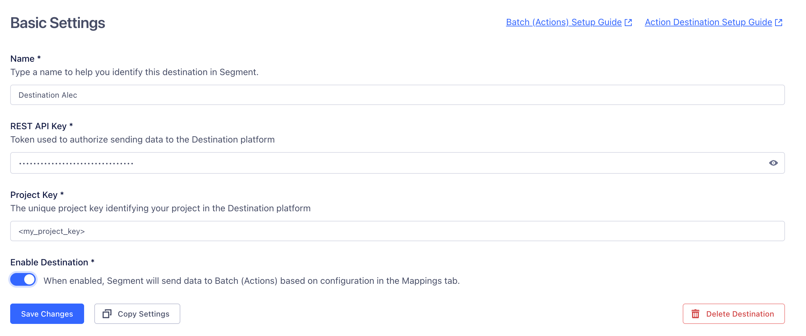
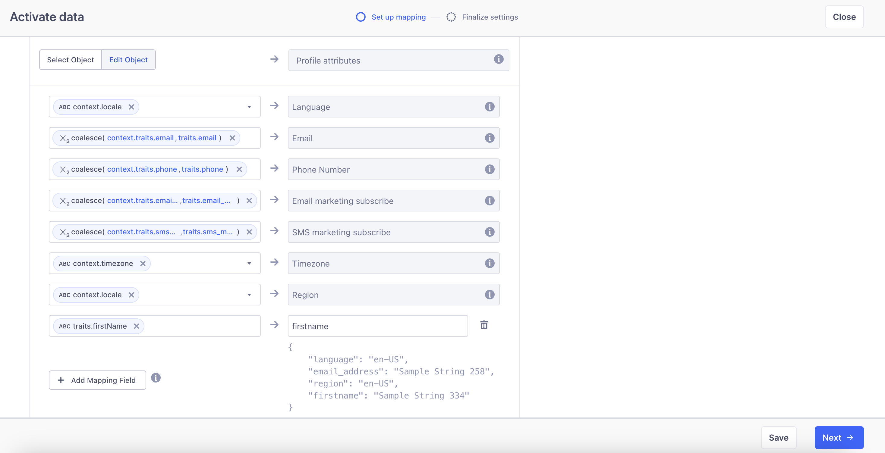
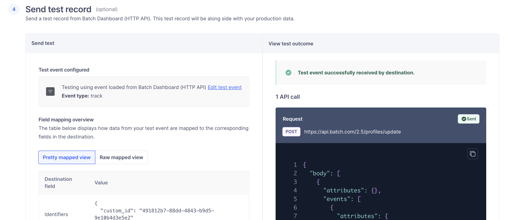
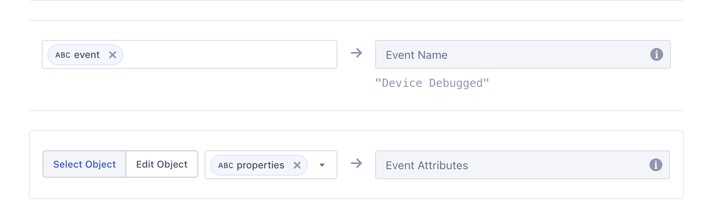



[Batch](https://batch.com/?utm_source=segmentio&utm_medium=docs&utm_campaign=partners){:target="_blank"} is a customer engagement platform for personalized, timely notifications and messages that boost retention and drive growth.

This destination is maintained by Batch. For any issues, [contact Batch Support](mailto:support@batch.com){:target="_blank"}.

## Getting started

1. From your workspace’s [destinations catalog](https://app.segment.com/goto-my-workspace/destinations/catalog){:target="_blank"}, search for **Batch**.
2. Select **Batch (Actions)** and click **Add Destination**.
3. Choose the **source** you want to connect to **Batch (Actions)**.
4. In the [Batch dashboard](https://dashboard.batch.com/){:target="_blank"}, copy your **Project Key** and **REST API Key**.
5. Paste the **Project Key** and **REST API Key** into the Batch destination settings in Segment.
6. Toggle **Enable Destination**. Segment will start sending data to Batch according to your **Mappings**.
   




## Profile attributes mapping

> info ""
> If you’re new to the Identify call, see the [Segment spec](/docs/connections/spec/identify/) for more details.

When you call **Identify**, Segment maps `userId` to **`identifiers.custom_id`** and writes traits into **`attributes`**.

### Example Identify call (Segment input)

```js
analytics.identify("97980cfea0067", {
  name: "Peter Gibbons",
  email: "peter@example.com",
  phone: "+33600000000",
  email_marketing: "subscribed",
  sms_marketing: "unsubscribed",
  plan: "premium",
  logins: 5
}, {
  context: {
    timezone: "Europe/Paris",
    locale: "fr-FR"
  }
});
```

### Auto-mapped fields (native)

| Segment field                          | Batch field                     |
|----------------------------------------|---------------------------------|
| `userId`                               | `identifiers.custom_id`         |
| `traits.email`                         | `attributes.$email_address`     |
| `traits.phone`                         | `attributes.$phone_number`      |
| `traits.email_marketing`               | `attributes.$email_marketing`   |
| `traits.sms_marketing`                 | `attributes.$sms_marketing`     |
| `context.timezone`                     | `attributes.$timezone`          |
| `context.locale` → language *(for example: `fr`)*| `attributes.$language`          |
| `context.locale` → region *(for example: `FR`)*  | `attributes.$region`            |

**Notes**

- `$email_marketing` / `$sms_marketing`: use `subscribed` / `unsubscribed`.  
- A locale like `fr-FR` is split into **language** (`fr`) and **region** (`FR`).  
- All other non‑reserved fields become **custom attributes** under `attributes` (strings, numbers, booleans, arrays of strings). Avoid arbitrary nested objects.

> info ""
> For more details on the fields to be included, refer to the Batch [API Profile documentation](https://doc.batch.com/developer/api/cep/profiles/update){:target="_blank"}.

### Resulting Batch profile payload (output)

```json
{
  "identifiers": {
    "custom_id": "97980cfea0067"
  },
  "attributes": {
    "$email_address": "peter@example.com",
    "$phone_number": "+33600000000",
    "$email_marketing": "subscribed",
    "$sms_marketing": "unsubscribed",
    "$language": "fr",
    "$region": "FR",
    "$timezone": "Europe/Paris",

    "name": "Peter Gibbons",
    "plan": "premium",
    "logins": 5
  }
}
```

### Add custom mappings

To map additional traits into Batch profile attributes:

1. Open your destination → **Mappings** → **Edit Mapping**.  
2. Go to **Profile attributes** → **Add Mapping Field**.
3. Choose a **source** (for example, `traits.plan`) and set a **target** under `attributes` (for example, `attributes.plan`).  

4. In **Step 4 – Send test record**, you can test your mapping before saving.  

5. **Save** and enable the mapping.

> info "Supported types"
> Strings, numbers, booleans, arrays of strings are supported.
> Avoid arbitrary nested objects.

## Historical backfill request

If you want to integrate your entire Segment userbase into Batch using the **Identify** method, you can request a historical backfill from Segment.  

To do this:

1. **Contact Segment Support** at [friends@segment.com](mailto:friends@segment.com).
2. **Request a historical replay** of your data.  
3. Provide Segment with the following details:  
   - **Start date and time**  
   - **End date and time** (usually “now”)  
   - **Source**: the Segment source you want to replay
   - **Destination**: **Batch (Actions)** 
   - **Events**: `Identify`  

Segment will then replay your historical data so Batch can import your full userbase.

## Profile events mapping

When you call **Track**, Segment uses your `userId` as Batch’s **`identifiers.custom_id`**. A **userId is required** to attribute the event to a profile.

> info ""
> For more details on the Track call, see the [Track spec](/docs/connections/spec/track).

### Example Track call (Segment input)

```js
analytics.track("User Registered", {
  plan: "Pro Annual",
  accountType: "Facebook"
}, {
  userId: "97980cfea0067"
});
```

### How Segment maps to Batch

| Segment           | Batch                   |
|-------------------|-------------------------|
| `userId`          | `identifiers.custom_id` |
| `event`           | `event.name`            |
| `properties.*`    | `event.attributes.*`    |

### Resulting Batch event payload (output)

```json
{
  "identifiers": {
    "custom_id": "97980cfea0067"
  },
  "event": {
    "name": "User Registered",
    "attributes": {
      "plan": "Pro Annual",
      "accountType": "Facebook"
    }
  }
}
```

Events are sent to Batch in near real time according to your destination mappings, and all event `properties` are included under `event.attributes`.



## Validation checklist

- Always send a stable `userId` → becomes `identifiers.custom_id`.  
- Place native profile fields under `attributes`: `$email_address`, `$email_marketing`, `$phone_number`, `$sms_marketing`, `$language`, `$region`, `$timezone`.  
- Put everything else under **custom attributes** in `attributes`.  
- Format dates using **ISO‑8601 UTC** (for example: `1989-07-20T00:00:00Z`).  
- Configure additional mappings in **Mappings → Edit Mapping**.  
- Test with a read-back or export to verify types, encodings, and timezones.

## Integrating a computed trait

> info ""
> For more details on computed traits, see the [Segment spec](/docs/unify/Traits/computed-traits).

To integrate a computed trait with Batch:

1. Go to your **Segment workspace**.  
2. Open the **Engage** tab → **Destinations**.  
   - If your Batch destination is already listed, skip this step.  
   - Otherwise, click **Add destination** and select **Batch (Actions)**.  
3. Open the **Engage** tab → **Audiences** → **Computed traits**.
4. Click **Create computed trait**.  
5. Configure your **calculation method** (for example: count, aggregation, last value).  
6. Click **Preview**, then **Next**.  
7. Select your **Batch destination**.  
8. Choose how to send the data:  
   - For an attribute → enable **Send Identify** in the connection settings.  
   - For an event → enable **Send Track**.  
9. Give your computed trait a **clear name**.  

Segment will then automatically update and forward your computed trait data to Batch.
