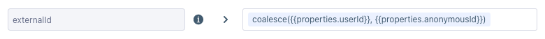
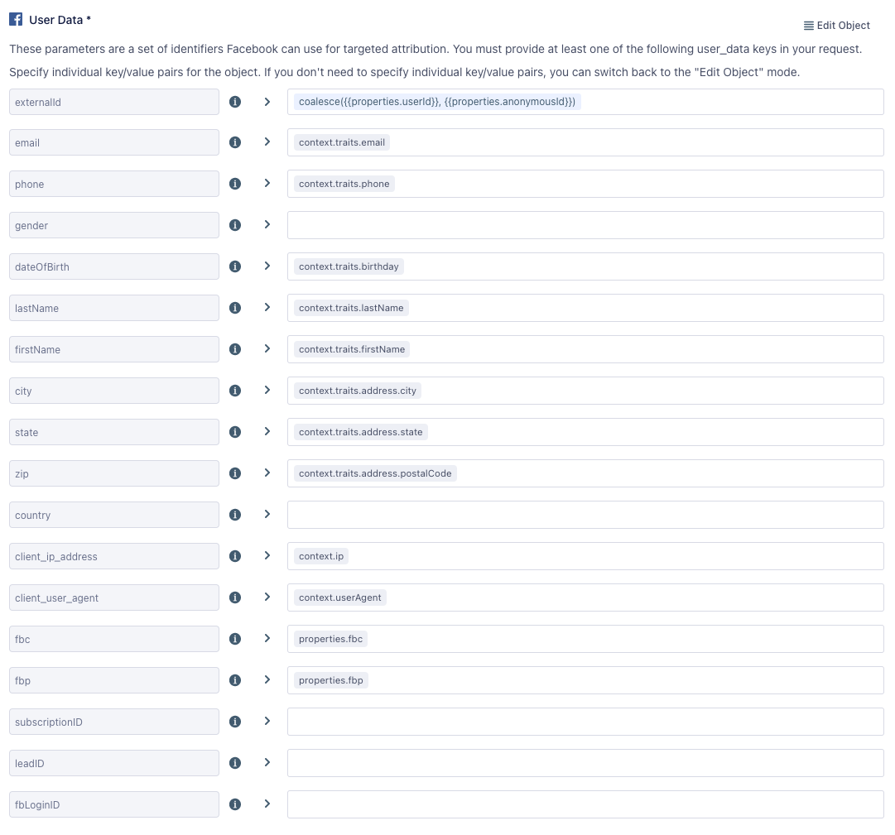

Facebook Conversions API (Actions) enables advertisers to send events from their servers directly to Facebook. Server-side events link to Facebook Pixel events, and process like browser pixel events. This means that server-side events are used in measurement, reporting, and optimization, just like browser pixel events.

> info "Customer Information Parameters Requirements"
> As of Facebook Marketing API v13.0+, Facebook began enforcing new requirements for customer information parameters (user data). To ensure your events don't throw an error, Segment recommends that you review [Facebook’s new requirements](https://developers.facebook.com/docs/graph-api/changelog/version13.0#conversions-api){:target="_blank"}.

## Benefits of Facebook Conversions API (Actions) vs Facebook Conversions API Classic

The Facebook Conversions API (Actions) destination provides the following benefits over the classic Facebook Conversions API destination:
- **Fewer settings**. Data mapping for actions-based destinations happens during configuration, which eliminates the need for most settings.
- **Clearer mapping of data**. Actions-based destinations enable you to define the mapping between the data Segment receives from your source, and the data Segment sends to Facebook Conversions API.
- **Prebuilt mappings**. Mappings for standard Facebook Conversions API events, like `Purchase`, are prebuilt with the prescribed parameters and available for customization.
- **Support for page calls**. Page calls can be sent to Facebook as a standard Page View.
- **Support for identify calls**. Identify calls can be sent to Facebook as a standard or custom event.
- **Support for multi-product arrays**. Product data nested within arrays, like the `products` array in the [Order Completed](/docs/connections/spec/ecommerce/v2/#order-completed) event, can be sent to Facebook.
- **Data normalization**. Data is normalized before it is hashed to ensure the hashed value matches Facebook Pixel (browser).

## Other Facebook Destinations Supported by Segment
This page is about the **Facebook Conversions API**. For documentation on other Facebook destinations, see the pages linked below.

| **Facebook Destination**                                                                                    | Supported by Personas |
| ----------------------------------------------------------------------------------------------------------- | --------------------- |
| **[Facebook App Events](/docs/connections/destinations/catalog/facebook-app-events/)**                      | Yes                   |
| **[Facebook Offline Conversions](/docs/connections/destinations/catalog/facebook-offline-conversions/)**    | Yes                   |
| **[Facebook Pixel](/docs/connections/destinations/catalog/facebook-pixel/)**                                | No                    |
| **[Facebook Custom Audiences](/docs/connections/destinations/catalog/personas-facebook-custom-audiences/)** | Yes                   |
| **[Facebook Conversions API](/docs/connections/destinations/catalog/actions-facebook-conversions-api/)**    | Yes                   |

## Getting started

Set up your Pixel to work with the Facebook Conversions API (Actions) destination. You can use an existing Facebook Pixel that you already have set up, or create a new one.

### Option 1: Create a new pixel

1. Go to the [Facebook Business Events Manager](https://www.facebook.com/events_manager/){:target="_blank"} and click **Connect Data Sources**.
2. Choose "Web" and then click **Get Started**.
3. Select “Conversions API” and then click **Connect**.
4. Choose “Segment” from the list of partners.
5. Enable the setting to “Authorize Segment Connection” and then click **Continue**.

### Option 2: Configure an existing pixel

1. Go to the Pixel Settings in [Facebook Business Events Manager](https://www.facebook.com/events_manager/){:target="_blank"} 
2. Scroll down to the “Set up through a partner integration section” and click **Choose Partner**.
3. Choose “Segment” from the list of partners.
4. Enable the setting to “Authorize Segment Connection” and then click **Continue**.

### Connect Facebook Conversions API (Actions) to your workspace

1. From the Segment web app, click **Catalog**, then click **Destinations**.
2. Search for “Facebook Conversions API (Actions)” in the Destinations Catalog, and select the destination.
3. Click **Configure Facebook Conversions API (Actions)** in the top-right corner of the screen.
4. Select the source that will send data to Facebook Conversions API and follow the steps to name your destination.
5. On the **Settings** tab, enter in your Pixel ID and click **Save**.
6. Follow the steps in the Destinations Actions documentation on [Customizing mappings](/docs/connections/destinations/actions/#customizing-mappings).



## Configuration options

The Facebook Conversions API (Actions) destination gives you several ways to implement your conversion tracking. You can use it with [Facebook Pixel](/docs/connections/destinations/catalog/facebook-pixel/), or as a stand-alone alternative. You can read more about implementation options below and in [Facebook documentation](https://developers.facebook.com/docs/marketing-api/conversions-api/guides/end-to-end-implementation#pick-your-integration-type){:target="_blank"}.                                                               |

### Send events from both the browser and the server

This approach provides a redundancy that ensures maximum signal reliability. Events that previously could have been lost (for several different reasons) when sent from the browser to Facebook Pixel, are also captured using the Facebook Conversions API. You can use this if you do not want to miss any events coming from the browser. 

#### Match rate considerations

For this option to work best, pass the same External ID from the browser and the server. To do this, go to your Facebook Pixel destination settings in Segment and enable the **Enable Advanced Matching** setting. Next, enable the **Use User ID or Anonymous ID as External ID** setting, or choose a custom trait for External ID using the **Advanced Match Trait Key for External ID** setting.

With the Facebook Conversions API (Actions) destination, you can choose any field in your event to map to External ID. By default, Segment uses the userId (or anonymousId if userId is not present) to set the External ID, but you can change this in the User Data object mapping of your Action.

You can send additional User Data to increase the match rate for events from a server source. Collect other fields from the browser, like User Agent, IP Address, and [Facebook's cookie parameters (fbp, fbc)](https://developers.facebook.com/docs/marketing-api/conversions-api/parameters/fbp-and-fbc){:target="_blank"}, pass them to the server, and map them in the User Data object. See [Facebook's Customer Information Parameters](https://developers.facebook.com/docs/marketing-api/conversions-api/parameters/customer-information-parameters){:target="_blank"} for more information on User Data fields, and [Facebook's Best Practices for Conversions API](https://www.facebook.com/business/help/308855623839366?id=818859032317965){:target="_blank"} for match rate best practices.

#### Deduplication considerations

A redundant setup requires deduplication to ensure browser events that are sent to Facebook Pixel and Facebook Conversions API are not duplicated. Facebook can deduplicate identical events sent through the Pixel and the Conversions API in two ways:
- [Event ID and Event Name](https://developers.facebook.com/docs/marketing-api/conversions-api/deduplicate-pixel-and-server-events/#event-id-and-event-name--recommended-){:target="_blank"}
- [FBP or External ID](https://developers.facebook.com/docs/marketing-api/conversions-api/deduplicate-pixel-and-server-events/#fbp-or-external-id){:target="_blank"}

Segment's Facebook Conversions API (Actions) destination allows you to map your data to these four fields, to support either deduplication method. Please note that Segment's Facebook Pixel destination will set `messageId` as the `eventId`. See Facebook's [Handling Duplicate Pixel and Conversions API Events](https://developers.facebook.com/docs/marketing-api/conversions-api/deduplicate-pixel-and-server-events){:target="_blank"} for more information.

### Send some events from the browser and others from the server 

If you want to separate events completed on a user's browser from events completed outside the browser, such as a server-based payment system, you can send some events to Facebook Pixel and other events to Facebook Conversions API. Sensitive information is best kept out of browsers, so any data you don't want exposed to users should only be sent using a server source. You can also set up the Conversions API to measure customer actions that are deeper in your marketing funnel. Seeing these deeper funnel events means you can more accurately measure how your ads are helping you reach your business goals.

#### Match rate considerations

For this option to work best, the same External ID needs to be passed from the browser and the server. To achieve this, go to your Facebook Pixel destination settings in Segment and enable the **Enable Advanced Matching** setting. Next, enable the **Use User ID or Anonymous ID as External ID** setting, or choose a custom trait for External ID using the **Advanced Match Trait Key for External ID** setting.

With the Facebook Conversions API (Actions) destination, you can choose any field in your event to map to External ID. By default, Segment uses the userId (or anonymousId if userId is not present) to set the External ID, but you can change this in the User Data object mapping of your Action.

You can send additional User Data to increase the match rate for events from a server source. Collect other fields from the browser, like User Agent, IP Address, and [Facebook's cookie parameters (fbp, fbc)](https://developers.facebook.com/docs/marketing-api/conversions-api/parameters/fbp-and-fbc){:target="_blank"}, pass them to the server, and map them in the User Data object. See [Facebook's Customer Information Parameters](https://developers.facebook.com/docs/marketing-api/conversions-api/parameters/customer-information-parameters){:target="_blank"} for more information on User Data fields, and [Facebook's Best Practices for Conversions API](https://www.facebook.com/business/help/308855623839366?id=818859032317965){:target="_blank"} for match rate best practices.

#### Deduplication considerations

If you choose this option, each source sends different events, and deduplication is not necessary.

### Send events from the server

Use this approach if you don't want to track users from the browser with Facebook Pixel. By default, Facebook Pixel collects cookie data, as well as browser data such as the IP Address and the User Agent, some of which you might not want to collect. By sending from a Segment server source to Facebook's Conversions API, you can control which identifiers you pass to Facebook.

#### Match rate considerations

If you use Facebook Conversions API as a stand-alone without certain data fields collected from the browser, the match rate might not be as high as if you included them. You can increase the match rate for events from a server source by including User Data, such as Zip Code, Country and State.

You can send additional User Data to increase the match rate for events from a server source. Collect other fields from the browser, like User Agent, IP Address, and [Facebook's cookie parameters (fbp, fbc)](https://developers.facebook.com/docs/marketing-api/conversions-api/parameters/fbp-and-fbc){:target="_blank"}, pass them to the server, and map them in the User Data object.

#### Deduplication considerations

If you choose this option, each source sends different events, and deduplication is not necessary.

## FAQ & Troubleshooting

### Other Standard Events

If you want to send a [Facebook standard event](https://developers.facebook.com/docs/meta-pixel/reference#standard-events){:target="_blank"} that Segment does not have a prebuilt mapping for, you can use the [Custom Event action](/docs/connections/destinations/catalog/actions-facebook-conversions-api/#custom-event) to send the standard event. For example, if you want to send a `CompleteRegistration` event, create a mapping for Custom Event, set up your Event Trigger criteria for completed registrations, and input a literal string of "CompleteRegistration" as the Event Name. You can use the Custom Data key/value editor to add fields that are in the `CompleteRegistration` event such as `content_name` and `currency`.

### PII Hashing

Segment creates a SHA-256 hash of the following fields before sending to Facebook:
- External ID
- Email
- Phone
- Gender
- Date of Birth
- Last Name
- First Name
- City
- State
- Zip Code
- Country

If you use Facebook Pixel, the Pixel library also hashes the External ID. This means External IDs will match across Facebook Pixel and Facebook Conversions API if they use the External ID for [deduplication](https://developers.facebook.com/docs/marketing-api/conversions-api/deduplicate-pixel-and-server-events/#fbp-or-external-id){:target="_blank"}.

### Server Event Parameter Requirements

Facebook requires the `action_source` server event parameter for all events sent to the Facebook Conversions API. This parameter specifies where the conversions occur. If `action_source` is set to **website**, then the `client_user_agent` and the `event_source_url` parameters are also required. Events sent to the Conversions API that don't meet the requirements may not be available for optimization, targeting, or measurement.

### Verify Events in Facebook

After you start sending events, you should start seeing them in twenty minutes. You can confirm that Facebook received them:

1. Go to the Events Manager.
2. Click on the corresponding pixel.
3. In the Overview tab, look for events where the “Connection Method” is Server.

