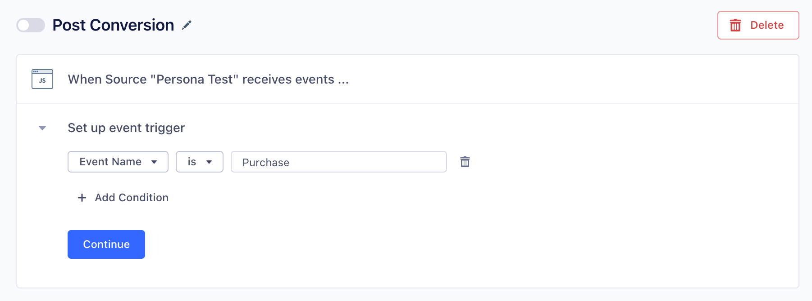

> info ""
> This document is about a feature which is in beta. This means that the destination is in active development, and some functionality may change before it becomes generally available

> success ""
> **Good to know**: This page is about the [Actions-framework](/docs/connections/destinations/actions/) Google Enhanced Conversions Segment destination. 

The Google Enhanced Conversions destination enables you to improve the accuracy of your conversion measurement. You can send first-party customer conversion data from your website, such as email address, to Google Ads. Segment hashes this data sends it in a privacy-safe way. Google matches hashed data with signed-in Google accounts to attribute the conversion to ad events, such as clicks or views. To learn more about Google Enhanced Conversions, see Google's documentation [About enhanced conversions (beta)](https://support.google.com/google-ads/answer/9888656?hl=en-GB){:target="_blank"}.

> warning "Before you begin"
> Enable Enhanced Conversions in your Google Ads account. When you authenticate your Segment works space with your Google Account, use a Google Account that is a member of your Google Ads account.

## Getting started

The Actions Google Enhanced Conversions destination is in Private Beta, and does not appear in the Destinations Catalog. 

1. To access the destination, navigate to this URL: `https://app.segment.com/<workspace_slug>/destinations/catalog/actions-google-enhanced-conversions`. Replace `<workspace_slug>` with your workspace slug.
2. Click **Configure Actions Google Enhanced Conversions** in the top-right corner of the screen.
3. Select the source to use to send data to Google Enhanced Conversions.
4. Enter your Conversion Tracking ID. For more information, see the article [Google Ads conversions](https://support.google.com/tagmanager/answer/6105160?hl=en){:target="_blank"}.
   1. To find your Conversion Tracking ID, log in to Google Ads, and make sure you are in [Expert Mode](https://support.google.com/google-ads/answer/9520605?hl=en){:target="_blank"}.
   2. Click **Tools & Settings** in the top bar, and select **Conversions** from the dropdown. Select the **Conversion Action** you want Segment to log to.
   3. Open the menu for **Enhanced Conversions**. Enable **Turn on enhanced conversions** and click **Edit code**. then **Use event snippet**.
   4. Open the **Tag setup** menu. In the *Select how you want to install your tag* section, select **Install the tag yourself - Add the tag to your website code**.
   5. Scroll down to the **Event snippet** and click **Download snippet**.
   6. Open the snippet in a text editor, you should see something like the following:
    ```html
    <!-- Event snippet for Purchase conversion page -->
    <script>
      gtag('event', 'conversion', {
          'send_to': 'AW-#########/YdJ9ma7Q-DB2qGvaPapk',
          'value': 10.0,
          'currency': 'USD',
          'transaction_id': ''
      });
    </script>
    ```
    7. On the line that begins `'send_to`, copy the digits that come directly after `AW-`. For example, if the line reads `'send_to': 'AW-123456789/YdJ9ma7Q-DB2qGvaPapk`, copy `123456789`. This is your Conversion Tracking ID.
 5. Click **Configure Actions**.
 6. Click **Create Destination**.

### Connect to Google Enhanced Conversions

After you create the destination in your Segment workspace, you can authenticate with Google using OAuth. On the **Settings** tab of the destination, click **Connect to Actions Google Enhanced Conversions**. Follow the prompts to authenticate using OAuth, with a Google login that is a member of the Google Ads account with Enhanced Conversions  enabled.

## Create your first Action

Actions define which events Segment sends to Google Enhanced Conversions, and the data that they carry. To create an Action:

1. Navigate to the **Actions** tab on the destination.
2. Click **Add Subscription**, and select **Post Conversion**.
3. Configure the **Event Trigger**. For example, you can trigger the action whenever the source sends an Event named `Purchase`. Click **Continue** to configure the action fields, skip Testing for now. 
4. Find the Conversion Label. This string is in the Event snippet you downloaded in a previous step. On the line that begins `'send_to'`, copy the string that comes after the Conversion Tracking ID. For example, For example, if the line reads `'send_to': 'AW-123456789/YdJ9ma7Q-DB2qGvaPapk`, copy `YdJ9ma7Q-DB2qGvaPapk`, this is the Conversion Label.
5. Configure the remaining properties. The **Email** field is not editable. In the default configuration, `properties.email` maps to the Email property in Google Enhanced Conversions. If `properties.email` is unavailable, the destination uses `traits.email` as a fallback.
6. When you're finished editing the action fields, click **Continue**. Click **Save**.
7. To test your action, expand the **Test event trigger** section. Segment searches for recent events that match the trigger conditions. If there are no recent events that match the criteria, click **manually enter an event**, and replace the default event data with the following:
```json
{
	"messageId": "segment-test-message-hkz2b",
	"timestamp": "2021-08-27T17:32:12.781Z",
  "context" : {
    "userAgent": "Mozilla/5.0 (iPhone; CPU iPhone OS 9_1 like Mac OS X) AppleWebKit/601.1.46 (KHTML, like Gecko) Version/9.0 Mobile/13B143 Safari/601.1"
  },
	"type": "track",
	"email": "test@example.org",
	"properties": {
		"email": "test@example.org",
    "orderId": "123",
    "firstName": "Bob John",
    "lastName": "Smith",
    "phone": "14150000000",
    "address": {
      "street": "123 Market Street",
      "city": "San Francisco",
      "state": "CA",
      "postalCode": "94000",
      "country": "USA"
    }
	},
	"userId": "test-user-j75yud",
	"event": "Purchase"
}
```
8. Click **Test Event**.
9. Scroll down and expand the **Send a test event** section, and click **Test Action**.
10. The section displays the test result and the payload that Google Enhanced Conversions returns to Segment.
11. Click **Save**.
12. Enable the action with the toggle at the top of the page.


