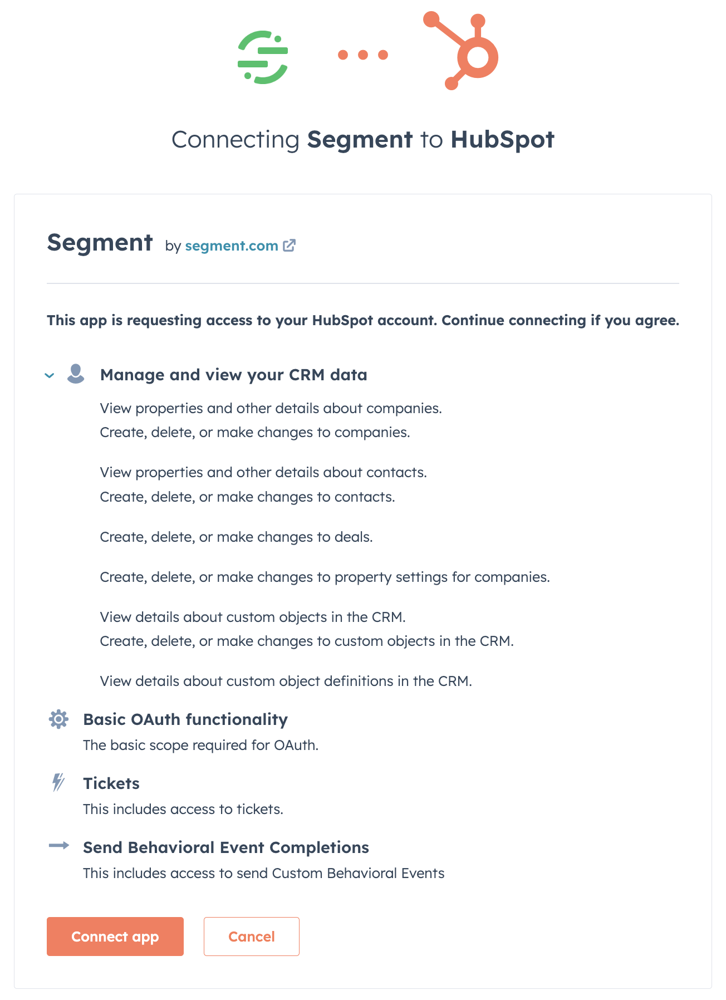
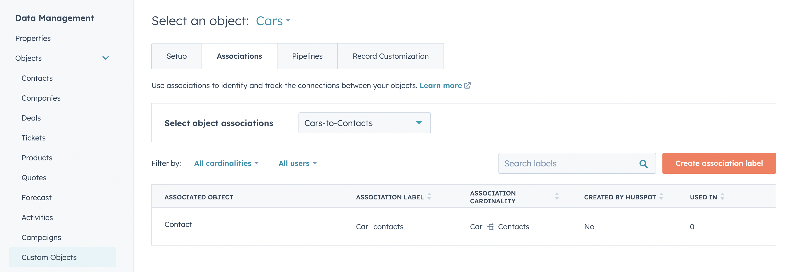
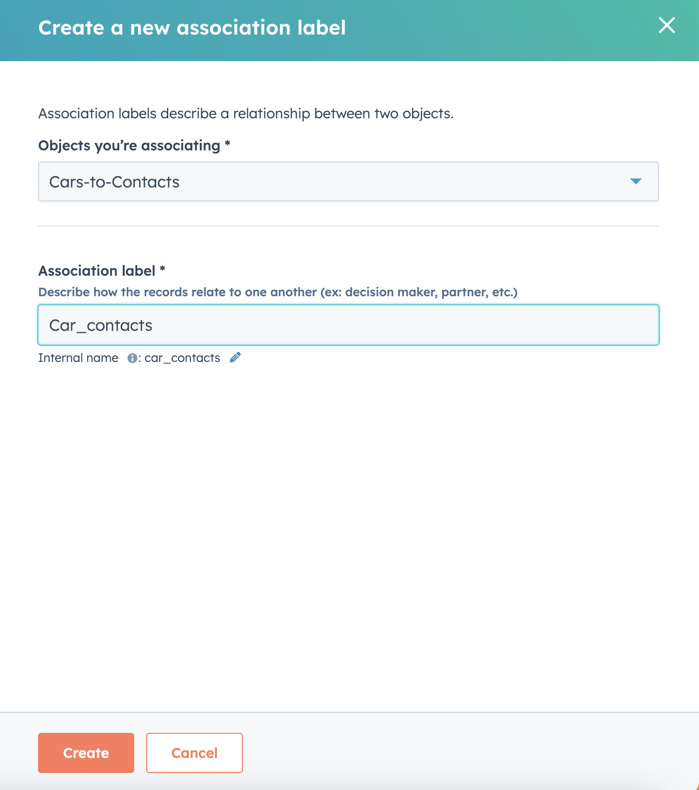



HubSpot is an all-in-one marketing tool that helps attract new leads and converts them into paying customers, with features like landing page creation and email automation.

When you use the HubSpot Cloud Mode (Actions) destination, Segment sends your data to [HubSpot's REST API](https://developers.hubspot.com/docs/api/overview){:target="_blank"}.

> warning ""
> The **Upsert Company** action is not compatible with the Mapping Tester on the mappings page if Associate Contact is set to **Yes**. As a result, Segment recommends using the Event Tester or other tools to test and troubleshoot creating and updating companies in HubSpot. Please note, for the company to contact association to work, you are required to trigger an Upsert Contact action before triggering an Upsert Company action.

## Benefits of HubSpot Cloud Mode (Actions) vs HubSpot Classic
HubSpot Cloud Mode (Actions) provides the following benefits over the classic HubSpot destination:

- **Fewer settings.** Data mapping for actions-based destinations happens during configuration, which eliminates the need for most settings.
- **Clearer mapping of data.** Actions-based destinations enable you to define the mapping between the data Segment receives from your source, and the data Segment sends to the destination.
- **Granular control over data sent.** You can customize the conditions under which the events are sent to HubSpot.
- **OAuth 2.0 support**. Authentication with HubSpot uses OAuth 2.0 instead of an API key.
- **Sandbox support**. Test with a HubSpot sandbox account before implementing in your main production account to feel confident in your configuration.
- **Support for custom behavioral events**. Send [custom behavioral events](https://developers.hubspot.com/docs/api/analytics/events){:target="_blank"} and event properties to HubSpot.
- **Create records in custom objects**. Use your Segment events to create records in any standard or custom object in your HubSpot account.

## Getting started

1. From the Segment web app, navigate to **Connections > Catalog**.
2. Search for **HubSpot Cloud Mode (Actions)** in the Destinations Catalog, and select the destination.
3. Click **Configure HubSpot Cloud Mode (Actions)**.
4. Select the source that will send data to HubSpot Cloud Mode (Actions) and follow the steps to name your destination.
5. On the **Settings** tab, authenticate with HubSpot using OAuth. Your user must be a [super admin](https://knowledge.hubspot.com/settings/hubspot-user-permissions-guide#super-admin){:target="_blank"} in the HubSpot account to authenticate the connection. Click **Connect app**.

6. Follow the steps in the Destinations Actions documentation on [Customizing mappings](/docs/connections/destinations/actions/#customize-mappings).
7. Enable the destination and configured mappings.

> info ""
> To ensure that data is sent downstream, configure and enable at least one mapping to handle a connected sources event(s).



## Association Support between two Custom Object Records in Upsert Custom Object Record
To Associate two records , it is mandatory to have **Search Fields to associate , ObjectType to associate and Association Label.** If anyone of these three fields is not configured, it will skip association.
- **ObjectType to associate.** Select custom Object Type with which you want to associate the created/updated custom object record.
- **Search Fields to associate Custom Object record.** It is for finding an unique custom object record on the basis of search properties provided in key:value format,so that records can get associated.
   - If Search association object meets more than one record and returns more than one record,Association will get failed but it will not impact on upserting a custom object record.
   - If a Record is not found on the basis of data provided here in key:value format will skip the association.
    **Ensure that you use an unique identifier to lookup an association object.**
- **Association Label.** Select an association label between both the Object Types.You can create an association between any of Object Type from Hubspot Dashboard. 
  1. Login to [HubSpot Dashboard](https://app.hubspot.com/).
  2. Go to Data Management -> Objects -> Custom Objects.

## FAQ & Troubleshooting

### How do I send other standard objects to HubSpot?
Segment provides prebuilt mappings for contacts and companies. If there are other standard objects you would like to create records in, please use the **Create Custom Object Record** action. For example, to create a deal in HubSpot, add a mapping for Create Custom Object Record, set up your Event Trigger criteria, and input a literal string of "deals" as the Object Type. You can use the Properties object to add fields that are in the [deals object](https://developers.hubspot.com/docs/api/crm/deals){:target="_blank"}, such as `dealname` and `dealstage`. The same can be done with other object types (for example, tickets, quotes, etc). Ending fields that are to go to HubSpot outside of the properties object isn't supported. This includes sending [associations](https://developers.hubspot.com/docs/api/crm/associations){:target="_blank"}.  Please note, Segment only supports creating new records in these cases; updates to existing records are only supported for contacts and companies. 

### How do I send `Page` events to HubSpot?
The [Track Page View action](/docs/connections/destinations/catalog/actions-hubspot-web/#track-page-view) is only available in [HubSpot Web (Actions) destination](/docs/connections/destinations/catalog/actions-hubspot-web/). As a workaround, with HubSpot Cloud Mode (Actions) destination, you can use the [Custom Behavioral Event](/docs/connections/destinations/catalog/actions-hubspot-cloud/#send-custom-behavioral-event) to send Page events to Hubspot. You'll need to [follow Hubspot's instructions](https://knowledge.hubspot.com/analytics-tools/create-custom-behavioral-events-with-the-code-wizard){:target="_blank"} to create a custom behavioral event for `Page Viewed` in HubSpot.

### Why aren't my custom behavioral events appearing in HubSpot?
HubSpot has several limits for custom behavioral events, including a limit on the number of event properties per event. Each event can contain data for up to 50 properties. If this limit is exceeded, the request will fail. See [HubSpot documentation](https://knowledge.hubspot.com/analytics-tools/create-custom-behavioral-events#define-the-api-call){:target="_blank"} for other limits.

> note ""
> A HubSpot Enterprise Marketing Hub account is required to send Custom Behavioral Events.

### Why can't I set an entire object for the Other properties field?

This destination doesn't allow selecting an entire object for the Other properties field. HubSpot rejects API calls if a property name doesn't match with HubSpot's internal name. When working with a large object of key/value pairs, map each key/value pair to prevent rejection. This ensures that every key matches the pre-created property names in HubSpot.

### Does the HubSpot Cloud Mode (Actions) destination support EU data residency?
Yes. HubSpot will automatically redirect API requests directly to an EU data center if your HubSpot instance is on an EU data center. See more in HubSpot's [Routing API Traffic](https://product.hubspot.com/blog/routing-api-traffic){:target="_blank"} article.

### How can I disable or delete a destination from Segment?
Follow the instructions in the docs to [disable](/docs/connections/destinations/actions/#disable-a-destination-action) or [delete](/docs/connections/destinations/actions/#delete-a-destination-action) a destination action from Segment.

### How can I uninstall an app from my HubSpot account?
Follow the steps mentioned [here](https://knowledge.hubspot.com/integrations/connect-apps-to-hubspot#uninstall-an-app){:target="_blank"} to uninstall or disconnect an app from your HubSpot account.

### How does disconnecting and uninstalling affect a user's data and HubSpot account?
Segment immediately stops sending data to HubSpot after you disconnect and uninstall a HubSpot account.
