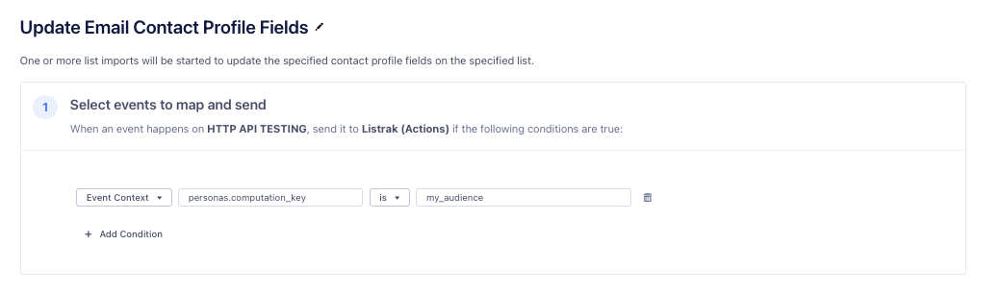
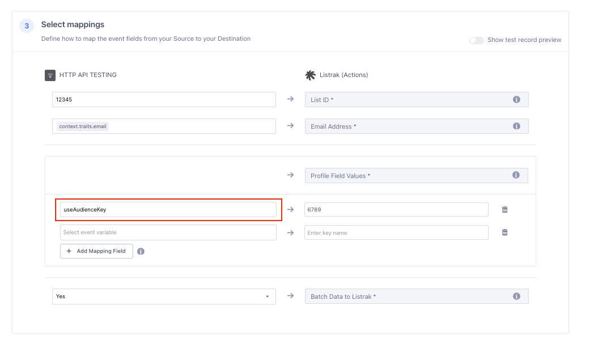
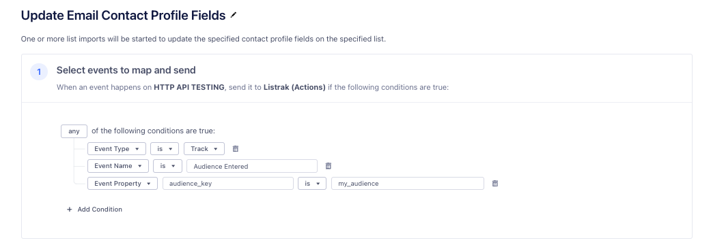
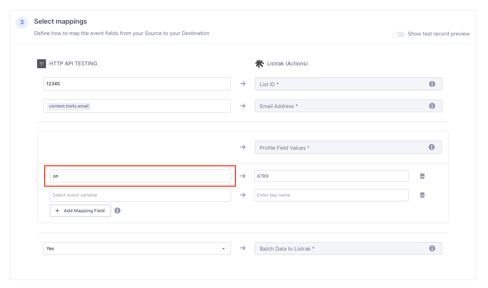



[Listrak](https://www.listrak.com/?utm_source=segmentio&utm_medium=docs&utm_campaign=partners){:target="_blank”} is the retail industry’s leading customer engagement platform. Listrak delivers results for more than 1,000 retailers by providing best-in-class email, text message marketing, identity resolution marketing and push notifications through seamless cross-channel orchestration. Listrak’s data-first approach delivers 1:1 personalization at scale so you can send messages at precisely the right time across the right combination of channels and devices to maximize customer engagement, revenue, and lifetime value.

Listrak maintains this destination. For any issues with the destination, [contact the Listrak Support team](mailto:support@listrak.com).

## Getting started

To add the Listrak Actions destination: 

1. Set up the [Listrak Source](/docs/connections/sources/catalog/cloud-apps/listrak/) first before connecting to the Listrak Actions Destination. Note the API client ID and client secret after creating the integration in Listrak.
2. From your Segment workspace, go to **Connections > Catalog** and select the **Destinations** tab.
3. Search for **Listrak (Actions)** in the Catalog and select the destination.
4. Click **Add destination**.
5. On the **Select data source** step, select your desired source. The source should not be a Listrak source. If you want to sync an Engage Audience, select the Engage space as the source. Click **Confirm Source**.
6. On the **Settings** tab, name your destination. For example, `Listrak`.
7. In the same section of the **Settings** tab, enter your Listrak API client ID and client secret.
8. Click **Save Changes**.
9. Follow the steps in the Destinations Actions documentation to [customize mappings](/docs/connections/destinations/actions/#customize-mappings) or follow the steps below to Sync an Engage Audience.

## Syncing an Engage audience to Listrak

To sync an Engage audience with Listrak (Actions), first ensure that the Engage audience only includes profiles with email addresses subscribed to the Listrak list.

For example, when you build the audience, ensure each profile includes a Custom Trait like `listrak_list_12345`, where `12345` is the List ID.

### Listrak configuration

1. In Listrak, navigate to **Contacts > Profile Fields** and click **Create Field Group**.
2. Enter a name for the Profile Field Group (like `Engage Audiences`) and click **Save**.
3. Enter a name for the audience in the **Field Name** field.
4. Select **Check Box** for the **Data Type**.
5. Click **Update**.
6. Go to **Help & Support > API ID Information** and note the List ID and Profile Field ID values. You'll use these in your Segment destination.

### Segment configuration

In Segment, open the Listrak destination you created. Navigate to the **Mappings** tab, click **New Mapping**, and select **Update Email Contact Profile Fields**.

You can configure the "Update Email Contact Profile Fields" mapping in two ways:

1. **Separate Mappings:** Create individual mappings for "Audience Entered" and "Audience Exited" events. Set the profile field to "on" for "Audience Entered" and "off" for "Audience Exited."
2. **Single Mapping:** Use one mapping with the special value `useAudienceKey` for the profile field. This will dynamically use "on" and "off" in the request made to Listrak based on the `audience_key` boolean value - `true` ("Audience Entered") activates the field, and `false` ("Audience Exited") deactivates it.

### Recommended approach: single mapping for both events

1. To use a single mapping for "Audience Entered" and "Audience Exited" events, under **Select events to map and send**, configure a condition to include events from the desired audience only. 
- Set **Event Context** `personas.computation_key` to `my_audience` (where `my_audience` is the Audience Key from the Audience settings page).

   

2. Under **Select mappings**, enter the Listrak List ID and map the email address if `context.traits.email` is not needed.
3. In the **Profile Field Values** section, enter the Listrak Profile Field ID in the `Enter Key Name` textbox on the right, and type `useAudienceKey` in the textbox on the left. 
- This configuration will activate the profile field based on the boolean value in the Audience payload: "true" activates the field for "Audience Entered," and "false" deactivates it for "Audience Exited."

   

4. Click **Save** to save the mapping.

### Alternative approach: separate mappings for each event

1. Under **Select events to map and send**, select **Track** for the **Event Type**.
2. Click **Add Condition** and add: **Event Name** is `Audience Entered`.
3. Click **Add Condition** and add: **Event Property** `audience_key` is `my_audience` (where `my_audience` is the Audience Key from the Audience settings page).

   

5. Under **Select mappings**, enter the Listrak List ID and map the email address if `context.traits.email` is not needed.
6. In the **Profile Field Values** section, enter the Listrak Profile Field ID in the `Enter Key Name` textbox on the right, and type `on` in the textbox on the left. This will activate the profile field in Listrak.

   

6. Click **Save** to save the mapping.
7. Repeat the previous steps, substituting `Audience Entered` for `Audience Exited` and `on` for `off`.

## Using Segment audience data in Listrak

To filter email sends in Listrak using the new audience profile field, refer to the [help article](https://help.listrak.com/en/articles/3951597-introduction-to-building-filter-2-0-segments){:target="_blank"}.



