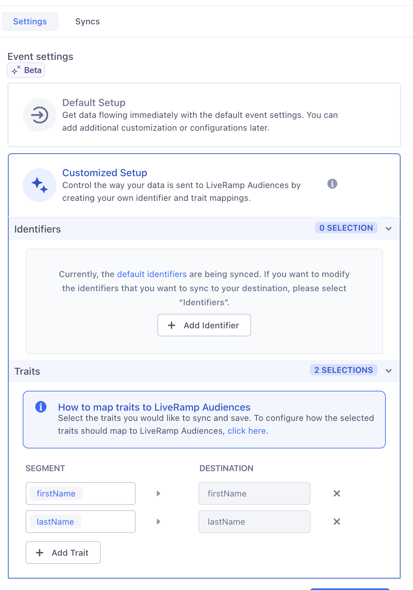
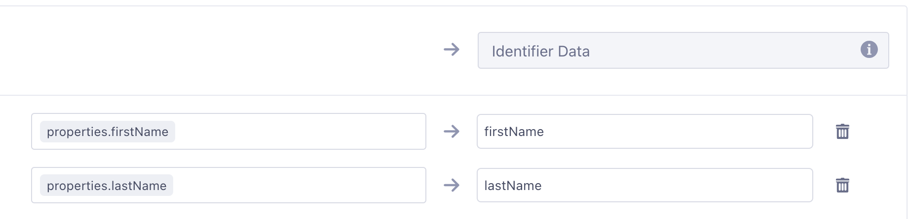

[LiveRamp](https://liveramp.com/){:target="_blank"} gives companies and their partners the power to connect, control, and activate data to transform customer experiences and generate more valuable business outcomes. Segment's integration with LiveRamp lets you push user audiences created in [Twilio Engage](https://www.twilio.com/en-us/engage){:target="_blank"} into your LiveRamp account to execute various marketing use cases.

The LiveRamp Audiences destination allows users to connect their Engage Audiences to LiveRamp through their SFTP or a customer-managed S3 cloud storage bucket. Users will be able to configure their delivery preferences within Segment.

The LiveRamp Audiences destination can be connected to **Twilio Engage sources only**. 

## Getting started

### Set up your file drop

#### SFTP

1. Contact your LiveRamp representative to gain a set of [SFTP](https://docs.liveramp.com/connect/en/upload-a-file-via-liveramp-s-sftp.html){:target="_blank"} credentials.
2. Connect to the SFTP server using the client of your choice, and create a new folder under `/uploads` with the name of your audience.

#### S3

1. Create a new S3 bucket.
2. Create a new IAM Role with `PutObject` access to the S3 bucket.
3. Create a new IAM User and assign them the role.
4. Generate a new Access Key pair for the user and note them down; you'll use it for the settings.

### Connect LiveRamp Audiences

1. Create and configure your Engage Audience.
2. Navigate to **Engage > Engage Settings > Destinations** and click **Add Destination**.
3. Select **LiveRamp Audiences**, select your Audience Space as the source, and name your destination.
4. On the **Mappings** tab, click **Add Mapping** and choose whether your will be using S3 or SFTP to upload the files. Within the mapping, configure which fields from your payload will be included in the files.
5. Enable the destination and configured mappings.
6. On the **Engage > Audiences > (your audience)** page, click **Add Destination** and select the destination just created.
7. Enable **Send Track**. Keep event names as they are.
8. File a [support case](https://docs.liveramp.com/connect/en/considerations-when-uploading-the-first-file-to-an-audience.html#creating-a-support-case){:target="_blank"} with the LiveRamp team to configure and enable ingestion.



## Public Beta instructions 

* The Segment team will need to enable the feature for your Engage spaces.
* Once you agree to join the public beta, Segment will enable all Engage spaces that are part of your Segment workspace.
* New Engage spaces you create won't automatically be enrolled. Contact your Account Team/CSM to get these spaces enrolled.

## Limitations 

* Audience must have at least 25 unique members, otherwise the destination will fail and the data will not be synced.
* Audience sync happens once per day.
* Audience sync is a full sync.
* Files are created per audience.
* After initial ingestion is complete, changing the mappings will cause the LiveRamp ingestion to start failing until ingestion setup is run again.

## Trait Enrichment 

Use Trait Enrichment to access Segment profile traits when you sync Audiences to Destinations. With Trait Enrichment, you can use custom, SQL, computed, and predictive traits to enrich the data you map to your destinations.

> info "Trait Enrichment in beta"
> Trait Enrichment is in beta, and Segment is actively working on this feature. Some functionality may change before it becomes generally available. [Contact Segment](https://segment.com/help/contact/){:target="_blank"} with any feedback or questions.

Trait Enrichment setup 

1. Confirm that **Send Track** is toggled on and select Customized Setup. Select **Add Trait**, select the traits you want to sync, and click **Save**. 

2. Update the **Identifier Data** Field in your destination **Audience Entered** Mapping (either SFTP or S3). 
- To update a trait field mapping, click on the **Select event variable** section and in the dropdown search for `properties`, followed by your trait. For example, `properties.firstName`. If no matches are found, use `properties.TRAIT` as an event variable. 

For best results with Trait Enrichment, Segment recommends the following:

- Use Trait Enrichment with new audiences.
- Use smaller audiences for real-time use cases, as data delivery is slower for large audiences. 
