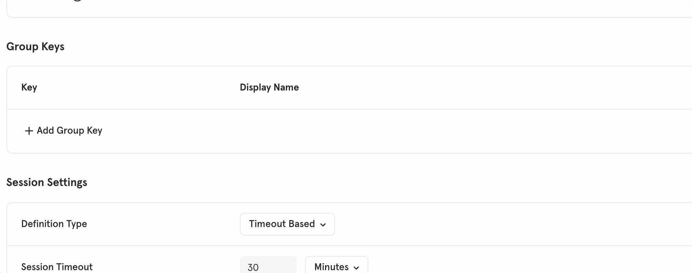




[Mixpanel](https://mixpanel.com/){:target='_blank'} enables you to build better products through powerful, self-serve product analytics to help you convert, engage, and retain more users.


## Benefits of Mixpanel (Actions) vs Mixpanel Classic

Mixpanel (Actions) provides the following benefits over the classic Mixpanel destination:
- **Simpler setup** - Mixpanel (Actions) has a streamlined default setup process making it easier to get started in a way that "just works".
- **More control** - Actions-based destinations enable you to define the mapping between the data Segment receives from your source, and the data Segment sends to the destination.
- **Additional default property mappings** - More default mappings from the Segment context like app name, app namespace, device type, and more.
- **Improved Groups support** - Implementation of [Segment Groups](/docs/connections/spec/group/) with [Mixpanel Group Analytics](https://help.mixpanel.com/hc/en-us/articles/360025333632-Group-Analytics){:target='_blank'} is easier. If you're already using Segment Groups, no code changes are required.
- **E-commerce mappings** - Mixpanel (Actions) accepts products nested within arrays in the `Order Completed` event as described in the Segment [ecommerce spec](/docs/connections/spec/ecommerce/v2/#order-completed).
- **Batching Requests** - If you have a lot of events, Mixpanel (Actions) provides more efficient way to receive and process those large sets of data.

## Getting started

1. Go to your [Mixpanel project settings](https://mixpanel.com/report/settings/#account/projects){:target='_blank'}. Copy the Mixpanel API Key and API Secret for your project.
2. From the Segment web app, click **Catalog**, then click **Destinations**.
3. Find the Destinations Actions item in the left navigation, and click it.
4. Click the "Mixpanel" item to select it and click **Configure**.
5. Choose which of your sources to connect the destination to. (You can connect more sources to the destination later.)

### Connection Modes for Mixpanel (Actions) destination

The Mixpanel (Actions) destination does not offer a device-mode connection mode. If you're using one of Segment's new libraries ([Analytics.js 2.0](/docs/connections/sources/catalog/libraries/website/javascript/), [Swift](https://github.com/segmentio/analytics-swift) or [Kotlin](https://github.com/segmentio/analytics-kotlin)) with the Actions-framework version of the destination, you do not need the device-mode connection.



When set `Generate Purchase Event Per Product` to `true`, this setting effectively "flattens" the array of objects in the `Order Completed`'s `products` property by tracking a `Product Purchased` event for each item in the array. This enables more sophisticated analysis on a per-product basis in Mixpanel. These `Product Purchased` events will contain all of the key-value pairs from their respective object in the `products` array as event properties, along with the `order_id` and `checkout_id` from the `Order Completed` event.







In the default configuration, Mixpanel (Actions) triggers this action when it receives a Group call.

> warning ""
> Group Analytics is available as an add-on package to customers on [Growth](https://mixpanel.com/pricing/){:target='_blank'} and [Enterprise](https://mixpanel.com/pricing/){:target='_blank'} plans.

This action sets or updates the properties of specific groups. Use this when you want to update properties on a [group profile](https://help.mixpanel.com/hc/en-us/articles/360025333632-Group-Analytics#group-profiles){:target='_blank'}.

The Groups model in Segment is slightly different than in Mixpanel. To explain the conceptual difference, it may help to think in terms of database tables. In Segment, there is a single "groups" table. You can have as many group rows as you want and each row has a unique identifier. When you want to set traits on that group, you only need to know the group id.

However, in Segment you cannot distinguish between "types" of groups. For example, a user can belong to a "Company" as well as a "Team". There is no way to differentiate between those in Segment. In Mixpanel, you can have multiple group types which are defined by a `group key`. To update group traits in Mixpanel you need to specify the `group key` *and* `group id`.

### Default group key
By default, the Mixpanel (Actions) destination uses `$group_id` as the group key. Create a new group in Mixpanel with `$group_id` as the group key to complete the configuration.

1. Go to your [Mixpanel project](https://mixpanel.com/report){:target='_blank'} settings
2. Scroll to the "Group Keys" section. If this section doesn't exist, you may not have the Group Analytics add-on.
3. Create the new group key:



### Using a different group key
If you already have a group set up in Mixpanel with a different group key and wish to use that one, you can specify it in the `Group Key` field of the destination configuration.

### Backwards-compatibility with Mixpanel Classic destination
In the classic destination, the "group id" specified in the Segment SDK call was ignored and you were required to set a trait where the key of the trait is the group key and the value of that trait is the group id. While that is no longer necessary, this behavior is supported in the Mixpanel (Actions) destination to ensure backwards-compatibility. *If* you specify a trait that matches specified group key, Mixpanel uses the value of that trait as the group id.

#### Scenario 1: No group key trait specified
```js
analytics.group("0e8c78ea9d97a7b8185e8632", {
  name: "Initech",
  industry: "Technology",
  employees: 329,
  plan: "enterprise",
  "total billed": 830
});
```
The group id that Mixpanel will use is `0e8c78ea9d97a7b8185e8632`.

#### Scenario 2: Group key trait IS specified
```js
analytics.group("0e8c78ea9d97a7b8185e8632", {
  $group_id: "12345",
  name: "Initech",
  industry: "Technology",
  employees: 329,
  plan: "enterprise",
  "total billed": 830
});
```
The group id that Mixpanel will use is `12345`.

> success ""
> The below special traits will be mapped to Mixpanel reserved properties automatically to fit Mixpanel's use cases. `traits.name` -> `$name`.




> success ""
> The below special traits will be mapped to Mixpanel reserved properties automatically to fit Mixpanel's use cases. `traits.created` -> `$created`, `traits.email` -> `$email`, `traits.firstName` -> `$first_name`, `traits.lastName` -> `$last_name`, `traits.name` -> `$name`, `traits.username` -> `$username` and `traits.phone` -> `$phone`.





> info "Anonymous ID format"
> [Mixpanel](https://developer.mixpanel.com/reference/create-identity#create-identity){:target="_blank"} requires that values it receives for the anonymous identifier (`anonymousId` in Segment) must be in the UUID v4 format. Analytics.js sends `anonymousId` in this format by default. If you manually send anonymous identifiers to Mixpanel, ensure they are in the correct format.

## Migration from Mixpanel Classic



Assuming you're already using Segment Cloud-mode, the Mixpanel (Actions) destination is expected to have no breaking changes when upgrading. With the exception of a few new properties added to your events in the new Actions destination, there should be no difference in the data received in Mixpanel when using either of the Mixpanel destinations.

If you want to confirm, you can configure the new destination to point to a different Mixpanel project and connect it to the same source(s) as the Classic destination and manually verify before fully switching over.

> info ""
> Contact Mixpanel support if you find features missing from the Mixpanel (Actions) destination that were available in the classic Mixpanel destination.



## Troubleshooting

### Track events are not attributed to Mixpanel Groups

Ensure that the mapping(s) handling your `track` events have the field for **Group ID** mapped to a valid value. By default, this field is mapped to the event variable `context.groupId`.

