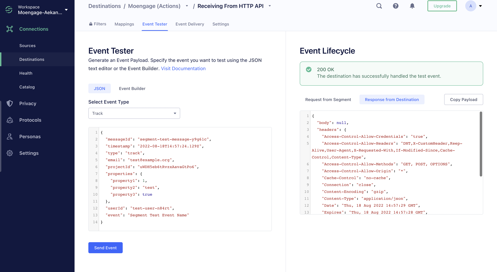

<!-- This template is meant for Actions-based destinations that represent a new version of an existing, or Classic Segment destination. For new Actions-based destinations, see the doc-template-new.md template -->

<!-- In the section above, edit the `title` field. For example, Slack (Actions) Destination -->



<!-- Include a brief description of the destination here, along with a link to your website. -->

<!-- In the section below, add your destination name where indicated. If you have a classic version of the destination, ensure that its documentation is linked as well. If you don't have a classic version of the destination, remove the second and third sentences. -->

> info ""
> This page is about the [Actions-framework](/docs/connections/destinations/actions/) MoEngage Segment destination. There's also a page about the [non-Actions MoEngage Destination](/docs/connections/destinations/catalog/moengage/). Both of these destinations receives data from Segment.

<!-- In the section below, explain the value of this actions-based destination over the classic version, if applicable. If you don't have a classic version of the destination, remove this section. -->

This destination is maintained by MoEngage. For any issues with the destination, [contact the MoEngage Support team](mailto:support@moengage.com).

## Benefits of MoEngage (Actions) vs MoEngage Classic

MoEngage (Actions) provides the following benefits over the MoEngage Classic destination:

<!-- rephrase moengage for mapping and config -->
- **Data Consistency**. Data consistency between device-mode and cloud-mode. Earlier, data sent from device and cloud-mode would sometimes be mismatched with duplicated properties - this has now been fixed.
- **Better Mapping**. Using MoEngage Actions, you can now map incompatible properties with MoEngage-compatible properties. This significantly reduces your development bandwidth.
- **Region Support**. Support across all data clusters. Moengage provides an option to choose your Data Region where your app is present.
- **Better Configuration**. There are additional configurations for the JavaScript integration like custom Service Worker.

<!-- The section below explains how to enable and configure the destination. Include any configuration steps not captured below. For example, obtaining an API key from your platform and any configuration steps required to connect to the destination. -->

## Getting started

1. From the Segment web app, click **Catalog**, then click **Destinations**.
2. Search for **MoEngage (Actions)** and select it.
3. Click **Configure MoEngage**.
4. Select an existing Source to connect to MoEngage (Actions).
5. Finish the setup.
6. Configure the settings. See the table below for more information.

    Field Name | Description |
    ---------|----------|
     Name | The name of the Moengage destination such as MoEngage prod, MoEngage test. |
     App Id | Navigate to Settings > API > General on your MoEngage dashboard to access the App ID. |
     App Key  | Navigate to Settings > API > General on your MoEngage dashboard to access the App Key. |
     Endpoint Region | This is your MoEngage data center. [Read more](https://help.moengage.com/hc/en-us/articles/360057030512-Data-Centers-in-MoEngage){:target="_blank”}. |

7. Enable the toggle option to **Enable** the destination and click **Save changes**.

<!--
Additional Context

Include additional information that you think will be useful to the user here. For information that is specific to an individual mapping, please add that as a comment so that the Segment docs team can include it in the auto-generated content for that mapping.
-->

### Default Mapping

> warning "Do not change the preset values"
> Moengage provides preset values to all mappings and hence no changes are required in the Identify User Actions, and Track Event Actions.

<!-- The line below renders a table of connection settings (if applicable), Pre-built Mappings, and available actions. -->



## Testing the integration

1. Navigate to **Connections > Destinations> MoEngage**.
2. Go to the **Event tester** tab.
2. Test your `track` and `identify` methods.

If successful, the data starts flowing into your MoEngage account in 3-5 minutes. You can log in to your MoEngage dashboard and go to Test & Debug > Recent events to verify.

<!-- If applicable, add information regarding the migration from a classic destination to an Actions-based version below -->

<!-- IG, 12/23 - The only content under this header was the "upgrade to A.js 2.0!" note, which I removed because all sources were automatically upgraded in 2/2023. Because there's nothing else under this header, I'll hide it for now.

## Migration from the classic MoEngage destination

Include any pertinent information here. -->
