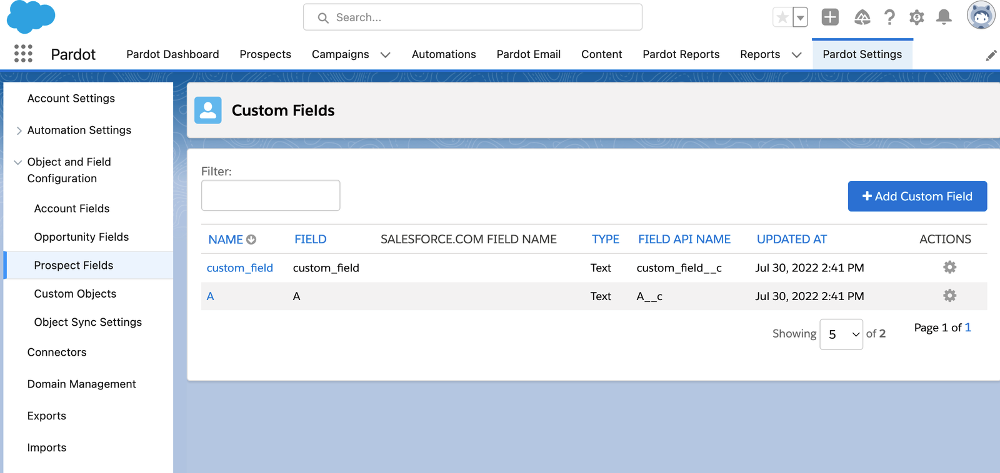
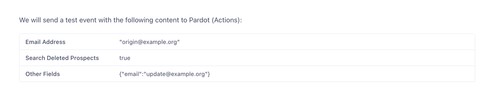



Pardot is a Salesforce marketing automation and analytics solution that lets you send automated emails to prospects and track conversions in emails and across social networks.

Segment’s Pardot (Actions) destination enables you to create and update prospects with custom traits that can be leveraged in your marketing efforts. Segment sends data to [version 5 of the Pardot API](https://developer.salesforce.com/docs/marketing/pardot/guide/version5overview.html){:target="_blank"}.

## Benefits of Pardot (Actions) Destination vs Pardot Destination Classic

The Pardot (Actions) destination provides the following benefits over the classic Pardot destination:
- **Fewer settings**. Data mapping for actions-based destinations happens during configuration, which eliminates the need for most settings.
- **Clearer mapping of data**. Actions-based destinations enable you to define the mapping between the data Segment receives from your source, and the data Segment sends to Pardot.
- **Sandbox support**. Testing with a Salesforce Pardot sandbox account before implementing in your production account enables you to feel confident in your configuration.
- **API upgrade**. Data is sent to version 5 of the Pardot API — the newest and most standardized version of the API.
- **Transparent error handling**. Triage and resolve any errors blocking delivery to Pardot with clearer error messages and steps to fix.
- **OAuth 2.0 support**. Authentication with Salesforce Pardot leverages OAuth 2.0 with an improved token refresh flow.

## Getting started

To get started using Pardot with Segment:
1. Make sure you have a Salesforce account with Pardot REST API access.
2. Navigate to `https://app.segment.com/[workspace-slug]/destinations/catalog/actions-pardot`. Replace `[workspace-slug]` with your workspace slug.
3. Click **Configure Pardot (Actions)** in the top-right corner of the screen.
4. Accept the Beta terms.
5. Select the source that will send data to Pardot (Actions) and follow the steps to name your destination.
6. On the **Settings** tab, authenticate with Salesforce Pardot using OAuth. Input the Pardot Business Unit ID associated with your Pardot Account, and click **Save**.
7. Follow the steps in the Destinations Actions documentation on [Customizing mappings](/docs/connections/destinations/actions/#customizing-mappings).
8. Enable the destination and configured mappings.



## FAQ
### When will Pardot create versus update a prospect?
In version 5 of the Pardot API, the email address is used to upsert a prospect.
- If there’s no prospect with the email address provided, a prospect is created.
- If there’s one prospect with the email address provided, that prospect is updated.
- If multiple prospects have the same email address provided, the prospect with the latest activity is updated.
Please note that Pardot treats email address as case sensitive and will create multiple prospects for casing differences.

### How do I enable a sandbox instance?
To send data to a Salesforce Pardot sandbox instance, navigate to **Settings** and toggle on the “Sandbox Instance” setting. If you have not set up OAuth yet, connect with your sandbox username. If you are already authenticated, please disconnect and reconnect with your sandbox username. Update your Pardot Business Unit ID with the ID corresponding to your sandbox account and click **Save**.

Your sandbox username appends the sandbox name to your Salesforce production username. For example, if a username for a production org is `user@acme.com` and the sandbox is named `test`, the username to log in to the sandbox is `user@acme.com.test`.

> info ""
> Data and configuration can’t be shared between sandbox and production accounts. Make sure you use the Pardot Business Unit ID corresponding to your sandbox account. Information on how to create a sandbox for Pardot can be found [here](https://help.salesforce.com/s/articleView?language=en_US&type=5&id=sf.pardot_sf_connector_sandbox.htm){:target="_blank"}.

### How do I add custom prospect fields?
Custom fields can be included in the Other Fields mapping. Custom fields must be predefined in your Pardot account and should end with `__c` (for example, `custom_field__c`). Please include the `__c` in your mapping.

You can see and add custom prospect fields in Pardot under **Pardot Settings** > **Object and Field Configuration** > **Prospect Fields**. Be sure to input the **FIELD API NAME** exactly as it appears in Pardot in your Segment mapping.

### How do I update a prospect’s email address?
With version 5 of the Pardot API, you can update a prospect’s email address using the Other Fields mapping. To update a prospect's email address:
1. Input the prospect’s current email in the Email Address mapping. This will be used to search for the corresponding prospect in Pardot.
2. Input the prospect’s new email in the **Other Fields** mapping with a field name of “email”.

In the example below, `origin@example.org` is the prospect’s current email. `update@example.org` is the prospect’s new email that will be updated in Pardot.

