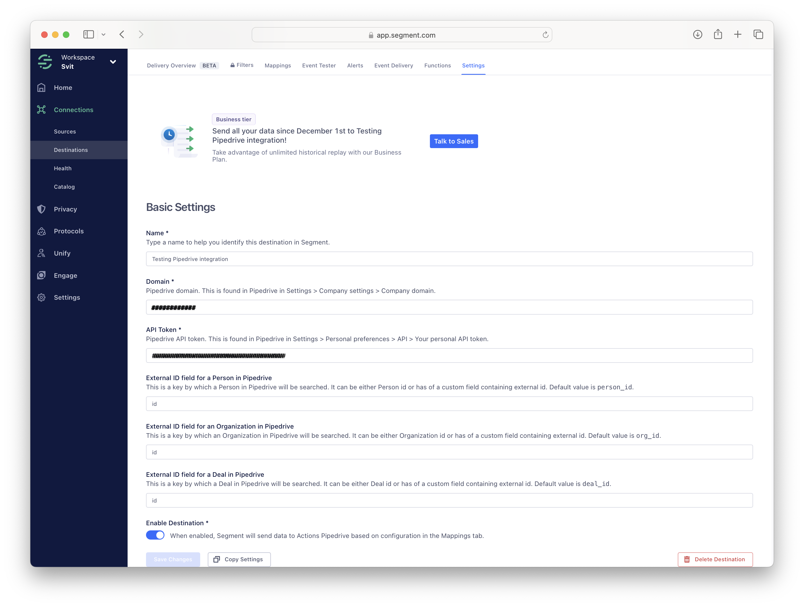
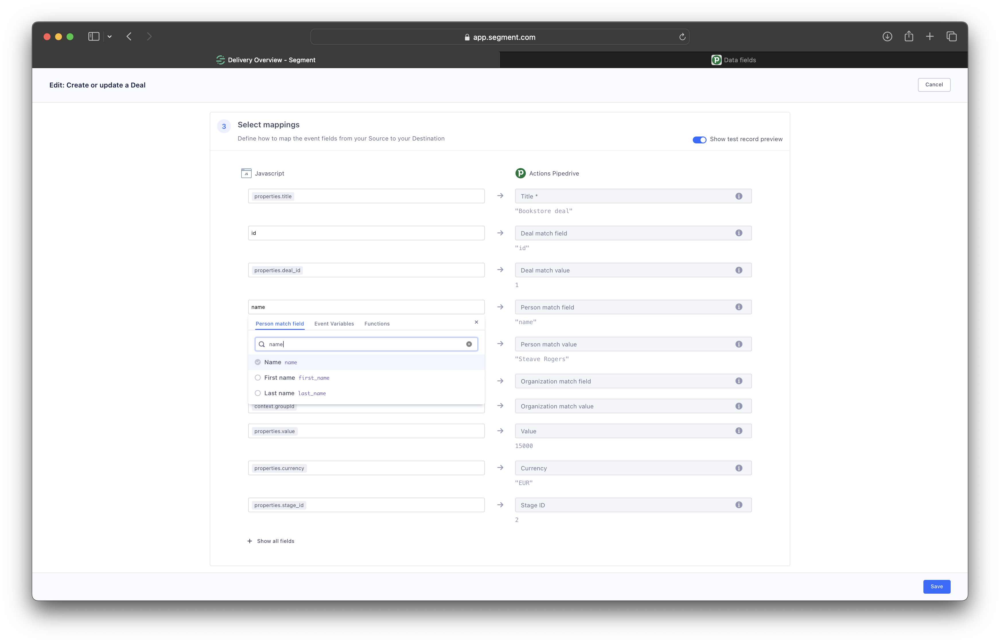
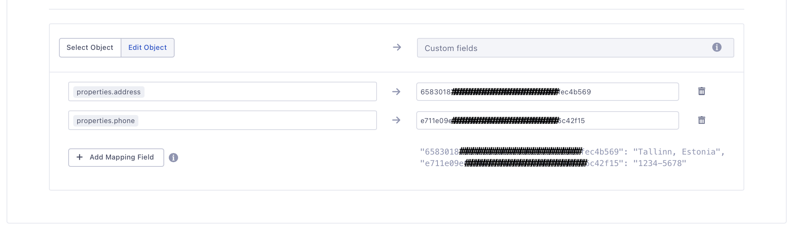



The Actions Pipedrive destination is an integration that allows customers to share events from Segment directly to Pipedrive. When you use Pipedrive with Segment, you don’t need to manually export and upload data to Pipedrive. Your customer data will remain up to date in real time and across all enabled integrations. Every tool you use to interact with leads and customers will land in Pipedrive, so you can always have a clear picture in front of you.

## Benefits of Actions Pipedrive

Actions Pipedrive provides the following benefits:

- **Clear mapping of data**.  Actions-based destinations enable you to define the mapping between the data Segment receives from your source and the data Segment sends to Pipedrive.
- **Maximum event measurement**. Capture more events with improved accuracy across different browsers, apps, and devices to get a unified view of your customer’s journey from page view to purchase.

## Getting started

1. From the Segment web app, click **Catalog**, then click **Destinations**.
2. Find the Destinations Actions item in the left navigation, and click it.
3. Click **Configure "Actions Pipedrive"**.
4. Select an existing Source to connect to "Actions Pipedrive".
5. When adding Pipedrive as a destination, you will be redirected to the action basic settings page, where you need to enter the destination name as well as Pipedrive's domain and API token.

6. Now, to enable events sending from your Source to the Pipedrive, you'll need to enable one or more of available Actions and verify that pre-defined configurations suit your needs. Select **Mapping** tab and manage available Actions.



- **Create or update a person**
- **Create or update an activity**
- **Create or update a lead**
- **Create or update a note**
- **Create or update a deal**
- **Create or update an organization**.

## Configure Action

Each Action has a pre-defined trigger event and data mapping, and we suggest You go over the Action configuration steps and make sure, that:

- trigger uses correct event type and name, and has additional conditions if needed
- data mapping uses correct event properties or maps them to correct Pipedrive entity fields

To manage Action configuration, please click the **"..."** and choose the **"Edit"** context menu item.

### How to update existing Pipedrive entity object

Actions Pipedrive provides flexible data mapping, where you can create a new Pipedrive entity object to update an existing one.

To update an existing object in the Pipedrive, you must fill the `<Entity> match field` with the Pipedrive entity field name and `<Entity> match value` with the Segment event field name. The combination of these fields values will be considered and, instead of creating a new object, the found one will be updated.

### How to update Pipedrive object custom fields values

The Pipedrive Deal, Person, and Organization actions also support updates for the Custom Fields. For that, the [Pipedrive API docs](https://developers.pipedrive.com/docs/api/v1) should be used to retrieve a list of the `/dealFields`, `/personFields` or `/organizationFields` accordingly. After you get the Pipedrive custom field unique key name, just map it with the Segment event field name.

### Supported API methods

By default, Actions Pipedrive work with the [Identify](https://segment.com/docs/connections/spec/identify/), [Track](https://segment.com/docs/connections/spec/track/) and [Group](https://segment.com/docs/connections/spec/group/) API calls, however can support all other API calls, specified in the [Segment Spec](https://segment.com/docs/connections/spec/).

#### Identify

Send Identify calls to create or update Pipedrive Person or Lead. If the Person or Lead already exists, then its properties values will be updated.

By default, Lead will be linked to the Person and Organization by the `userId` and `context.groupId` event fields accordingly.

#### Group

Send Group calls to create or update Pipedrive Organizations. If the Organization already exists, then its properties values will be updated.

#### Track

Send Track calls to create or update Pipedrive Deal, Activity, and Note.

By default, Activity can be linked to the Person, Organization, and Deal by the `userId`, `context.groupId`, and `properties.deal_id` event fields accordingly.

By default, Note can be linked to the Person, Organization, Deal, or Lead by the `userId`, `context.groupId`, `properties.deal_id`, and `properties.lead_id` event fields accordingly.

By default, Deal will be linked to the Person and Organization by the `userId` and `context.groupId` event fields accordingly.
