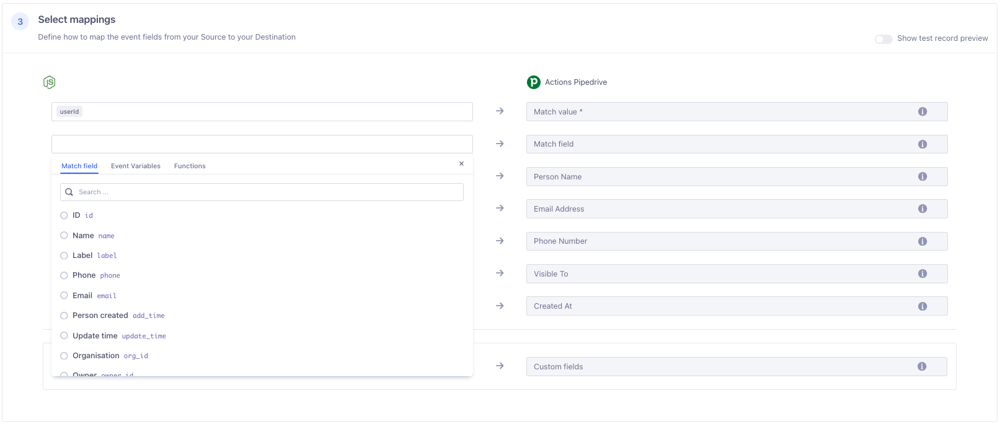



The Actions Pipedrive destination allows customers to share Segment event data with Pipedrive. Segment events sent to Pipedrive will either create new Entities or update existing Entities in Pipedrive. 

## Benefits of Actions Pipedrive

Actions Pipedrive provides the following benefits:

- **Clear mapping of data**.  Actions-based destinations enable you to define the mapping between the data Segment receives from your source and the data Segment sends to Pipedrive.
- **Maximum event measurement**. Capture more events with improved accuracy across different browsers, apps, and devices to get a unified view of your customer’s journey from page view to purchase.

## Getting started

1. Sign in to your Segment Workspace
2. Click to the **Catalog** tab. 
3. Click on the **Destinations** tab.
2. Use the search field to find the 'Pipedrive' destination. Click on the **Actions Pipedrive** tile. 
3. Click **Add Destination**.
4. Select a source to connect to and click the **Next** button.
5. Provide a name for your Pipedrive destination and click the **Create Destination** button.
6. On the Settings tab, provide values in the **Domain** and **API Token** settings fields, then click the **Save Changes** button. 
7. Navigate to the **Mappings** tab to configure how Segment events will be mapped to Pipedrive Entities. By default, mappings to upsert to Pipedrive's Person, Organization and Activity Entities will already be enabled. You can configure new Mappings by clicking on the **New Mapping** button. 
8. After you've configured and enabled your Mappings, click back to the **Settings** tab and enable the integration using the **Enable Destination** toggle. Segment should now start sending event data to Pipedrive.  

## Inserting new Entities compared to updating existing Entities

Segment uses the **Match value** field value as a key when creating or updating an Entity in Pipedrive. By default, the **Match value** will be mapped to the **id** field for the corresponding Entity. You can specify which Pipedrive field to use as a key using the **Match field** field. 

**Match field** fields are dynamic and will populate with data from your Pipedrive account. 

In the following example, Segment is configured to create or update Person entities using the email field. 

## Associating Entities with other Entities

Entities such as the **Deal** Entity can be configured to be associated with other Entities in Pipedrive. In the example with the **Deal** mapping below the following will happen: 
1. A **Person** Entity with an email address matching **properties.email** will be associated with the **Deal** Entity being created or updated. 
2. An **Organization** Entity with an ID matching **properties.org_id** will be assocated with the **Deal** Entity being created or updated.  



