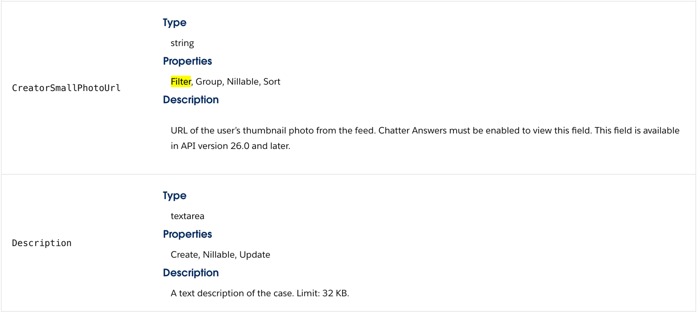
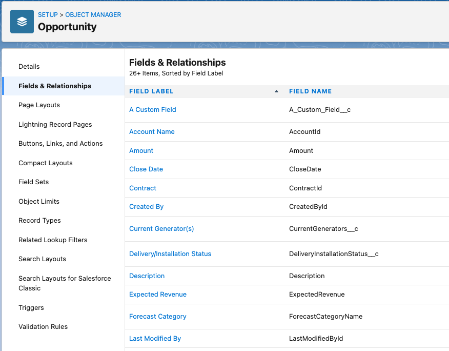

Segment’s Salesforce (Actions) destination allows you to create, update or upsert records for any object type. Segment sends data to the [Salesforce REST API](https://developer.salesforce.com/docs/atlas.en-us.api_rest.meta/api_rest/intro_rest.htm){:target="_blank"}. 

> success "Good to know"
> This page is about the [Actions-framework](/docs/connections/destinations/actions/) Salesforce destination. There's also a page about the [non-Actions Salesforce destination](/docs/connections/destinations/catalog/salesforce/). Both of these destinations receive data _from_ Segment.

## Benefits of Salesforce (Actions) Destination vs Salesforce Destination Classic

The Salesforce (Actions) destination provides the following benefits over the classic Salesforce destination:
- **Fewer settings**. Data mapping for actions-based destinations happens during configuration, which eliminates the need for most settings.
- **Clearer mapping of data**. Actions-based destinations enable you to define the mapping between the data Segment receives from your source, and the data Segment sends to Salesforce.
- **OAuth 2.0 support**. Authentication with Salesforce leverages OAuth 2.0 instead of a username/password.
- **Flexible match keys**. Upsert and update records based on any match key, including external IDs, record IDs, email and other object fields.

## Getting started

Before you connect Segment to Salesforce, please ensure you have a Salesforce account with REST API access.

1. From the Segment web app, click **Catalog**, then click **Destinations**.
2. Search for **Salesforce (Actions)** in the Destinations Catalog, and select the destination.
3. Click **Configure Salesforce (Actions)** in the top-right corner of the screen.
4. Select the source that will send data to Salesforce (Actions) and follow the steps to name your destination.
5. On the **Settings** tab, authenticate with Salesforce using OAuth.
6. Follow the steps in the Destinations Actions documentation on [Customizing mappings](/docs/connections/destinations/actions/#customizing-mappings). You must select which Event Types and/or Event Names will trigger each mapping.
7. Enable the destination and configured mappings.



## Configuration options

### Operations
When configuring a mapping, you must select the Operation that will be performed on the record. The Salesforce (Actions) destination supports the following operations:
- **Create**. Pushes new records to Salesforce. This operation is good for the following scenarios:
  - Push records into Salesforce, but don’t need data within each row to remain up to date.
  - Static data where each row is never updated, such as events.
- **Upsert**. Pushes new records to Salesforce and updates fields on existing records in Salesforce. This operation is good for the following scenarios:
  - Push records into Salesforce and keep the data up to date.
- **Update**. Updates fields on existing records in Salesforce. This operation is good for the following scenarios:
  - You have records in Salesforce that you want to add new information/fields to.
  - You want to update fields on existing records in Salesforce.

### Record Matchers
When using the `update` and `upsert` operations, you must specify the match key(s) that will be used to query Salesforce for the record. You can do this within the Record Matchers object. Any field can be used as a record matcher, including:
- **External IDs**. To map an External ID, the Salesforce API name should have `__c` appended to it.
- **Record IDs**. To map a Record ID, the Salesforce API name is `Id`.
- **Standard fields**. To map a standard field, the Salesforce API name should match what is in Salesforce for the given field, for example `Email`.
- **Custom fields**. To map a custom field, the field needs to be predefined in Salesforce and the Salesforce API name should have `__c` appended to it. 

If multiple fields are provided in the Record Matchers object, Segment uses an "OR" operator to query Salesforce for a record. If multiple records are returned upon query, no updates will be made. Segment will instead record a 300 error status for the request, and the request will not be retried. **Please use fields that result in unique records**.

Please note Salesforce only allows querying on fields that have the "Filter" property. For example, we cannot query on the Case `Description` because it is not a filterable property. You can lookup the standard field properties in [Salesforce’s API documentation](https://developer.salesforce.com/docs/atlas.en-us.api_rest.meta/api_rest/intro_rest.htm){:target="_blank"} to determine if a field is available for querying.

## FAQ

### How do I enable a sandbox instance?
To send data to a Salesforce sandbox instance, navigate to **Settings > Advanced Settings**, toggle on the "Sandbox Instance" setting, and authenticate. If you are already authenticated, please disconnect and reconnect with your sandbox username. 

Your Salesforce sandbox username appends the sandbox name to your Salesforce production username. For example, if a username for a production org is `user@acme.com` and the sandbox is named `test`, the username to log in to the sandbox is `user@acme.com.test`.

### How do I add custom fields?
Custom fields can be included in the Other Fields mapping. Custom fields must be predefined in your Salesforce account and should end with `__c` (i.e. `My_Custom_Field__c`). Please include the `__c` in your mapping.

You can see Salesforce API names in Salesforce under **Setup > Objects and Fields > Object Manager > Select your object > Fields & Relationships > FIELD NAME**.

See Salesforce's [Create Custom Fields](https://help.salesforce.com/s/articleView?language=en_US&type=5&id=sf.adding_fields.htm){:target="_blank"} for more information on custom fields.

### How do I associate a Contact with an Account?
The only way to associate a Contact with an Account is to include the `AccountId` on the Contact record. The `AccountId` is a Salesforce-generated ID assigned to the account during creation (i.e. `0018c00002CDThnAAH`). Salesforce only accepts a single `AccountId` as the Contact’s primary account; you cannot pass an array of IDs.

> info ""
> The `AccountId` is different than the `AccountNumber` and `AccountName`. The `AccountId` is auto-generated, whereas the `AccountNumber` and `AccountName` are chosen by you.

### How do I send data for Person Accounts?
A [Person Account](https://developer.salesforce.com/docs/atlas.en-us.api.meta/api/sforce_api_guidelines_personaccounts.htm){:target="_blank"} is a special type of account that represents an individual rather than a business. The requirements for Person Account records differ from what Segment’s standard Account action supports. For example, `Name` is required for Accounts, whereas `LastName` is required for Person Accounts. To send data for Person Accounts, you must use the Custom Object action. Hardcode the Salesforce Object to `Account` and define other standard and custom fields, such as `LastName` and `FirstName`, in the Other Fields mapping.

Person Accounts are not enabled by default, and the solution above will only work if you have Person Accounts enabled. If you do not have Person Accounts enabled, please use the standard Account action.

### How many API calls does Segment make to Salesforce?
- For `update` and `upsert`, the query request used to determine whether the record already exists in Salesforce counts as one API call. A second API call is used to update or create that record.
- For `create`, no query is executed so one API call is used to create the record.

### Can I send data to the Salesforce Bulk API 2.0?
Segment is in the process of adding support for the Bulk API to help reduce API calls made to Salesforce. This is not yet available.