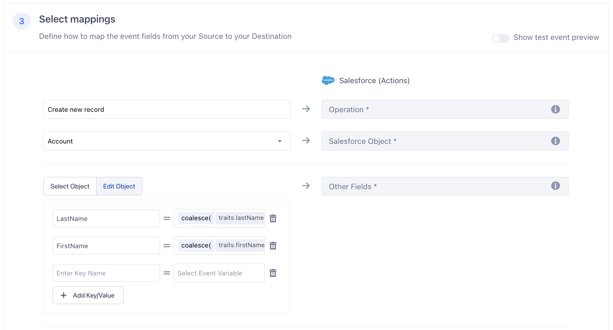
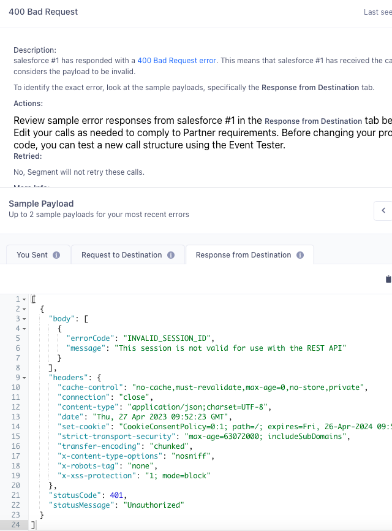



Segment’s Salesforce (Actions) destination allows you to create, update or upsert records for any object type. Segment sends data to the [Salesforce REST API](https://developer.salesforce.com/docs/atlas.en-us.api_rest.meta/api_rest/intro_rest.htm){:target="_blank"}. 

## Benefits of Salesforce (Actions) Destination vs Salesforce Destination Classic

The Salesforce (Actions) destination provides the following benefits over the classic Salesforce destination:
- **Fewer settings**. Data mapping for actions-based destinations happens during configuration, which eliminates the need for most settings.
- **Clearer mapping of data**. Actions-based destinations enable you to define the mapping between the data Segment receives from your source, and the data Segment sends to Salesforce.
- **OAuth 2.0 support**. Authentication with Salesforce uses OAuth 2.0 instead of a username/password.
- **Flexible match keys**. Upsert and update records based on any match key, including external IDs, record IDs, email and other object fields.
- **Batch support**. Reduce Salesforce overages and rate-limit errors by batching your Segment data to Salesforce's Bulk API 2.0.

## Getting started

Before you connect Segment to Salesforce, please ensure you have a Salesforce account with REST API access.

1. From the Segment web app, click **Catalog**, then click **Destinations**.
2. Search for **Salesforce** in the Destinations Catalog, and select the destination.
3. Click **Configure Salesforce** in the top-right corner of the screen.
4. Select the source that will send data to Salesforce, follow the steps to name your destination, and select **Actions** as the destination framework.
5. On the **Settings** tab, authenticate with Salesforce using OAuth.
6. Follow the steps in the Destinations Actions documentation on [Customizing mappings](/docs/connections/destinations/actions/#customize-mappings). You must select which Event Types and/or Event Names will trigger each mapping.
7. Enable the destination and configured mappings.

> info "Salesforce (Actions) authentication limitations"
> You must authenticate with the Salesforce (Actions) destination using OAuth. A single user can connect up to 5 Salesforce destinations, but upon connecting a 6th instance of the Salesforce (Actions) destination, Salesforce revokes the oldest destination's authorization. If the same user reauthorizes that same destination, this same behavior occurs on the next oldest destination that was authorized, and so on. To prevent this behavior, ensure that a different user with the same Salesforce permissions connects any additional Salesforce destinations.
> 
> _For additional information on these limitations, see the Salesforce [Manage OAuth-Enabled Connected Apps Access to Your Data](https://help.salesforce.com/s/articleView?id=sf.remoteaccess_request_manage.htm&type=5#:~:text=Each%20connected%20app%20allows%20five%20unique%20approvals%20per%20user.){:target="_blank”}  documentation._

## Actions v2

Segment's Actions v2 provide you with access to the following features: 
  - **Sync modes**: Control how Segment updates Salesforce by selecting a [sync mode](#sync-modes), or a strategy for updating your downstream data.
  - **Dynamic dropdowns**: When creating or updating a mapping in the Segment app, the dropdown auto-populates all of the available properties directly from Salesforce.
  - **Create and modify data**: Use Sync modes to create objects in your downstream destination without having to leave the Segment app.

> warning ""
> You might need to reauthorize your Salesforce account to use all of the features associated with Actions v2.

The following Actions support the Actions v2 functionality: 
  - [Account v2](#account-v2)
  - [Custom Object v2](#custom-object-v2)
  - [Case v2](#case-v2)
  - [Opportunity v2](#opportunity-v2)
  - [Lead v2](#lead-v2)
  - [Contact v2](#contact-v2)

### Sync modes
Sync modes allow users to define how Segment should update the data in your destination.

Available sync modes for the Salesforce (Actions) destination include: 
- **Add**: Add a new record when the specified identifier doesn't exist. If it does exist, Segment skips the record.
- **Update**: Update a record if a match with the specified identifier is found. Segment does nothing if the record doesn't exist.
- **Upsert**: If a record with the specified identifier is found, it is updated. If not, Segment creates a new record
- **Delete**: Remove the record associated with a specified identifier. Not available when using batching.



## Configuration options

### Operations
When configuring a mapping, you must select the Operation that will be performed on the record. The Salesforce (Actions) destination supports the following operations:
- **Create**. Pushes new records to Salesforce. This operation is good for the following scenarios:
  - Push records into Salesforce, but don’t need data within each row to remain up to date.
  - Static data where each row is never updated, such as events.
- **Upsert**. Pushes new records to Salesforce and updates fields on existing records in Salesforce. This operation is good for the following scenarios:
  - Push records into Salesforce and keep the data up to date.
- **Update**. Updates fields on existing records in Salesforce. This operation is good for the following scenarios:
  - You have records in Salesforce that you want to add new information/fields to.
  - You want to update fields on existing records in Salesforce.
- **Delete**. Deletes existing records in Salesforce. This operation is good for the following scenarios:
  - You have records in Salesforce that you want to remove.

### Record Matchers
When using the `delete`, `update` and `upsert` operations, you must specify the match key(s) that will be used to query Salesforce for the record. You can do this within the Record Matchers object. Any field can be used as a record matcher, including:
- **External IDs**. To map an External ID, the Salesforce API name should have `__c` appended to it.
- **Record IDs**. To map a Record ID, the Salesforce API name is `Id`.
- **Standard fields**. To map a standard field, the Salesforce API name should match what is in Salesforce for the given field, for example `Email`.
- **Custom fields**. To map a custom field, the field needs to be predefined in Salesforce and the Salesforce API name should have `__c` appended to it. 

If multiple fields are provided in the Record Matchers object, Segment uses an "OR" operator to query Salesforce for a record. If multiple records are returned upon query, no updates will be made. Segment will instead record a 300 error status for the request, and the request will not be retried. **Please use fields that result in unique records**.

Please note Salesforce only allows querying on fields that have the "Filter" property. For example, Segment doesn't query on the Case `Description` because it is not a filterable property. You can lookup the standard field properties in [Salesforce’s API documentation](https://developer.salesforce.com/docs/atlas.en-us.api_rest.meta/api_rest/intro_rest.htm){:target="_blank"} to determine if a field is available for querying.

## Migrate from Salesforce (Classic)

To migrate from Salesforce (Classic), complete the following steps before May 31, 2023:

1. Log in to your Segment workspace and review the copied settings in each new Salesforce (Actions) instance to ensure their accuracy. 
2. Authenticate Segment with Salesforce with OAuth.
3. Enable the Salesforce (Actions) destination & disable the Classic destination.

> info "Authenticate with Salesforce"
> Salesforce (Actions) requires OAuth based authentication while Salesforce Classic uses tokens and credentials. Because of this, Segment can't migrate authentication credentials. Your workspace owner must login and configure OAuth Authentication for each Salesforce (Actions) destinations that were migrated.

If you have more than one Salesforce instance connected to Segment, repeat these three steps for each instance. 

Keep the following in mind as you begin to use Salesforce (Actions):
- Salesforce (Actions) supports batching. The workspace owner can edit the enabled-batching field manually for any of the mappings. This setting is disabled by default.
- Sending Identify events to Salesforce (Classic) results in a create or update operation for Leads, and maps properties from `event.traits` Salesforce (Actions) does not support this behavior. By default, the automatic migration maps only a subset of the most used Lead properties as mentioned below. The workspace owner must map any additional Salesforce properties or Custom properties manually.

Review the tables below to see how settings from Salesforce (Classic) were migrated to Salesforce (Actions).

### Leads

| Salesforce (Actions) property | Migrated behavior                                                                                             |
| ----------------------------- | ------------------------------------------------------------------------------------------------------------- |
| Record Matchers               | Uses **Custom Lead Lookup** fields from Salesforce (Classic), if available, or **Email** as a fallback value. |
| Name                          | Appears within the **Other Fields** property, defaults to `traits.name`.                                      |
| Phone                         | Appears within the **Other Fields** property, defaults to `coalesce(traits.phone, traits.phoneNumber)`.       |
| Title                         | Appears within the **Other Fields** property, defaults to `coalesce(traits.address.title, traits.position)`.  |
| Website                       | Appears within the **Other Fields** property, defaults to `traits.website`.                                   |
| Description                   | Appears within the **Other Fields** property, defaults to `traits.description`.                               |
| Lead Source                   | Appears within the **Other Fields** property, defaults to `traits.leadSource`.                                |

### Account

| Salesforce (Actions) property | Migrated behavior                                                                                             |
| ----------------------------- | ------------------------------------------------------------------------------------------------------------- |
| Billing Street | Created only if the **Send Address as Billing Address** property is set in Salesforce (Classic). Defaults to `coalesce(traits.address.street, traits.street)`. |
| Billing City | Created only if the **Send Address as Billing Address** property is set in Salesforce (Classic). Defaults to `coalesce(traits.address.city, traits.city)`. |
| Billing State | Created only if the **Send Address as Billing Address** property is set in Salesforce (Classic). Defaults to `coalesce(traits.address.state, traits.state)`. |
| Billing Country | Created only if the **Send Address as Billing Address** property is set in Salesforce (Classic). Defaults to `coalesce(traits.address.country, traits.country)`. |
| Billing Postal Code | Created only if the **Send Address as Billing Address** property is set in Salesforce (Classic). Defaults to `coalesce(traits.address.postalCode, traits.postalCode)`. |
| Shipping Street | Created only if the **Send Address as Shipping Address** property is set in Salesforce (Classic). Defaults to `coalesce(traits.address.street, traits.street)`. |
| Shipping City | Created only if the **Send Address as Shipping Address** property is set in Salesforce (Classic). Defaults to `coalesce(traits.address.city, traits.city)`. |
| Shipping State | Created only if the **Send Address as Shipping Address** property is set in Salesforce (Classic). Defaults to `coalesce(traits.address.state, traits.state)`. |
| Shipping Country | Created only if the **Send Address as Shipping Address** property is set in Salesforce (Classic). Defaults to `coalesce(traits.address.country, traits.country)`. |
| Shipping Postal Code | Created only if the **Send Address as Shipping Address** property is set in Salesforce (Classic). Defaults to `coalesce(traits.address.postalCode, traits.postalCode)`. |

## FAQ

### How do I enable a sandbox instance?
To send data to a Salesforce sandbox instance, navigate to **Settings > Advanced Settings**, toggle on the "Sandbox Instance" setting, save the setting and then authenticate. If you are already authenticated, please disconnect and reconnect with your sandbox username. 

Your Salesforce sandbox username appends the sandbox name to your Salesforce production username. For example, if a username for a production org is `user@acme.com` and the sandbox is named `test`, the username to log in to the sandbox is `user@acme.com.test`.

### How do I add custom fields?
Custom fields can be included in the Other Fields mapping. Custom fields must be predefined in your Salesforce account and should end with `__c` (for example, `My_Custom_Field__c`). Please include the `__c` in your mapping.

You can see Salesforce API names in Salesforce under **Setup > Objects and Fields > Object Manager > Select your object > Fields & Relationships > FIELD NAME**.

See Salesforce's [Create Custom Fields](https://help.salesforce.com/s/articleView?language=en_US&type=5&id=sf.adding_fields.htm){:target="_blank"} for more information on custom fields.

### How do I associate a Contact with an Account?
The only way to associate a Contact with an Account is to include the `AccountId` on the Contact record. The `AccountId` is a Salesforce-generated ID assigned to the account during creation (i.e. `0018c00002CDThnAAH`). Salesforce only accepts a single `AccountId` as the Contact’s primary account; you cannot pass an array of IDs.

> info ""
> The `AccountId` is different than the `AccountNumber` and `AccountName`. The `AccountId` is auto-generated, whereas the `AccountNumber` and `AccountName` are chosen by you.

### How do I send data for Person Accounts?
A [Person Account](https://developer.salesforce.com/docs/atlas.en-us.api.meta/api/sforce_api_guidelines_personaccounts.htm){:target="_blank"} is a special type of account that represents an individual rather than a business. The requirements for Person Account records differ from what Segment’s standard Account action supports. For example, `Name` is required for Accounts, whereas `LastName` is required for Person Accounts. To send data for Person Accounts, you must use the Custom Object action. Hard code the Salesforce Object to `Account` and define other standard and custom fields, such as `LastName` and `FirstName`, in the Other Fields mapping.

Person Accounts are not enabled by default, and the solution above will only work if you have Person Accounts enabled. If you do not have Person Accounts enabled, please use the standard Account action.

### How many API calls does Segment make to Salesforce?
- For `update` and `upsert`, the query request used to determine whether the record already exists in Salesforce counts as one API call. A second API call is used to update or create that record.
- For `create`, no query is executed so one API call is used to create the record.

To check how many API calls you have left in Salesforce, go to **Setup > Company Settings > Company Information**, and you’ll find a field labeled: `API Requests, Last 24 Hours`.

### Why do I see duplicate records in Salesforce?
When using the `create` operation, it's possible for duplicate records to be created in Salesforce. This is because Segment retries records once they hit the internal timeout. It's possible Salesforce's REST API eventually processes the original record in addition to the retried record, resulting in duplicates. You may encounter this behavior if Salesforce's REST API throttles your records (for example, due to hitting API limits or complex workflow automation). To prevent duplicates, you can use [Duplicate Rules](https://help.salesforce.com/s/articleView?id=duplicate_rules_map_of_reference.htm&language=en_US){:target="_blank"} in Salesforce. See set up information in [Resolve and Prevent Duplicate Data in Salesforce](https://trailhead.salesforce.com/content/learn/modules/sales_admin_duplicate_management/sales_admin_duplicate_management_unit_2){:target="_blank"}.

Please note this is only a concern when using the `create` operation. You can use the `upsert` operation instead to avoid duplicates if `upsert` meets your needs.

### Why do I see "undefined traits" error?
This error happens when you use the `update` operation, but no value is provided for the field defined as the Record Matcher. To fix this, make sure your payload includes a value for the Record Matcher field.

### How does Salesforce Bulk API work?
When **Use Salesforce Bulk API** is enabled for your mapping, events are sent to [Salesforce’s Bulk API 2.0](https://developer.salesforce.com/docs/atlas.en-us.api_asynch.meta/api_asynch/asynch_api_intro.htm){:target="_blank"} rather than their streaming REST API. If enabled, Segment will collect events into batches of up to 5000 before sending to Salesforce. Bulk support can be used for the `upsert` or `update` operations only.

> info ""
> To monitor Bulk API uploads in Salesforce, search for 'Bulk Data Load Jobs' in the Quick Find box, then select **Bulk Data Load Jobs**. This will redirect you to the [Bulk Data Load Jobs](https://help.salesforce.com/s/articleView?id=sf.monitoring_async_api_jobs.htm&type=5) page (Environment > Jobs > Bulk Data Load Jobs), where you can view the progress of current jobs, along with success and error messages for recent Bulk V2 operations.

For bulk `update`, if a record in a batch is missing a Bulk Update Record ID, Segment will still send it to Salesforce. Salesforce will reject the individual record because it will be unable to find a record to update. Other records in the batch that are valid will still be processed. Please note that Segment's Event Delivery tab will show the entire batch as successful as Segment cannot currently break down Event Delivery stats into individual failed/passed events.

### Which fields are supposed to map to Salesforce’s required fields for "Bulk Update Record ID" and "Bulk Upsert External ID"?

For "Bulk Update Record ID", see [Salesforce’s help documentation](https://help.salesforce.com/s/articleView?id=000385008&type=1){:target="_blank"}.
For "Bulk Upsert External ID", see [Salesforce’s help documentation](https://help.salesforce.com/s/articleView?id=000383278&type=1){:target="_blank"}.

> warning ""
> The field mapped to Bulk Upsert External Id should **not** be included in the Other Fields mapping. Including it as a custom field will cause an error in Salesforce. Although the Bulk API may return successful responses, the [Bulk Data Load Jobs](https://help.salesforce.com/s/articleView?id=sf.monitoring_async_api_jobs.htm&type=5) page in Salesforce will display error messages for failed operations.

### How to identify and recitfy Salesforce (Actions) destination's event delivery issue, when it is caused by expired Oauth token?

You often see an "INVALID_SESSION_ID" error message in a **400 Bad Request** sample response in our UI, where the message is expected and it doesn't affect the actual event delivery. However, there are also occasions that it is the actual error message and the event delivery is impacted. 

The reason is that each email address can only be used to authenticate 4 Salesforce (Actions) destinations at the same time, which is related to Segment's current implemented OAuth 2.0 flow. See [Salesforce’s help documentation](hhttps://help.salesforce.com/s/articleView?id=sf.remoteaccess_request_manage.htm&type=5){:target="_blank"} for more details. 

To resolve the issue, please consider spliting the destinations with multiple email addresses. 

For reference, you will find the below screeshot in a **400 Bad Request** response without any additional error message. In which case, your destination is potentially impacted by the limit. 

