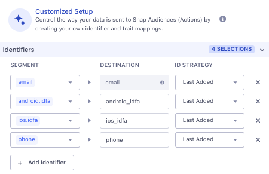
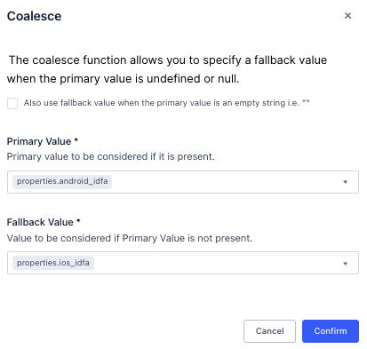



[Snap Ads](https://forbusiness.snapchat.com/advertising/targeting/?utm_source=segmentio&utm_medium=docs&utm_campaign=partners){:target="_blank"} provides a way to target advertisements to a global audience and drive meaningful results.

This destination is maintained by Segment. For any issues with the destination, [contact the Segment Support team](mailto:friends@segment.com).

> **Good to know**: This page is about the [Actions-framework](/docs/connections/destinations/actions/) Snap Ads Segment destination. There's also a page about the [non-Actions Snap Ads destination](/docs/connections/destinations/catalog/snapchat-audiences/). Both of these destinations receives data from Segment.

## Benefits of <destination_name> (Actions) vs <destination_name> Classic

Snap Audiences (Actions) provides the following benefits over the classic Snapchat Audience destination:

- **Multiple concurrent identifiers**. Email, phone number and Mobile Advertising IDs are supported concurrently. There's no need to select only one type of user identifier to sync with. 

- **Improved match rates**. Improved match-rate when multiple identifiers per profile are synced. 

## Getting started

### Create the Destination and authenticate to Snap Ads
1. In your Segment workspace, click Engage in the left navigation bar, and select your Space.
2. Click **Engage Settings** and select the **Destinations** tab.
3. Click **Add Destination**.
4. Search for `Snap Audiences (Actions) ` and click **Configure**.
5. On the Snapchat Audiences configuration screen, click **Connect to Snap Audiences (Actions)**. Log in to Snapchat with an account that has access to Ads Manager. Once authenticated, confirm the connection to Segment.
6. Select the Snap Ads account that will receive audience data. This account represents an advertising entity or business, and not your personal Snapchat user account. You may belong to several Ad Accounts; make sure to select the correct account here. After the Ad Account is specified, the destination is active.

### Create the Mapping
7. In Segment, click on **Connections** then **Destinations**, then find the Snap Audiences (Actions) Destinations you just created. 
8. Click on the **Mappings** tab, then **New Mapping**, then the **Sync Audience** Action. There should be no need to edit any of the Mapping fields, so click the **Next** button. Give the Action a name, then click **Save and Enable**.

### Connect and sync your Audience
Next, you will add the Snapchat Audiences Destination to an existing Engage Audience.

9. Navigate to **Engage** then to **Audiences**. Find and click on the Audience you'd like to sync. 
10. Click **Add Destination**.
11. The configured Snap Audiences (Actions) destination should appear in the *Send as User List* category of available destinations
12. Provide values in the **Audience Name** and **Audience Description** fields. 
13. Ensure that **track** is selected under **Connection Settings**. You can ignore the **Send Mobile IDs** as you can configure Mobile Advertising IDs in the next step. 
14. Click on **Customized Setup** and add the identifiers you'd like to sync with. These should include one or more of: `email`, `phone`, `android.idfa`, `ios.idfa`. If you choose to sync `android.idfa` and/or `ios.idfa`, you must update the destination mappings to use underscores: `android_idfa` and `ios_idfa`. 

15. Click **Save** then **Add 1 Destination**. 

Your Audience should now be configured to sync to Snap Ads. The initial synchronization of audience data may take several hours, depending on the size of the audience. Once the initial sync occurs, you'll notice a new Audience in the Snap Ads dashboard.



## FAQ

### Which identifiers types are supported?

The Snap Audience (Actions) destination supports syncing using `email`, `phone` number and `Mobile Advertising IDs`. `email` is the default identifier; other identifiers should be configured using [ID Sync](https://segment.com/docs/engage/trait-activation/id-sync/). 

### Mobile Advertising IDs aren't syncing properly

Mobile Advertising IDs need to be correctly configured using [ID Sync](https://segment.com/docs/engage/trait-activation/id-sync/), as per the image below. Note the underscores for `android_idfa` and `ios_idfa`. 

The field mapping for the **Mobile Advertising ID** field must also be correct. By default it will be configured as follows when the Mapping is created. 

. Again, note the underscores for `android_idfa` and `ios_idfa`. 

### Why can't I select our Ads Account during the destination setup?

Ensure the following criteria are met:

- Your personal Snapchat login has appropriate permissions within your business. Snapchat Account Admin or Data Manager permissions are required to configure and add audiences.
- Your Snap Ads account is in `Active` status.

### How do I view the sync status?

Status will be shown in the Event Delivery tool. When you view the audience, you can open the side bar which directs you  to [Event Delivery](/docs/getting-started/06-testing-debugging/#event-delivery).
