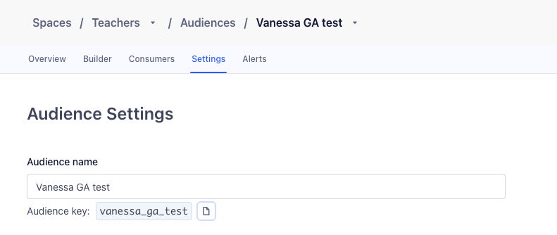



[StackAdapt](https://www.stackadapt.com/){:target="_blank"} is a programmatic advertising platform specializing in audience engagement. StackAdapt lets marketers deliver high-performing advertising campaigns across channels through real-time bidding, detailed audience targeting, and data-driven insights. StackAdapt’s integration with [Engage](/docs/engage/) helps you sync user data to optimize targeting and improve your campaign outcomes.

This destination is maintained by StackAdapt. For any issues with the destination, submit a ticket to [StackAdapt's support team](https://support.stackadapt.com/hc/en-us/requests/new?ticket_form_id=360006572593){:target="_blank"}.

## Getting started

> info "Getting your StackAdapt GraphQL token"
> If you do not have an existing StackAdapt read & write API key, contact the [StackAdapt team](https://support.stackadapt.com/hc/en-us/requests/new?ticket_form_id=360006572593){:target="_blank"}.

### Setting up the StackAdapt Audiences destination in Engage

1. In your Segment workspace, navigate to **Connections > Catalog > Destinations**.
2. Search for and select "StackAdapt Audiences".
3. Click **Add Destination**.
4. Select an existing Engage space source to connect to the StackAdapt Audience destination.
5. Enter a name for your destination.
6. On the Settings screen, provide your StackAdapt GraphQL API token. Then, select the advertiser you want to sync the audience with. You can identify an advertiser by [finding its ID in StackAdapt](#finding-the-advertiser-id-in-stackadapt).
7. Toggle the destination on using **Enable Destination**.
8. Click **Save Changes**.
9. Follow the Destinations Actions documentation to [customize mappings](/docs/connections/destinations/actions/#customize-mappings) or [sync an Engage Audience](#sync-an-engage-audience).
10. Enable the destination and click **Save Changes**.

#### Finding the advertiser ID in StackAdapt
In the StackAdapt, go to **Execute** (or **Overview**) and click **Advertiser**.
From the **Filter** section, select the advertiser. The advertiser ID appears in the URL after `advertiser=`.

### Sync an Engage Audience

To sync an Engage audience with StackAdapt:

1. Each Engage audience should only contain profiles that have a valid email address. Profiles missing an email address are not valid on StackAdapt's platform.
2. Add a condition to the Engage audience to ensure the required email trait is included.
3. Open the previously created StackAdapt Audience destination.
4. Create a mapping: In the mappings tab, click **New Mapping** and select **Forward Audience Event**.
5. Define the event trigger: Click **Add Condition** and add this condition: **Event Type is `Track` or `Identify`**.

To verify that your audience syncs with StackAdapt, open StackAdapt and navigate to **Audience & Attribution > Customer Data > Profiles**. On the Profiles tab, you should be able to see a list of profiles being synced to StackAdapt platform.

> info "Syncs can take up to 4 hours"
> It can take up to 4 hours from the time you initiate a sync for profiles to show up in StackAdapt.

To create a StackAdapt audience from your Engage audience:

1. Open StackAdapt and navigate to **Audience & Attribution > Data Data > Segments**, then click **Create Segment**.
2. Select the advertiser you have synced your audience to.
3. Choose **Profile Properties** > **Segment** and select **External Audience Name** as the rule.
4. Select a condition and put in the audience name as the filter.
5. Click **Submit** to create the segment.

> info "Audience name format"
> Use the *snake_case* name of the Segment Engage audience which can be found in **Settings**, shown in the following screenshot.

### Sending an audience to StackAdapt

1. In Segment, go to **Engage > Audiences** and select the audience to sync with StackAdapt.
2. Click **Add Destination** and select **StackAdapt Audiences**.
3. Toggle **Send Track** and **Send Identify** on.
4. Click **Save**.

## Data and privacy

Review [StackAdapt's Data Processing Agreement](https://www.stackadapt.com/data-processing-agreement){:target="_blank"} to learn more about StackAdapt's privacy and data terms.
