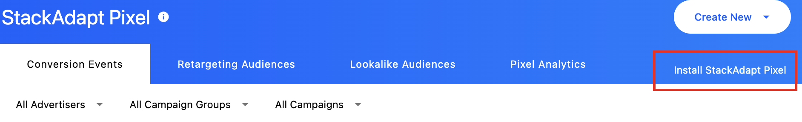
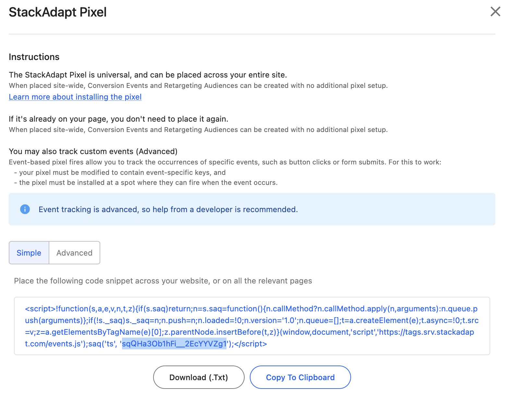
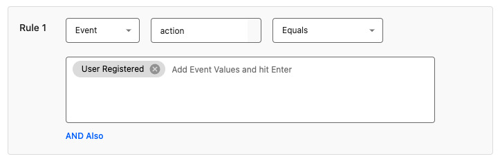
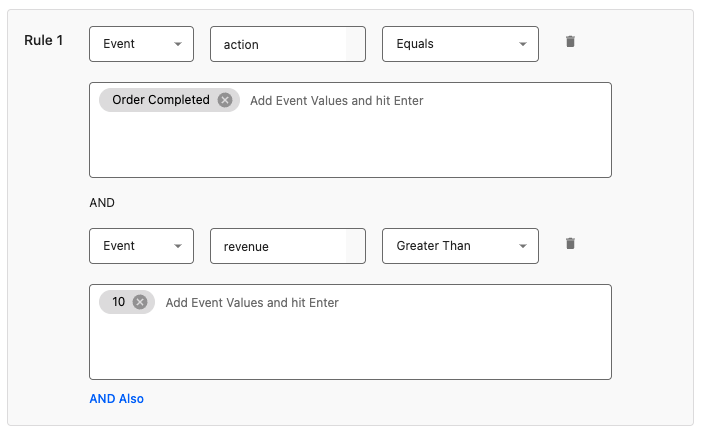
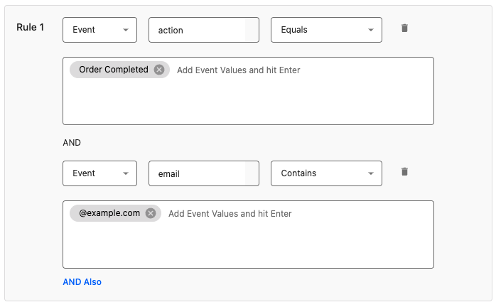
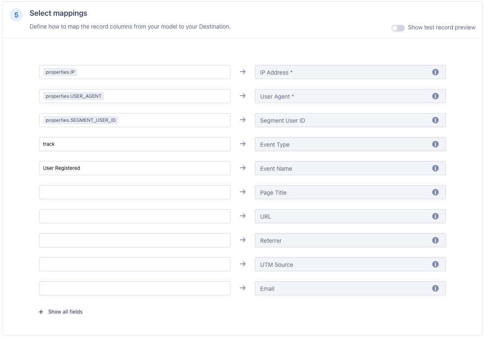



By setting up StackAdapt as a Segment destination, your Segment events will be forwarded to [StackAdapt](https://www.stackadapt.com/){:target="\_blank"}. This allows you to generate retargeting and lookalike audiences, track conversions, and measure return on ad spend using your Segment events - bypassing the need to install the StackAdapt pixel on your website and write code to send events to StackAdapt.

This destination is maintained by StackAdapt. For any issues with the destination, please [submit a ticket to StackAdapt's support team](https://support.stackadapt.com/hc/en-us/requests/new?ticket_form_id=360006572593){:target="\_blank"}.

## Getting started

### Getting your StackAdapt Universal Pixel ID

1. Log in to your StackAdapt account and navigate to the Pixels page.
2. Above the list of pixels, click **Install StackAdapt Pixel**.

   

3. In the instructions that appear, copy the universal pixel ID from the code snippet. Below is an example of a code snippet where the universal pixel ID is `sqQHa3Ob1hFi__2EcYYVZg1`.



### Setting up the StackAdapt destination in Segment

1. From the Segment web app, navigate to **Connections > Catalog > Destinations**.
2. Search for and select the "StackAdapt" destination.
3. Click **Add Destination**.
4. Select an existing source to connect to the StackAdapt destination.
5. Give the destination a name.
6. On the Settings screen, provide your StackAdapt Universal Pixel ID. This can be found on the Pixels page in StackAdapt as described above.
7. Toggle on the destination using the **Enable Destination** toggle.
8. Click **Save Change**.

### StackAdapt Pixel setup

Segment events that are forwarded to StackAdapt can be used to track ad conversions, and to generate retargeting and lookalike audiences. Please review the StackAdapt documentation for the general setup of these if you are not already familiar:

- [Creating Conversion Events](https://support.stackadapt.com/hc/en-us/articles/360005859214-Creating-Conversion-Events){:target="\_blank"}
- [Creating Retargeting Audiences](https://support.stackadapt.com/hc/en-us/articles/360005939153-Creating-Retargeting-Audiences){:target="\_blank"}
- [How to Generate and Target a Lookalike Audience](https://support.stackadapt.com/hc/en-us/articles/360023738733-How-to-Generate-and-Target-a-Lookalike-Audience){:target="\_blank"}

Setup of conversion events, retargeting audiences, and lookalike audiences that fire on Segment events is largely the same as the setup in the StackAdapt documentation, with a few caveats:

1. You **must** select "Universal Pixel" as the pixel type. This is because the StackAdapt destination in Segment uses your Universal Pixel ID to send events to StackAdapt.
2. There is no need to install the StackAdapt pixel on your website as instructed in the "Installation" step, since Segment will forward events to StackAdapt that would normally be tracked by the StackAdapt pixel.
3. If you choose to set up event rules, you will need to ensure that you use the event keys supported by the the StackAdapt destination as described below.

### Event rules

The StackAdapt Segment destination sends an `action` event key which by default is mapped to the Segment event name. Creating rules on this `action` key should be sufficient for most simple event rule use cases. For example, if you fire a Segment event when a user fills out a registration form on your website and want to track this as a conversion event in StackAdapt, you can create a rule in StackAdapt that matches the `action` key with the Segment event name.

A Segment event fired with the code `analytics.track("User Registered")` can be tracked as a conversion event with an event rule that matches an `action` of `User Registered` as shown below:



#### Ecommerce events

The StackAdapt destination also supports forwarding ecommerce fields for the purpose of creating event rules that match ecommerce events, with default mappings to properties specified in the [Segment V2 Ecommerce Event Spec](/docs/connections/spec/ecommerce/v2/) as described in the below table:

| Segment Ecommerce Event Property | StackAdapt Event Key |
| -------------------------------- | -------------------- |
| `order_id`                       | `order_id`           |
| `revenue`                        | `revenue`            |
| `product_id`                     | `product_id`         |
| `category`                       | `product_category`   |
| `name`                           | `product_name`       |
| `price`                          | `product_price`      |
| `quantity`                       | `product_quantity`   |

For events that can involve multiple products, such as checkout events, StackAdapt forwards a JSON array of product objects with a `products` key and fields that map by default to following Segment product array fields:

| Segment Ecommerce Event Property | StackAdapt Product Object Key |
| -------------------------------- | ----------------------------- |
| `products.$.product_id`          | `product_id`                  |
| `products.$.category`            | `product_category`            |
| `products.$.name`                | `product_name`                |
| `products.$.price`               | `product_price`               |
| `products.$.quantity`            | `product_quantity`            |

For example, to create a conversion event when an order is completed with a revenue value greater than 10, you could set up an event rule matching an `action` value of `Order Completed` and a `revenue` value greater than 10 as shown below:



This rule would match a Segment event fired with code such as:

```javascript
analytics.track('Order Completed', {
  order_id: '50314b8e9bcf000000000000',
  revenue: 11.5
  products: [
    {
      product_id: '507f1f77bcf86cd799439011',
      name: 'Monopoly: 3rd Edition',
      price: 11.5,
      quantity: 1,
      category: 'Games'
    }
  ]
});
```

#### Trait Fields

Although trait fields are not frequently used in event rules, the StackAdapt destination forwards them and they can be used if desired.

| Segment Trait Property | StackAdapt Event Key |
| ---------------------- | -------------------- |
| `traits.email`         | `email`              |
| `traits.first_name`    | `first_name`         |
| `traits.last_name`     | `last_name`          |
| `traits.phone`         | `phone`              |

For example, to create a conversion event when a user with the domain `example.com` completes an order, you could set up an event rule matching an `action` value of `Order Completed` and an `email` containing `@example.com` as shown below:



This rule would match a Segment event fired with code such as:

```javascript
analytics.track("Order Completed", {
  order_id: "50314b8e9bcf000000000000",
  traits: {
    email: "john.smith@example.com",
    first_name: "John",
    last_name: "Smith",
    phone: "+180055501000"
  }
});
```

### URL rules

If you are using URL rules, these will be matched whenever Segment sends an event to StackAdapt with a `url` matching the URL rule. This should be accomplished by the page event Segment automatically fires when a page is viewed, so setup of URL rules should be identical to setting up URL rules with the StackAdapt pixel.

### Conversion Tracking with Backend Events

When you send events to Segment from your backend, which are forwarded to StackAdapt using Segment's backend SDKs, the user agent and IP address of the user who originated the event must be included in the event context for conversions to be tracked. StackAdapt uses the user agent and IP address to attribute the conversion to the correct event to a user who has interacted with your ads. Examples of how to do this can be found in the documentation for Segment's SDKs. For example, for the [Python SDK](/docs/connections/sources/catalog/libraries/server/python/#override-context-value) this can be done as follows:

```python
analytics.track('user_id', 'Order Completed', context={
  'ip': '203.0.113.1',
  'userAgent': 'Mozilla/5.0 (Linux; U; Android 4.1.1; en-gb; Build/KLP) AppleWebKit/534.30 (KHTML, like Gecko) Version/4.0 Safari/534.30'
})
```

This is necessary when using backend SDKs but not for events sent from the frontend with `analytics.js`, because `analytics.js` automatically includes the user-agent and IP address in the event context.

### Conversion Tracking with Reverse ETL

When sending past events to StackAdapt using a Reverse ETL tool, the user agent, IP address, event type, and either the page URL (for conversion trackers with URL rules), or the fields the event rules match on, must be included in your mappings. For example, the below mapping for a Snowflake source can be used to match a conversion tracker with an event rule that matches an `action` of `User Registered`:



Rows forwarded to StackAdapt with this mapping will be matched by the `User Registered` event rule shown below:


When forwarding past events using Reverse ETL, only users who have interacted with an ad from an associated campaign within the conversion tracker's configured view-through expiry window (for impressions) or click-through expiry window (for clicks) will count as conversions. These windows can be set to up to 180 days in the conversion tracker configuration.



## Data and privacy

Review [StackAdapt's Data Processing Agreement](https://www.stackadapt.com/data-processing-agreement){:target="\_blank"} to learn more about StackAdapt's privacy and data terms.
