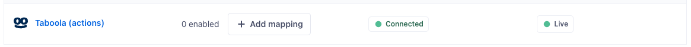



[Taboola](https://developers.taboola.com/backstage-api/reference/create-a-first-party-audience/?utm_source=segmentio&utm_medium=docs&utm_campaign=partners){:target="_blank”} integration allows you to connect and target your Segment audiences with Taboola.

This destination is maintained by Taboola. For any issues with the destination, contact their [Support team](mailto:support@taboola.com) or your account manager.

## Getting started

### Get Taboola Account Details

Before connecting the **Taboola (Actions)** destination you'll need the following:
1. Your Taboola **Client ID** and **Client Secret** - provided by your Taboola account manager.
2. **Account ID**: retrieve using one of these options:
   * [Taboola Ads](https://ads.taboola.com){:target="_blank"} - Use the account's alphanumeric name without spaces and in lowercase. For example, 'My Account - Name' would become 'myaccountname'
   * [API](https://developers.taboola.com/backstage-api/reference/get-account-details){:target="_blank"} - Retrieve Account Details using the Get Account Details API.

### Create and Connect the Taboola Destination

1. From your Segment workspace's [Destination catalog page](https://app.segment.com/goto-my-workspace/destinations/catalog){:target="_blank”} search for **Taboola (Actions)**.
2. Select **Taboola (Actions)** and click **Add Destination**.
3. Next, connect the Engage Space to your **Taboola (Actions)** Destination. To do this, use the `Search for a source` search field to find your Engage Space, then select it. Next, click the **Confirm Source** button.
4. On the **Basic Settings** screen input the Taboola **Client ID** and **Client Secret** values.
5. Enable the Destination using the toggle, then click the **Save Changes** button. 

The **Taboola (Actions)** Destination is now connected to your Engage Space. The next steps cover connecting an Audience to a **Mapping** on your **Taboola (Actions)** Destination.

6. Navigate to the Audience you'd like to sync to **Taboola (Actions)**. 
7. On the **Audience Overview** tab, click the **Add Destination** button, then select the **Taboola (Actions)** Destination. 
8. Under the **Destinations** heading in the **Audience Overview** page you should now see your **Taboola (Actions)** listed. Click the **Add Mapping** button. 

9. When the side panel on the right displays, navigate to the **Settings** tab. 
9. On the **Settings** tab, ensure that **Send Track** is enabled, then populate the Taboola **Account ID** field.

10. Click the **Save** button. 
11. Remain in the side panel, and navigate to the **Matching mappings** tab. Click the **Add mapping** button, then select **Sync Audience**. 
12. On the **Sync Audience** page, click the **Save** button. You'll be taken back to the **Matching mappings** tab. Enable the Mapping using the toggle.   

The Audience will start to sync to Taboola shortly.
It takes another 2-5 days for the segment to scale up and become available for targeting/suppression in Taboola Ads.

> info ""
> To view the audience on the Taboola platform, navigate to the [Taboola Ads audience page](https://ads.taboola.com/audiences){:target="_blank"}, select "Custom Audience" and search for the audience you have just connected.

## Supported identifiers

The **Taboola (Actions)** destination supports syncing Audiences to Taboola using either the `email` and/or the `Mobile Device ID`.
`email` will be automatically included if present. Additional configuration steps are required in order to sync `Mobile Device ID` values. To sync `Mobile Device ID` values ensure the following is configured:  

1. Configure your Engage Space's identity resolution rules for `android.id` and `ios.id` identifiers by navigating to `Unify` >> `Unify Settings`.
   
 
2. Ensure that both the `android.id` and `ios.id` identifiers are configured exactly as per the image below. This configuration step takes place when the Destination is being connected to an Audience. 


