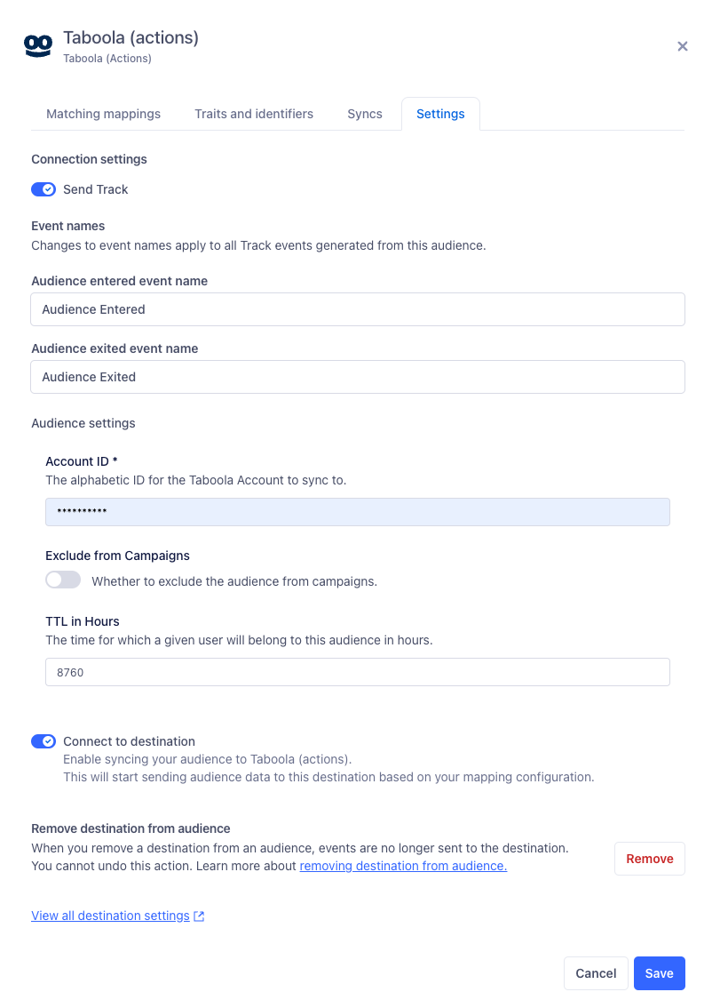
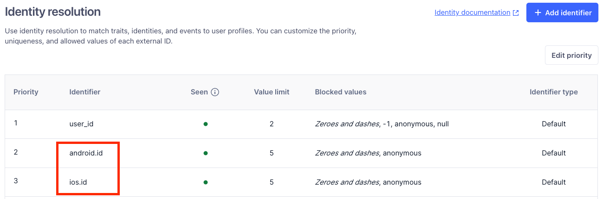

# 💥 Segment Partner Actions Destination Documentation Template

> Hi Partners 👋🏼
>
> Welcome to Segment - glad to have you onboard! This doc serves as a guideline for your team to create best-in-class documentation alongside your amazing product.
>
> Here are the guidelines we want you to have in mind when writing out your documentation:
>
> - Be succinct and simple in your writing. Reduce text bloat where possible.
> - Avoid 1st person language as it’s confusing for customers if they don’t know who wrote the docs (Segment or the Partner).
> - Where pre-reading is required, hyperlink to other more generic parts of Segment’s (or your) documentation.
>
> - Screenshots/Images are generally discouraged unless absolutely necessary
>
> The below template intends to provide a standardized structure. To submit your documentation, complete the following steps:
>
> 1. Fork and clone the `segment-docs` repo locally
> 2. Create a new branch (e.g., partner-name/destination)
> 3. Create an `index.md` file in the following path `src/connections/destinations/catalog/{destination-slug}/index.md
> 4. Copy the template below into your `index.md` file, and edit it to be in line with how your integration operates
> 5. Add, commit, and push your code, then submit a pull request to the `segment-docs` repo
>
> If a section does not apply to your integration, feel free to remove. Please don’t create separate sections unless absolutely necessary. In most cases, creating a H3 (###) sub-heading under an existing section is the best option!
>
> If you have any questions in the meantime, please reach out to our team at partner-support@segment.com.

## Template begins here...

---
title: [integration_name] Destination
---

> (delete after reading) This template is meant for Actions-based destinations that do not have an existing Classic or non-Actions-based version. For Actions Destinations that are a new version of a classic destination, see the doc-template-update.md template.

> (delete after reading) In the section above, edit the `title` field. For example, Slack (Actions) Destination



> (delete after reading) Include a 1-2 sentence introduction to your company and the value it provides to customers - updating the name and hyperlink. Please leave the utm string unchanged.

[<integration_name>](https://yourintegration.com/?utm_source=segmentio&utm_medium=docs&utm_campaign=partners){:target="_blank”} provides self-serve predictive analytics for growth marketers, leveraging machine learning to automate audience insights and recommendations.

> (delete after reading) Update your company name and support email address.

This destination is maintained by <integration_name>. For any issues with the destination, [contact their Support team](mailto:support@<integration_name>.com).

> (delete after reading) The section below explains how to enable and configure the destination. Include any configuration steps not captured below. For example, obtaining an API key from your platform and any configuration steps required to connect to the destination.

## Getting started

Before connecting the **Taboola (Actions)** destination you'll need your Taboola **Client ID**,  **Client Secret** and **Account ID** values to hand. <TODO: Eden to provide instructions for how to get these values>

1. From your Segment workspace's [Destination catalog page](https://app.segment.com/goto-my-workspace/destinations/catalog){:target="_blank”} search for **Taboola (Actions)**.
2. Select **Taboola (Actions)** and click **Add Destination**.
3. Next, connect the Engage Space to your **Taboola (Actions)** Destination. To do this, use the `Search for a source` search field to find your Engage Space, then select it. Next, click the **Confirm Source** button.
4. On the **Basic Settings** screen input the Taboola **Client ID** and **Client Secret** values.
5. Enable the Destination using the toggle, then click the **Save Changes** button. 

The **Taboola (Actions)** Destination is now connected to your Engage Space. The next steps cover connecting an Audience to a **Mapping** on your **Taboola (Actions)** Destination.

6. Navigate to the Audience you'd like to sync to **Taboola (Actions)**. 
7. On the **Audience Overview** tab, click the **Add Destination** button, then select the **Taboola (Actions)** Destination. 
8. Under the **Destinations** heading in the **Audience Overview** page you should now see your **Taboola (Actions)** listed. Click the **Add Mapping** button. 

9. When the side panel on the right displays, navigate to the **Settings** tab. 
9. On the **Settings** tab, ensure that **Send Track** is enabled, then populate the Taboola **Account ID** field.

10. Click the **Save** button. 
11. Remain in the side panel, and navigate to the **Matching mappings** tab. Click the **Add mapping** button, then select **Sync Audience**. 
12. On the **Sync Audience** page, click the **Save** button. You'll be taken back to the **Matching mappings** tab. Enable the Mapping using the toggle.   

The Audience will start to sync to Taboola shortly. 

## Supported identifiers

The **Taboola (Actions)** destination supports syncing Audiences to Taboola using either the `email` and/or the `Mobile Device ID`.
`email` will be automatically included if present. Additional configuration steps are required in order to sync `Mobile Device ID` values. To sync `Mobile Device ID` values ensure the following configuration:  

1. Your Engage Space's Identify Resolution rules will need to be configured for `android.id` and `ios.id` identifiers. This can be configured by navigating to `Unify` >> `Unify Settings`. 

 
2. Ensure that both the `android.id` and `ios.id` identifiers are configured exactly as per the image below. This configuration step takes place when the Destination is being connected to an Audience. 



> (delete after reading) Additional Context
>
> Include additional information that you think will be useful to the user here. For information that is specific to an individual mapping, please add that as a comment so that the Segment docs team can include it in the auto-generated content for that mapping.

> (delete after reading) Congratulations! 🎉 You’ve finished the documentation for your Segment integration. If there’s any additional information or nuance which did not fit in the above template and that you want to share with our mutual customers, feel free to include these as a separate section for us to review. If not, you may now submit this doc to our team.
