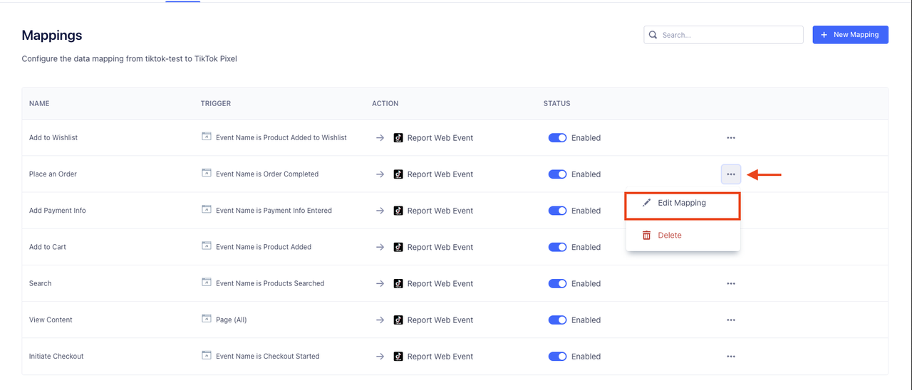



The TikTok Offline Conversions destination is a secure server-to-server integration that allows advertisers to share the actions customers take on their offline sites from Segment directly with TikTok using [TikTok Offline Events API](https://business-api.tiktok.com/portal/docs?id=1771100815832065){:target="_blank”}. By sharing these events with TikTok, you can better optimize your campaigns and measure ad performance.

## Benefits of TikTok Offline Conversions

1. **Measure how TikTok ads influence offline conversions.** Learn what online strategies lead to better Brick & Mortar sales, subscription sign-ups or leads. 
2. **Power holistic attribution models with cross-channel event tracking.** Combine online and offline touchpoints to get comprehensive campaign metrics, like ROAS.
3. **Reach offline customers online with custom audiences.** Promote new products or services to high-value customers who initiative offline events.

## Getting started

Prior to setting up the **TikTok Offline Conversion Destination**, please create an Offline Event Set and generate the Access Token for it from **TikTok Events Manager**.

1. From the Segment web app, click **Catalog**, then click **Destinations**.
2. Find the Destinations Actions item in the left navigation, and click it.
3. Click **Configure Tiktok Offline Conversions (Actions)**.
4. Select an existing Source to connect to Tiktok Offline Conversions (Actions).
5. Give Destination a name.
6. On the Settings screen, provide Access Token and Event Set ID.
7. Toggle on the Destination.
8. Hit the Save Change button.



## FAQ & Troubleshooting

### Acess Token & Event Set ID
Please refer to the [documentation](https://business-api.tiktok.com/portal/docs?id=1771101027431425){:target="_blank”} to obtain the **Access Token** and the **Event Set ID**.

### PII Requirement & Validation
TikTok Offline Events API requires at least one type of PII (email addresses and/or phone numbers) to be included in all offline conversion events. The email addresses and phone numbers will be hashed using SHA 256 from Segment before they are sent to TikTok. TikTok Offline Conversions Destination will automatically hash the provided PII, so please do not hash the PIIs before sending them to Segment. In addition, TikTok Offline Conversions Destination will validate all offline events before forwarding them to TikTok Offline Events API. TikTok Offline Conversions Destination will not send any offline events to TikTok with invalid or missing PIIs.

### Custom Event Implementation

1. Click **New Mapping**, then click **Report Web Event**.

    
    <!--  -->

2. Provide the Segment event to map and trigger the connection (i.e. `segment_event`)

    

3. Provide the custom event name in the **Event Name** field from the mappings section (i.e. `tiktok_custom_event`)

    

4. Edit parameter mappings for each event

    

## Data and Privacy Considerations
- Every offline event sent to TikTok Offline Events API requires at least one email address or phone number.
- E-mails and phone numbers will be hashed in a privacy-safe way by default so that TikTok cannot identify customers who are not TikTok users.
- iOS compliance checks will be performed on PII (ATT opt-out users will still be reported and attributed).
- TikTok will pruge unmatched offline conversions IDs/records.

## Support

The TikTok Offline Conversions destination is owned and maintained by the TikTok team. For any issues with the destination, [contact TikTok's Support team](mailto:segmenteng@bytedance.com).
