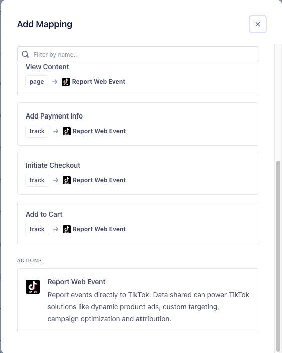



The TikTok Pixel destination is a client-side integration that enables advertisers to implement [TikTok Pixel](https://ads.tiktok.com/marketing_api/docs?id=1739583652957185){:target="_blank"} for tracking website events. This tool makes it easier to track ad performance by embedding a pixel code on a site. You can define multiple events to track multiple user's behaviors under each pixel.

### Benefits of TikTok Pixel

Use data collected from TikTok Pixel to:
- **Build marketing audiences**: Create custom Audiences based on website visitor events, like viewing a product page or making a purchase. Audiences can be used to re-engage previous site visitors or model lookalikes to find new customers. 
- **Optimize ad delivery**: Target Audiences that are more likely to initiate a website event by setting an optimization goal on visitor events like add to cart, view page, or purchase. 
- **Measure campaign performance**: Measure your ad performance and return on ad spend (ROAS) based on a series of conversion events you define.

## Getting started

### TikTok Requirements

The TikTok Conversions destination is configured to use the TikTok Events API. To generate a TikTok Pixel Code and Access Token:

1. [Create a TikTok For Business account](https://business-api.tiktok.com/portal/docs?id=1738855099573250){:target="_blank"}.
2. [Create a TikTok Pixel](https://ads.tiktok.com/help/article/get-started-pixel?redirected=2){:target="_blank"} for Segment Partner setup to obtain a Pixel Code.

### Connect TikTok Pixel to your workspace

1. From the Segment web app, click **Catalog**, then click **Destinations**.
2. Search for "TikTok Pixel" in the search bar, then click on the Destination "TikTok Pixel".
3. Click **Add Destination**.
4. Select an existing JavaScript Source to connect to TikTok Pixel.
5. Give the Destination a name.
7. Toggle on the Destination using the **Enable Destination** toggle.
8. Click **Save Change**.



## FAQ & Troubleshooting

### Advanced Matching

Advanced Matching helps you optimize your TikTok ads and drive performance by matching customer information with TikTok users. Hashed customer information can be shared with any TikTok event to attribute more conversions, build bigger audiences, and improve campaign optimization.

There are two types of Advanced Matching: manual or automatic.

**Manual Advanced Matching** is the passing of customer information to TikTok from your website. With this option, you have the flexibility to configure what information and for which event you want to pass to TikTok. This will be enabled automatically if PIIs are included in the Pixel events sent from TikTok Pixel Destination.

When email and/or phone number values are sent to TikTok, TikTok will try to match users with the PII you send to TikTok. If you don't send email or phone number values, TikTok will try to match users with IP and user-agent values that are included in the Pixel event payload.

**Automatic Advanced Matching** is when advertisers instruct TikTok to automatically identify form fields on pages where Pixel is installed and to hash and collect email and phone numbers entered on those pages for ad measurement and attribution purposes. Learn more about Automatic Advanced Matching and how to turn it on in [TikTok help center](https://ads.tiktok.com/help/article/advanced-matching-web?lang=en){:target="_blank"}.

To maximize Advanced Matching's performance, TikTok recommends using both Manual and Automatic Advanced Matching at the same time.

### PII hashing
- TikTok hashes all values with `sha256` before processing.

- Normalize phone numbers you send to TikTok with in the `E.164` format. This format is a combination of `+［country code]［phone number]`. For example: `+12133734253`.

### Deduplication with the Segment TikTok Pixel Destination

When connected to the same Segment source, the destination will have a default mapping `messageId` assigned to Event ID parameter. This will need to match the Event ID mapping from the client-side Segment integration (TikTok Pixel Destination).

### Custom Event Implementation

1. Click **New Mapping**, then click **Report Web Event**.

    
    <!--  -->

2. Provide the Segment event to map and trigger the connection (i.e. `segment_event`)

    

3. Provide the custom event name in the **Event Name** field from the mappings section (i.e. `tiktok_custom_event`)

    

4. Edit parameter mappings for each event

    

### Web Diagnostics

You can check whether the integration is working, test events in real-time, and troubleshoot common issues in TikTok's Web Diagnostics Suite. See the [TikTok Pixel Web Diagnostics documentation](https://ads.tiktok.com/help/article?aid=10000360){:target="_blank"} for more information.

## Data and privacy

Visit TikTok's [docs](https://ads.tiktok.com/i18n/official/policy/business-products-terms){:target="_blank"} to learn more about TikTok's privacy and data terms.

## Support

The TikTok Pixel destination is owned and maintained by the TikTok team. For any issues with the destination, [contact TikTok's Support team](mailto:segmenteng@bytedance.com).