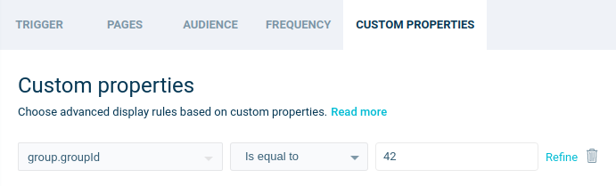



[Wisepops](https://wisepops.com/){:target='_blank'} offers an end-to-end platform to help all types of online brands deliver a personalized experience to their visitors through multiple formats: popups, bars, embeds and notifications feed.
Wisepops powers 2,000 brands in 53 countries which deliver 2Bn personalized onsite messages each year. Brands like Asphalte, Unilever, Decathlon, Heineken and Jaguar use Wisepops to build a brand connection and convert their visitors into loyal customers.

When you use the Wisepops destination, Segment loads Wisepops on your website you. It can help setting custom properties, and tracking event and goals.



## Getting started

1. From the Segment web app, click **Catalog**, then click **Destinations**.
2. Find the Wisepops item in the catalog, and click it.
3. Click **Configure Wisepops**.
4. Select an existing Source to connect to Wisepops.
5. Give the destination a name.
6. Once in the **Basic Settings** page, enter your **Website Identifier**. It can be found in your [Wisepops setup code](https://app.wisepops.com/f/settings/websites){:target='_blank'}. It's the 10 character long string in bold in the setup code of the Popups service.
   
7. Toggle **Enable Destination** and click **Save changes**.

## Default Mapping

The Wisepops destination comes with mapping presets. You can adjust this default mapping by going to the **Mapping** tab of the destination in the Segment web app.

### Set User Traits as Custom Properties

By default, when you identify a user, their traits are set as [custom properties](https://support.wisepops.com/article/yrdyv1tfih-set-up-custom-properties){:target='_blank'}.
The user ID is set as the custom property `userId`.
For example, a common use case is to display the user first name in your campaign:

[Learn more about Wisepops dynamic content](https://support.wisepops.com/article/snksb93jrq-personalize-the-content-of-your-popup-on-the-fly){:target='_blank'}.

### Set Group Traits as Custom Properties

By default, when you identify a group, its traits are set as [custom properties](https://support.wisepops.com/article/yrdyv1tfih-set-up-custom-properties){:target='_blank'} in a nested object `group`.
This means that, when you refer to a group trait in Wisepops, you must prefix it with `group.`.
The group ID is set as the custom property `group.groupId`.
For example, you can display a campaign only to the users of the group ID 42:

[Learn more about Wisepops custom conditions](https://support.wisepops.com/article/yrdyv1tfih-set-up-custom-properties#defining-custom-conditions){:target='_blank'}.

### Track Event

> warning ""
> Custom events count as page views in your monthly quota. If you track a lot of events on Segment, you may want to edit this mapping to forward only the relevant events to Wisepops.

By default, when you track an event, Segment sends a [custom event](https://support.wisepops.com/article/zbpq1z0exk-set-up-custom-events-to-trigger-popups) to Wisepops.
You can trigger a campaign on custom events by typing the event name as the campaign trigger on Wisepops.
For example, you can display a popup when a product is added to the cart:

### Track Goal

By default, when you track the event **Order Completed**, Segment sends a [goal completion](https://support.wisepops.com/article/mx3z8na6yb-set-up-goal-tracking) to Wisepops.
The goal and its revenue are attached to one of your campaigns based on your Wisepops' goal attribution model.
You can easily track more goals by editing the mapping.
The goals will be named after the Segment event name.

### Track Page

By default, when you track a page, Segment sends a [page view](https://support.wisepops.com/article/uymb5lywhi-wisepops-on-single-page-applications) to Wisepops.
This mapping is required for Wisepops to display campaigns at page change.


