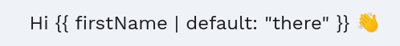
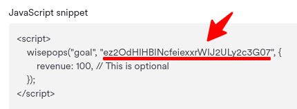



[Wisepops](https://wisepops.com/){:target="_blank"} offers an end-to-end platform to help all types of online brands deliver a personalized experience to their visitors through multiple formats: popups, bars, embeds and notifications feed.
Wisepops powers 2,000 brands in 53 countries and delivers 2 billion personalized onsite messages each year to convert visitors into loyal customers.

When you use the Wisepops destination, Segment loads Wisepops on your website for you. With no development, you can target your users based on their traits or events, display personalized messages, and track the revenue generated by your campaigns.

## Getting started

1. From the Segment web app, click **Catalog**, then click **Destinations**.
2. Find the Wisepops item in the catalog, and click it.
3. Click **Configure Wisepops**.
4. Select an existing Source to connect to Wisepops.
5. Give the destination a name.
6. In the **Basic Settings** page, enter your **Website Identifier**. It can be found in your [Wisepops setup code](https://id.wisepops.com/r/id/workspaces/_workspaceId_/settings/setup-code){:target="_blank"}. It's the bolded string that's 10 characters long.
   
7. Toggle **Enable Destination** and click **Save Changes**.

> info "Wisepops Destination is device mode only (web)"
> This destination is compatible only with [Analytics.js 2.0](/docs/connections/sources/catalog/libraries/website/javascript/). Server-side `identify` and `track` calls don't trigger Wisepops' actions.

## Default Mapping

The Wisepops destination comes with mapping presets. You can adjust each default mapping by going to the **Mapping** tab of the destination in the Segment web app.

### Set User Traits as Custom Properties

By default, when you identify a user, their traits are set as [custom properties](https://support.wisepops.com/article/yrdyv1tfih-set-up-custom-properties){:target="_blank"}.
A great use case is to [display the user first name in your campaign](https://support.wisepops.com/article/snksb93jrq-personalize-the-content-of-your-popup-on-the-fly){:target="_blank"}:

> success ""
> The user ID is set as the custom property `userId`. For example, use `{{userId}}` as a hidden field value to know who responds to your Wisepops surveys.

### Set Group Traits as Custom Properties

By default, when you identify a group, its traits are set as [custom properties](https://support.wisepops.com/article/yrdyv1tfih-set-up-custom-properties){:target="_blank"} in a nested object `group`.
You must use the prefix `group.` when you refer to a group trait in Wisepops.
For example, you can [target the users of groups subscribed to your "Premium" plan](https://support.wisepops.com/article/yrdyv1tfih-set-up-custom-properties#defining-custom-conditions){:target="_blank"}:

> success ""
> The group ID is set as the custom property `group.groupId`.

### Track Event

By default, when you track an event, Segment sends a [custom event](https://support.wisepops.com/article/zbpq1z0exk-set-up-custom-events-to-trigger-popups){:target="_blank"} to Wisepops.
To show a campaign when a custom event is emitted, enter the event name as the campaign trigger.
For example, you can display a popup when a product is added to the cart:

> info "Custom events count as page views in your Wisepops' monthly quota"
> If you track a lot of events with Segment, you may want to edit this mapping to send only the relevant events to Wisepops.

### Track Goal

The Track Goal action is not mapped by default. You can enable it to track [goal completion and revenue](https://support.wisepops.com/article/mx3z8na6yb-set-up-goal-tracking){:target="_blank"} on Wisepops.

To track a JavaScript goal using Segment:

1. [Create your JavaScript goal in Wisepops](https://id.wisepops.com/r/id/workspaces/_workspaceId_/goals){:target="_blank"}.
2. Copy the goal identifier. It is a 32-character string visible after the goal is created:
   
3. In Segment, create a new mapping with the action **Track Goal**.
4. In the first section, configure when the goal should be tracked.
5. In the third section, paste the goal identifier, without quotes, into the **Goal Identifier** field.
6. Save the new mapping.

### Track Page

By default, when you track a page, Segment sends a [page view](https://support.wisepops.com/article/uymb5lywhi-wisepops-on-single-page-applications){:target="_blank"} to Wisepops.
This mapping is required for Wisepops to display campaigns at page change.


