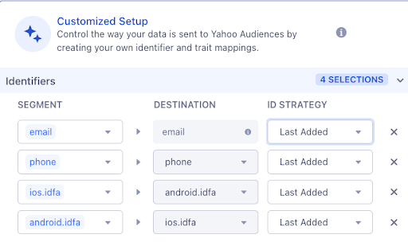
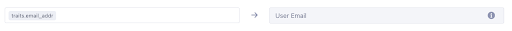
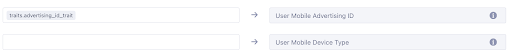
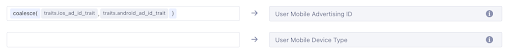

The Yahoo Audiences integration facilitates seamless connectivity between Engage Audiences and Yahoo DSP, offering users the flexibility to configure their data delivery preferences within the Segment platform.

This integration is designed to accommodate various identifiers, including **email**, **phone**, and **MAIDs** (iOS IDFA, Android Advertising Id). To ensure data security, the integration hashes **email** and **phone** identifiers, while also formatting phone numbers to comply with E.164 requirements.

Operating on the [Yahoo DataX platform](https://developer.yahooinc.com/datax/guide/){:target="_blank"}, the integration harnesses the power of the [Yahoo Realtime API](https://developer.yahooinc.com/datax/guide/datax-online-spec/user-data-audience-data/){:target="_blank"} for audience synchronization. Users can enjoy the convenience of syncing both realtime and batch audiences, with incremental batches supporting a maximum of 1000 user records. Notably, each synchronized user record can encompass the individual's membership in multiple audiences.

In addition to these features, the integration provides support for [Trait Activation](/docs/engage/trait-activation/) functionalities, specifically [Trait Enrichment](/docs/engage/trait-activation/trait-enrichment/) and [ID Sync](/docs/engage/trait-activation/id-sync/), enhancing the overall user experience.

## Getting started

To connect your Yahoo Audiences Destination: 
1. Create your Engage Audience.
2. Navigate to **Engage** > **Engage Settings** > **Destinations** and click **Add Destination**.
3. Select **Yahoo Audiences**, select your Engage space as the source, and name your destination.
4. Configure global destination settings on the **Settings** tab:
    - **Name**: Specify the destination name, for example “Yahoo Audiences Production”. This value will be only available in Segment.
    - **MDM ID**: Specify the MDM ID provided by your Yahoo DSP representative.
    - **Engage Space ID**: Specify the Engage Space ID. To locate Engage Space ID navigate to **Unify** > **Unify Settings** > **API Access**. This value identifies your customer node in Yahoo Data Taxonomy. Do not provide arbitrary values in this field, or any values other than your Engage Space ID. 
        - **NOTE:** The destination displays an error if the provided value includes any characters other than [a-zA-Z0-9] and “_” (underscore). This is to prevent passing values not supported by Yahoo.
    - **Customer Description**: Provide an optional description for the integration. 
    - Turn on the **Enable Destination** toggle.
    - Click **Save Changes** to save the destination.
    - This creates a new customer node in the Yahoo Data Taxonomy. The Customer node ID matches the Engage Space ID provided in the settings.
5. Configure destination Action Mappings. Action Mappings determine the information sent from Engage to Yahoo Audiences destination. Below you will find general information on configuring the mapping, as well as specific configuration for various use-cases. 
    - On the **Mapping** tab click **Add Mapping** and select **Sync to Yahoo Ads Segment**.
    - Within the mapping’s **Select events to map and send** configure whether the mapping should be triggered for all audiences connected to the destination, or for specific audiences only.
        - **NOTE:** Action mapping settings apply to all audiences that are processed by the mapping. The mapping can be configured to (1) process all audiences connected to the destination, or (2) only specific audiences. This can be helpful when enabling the GDPR flag only for specific audiences.
        - To apply the mapping only to specific audiences, modify the trigger as follows:
        
        - To apply the mapping to all audiences, modify the trigger as follows:
        
    - Configure the mapping for **Email**, **Phone**, **Mobile Advertising Id** and **Device Type** fields. You can keep default mapping for these fields, if your data matches default mappings.
        - **NOTE:** The destination expects mobile advertising Id to be a combination of 2 fields: advertising Id and device type. If device type field is not available in your data, the destination deduces the platform (iOS /Android) based on advertising Id value formatting. If the value is capitalized - the destination assumes that this is iOS IDFA, otherwise the destination assumes that is Android DSP ID.
    - Configure whether **GDPR Flag** should be sent.
        - **NOTE:** **GDPR Flag** setting applies to the entire audience. Set this setting to TRUE if the audience is subject to GDPR regulations. If you have set **GDPR Flag** to YES, then populate **GDPR Consent Attributes** setting with the following IAB user consent attributes: “Access of Information” and “Personalization”. See more in [Yahoo DSP API documentation](https://developer.yahooinc.com/datax/guide/gdpr/faq/){:target="_blank"}. If **GDPR Flag** setting is set to YES, and **GDPR Consent Attributes** is not populated, audience sync will fail.  
    - If you’ve opted to send a **GDPR Flag**, provide **GDPR Consent Attributes**.
    - Save the mapping by clicking **Save** button.
6. Connect the Destination to the Audience and configure Audience Sync settings:
    - Navigate to **Engage** > **Audiences** > **(your audience)**, click **Add Destination** and select the destination you just created.
    - Configure how the audience should be synced. Enable **Send Track** and disable **Send Identify**. 
    - Select the identifiers to be synced to Yahoo:
        - **Default Setup** - sends all email Ids available on a user profile
        - **Customized Setup** - configure the identifiers to be sent to Yahoo DSP*
    - If you’d like to send iOS IDFA and Android Advertising ID - turn on **Send Mobile IDs** and map MAIDs using **Customized Setup**.
    - Do not modify the **Placeholder** setting. 
    - Click **Save Settings**.

> info ""
> Yahoo DSP supports the following identifiers: **email**, **phone**, **iOS IDFA**, **Android Advertising Id**. Segment hashes email and phone per Yahoo DSP requirements, so you don’t have to hash email and phone. Segment formats the phone to meet E.164 requirements: removes non-digit characters and adds “+” sign. Your phone trait/identifier must include country code, as Segment does not prepend phone with country code.

Once the Audience is connected to the Destination, Segment makes a request to Yahoo DSP to create an ‘audience’ (‘segment’) node in Yahoo Data Taxonomy. The node is identified by Audience ID, and named with Audience Key. After Engage has computed the audience, the Destination syncs the audience to Yahoo DSP.



## Destination configurations for various use-cases

### Use-case 1

Email, phone, IOS IDFA and Android Advertising ID are available as Engage Identifiers. 

- **Action Mappings**: 
Keep default field mappings.
- **Audience Sync settings**: 
Select **Customized Setup**, and map available identifiers under the Identifiers section. You can select whether Engage should send First, Last or All Available identifiers.

### Use-case 2

Email, phone, IOS IDFA and Android Advertising Id are available as Engage Identifiers and/or Traits. 

- **Action Mappings**:
Modify the mapping to reflect your custom trait names. For example, if you’re planning to send ‘email_addr’ trait as email to Yahoo Audiences, map ‘email_addr’ trait in the **User Email** field.

- **Audience Sync settings**:
Click **Customized Setup** and select the **Identifiers** and **Traits** that you are planning to send to Yahoo Audiences. For example, if you are planning to send ‘phone’ identifier and ‘email_addr’ trait, map these fields as shown below:

### Use-case 3
Sending mobile advertising Id custom traits to Yahoo Audiences.

- **Action Mappings**:
The destination expects 2 fields for mobile advertising Id: advertising Id field (trait) storing the Id value itself, and device type field (trait) storing mobile platform name (‘ios’ or ‘android’). 

If your Engage data includes these 2 fields, you can map them as follows:

If your data does not include a field with the device type, you can map only the advertising Id trait. The destination detects device type based on the Id value format: Apple IDFA is typically capitalized, and Android advertising Id is typically lowercase. 

If you have separate traits for iOS IDFA and Android Advertising Id, you can map them using coalesce() function:

- **Audience Sync settings**:
Use Customized Setup to map custom advertising Id and, if available, device type traits:

## FAQs

### Why am I seeing the difference between audience size in Engage and in Yahoo DSP?
The difference between audience size in Segment and in Yahoo DSP is expected due to ID matching. Yahoo DSP will recognize only users it has matching ID (email / phone / MAID) for. 

### The audience has synced, but I’m seeing 0 population in Yahoo DSP UI.
As soon as user records land in Yahoo DSP, users become targetable in minutes. However, Yahoo DSP reporting is not realtime, and might take 24-48 hrs to catch up. This delay does not affect targeting. Because of that you might see 0 users in the Yahoo DSP audience immediately after the sync.
