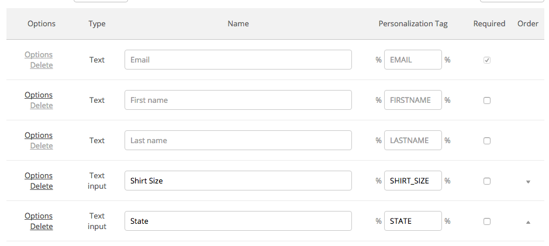

[ActiveCampaign](https://www.activecampaign.com) is an integrated email marketing, marketing automation, and small business CRM. It allows you to send beautiful newsletters, set up behavioral based automations, and benefit from sales automation.

This destination is maintained by ActiveCampaign. For any issues with the destination, [contact the ActiveCampaign support team](https://www.activecampaign.com/contact/).

## Getting Started



1.  From your Segment UI's Destinations page click on "Add Destination".
2.  Search for "Active Campaign" in the Catalog, select it, and choose which of your sources to connect the destination to.
3.  Add your API URL and API Key which can be found in your ActiveCampaign UI Settings page under the Developer tab.
4.  Since the Segment ActiveCampaign destination integration is 100% handled through Segment, you don't need to install ActiveCampaign site tracking or event tracking JavaScript code.


## Page

If you're not familiar with the Segment Specs, take a look to understand what the [Page method](/docs/connections/spec/page/) does. An example call would look like:

```js
analytics.page();
```

**NOTE**: A Page call will only work if Site Tracking is enabled. You can enable this by visiting the Tracking tab on the Settings page in your ActiveCampaign account.

When you call `page`, we will send that event to ActiveCampaign as a `site tracking` event. The `referrer` and `url` parameters will be tracked for the contact with the `email` parameter.


## Identify

If you're not familiar with the Segment Specs, take a look to understand what the [Identify method](/docs/connections/spec/identify/) does. An example call would look like:

```js
analytics.identify('ze8rt1u89', {
  firstName: 'Jane',
  lastName: 'Kim',
  email: 'jane.kim@example.com'
});
```

If the contact you are passing in doesn't already exist in your ActiveCampaign account, they will automatically be added through this method. If the contact does already exist, they will simply be updated.

**Note**: A new contact will only be created if the `identify` call has a name (`firstName` OR `lastName`) AND an `email` trait.

### Basic Fields

When you `identify` a contact, we'll pass that contact's information to ActiveCampaign with `userId` as ActiveCampaign's External User ID. ActiveCampaign accepts these basic fields from Segment.

- `firstName`
- `lastName`
- `email`
- `phone`

### Tags

You can add tags to a contact by passing in a trait called `tags`. If you would like to delete all tags currently on a contact, you can pass in a trait called `tagsReset` with a value of `1`. You can pass both `tags` and `tagsReset` if you wish, or just one of the two. If you pass both, all tags will be deleted and then any new tags will be added.

```js
analytics.identify('ze8rt1u89', {
  firstName: 'Jane',
  lastName: 'Kim',
  email: 'jane.kim@example.com',
  tags: [
      'checkout',
      'abandoned'
  ],
  tagsReset: 1
});
```

### Custom Fields

ActiveCampaign also supports updating a contact's custom fields with this integration. To send custom fields to ActiveCampaign you need to create the custom field first in ActiveCampaign for each custom field you want to send. Then when you call identify with keys that match those traits, those custom fields for the contact will be updated.

For example, if you have a contact in ActiveCampaign with these custom fields:



You can update those fields using this identify call:

```js
analytics.identify('ze8rt1u89', {
  firstName: 'Jane',
  lastName: 'Kim',
  email: 'jane.kim@example.com',
  shirtSize: 'medium',
  state: 'California',
  multiChoice: [Value1,Value2]
});
```
In the example these traits are `shirt size`, `state`, and `multiChoice`. They will be shown as `%SHIRT_SIZE%`, `%STATE%`, and `%MULTI_CHOICE%` in ActiveCampaign, but you can record them in lower-case to identify and they will still be populated. The `multiChoice` field applies to listbox or checkbox custom fields in ActiveCampaign (where more than one option value is allowed).

If your custom field has the same name as a [reserved trait](/docs/connections/spec/identify/#traits), that custom field will not be updated.

### Lists

You can add a contact to or unsubscribe a contact from any number of lists by passing in a trait called `lists`. As shown in the example below, this trait should be an array, with each element having an `id` and a `status`. The value of `status` must be either `active` or `unsubscribed`.

```js
analytics.identify('ze8rt1u89', {
  firstName: 'Jane',
  lastName: 'Kim',
  email: 'jane.kim@example.com',
  lists: [
     {
       id: 1,
       status: 'active'
     },
     {
       id: 7,
       status: 'unsubscribed'
     }
  ]
});
```
## Track

If you're not familiar with the Segment Specs, take a look to understand what the [Track method](/docs/connections/spec/track/) does. An example call would look like:

```js
analytics.track('Clicked a button', {
  properties: {
    acValue: 'Signup button'
  }
})
```

**NOTE**: A Track call will only work if Event Tracking is enabled. You can enable this by visiting the Tracking tab on the Settings page in your ActiveCampaign account.

When you call `track`, we will send that event to ActiveCampaign as an `event tracking` event. The `event` parameter will be tracked for the contact with the `email` parameter. If you want to pass a value for that event, you can pass the value in as the `acValue` property of `properties`. In the example above, the event name is `Clicked a button` and the value for the event is `Signup button`.
